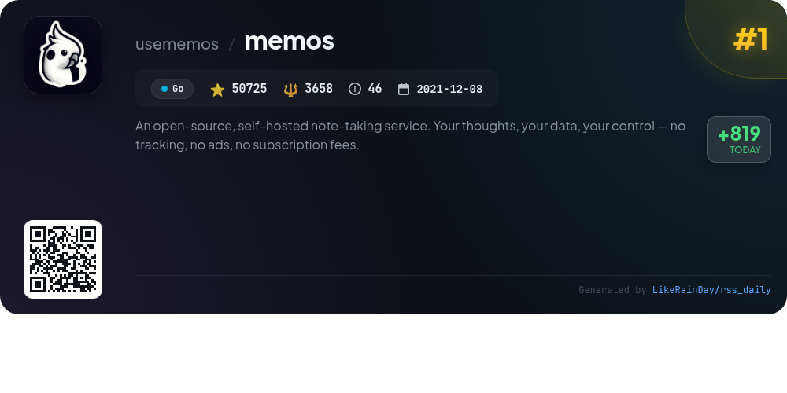
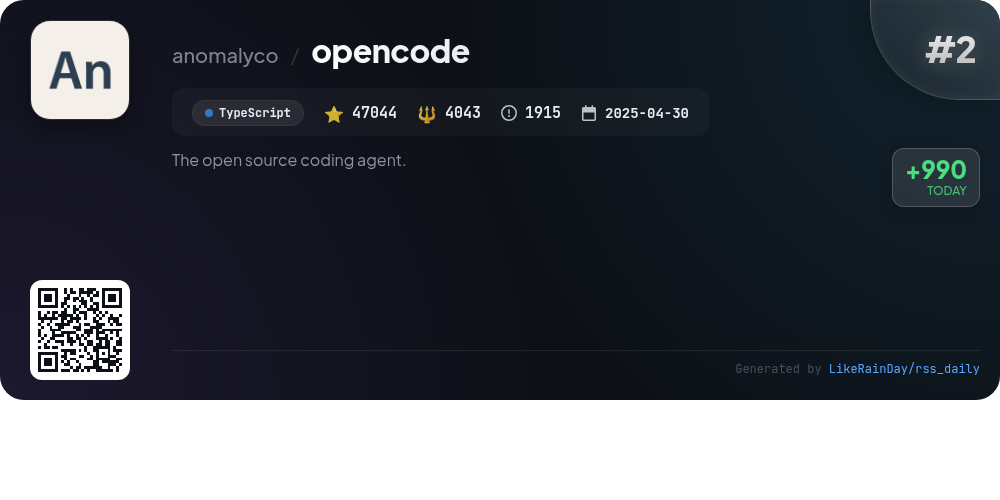
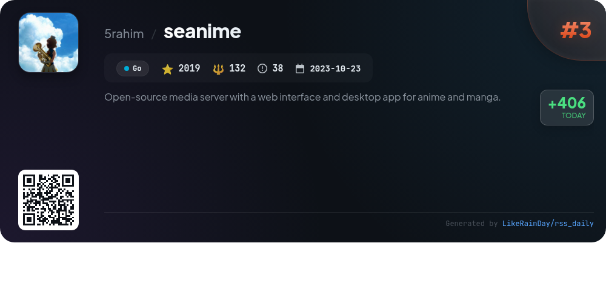
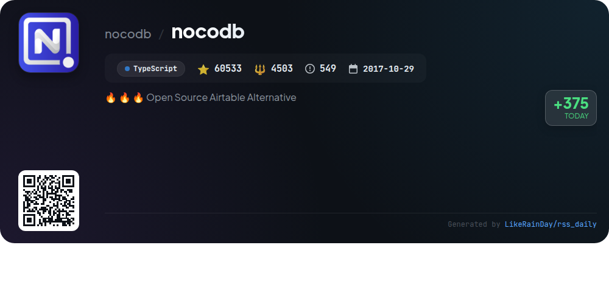
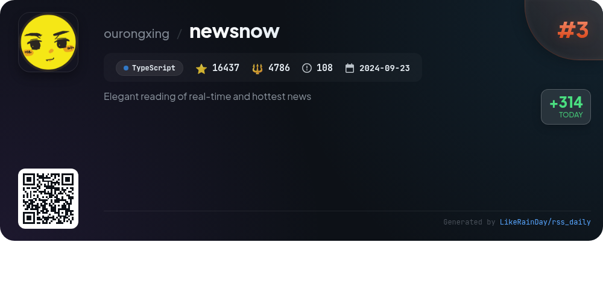
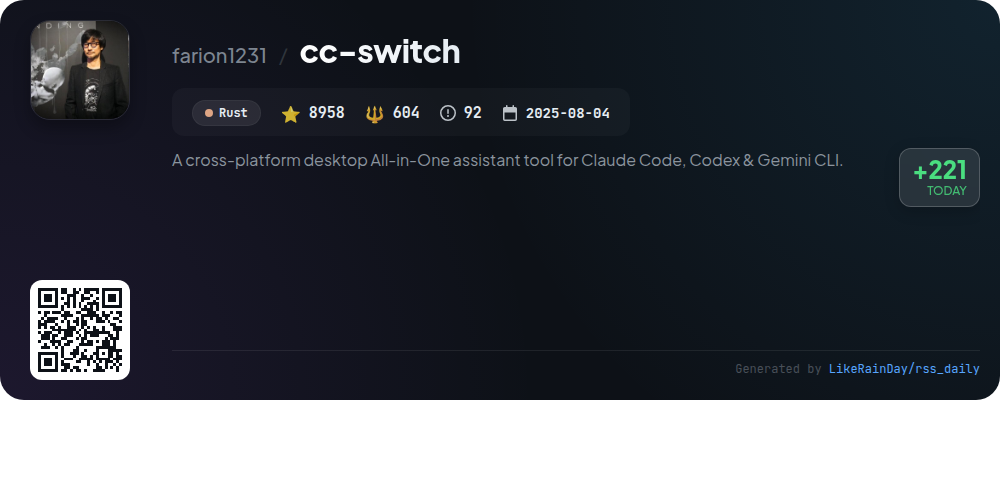
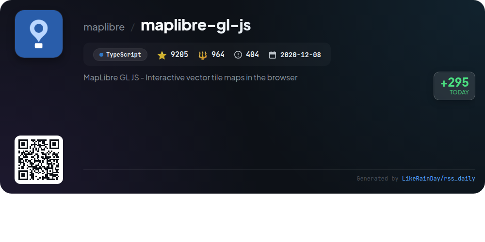
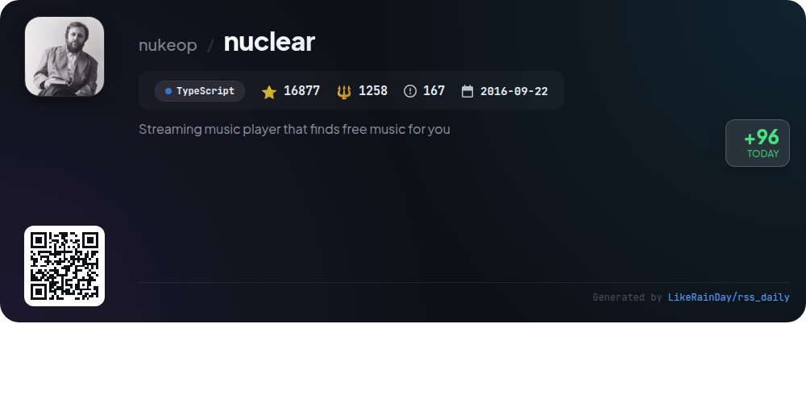
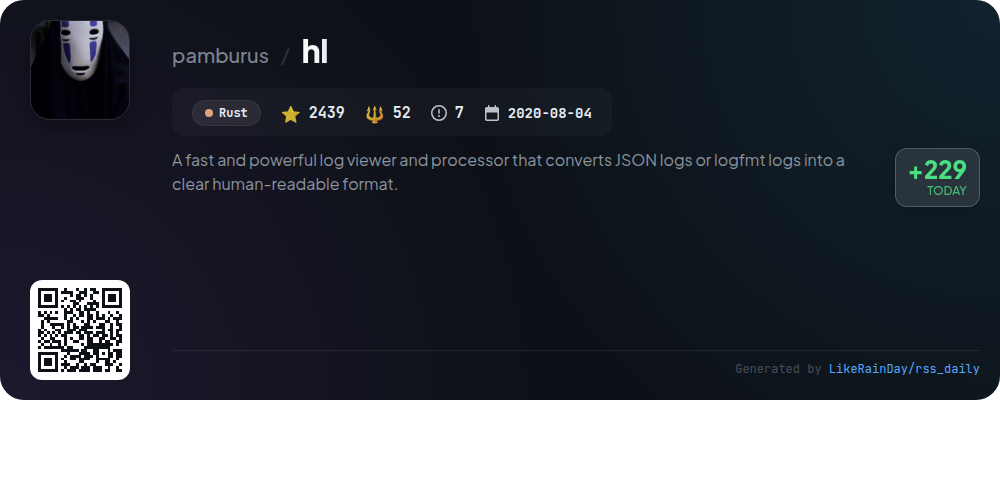
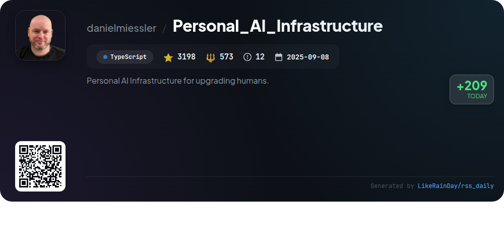

# 📊 🌟 GitHub Trending Daily - 2026-01-04

> > 📅 每日精选 GitHub 热门仓库 | 基于智能算法推荐

## 📋 Overview

**10** 个项目 | **218541** ⭐ | **20659** 🍴

**热门语言:** `TypeScript` (6) · `Rust` (2) · `Go` (2)

**更新时间:** 2026-01-04 18:38 UTC

**分类分布:**

- 🌟 每日 Top 10 精选 (10 项)

---

## 🌟 每日 Top 10 精选

### 1. [memos](https://github.com/usememos/memos)

> 🤖 **推荐理由**  
> *Memos is an open-source, self-hosted note-taking service designed for privacy and control, ensuring no tracking, ads, or subscription fees. Built with Go and React, it offers fast performance and full markdown support, making it ideal for personal notes and team wikis. Key features include a privacy-first architecture with data ownership, simple one-line Docker deployment, and REST/gRPC API access for easy integration. Memos supports SQLite, MySQL, and PostgreSQL, with a beautiful, mobile-responsive interface. Explore more at usememos.com.*

- ⭐ 51135 stars
- 💻 Go
- 📅 Updated: 2026-01-04

### 2. [opencode](https://github.com/anomalyco/opencode)

> 🤖 **推荐理由**  
> *OpenCode is an open-source AI coding agent designed for developers, featuring robust capabilities for code exploration and development. With over 47,000 stars, it supports multiple installation methods across platforms including macOS, Windows, and Linux. Key features include two built-in agents—'build' for full access development and 'plan' for read-only analysis. OpenCode is provider-agnostic, allowing integration with various AI models, and emphasizes a terminal user interface. The project encourages community contributions and offers comprehensive documentation for users.*

- ⭐ 47412 stars
- 💻 TypeScript
- 📅 Updated: 2026-01-04

### 3. [seanime](https://github.com/5rahim/seanime)

> 🤖 **推荐理由**  
> *Seanime is an open-source media server designed for anime and manga enthusiasts, featuring a cross-platform web interface and desktop app. Core functionalities include a built-in video player with subtitle support, AniList integration for managing collections, and offline mode. Users can scan libraries quickly, stream torrents directly, and customize their viewing experience. The platform supports various media players and offers integrated torrent search capabilities. Note that Seanime does not host media; users must obtain content legally.*

- ⭐ 2019 stars
- 💻 Go
- 📅 Updated: 2026-01-04

### 4. [nocodb](https://github.com/nocodb/nocodb)

> 🤖 **推荐理由**  
> *🔥 🔥 🔥 Open Source Airtable Alternative. popular project, actively maintained, recently updated*

- ⭐ 60533 stars
- 🍴 4503 forks
- 💻 TypeScript
- 📅 Updated: 2026-01-04

### 5. [newsnow](https://github.com/ourongxing/newsnow)

> 🤖 **推荐理由**  
> *newsnow is a real-time news reading platform built in TypeScript, featuring a clean UI for an optimal reading experience. With 16,529 stars, it offers real-time updates on trending news, GitHub OAuth login for data synchronization, and adaptive scraping intervals to prevent IP bans. The project supports MCP servers and provides a straightforward deployment process on platforms like Cloudflare and Vercel. Future enhancements include multi-language support, personalized news options, and expanded data sources. Contributions are encouraged, and it operates under the MIT license.*

- ⭐ 16529 stars
- 💻 TypeScript
- 📅 Updated: 2026-01-04

### 6. [cc-switch](https://github.com/farion1231/cc-switch)

> 🤖 **推荐理由**  
> *cc-switch is a cross-platform All-in-One assistant tool for Claude Code, Codex, and Gemini CLI, built with Rust and Tauri. With over 9,000 stars, it offers seamless provider management, a robust skills and prompts system, and MCP server integration. Key features include a dual-layer SQLite/JSON architecture for data handling, auto-launch on startup, and multi-language support (English, Chinese, Japanese). The application supports easy configuration import/export, speed testing, and has a user-friendly interface. It also offers cloud sync capabilities for cross-device usage.*

- ⭐ 9071 stars
- 💻 Rust
- 📅 Updated: 2026-01-04

### 7. [maplibre-gl-js](https://github.com/maplibre/maplibre-gl-js)

> 🤖 **推荐理由**  
> *MapLibre GL JS is an open-source library for creating interactive vector tile maps in web applications, leveraging GPU-accelerated rendering for fast display. Originating as a fork of Mapbox GL JS, it offers a drop-in replacement with enhanced functionality and a commitment to open-source principles. Key features include support for 3D terrain, heatmaps, and third-party vector tile sources. Developers can easily integrate it with examples and comprehensive documentation. Contributions are welcome, fostering a collaborative community around this powerful mapping tool.*

- ⭐ 9205 stars
- 💻 TypeScript
- 📅 Updated: 2026-01-04

### 8. [nuclear](https://github.com/nukeop/nuclear)

> 🤖 **推荐理由**  
> *Nuclear is a free streaming music player designed to source music from various free platforms like YouTube, SoundCloud, and Jamendo. With a focus on audio, it offers features such as playlist integration, song queuing, real-time lyrics, and no ads or accounts required. Key highlights include a powerful plugin system, genre browsing, unlimited downloads, and scrobbling to Last.fm. A major rewrite is underway to enhance performance, introduce auto-updates, and support more streaming providers. Community contributions and translations are encouraged.*

- ⭐ 16919 stars
- 💻 TypeScript
- 📅 Updated: 2026-01-04

### 9. [hl](https://github.com/pamburus/hl)

> 🤖 **推荐理由**  
> *A fast and powerful log viewer and processor that converts JSON logs or logfmt logs into a clear human-readable format.. popular project, recently updated*

- ⭐ 2470 stars
- 🍴 52 forks
- 💻 Rust
- 📅 Updated: 2026-01-04

### 10. [Personal_AI_Infrastructure](https://github.com/danielmiessler/Personal_AI_Infrastructure)

> 🤖 **推荐理由**  
> *Personal AI Infrastructure (PAI) is an open-source framework designed to create personalized AI systems that evolve with user goals. Key features include modular packs for self-contained capabilities, a universal two-loop goal framework, and a scientific method-based workflow. PAI allows for custom skills, persistent memory, and intelligent routing, enhancing productivity through context-aware AI assistance. With over 3,200 stars on GitHub, it offers a community-driven approach to building an AI that adapts to individual needs, making it a powerful tool for personal and professional development.*

- ⭐ 3248 stars
- 💻 TypeScript
- 📅 Updated: 2026-01-04

---

## 📡 RSS订阅

通过 RSS 订阅，第一时间获取每日精选项目：

- 🔔 [RSS 订阅源] (../../daily-top.xml)
- 🔔 [每日简报] (../../GITHUB_TODAY_CN.md)
- 🔔 [每日 Top 10 精选](../../daily-top.xml)

---

*⚡ Powered by Smart Trending Algorithm | Generated at 2026-01-04 18:38:02 UTC
