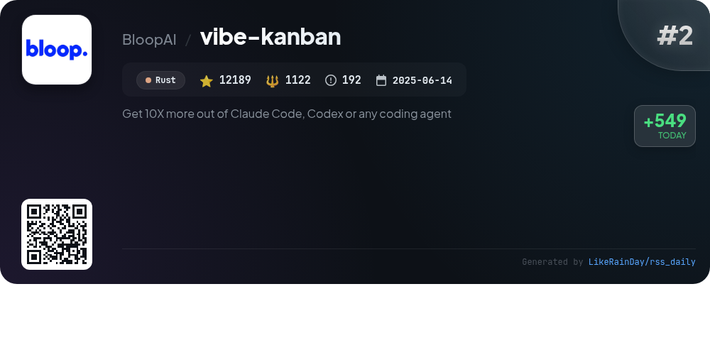
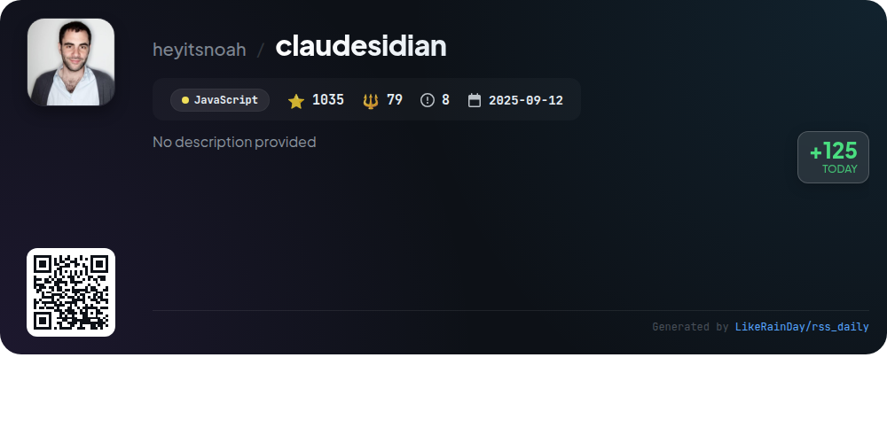

# 📊 🌟 GitHub Trending Daily - 2026-01-04

> > 📅 每日精选 GitHub 热门仓库 | 基于智能算法推荐

## 📋 Overview

**10** 个项目 | **216058** ⭐ | **24888** 🍴

**热门语言:** `TypeScript` (5) · `Rust` (2) · `Java` (1)

**更新时间:** 2026-01-04 08:12 UTC

**分类分布:**

- 🌟 每日 Top 10 精选 (10 项)

---

## 🌟 每日 Top 10 精选

### 1. [memos](https://github.com/usememos/memos)

> 🤖 **推荐理由**  
> *Memos is an open-source, self-hosted note-taking service that prioritizes user privacy and data control. Built with Go and React, it offers features like full markdown support, zero telemetry, and a beautiful, mobile-responsive interface. Key highlights include simple one-line Docker deployment, API access for integrations, and complete ownership of your data without ads or subscription fees. With over 50,000 stars, Memos is ideal for personal notes, team wikis, and knowledge management, ensuring a fast and customizable experience.*

- ⭐ 50725 stars
- 💻 Go
- 📅 Updated: 2026-01-04

### 2. [vibe-kanban](https://github.com/BloopAI/vibe-kanban)

> 🤖 **推荐理由**  
> *Vibe Kanban is a Rust-based project designed to enhance productivity with AI coding agents like Claude Code and Codex. With over 12,000 stars on GitHub, it enables seamless switching and orchestration of multiple coding agents, task tracking, and centralized configuration. Key features include parallel execution, quick work reviews, and SSH access for remote projects. Vibe Kanban simplifies the coding process, allowing engineers to focus on planning and orchestration. For installation and documentation, visit [vibekanban.com](https://vibekanban.com).*

- ⭐ 12189 stars
- 💻 Rust
- 📅 Updated: 2026-01-04

### 3. [newsnow](https://github.com/ourongxing/newsnow)

> 🤖 **推荐理由**  
> *NewsNow is a TypeScript-based project designed for elegant reading of real-time trending news, currently supporting Chinese. Key features include a clean UI, real-time updates, GitHub OAuth login, adaptive scraping intervals, and a customizable MCP server. It supports deployment on platforms like Cloudflare and Vercel, with options for caching and database integration. Future enhancements aim for multi-language support and improved personalization. Contributions are encouraged, with a focus on expanding data sources. The project is open-source under the MIT license.*

- ⭐ 16437 stars
- 💻 TypeScript
- 📅 Updated: 2026-01-04

### 4. [nocodb](https://github.com/nocodb/nocodb)

> 🤖 **推荐理由**  
> *🔥 🔥 🔥 Open Source Airtable Alternative. popular project, actively maintained, recently updated*

- ⭐ 60378 stars
- 🍴 4492 forks
- 💻 TypeScript
- 📅 Updated: 2026-01-04

### 5. [cc-switch](https://github.com/farion1231/cc-switch)

> 🤖 **推荐理由**  
> *cc-switch is a cross-platform desktop assistant tool for Claude Code, Codex, and Gemini CLI, built with Rust. With 8,958 stars, it offers key features like a dual-layer SQLite+JSON architecture, a redesigned UI, and support for Japanese, Chinese, and English. Key functionalities include seamless provider management, skills and prompts management, and auto-sync capabilities. It integrates with various AI coding platforms and provides critical bug fixes, speed testing, and configuration import/export. The tool is designed for Windows, macOS, and Linux, ensuring a robust coding experience.*

- ⭐ 8958 stars
- 💻 Rust
- 📅 Updated: 2026-01-04

### 6. [thingsboard](https://github.com/thingsboard/thingsboard)

> 🤖 **推荐理由**  
> *ThingsBoard is an open-source IoT platform for device management, data collection, processing, and visualization, boasting over 20,000 stars on GitHub. Key features include device provisioning, real-time data visualization with customizable dashboards, a powerful rule engine for data processing, and SCADA capabilities for industrial monitoring. Users can manage devices securely, set alarms, and receive notifications. Installation options include on-premise, cloud, or a live demo. Comprehensive documentation and support are available to enhance user experience.*

- ⭐ 20872 stars
- 💻 Java
- 📅 Updated: 2026-01-04

### 7. [claudesidian](https://github.com/heyitsnoah/claudesidian)

> 🤖 **推荐理由**  
> *Claudesidian is an AI-powered Obsidian starter kit designed to enhance your knowledge management using Claude Code. It features a structured PARA organization method, Git version control, and mobile access. Users can interact with Claude Code in two modes: Thinking Mode for exploration and Writing Mode for content creation. Key commands include research assistance and daily reviews. The kit supports advanced integrations like Google Gemini for document analysis and Firecrawl for web research, making it a comprehensive tool for personal and collaborative knowledge management.*

- ⭐ 1035 stars
- 💻 JavaScript
- 📅 Updated: 2026-01-04

### 8. [agents.md](https://github.com/agentsmd/agents.md)

> 🤖 **推荐理由**  
> *AGENTS.md is an open format designed to guide coding agents, serving as a structured README for AI tools. With over 14,000 stars, it provides clear instructions on development environments, testing, and pull request protocols. Key features include streamlined commands for package management, testing, and linting, ensuring efficient collaboration and project management. Additionally, the project includes a Next.js website that outlines its goals and offers examples. AGENTS.md simplifies the process of integrating AI coding agents into development workflows.*

- ⭐ 14036 stars
- 💻 TypeScript
- 📅 Updated: 2026-01-04

### 9. [nuclear](https://github.com/nukeop/nuclear)

> 🤖 **推荐理由**  
> *Nuclear is a streaming music player that curates free music from various online sources, including YouTube, SoundCloud, and Jamendo. Key features include playlist management, real-time lyrics, audio normalization, and scrobbling to Last.fm. The player supports genre browsing, radio mode, and unlimited downloads without ads or account requirements. A new version, currently being developed, promises auto-updates, improved performance with native Rust, and enhanced plugin support. Join the community on Discord and contribute to its ongoing development.*

- ⭐ 16877 stars
- 💻 TypeScript
- 📅 Updated: 2026-01-04

### 10. [zigbee2mqtt](https://github.com/Koenkk/zigbee2mqtt)

> 🤖 **推荐理由**  
> *Zigbee2MQTT is an open-source project that serves as a bridge between Zigbee devices and MQTT, enabling users to control their Zigbee devices without relying on proprietary hubs. With over 14,500 stars on GitHub, it integrates seamlessly with various smart home solutions, including Home Assistant, Domoticz, and Gladys Assistant. Key features include extensive device support, a modular architecture, and web-based interfaces for monitoring and configuration. The project is actively maintained and encourages community contributions for device support and enhancements.*

- ⭐ 14551 stars
- 💻 TypeScript
- 📅 Updated: 2026-01-04

---

## 📡 RSS订阅

通过 RSS 订阅，第一时间获取每日精选项目：

- 🔔 [RSS 订阅源] (../../daily-top.xml)
- 🔔 [每日简报] (../../GITHUB_TODAY_CN.md)
- 🔔 [每日 Top 10 精选](../../daily-top.xml)

---

*⚡ Powered by Smart Trending Algorithm | Generated at 2026-01-04 08:12:39 UTC
