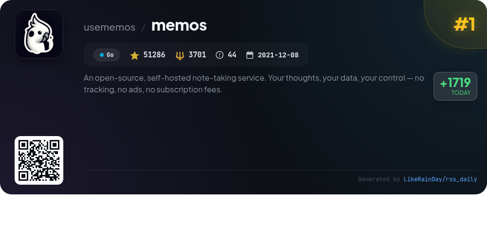
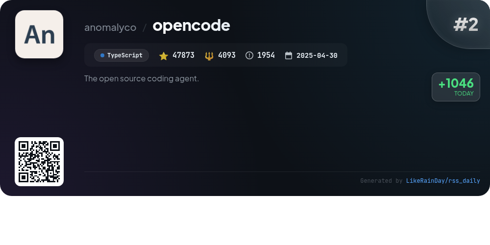
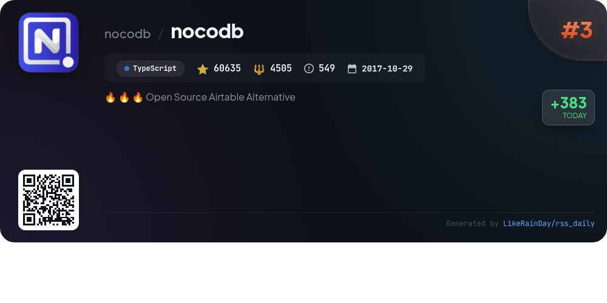
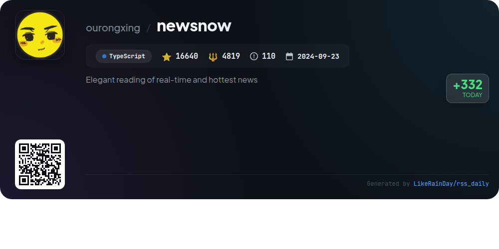
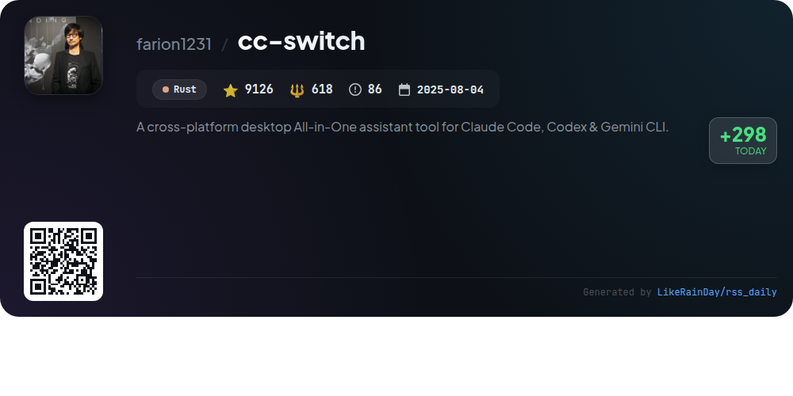
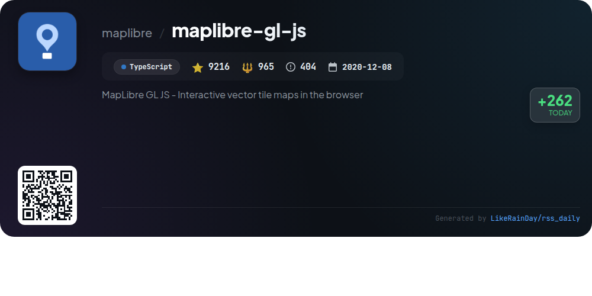
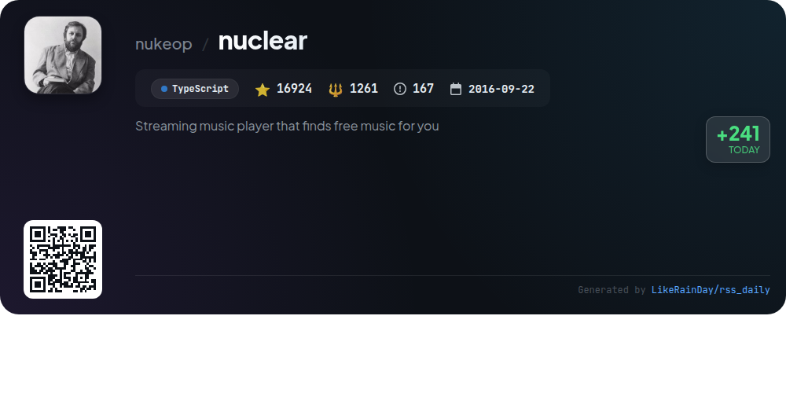
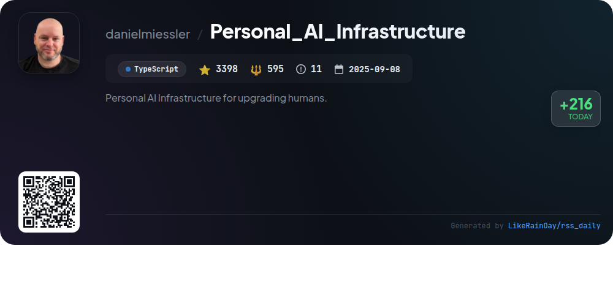
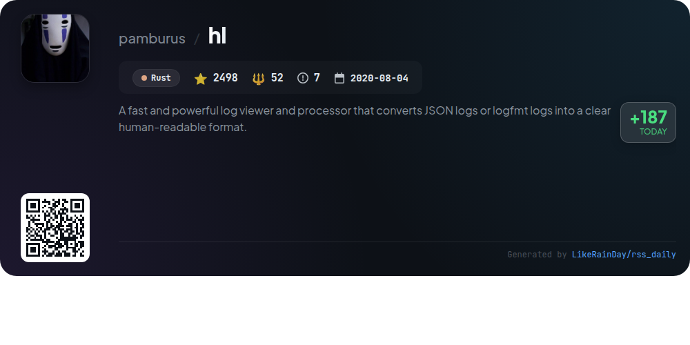

# 📊 🌟 GitHub Trending Daily - 2026-01-05

> > 📅 Daily Picks of GitHub Trending Repositories | Powered by Smart Algorithms

## 📋 Overview

**10** Projects | **220667** ⭐ | **20799** 🍴

**Top Languages:** `TypeScript` (6) · `Go` (2) · `Rust` (2)

**Updated:** 2026-01-05 06:51 UTC

**Categories:**

- 🌟 Daily Top 10 (10 items)

---

## 🌟 Daily Top 10

### 1. [memos](https://github.com/usememos/memos)

> 🤖 **Why Recommend**  
> *Memos is an open-source, self-hosted note-taking service designed for privacy and control, with no tracking, ads, or subscription fees. Built with Go and React, it offers full markdown support, blazing fast performance, and easy deployment via Docker. Key features include complete data ownership, REST and gRPC APIs for integration, and a clean, responsive interface. Suitable for personal notes and team wikis, Memos allows users to manage their knowledge effectively while ensuring data privacy. Explore more at usememos.com.*

- ⭐ 51415 stars
- 💻 Go
- 📅 Updated: 2026-01-05

### 2. [opencode](https://github.com/anomalyco/opencode)

> 🤖 **Why Recommend**  
> *OpenCode is an open-source AI coding agent built with TypeScript, boasting over 48,000 stars on GitHub. It features two agents—'build' for full development access and 'plan' for read-only analysis, ideal for exploring codebases. Users can switch between agents with ease. OpenCode supports various installation methods across platforms and offers a BETA desktop app. Its unique client/server architecture allows remote interaction with a terminal-based UI. The project emphasizes provider-agnostic model usage, making it versatile for developers. Join the community on Discord for support and collaboration.*

- ⭐ 48359 stars
- 💻 TypeScript
- 📅 Updated: 2026-01-05

### 3. [nocodb](https://github.com/nocodb/nocodb)

> 🤖 **Why Recommend**  
> *🔥 🔥 🔥 Open Source Airtable Alternative. popular project, actively maintained, recently updated*

- ⭐ 60723 stars
- 🍴 4513 forks
- 💻 TypeScript
- 📅 Updated: 2026-01-05

### 4. [seanime](https://github.com/5rahim/seanime)

> 🤖 **Why Recommend**  
> *Seanime is an open-source media server for anime and manga, featuring a cross-platform web interface and desktop app. Key features include a built-in video player with support for advanced subtitles, AniList integration for managing your library, and offline mode functionality. Users can scan their anime library quickly and stream torrents directly to their media player. Additional capabilities include customizable UI, integrated torrent search, and manga reading support. Seanime emphasizes legal media sourcing and offers extensive documentation and community support.*

- ⭐ 2253 stars
- 💻 Go
- 📅 Updated: 2026-01-05

### 5. [newsnow](https://github.com/ourongxing/newsnow)

> 🤖 **Why Recommend**  
> *newsnow is a TypeScript-based project designed for elegant reading of real-time trending news, currently supporting Chinese. Key features include a clean UI, GitHub OAuth login, adaptive scraping intervals to optimize resource usage, and a customizable caching system. The project offers easy deployment options via platforms like Cloudflare and Vercel, with support for multiple databases, particularly Cloudflare D1. Future enhancements aim to include multi-language support, personalized news options, and expanded data sources. Contributions are welcome under the MIT license.*

- ⭐ 16640 stars
- 💻 TypeScript
- 📅 Updated: 2026-01-05

### 6. [cc-switch](https://github.com/farion1231/cc-switch)

> 🤖 **Why Recommend**  
> *cc-switch is a cross-platform desktop assistant tool for Claude Code, Codex, and Gemini CLI, built with Rust and Tauri. It boasts over 9,200 stars and features a robust SQLite + JSON dual-layer architecture for data management. Key highlights include seamless provider switching, advanced skills and prompts management, and enhanced MCP server integration. The app supports multiple languages, auto-launches on startup, and offers a brand-new user interface. It also provides cloud sync capabilities and integrates with various AI coding services, ensuring a fast and stable coding experience.*

- ⭐ 9211 stars
- 💻 Rust
- 📅 Updated: 2026-01-05

### 7. [maplibre-gl-js](https://github.com/maplibre/maplibre-gl-js)

> 🤖 **Why Recommend**  
> *MapLibre GL JS is an open-source library for rendering interactive vector tile maps in web applications, leveraging GPU acceleration for fast performance. Originating as a fork of Mapbox GL JS, it provides a seamless experience for developers seeking an open-source alternative. Key features include customizable map styles, 3D terrain visualization, and support for heatmaps. The library is compatible with React and Angular, and comprehensive documentation, examples, and community engagement opportunities are available. It is actively maintained under the BSD-3-Clause license.*

- ⭐ 9222 stars
- 💻 TypeScript
- 📅 Updated: 2026-01-05

### 8. [nuclear](https://github.com/nukeop/nuclear)

> 🤖 **Why Recommend**  
> *Nuclear is a free, open-source music streaming player that aggregates music from platforms like YouTube, Jamendo, Audius, and SoundCloud. Key features include playlist management, real-time lyrics, scrobbling to Last.fm, and genre browsing. With no ads or accounts required, users can enjoy unlimited downloads and audio normalization. A forthcoming rewrite aims to enhance performance, add auto-updates, and support for plugins using Tauri and Rust. Community engagement is encouraged through translations and feature suggestions.*

- ⭐ 16925 stars
- 💻 TypeScript
- 📅 Updated: 2026-01-05

### 9. [Personal_AI_Infrastructure](https://github.com/danielmiessler/Personal_AI_Infrastructure)

> 🤖 **Why Recommend**  
> *Personal_AI_Infrastructure (PAI) is an open-source framework for creating personalized AI systems. With 3,398 stars on GitHub, PAI focuses on helping users achieve their goals through a unique architecture that combines a universal progress pattern and a scientific method cycle. Key features include modular packs for customizable AI capabilities, persistent memory, and intelligent context management. PAI enables users to build tailored AI assistants that learn and adapt, fostering a self-improving ecosystem designed for individual needs.*

- ⭐ 3398 stars
- 💻 TypeScript
- 📅 Updated: 2026-01-05

### 10. [hl](https://github.com/pamburus/hl)

> 🤖 **Why Recommend**  
> *A fast and powerful log viewer and processor that converts JSON logs or logfmt logs into a clear human-readable format.. popular project, recently updated*

- ⭐ 2521 stars
- 🍴 52 forks
- 💻 Rust
- 📅 Updated: 2026-01-05

---

## 📡 RSS Subscription

Subscribe via RSS to get daily trending updates:

- 🔔 [RSS XML] (../../daily-top.xml)
- 🔔 [Daily Report] (../../GITHUB_TODAY.md)
- 🔔 [Daily Top 10](../../daily-top.xml)

---

*⚡ Powered by Smart Trending Algorithm | Generated at 2026-01-05 06:51:06 UTC
