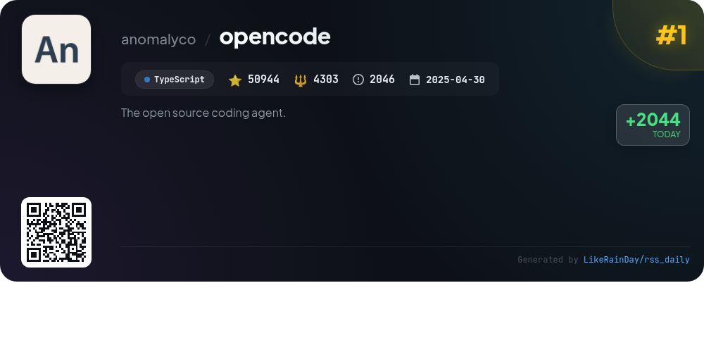
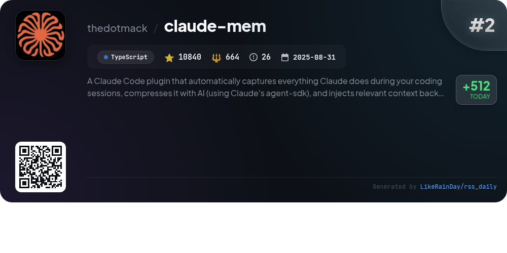
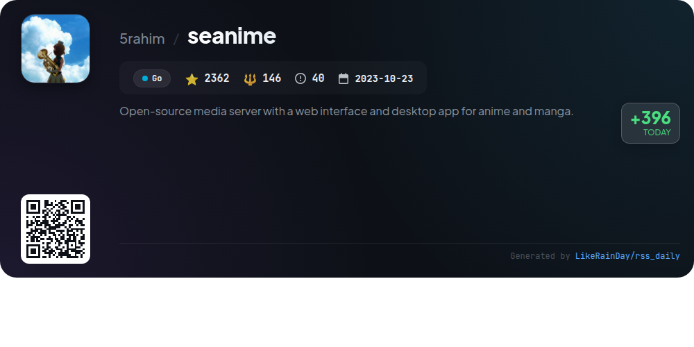
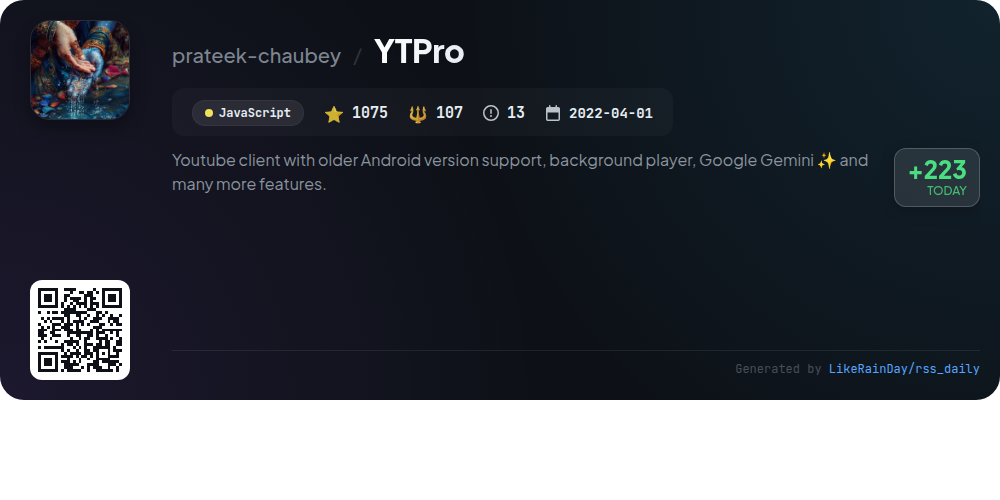
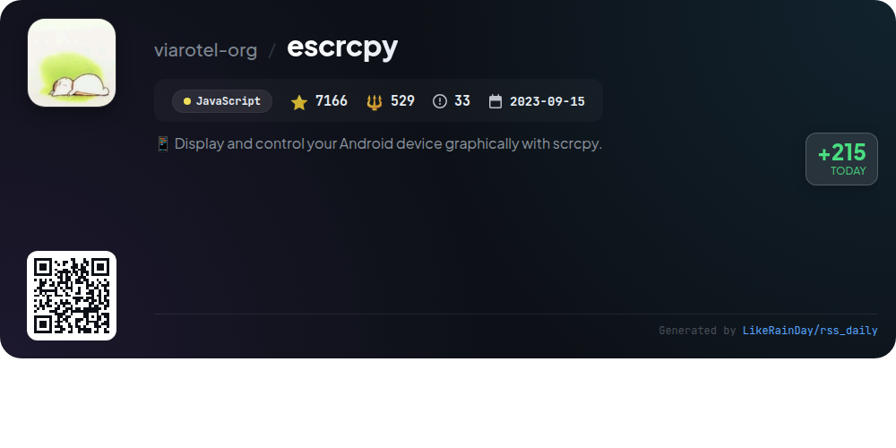
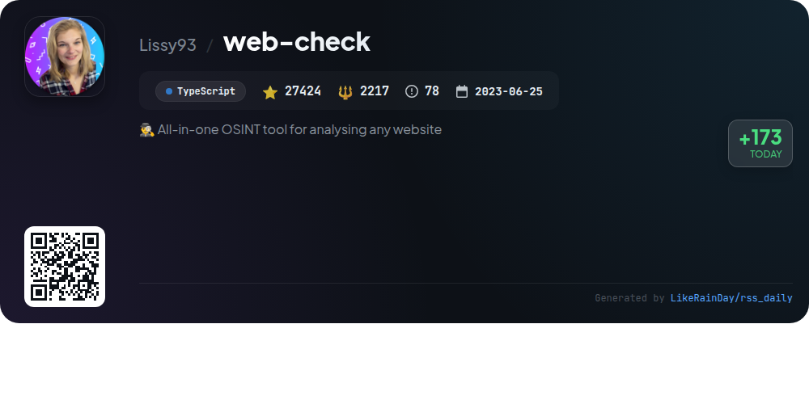
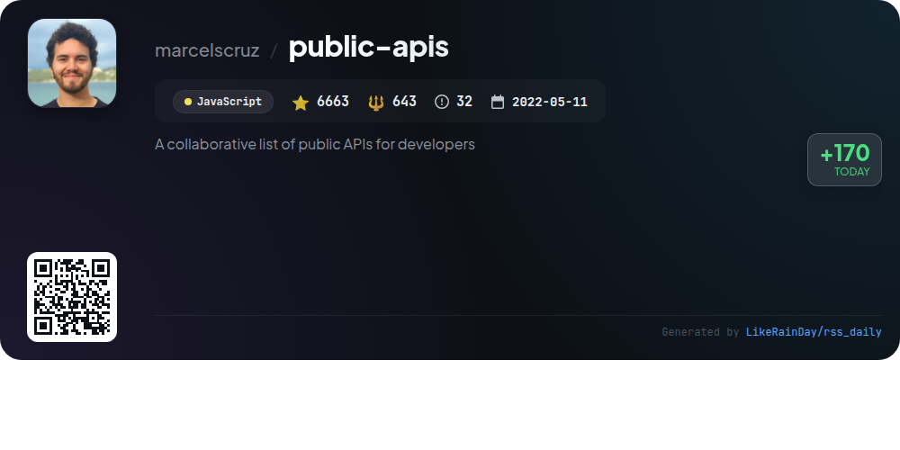
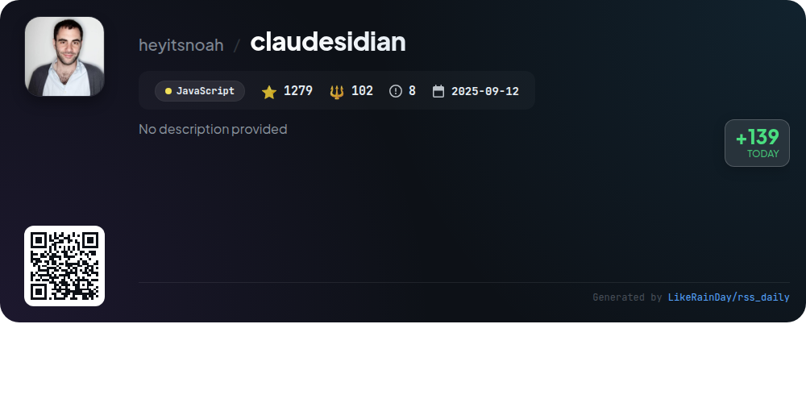
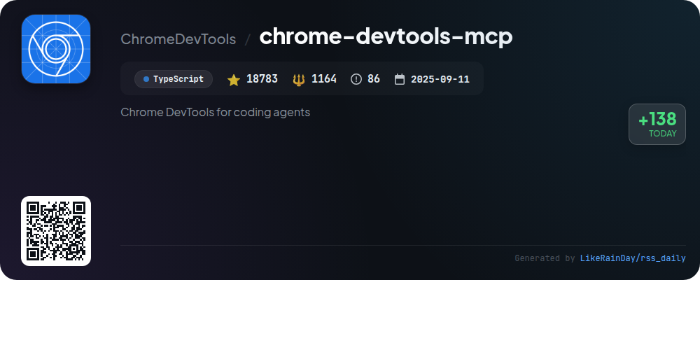

# 📊 🌟 GitHub Trending Daily - 2026-01-06

> > 📅 每日精选 GitHub 热门仓库 | 基于智能算法推荐

## 📋 Overview

**10** 个项目 | **136107** ⭐ | **10528** 🍴

**热门语言:** `TypeScript` (4) · `JavaScript` (4) · `Go` (1)

**更新时间:** 2026-01-06 12:58 UTC

**分类分布:**

- 🌟 每日 Top 10 精选 (10 项)

---

## 🌟 每日 Top 10 精选

### 1. [opencode](https://github.com/anomalyco/opencode)

> 🤖 **推荐理由**  
> *OpenCode is an open-source AI coding agent designed to enhance coding efficiency. It features two built-in agents: the "build" agent for full development access and the "plan" agent for read-only code exploration. Users can switch between agents seamlessly. OpenCode supports multiple platforms with a desktop application and offers installation via various package managers. It is provider-agnostic, enabling integration with models from various sources, and features a terminal user interface optimized for neovim users. Join the community on Discord for support and collaboration.*

- ⭐ 50944 stars
- 💻 TypeScript
- 📅 Updated: 2026-01-06

### 2. [claude-mem](https://github.com/thedotmack/claude-mem)

> 🤖 **推荐理由**  
> *Claude-Mem is a powerful TypeScript plugin designed for Claude Code that enhances coding sessions by automatically capturing and compressing context with AI. Key features include persistent memory to retain knowledge across sessions, progressive disclosure for efficient memory retrieval, and a web viewer UI for real-time access. Users can perform skill-based searches, manage privacy with `<private>` tags, and utilize automatic operation without manual input. Claude-Mem supports a beta channel for experimental features, making it an essential tool for continuous coding productivity.*

- ⭐ 10840 stars
- 💻 TypeScript
- 📅 Updated: 2026-01-06

### 3. [seanime](https://github.com/5rahim/seanime)

> 🤖 **推荐理由**  
> *Seanime is an open-source media server designed for anime and manga enthusiasts, featuring a cross-platform web interface and desktop app. Key features include a built-in video player with subtitle support, complete AniList integration, and the ability to manage a local library. Users can stream content via torrents without downloading, with support for major torrent clients. Seanime also offers offline mode, customizable UI, and manga reading capabilities. It emphasizes user responsibility for obtaining media legally and includes extensive documentation and community support.*

- ⭐ 2378 stars
- 💻 Go
- 📅 Updated: 2026-01-06

### 4. [cc-switch](https://github.com/farion1231/cc-switch)

> 🤖 **推荐理由**  
> *cc-switch is a cross-platform All-in-One assistant tool for Claude Code, Codex, and Gemini CLI, built with Rust and Tauri. It features a dual-layer SQLite + JSON architecture for data management, a redesigned UI, and support for multiple languages (English, Chinese, Japanese). Key functionalities include provider management, skills and prompts management, auto-launch on startup, and environment variable conflict detection. It offers seamless integration with various AI coding services, enhanced performance, and user-friendly configuration options, making it a valuable tool for developers.*

- ⭐ 9529 stars
- 💻 Rust
- 📅 Updated: 2026-01-06

### 5. [YTPro](https://github.com/prateek-chaubey/YTPro)

> 🤖 **推荐理由**  
> *YTPro is a YouTube client designed for older Android versions, offering features like background audio playback, video downloading, and Google Gemini for video summarization. With a minimalist design and APK size under 50KB, it includes an ad blocker, thumbnail and caption downloads, and gesture controls for volume and brightness. Users can save videos without logging in and enjoy features like Picture-in-Picture mode and dislike counts. The project has garnered 1,075 stars on GitHub, showcasing its popularity among users seeking a versatile YouTube experience.*

- ⭐ 1075 stars
- 💻 JavaScript
- 📅 Updated: 2026-01-06

### 6. [escrcpy](https://github.com/viarotel-org/escrcpy)

> 🤖 **推荐理由**  
> *Escrcpy is an innovative tool for displaying and controlling Android devices graphically, leveraging Electron for a seamless experience. Key features include intelligent control through natural-language commands, automated workflows across multiple devices, and efficient multi-device management. It supports wireless connectivity with Gnirehtet reverse tethering and offers high-performance, low-latency screen mirroring. With comprehensive documentation and community support, Escrcpy is a powerful solution for Android device management, boasting over 7,192 stars on GitHub.*

- ⭐ 7192 stars
- 💻 JavaScript
- 📅 Updated: 2026-01-06

### 7. [web-check](https://github.com/Lissy93/web-check)

> 🤖 **推荐理由**  
> *Web-Check is a powerful all-in-one OSINT tool for analyzing websites, boasting over 27,000 stars on GitHub. Built with TypeScript, it offers comprehensive insights into website security, server architecture, and technology stack. Key features include IP info, SSL chain analysis, DNS records, cookie examination, server location mapping, and performance metrics. Users can explore associated hostnames, traceroute paths, and even the environmental impact of a website. Web-Check facilitates optimization and security assessment, making it essential for web developers and security researchers alike.*

- ⭐ 27424 stars
- 💻 TypeScript
- 📅 Updated: 2026-01-06

### 8. [public-apis](https://github.com/marcelscruz/public-apis)

> 🤖 **推荐理由**  
> *The "public-apis" project is a collaborative repository featuring a curated list of over 1,000 public APIs for developers. It covers diverse categories such as Animals, Weather, Finance, Machine Learning, and more, enabling quick access to essential data and services. With 6,663 stars on GitHub, this resource facilitates API discovery for various applications, from e-commerce to social media integration. Key highlights include APIs for cryptocurrency, health data, transportation, and entertainment, making it a valuable tool for developers seeking to enhance their projects with external data.*

- ⭐ 6663 stars
- 💻 JavaScript
- 📅 Updated: 2026-01-06

### 9. [claudesidian](https://github.com/heyitsnoah/claudesidian)

> 🤖 **推荐理由**  
> *Claudesidian is an AI-powered Obsidian starter kit designed to enhance knowledge organization and productivity using Claude Code. Key features include a PARA method-based vault structure, Git integration for version control, and mobile access. It offers AI-driven functionalities such as collaborative exploration and content generation, along with optional modules for document analysis and web research. The setup wizard streamlines the initial configuration, making it easy to personalize and maintain an efficient workflow. Ideal for users seeking to leverage AI as a thinking partner.*

- ⭐ 1279 stars
- 💻 JavaScript
- 📅 Updated: 2026-01-06

### 10. [chrome-devtools-mcp](https://github.com/ChromeDevTools/chrome-devtools-mcp)

> 🤖 **推荐理由**  
> *chrome-devtools-mcp is a TypeScript project enabling coding agents like Gemini and Copilot to control and inspect live Chrome browsers. With over 18,000 stars, it acts as a Model-Context-Protocol (MCP) server, providing advanced debugging, performance insights, and reliable automation through Puppeteer. Key features include network request analysis, screenshot capture, and performance trace recording. The tool requires Node.js and a stable Chrome version, allowing seamless integration with various coding environments for enhanced development efficiency.*

- ⭐ 18783 stars
- 💻 TypeScript
- 📅 Updated: 2026-01-06

---

## 📡 RSS订阅

通过 RSS 订阅，第一时间获取每日精选项目：

- 🔔 [RSS 订阅源] (../../daily-top.xml)
- 🔔 [每日简报] (../../GITHUB_TODAY_CN.md)
- 🔔 [每日 Top 10 精选](../../daily-top.xml)

---

*⚡ Powered by Smart Trending Algorithm | Generated at 2026-01-06 12:58:37 UTC
