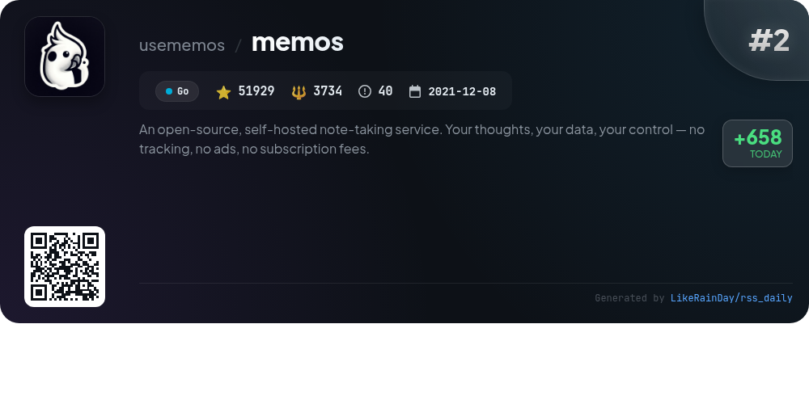
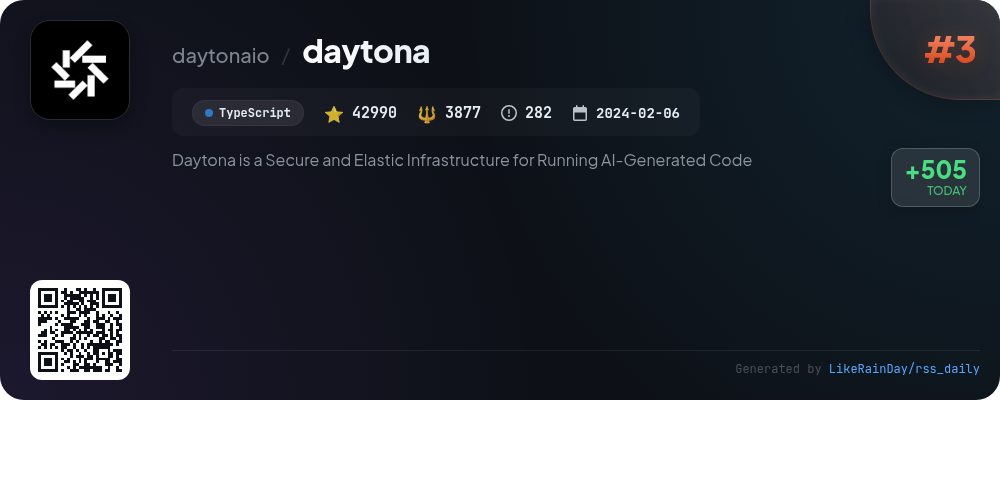
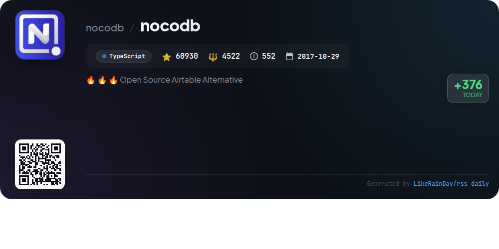
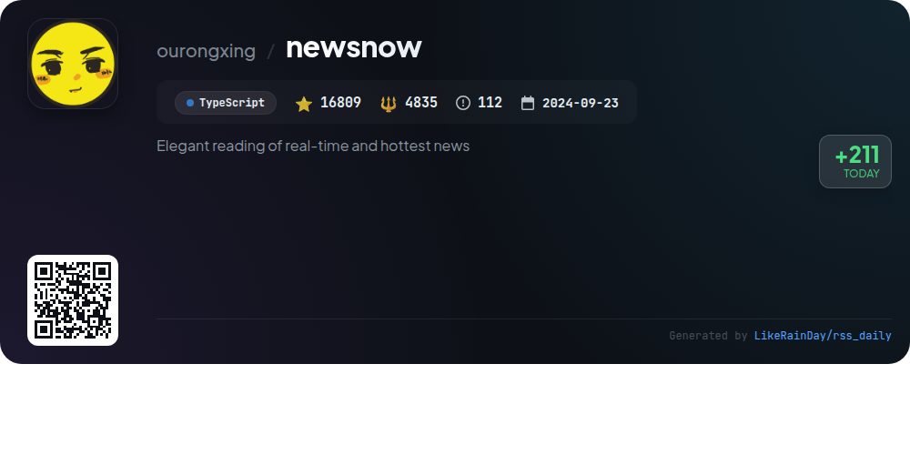
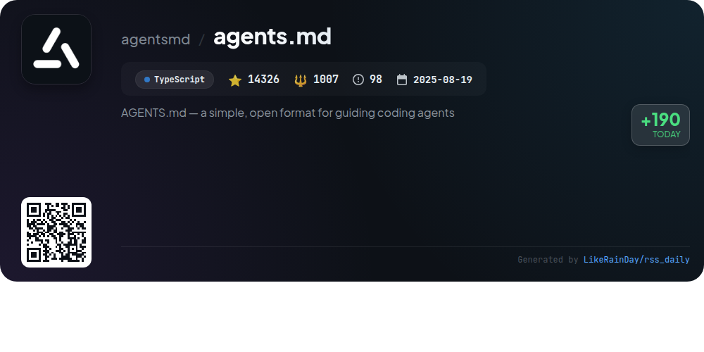

# 📊 🌟 GitHub Trending Daily - 2026-01-06

> > 📅 每日精选 GitHub 热门仓库 | 基于智能算法推荐

## 📋 Overview

**10** 个项目 | **259372** ⭐ | **24127** 🍴

**热门语言:** `TypeScript` (6) · `Go` (2) · `JavaScript` (1)

**更新时间:** 2026-01-06 02:09 UTC

**分类分布:**

- 🌟 每日 Top 10 精选 (10 项)

---

## 🌟 每日 Top 10 精选

### 1. [opencode](https://github.com/anomalyco/opencode)

> 🤖 **推荐理由**  
> *OpenCode is an open-source AI coding agent built in TypeScript, boasting nearly 50,000 stars on GitHub. It features a dual-agent system: a full-access "build" agent for development and a read-only "plan" agent for code analysis. Users can switch agents easily and utilize a general subagent for complex tasks. OpenCode supports multiple platforms, including a desktop app, and offers seamless integration with various AI models. Emphasizing terminal usability and community engagement, it also provides extensive documentation for configuration and contribution.*

- ⭐ 49895 stars
- 💻 TypeScript
- 📅 Updated: 2026-01-06

### 2. [memos](https://github.com/usememos/memos)

> 🤖 **推荐理由**  
> *Memos is an open-source, self-hosted note-taking service designed for privacy and control. Built with Go and React, it offers features like full markdown support, complete data ownership, and no tracking or ads. Key highlights include a blazing-fast performance, simple one-line Docker deployment, and extensive REST and gRPC APIs for easy integration. Memos is free forever under the MIT license, making it an ideal alternative to traditional cloud services. Experience a clean, responsive interface and contribute to the project to enhance its capabilities.*

- ⭐ 51929 stars
- 💻 Go
- 📅 Updated: 2026-01-06

### 3. [daytona](https://github.com/daytonaio/daytona)

> 🤖 **推荐理由**  
> *Daytona is a secure and elastic infrastructure designed for running AI-generated code, garnering 42,990 stars on GitHub. Key features include lightning-fast sandbox creation (under 90ms), isolated execution environments to protect infrastructure, and massive parallelization for concurrent workflows. It supports OCI/Docker images for sandbox creation and offers programmatic control via a comprehensive API. Daytona provides SDKs for both Python and TypeScript, enabling developers to integrate seamlessly. For documentation and more, visit [daytona.io](https://www.daytona.io/docs).*

- ⭐ 42990 stars
- 💻 TypeScript
- 📅 Updated: 2026-01-06

### 4. [seanime](https://github.com/5rahim/seanime)

> 🤖 **推荐理由**  
> *Seanime is an open-source media server designed for anime and manga enthusiasts, featuring a web interface and desktop app. Key features include a built-in video player, AniList integration for managing collections, and custom source support for additional series. It allows offline use, direct streaming of torrents, and supports various media players like MPV and VLC. Users can scan their library quickly, schedule episodes, and read manga from local or online sources. Seanime prioritizes legal media access and user customization, making it a versatile tool for anime and manga management.*

- ⭐ 2362 stars
- 💻 Go
- 📅 Updated: 2026-01-06

### 5. [nocodb](https://github.com/nocodb/nocodb)

> 🤖 **推荐理由**  
> *🔥 🔥 🔥 Open Source Airtable Alternative. popular project, actively maintained, recently updated*

- ⭐ 60930 stars
- 🍴 4522 forks
- 💻 TypeScript
- 📅 Updated: 2026-01-06

### 6. [cc-switch](https://github.com/farion1231/cc-switch)

> 🤖 **推荐理由**  
> *cc-switch is a cross-platform desktop assistant tool designed for Claude Code, Codex, and Gemini CLI, built with Rust. It boasts a dual-layer architecture combining SQLite and JSON, enabling efficient data management and future cloud sync capabilities. Key features include provider management, skills and prompts systems, and MCP server integration. With a user-friendly interface supporting multiple languages, it allows seamless switching between AI tools and offers extensive customization options. The project has garnered 9,375 stars on GitHub, reflecting its popularity and utility among developers.*

- ⭐ 9375 stars
- 💻 Rust
- 📅 Updated: 2026-01-06

### 7. [Personal_AI_Infrastructure](https://github.com/danielmiessler/Personal_AI_Infrastructure)

> 🤖 **推荐理由**  
> *Personal AI Infrastructure (PAI) is an open-source framework designed for creating personalized AI systems that help individuals achieve their goals. Key features include a modular architecture with self-contained "packs" for specific capabilities, a universal goal-oriented structure based on the scientific method, and persistent memory for context-aware interactions. PAI enables users to install, customize, and iterate on AI functionalities easily, ensuring that technology serves individual needs. With over 3,590 stars on GitHub, PAI emphasizes user empowerment through tailored AI experiences.*

- ⭐ 3590 stars
- 💻 TypeScript
- 📅 Updated: 2026-01-06

### 8. [escrcpy](https://github.com/viarotel-org/escrcpy)

> 🤖 **推荐理由**  
> *Escrcpy is an innovative tool that allows users to display and control Android devices graphically via Electron. Key features include intelligent control through natural-language commands, automation for efficient workflow across multiple devices, and wireless connectivity with Gnirehtet support. The software provides high-performance, low-latency screen mirroring and centralized management for multi-device orchestration. With a strong community backing and extensive documentation, Escrcpy is a powerful solution for Android device management, boasting over 7,166 stars on GitHub.*

- ⭐ 7166 stars
- 💻 JavaScript
- 📅 Updated: 2026-01-06

### 9. [newsnow](https://github.com/ourongxing/newsnow)

> 🤖 **推荐理由**  
> *newsnow is a TypeScript-based project designed for elegant reading of real-time and trending news, currently supporting Chinese. Key features include a clean UI, real-time news updates, GitHub OAuth login, and adaptive scraping to optimize resource usage. It supports deployment on platforms like Cloudflare and Vercel, along with Docker. Future enhancements include multi-language support, personalization options, and expanded data sources. The project encourages contributions and offers a detailed guide for adding new data sources.*

- ⭐ 16809 stars
- 💻 TypeScript
- 📅 Updated: 2026-01-06

### 10. [agents.md](https://github.com/agentsmd/agents.md)

> 🤖 **推荐理由**  
> *AGENTS.md is an open format designed to guide AI coding agents effectively. Acting as a README for agents, it provides structured context and instructions essential for project development. Key features include environment setup tips, testing instructions, and PR guidelines, ensuring seamless collaboration and code quality. The project is implemented in TypeScript and has garnered 14,326 stars on GitHub. Additionally, it includes a simple Next.js website at https://agents.md/, offering a clear overview and examples of its usage.*

- ⭐ 14326 stars
- 💻 TypeScript
- 📅 Updated: 2026-01-06

---

## 📡 RSS订阅

通过 RSS 订阅，第一时间获取每日精选项目：

- 🔔 [RSS 订阅源] (../../daily-top.xml)
- 🔔 [每日简报] (../../GITHUB_TODAY_CN.md)
- 🔔 [每日 Top 10 精选](../../daily-top.xml)

---

*⚡ Powered by Smart Trending Algorithm | Generated at 2026-01-06 02:09:31 UTC
