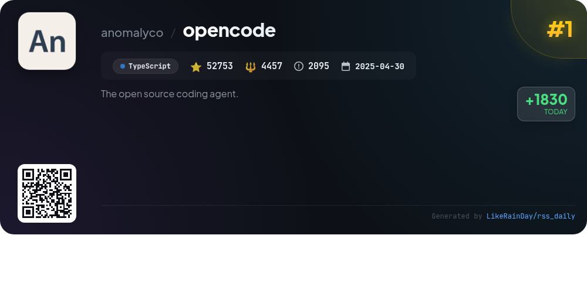
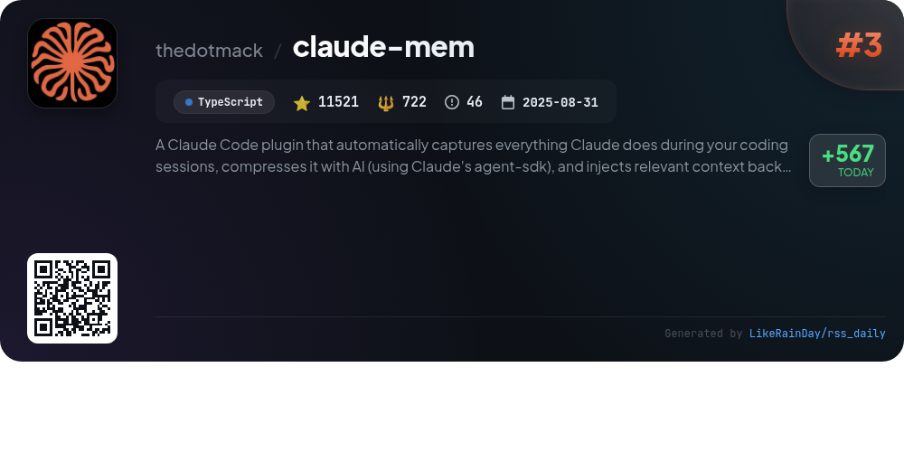
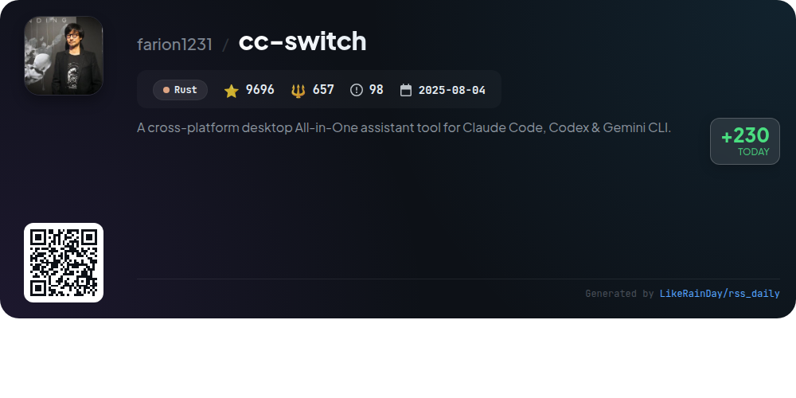
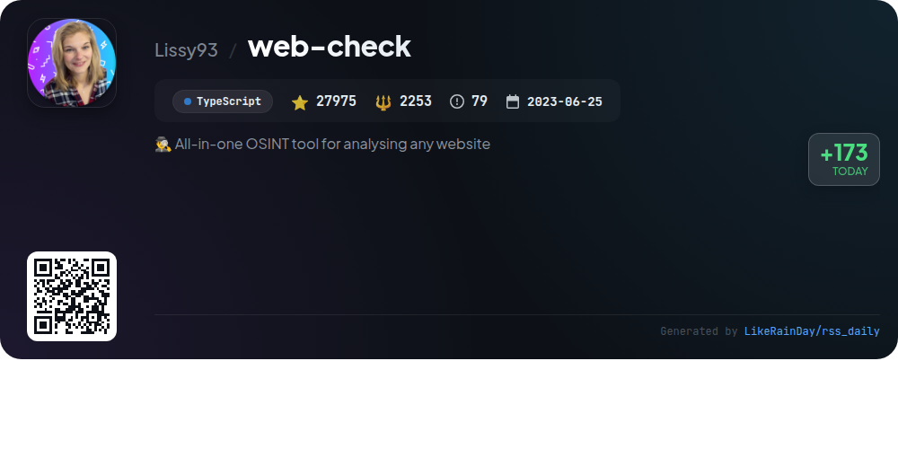
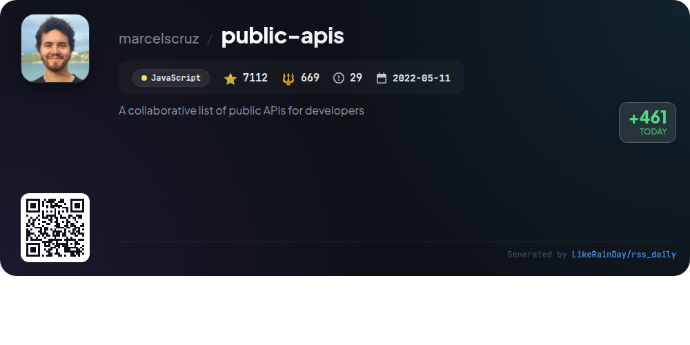
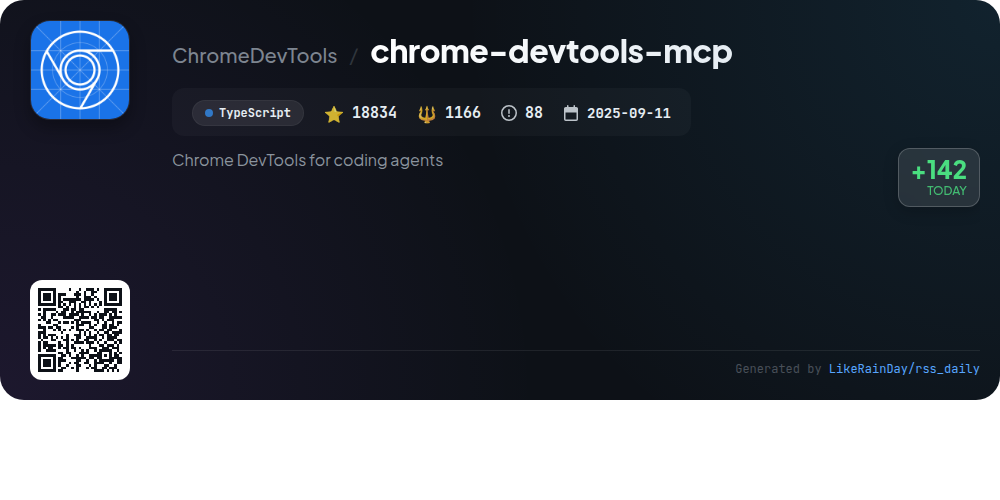
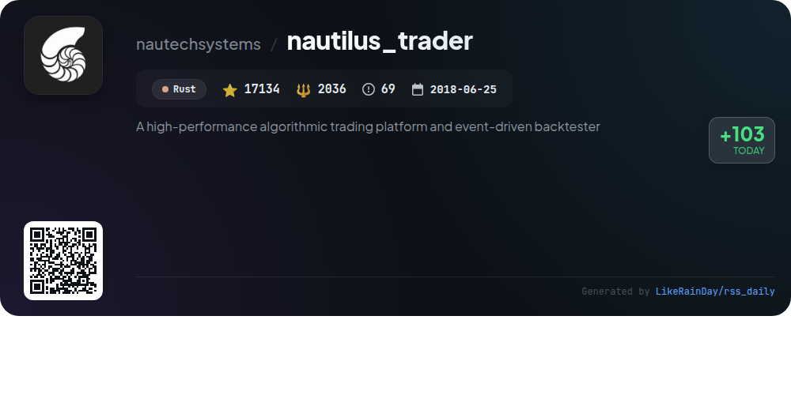
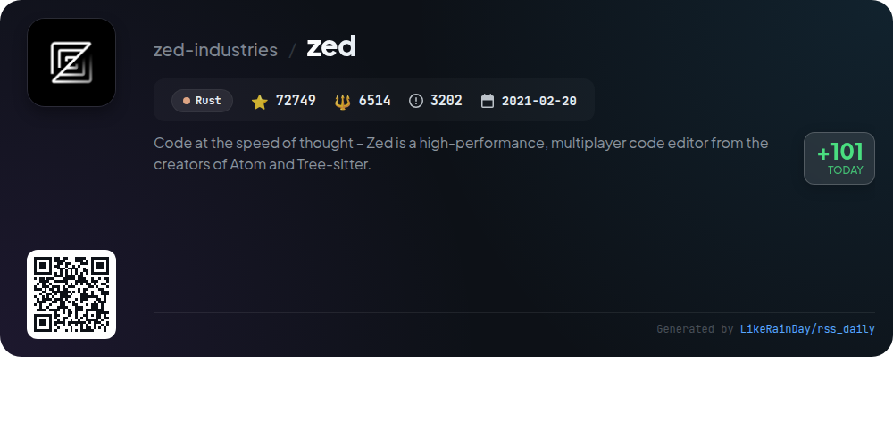
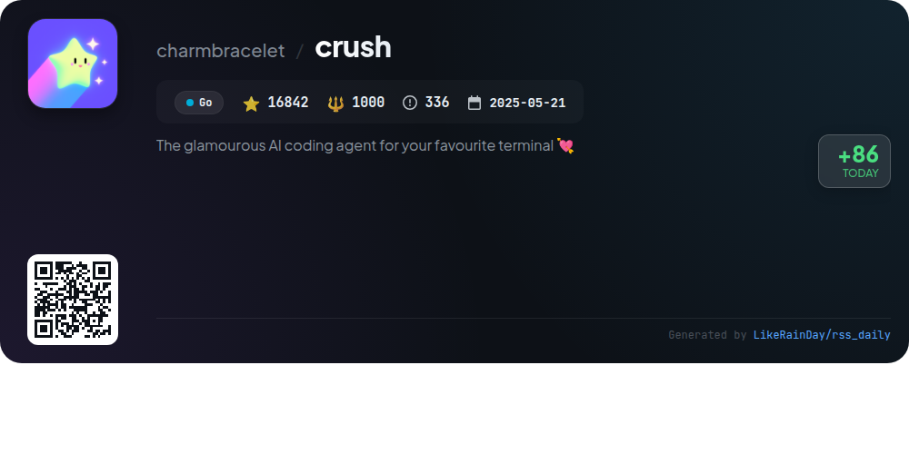

# 📊 🌟 GitHub Trending Daily - 2026-01-07

> > 📅 Daily Picks of GitHub Trending Repositories | Powered by Smart Algorithms

## 📋 Overview

**10** Projects | **234962** ⭐ | **19529** 🍴

**Top Languages:** `TypeScript` (4) · `Rust` (3) · `JavaScript` (2)

**Updated:** 2026-01-07 06:44 UTC

**Categories:**

- 🌟 Daily Top 10 (10 items)

---

## 🌟 Daily Top 10

### 1. [opencode](https://github.com/anomalyco/opencode)

> 🤖 **Why Recommend**  
> *OpenCode is an open-source AI coding agent built in TypeScript, boasting over 52,000 stars on GitHub. It features two main agents: a full-access "build" agent for development tasks and a "plan" agent for code exploration without edits. Users can switch between agents easily, and OpenCode supports various installation methods, including desktop applications for macOS, Windows, and Linux. Its client/server architecture allows for remote usage, and it integrates seamlessly with multiple AI models. Join the community on Discord for support and collaboration.*

- ⭐ 52136 stars
- 💻 TypeScript
- 📅 Updated: 2026-01-07

### 2. [claude-mem](https://github.com/thedotmack/claude-mem)

> 🤖 **Why Recommend**  
> *Claude-Mem is a powerful TypeScript plugin for Claude Code, revolutionizing coding sessions by automatically capturing and compressing context for future use. Key features include persistent memory that survives across sessions, a skill-based search tool for project history, and a web viewer for real-time memory streaming. It offers privacy controls, context configuration, and automatic operation. With over 11,000 stars, it enhances productivity by ensuring continuity in project knowledge and supports multiple languages, making it accessible to a global audience.*

- ⭐ 11333 stars
- 💻 TypeScript
- 📅 Updated: 2026-01-07

### 3. [YTPro](https://github.com/prateek-chaubey/YTPro)

> 🤖 **Why Recommend**  
> *YTPro is a YouTube client designed for older Android versions, offering a range of features such as Google Gemini for video summarization, background audio playback, and a video downloader. Key highlights include customizable prompts, ad-blocking, gesture controls for volume and brightness, and a minimal APK size under 50KB. Users can enjoy Picture-in-Picture mode, skip sponsors, and save videos without an account. The app supports auto updates and has almost zero internal dependencies, making it lightweight and efficient.*

- ⭐ 1263 stars
- 💻 JavaScript
- 📅 Updated: 2026-01-07

### 4. [cc-switch](https://github.com/farion1231/cc-switch)

> 🤖 **Why Recommend**  
> *cc-switch is a cross-platform desktop assistant tool designed for Claude Code, Codex, and Gemini CLI, built with Rust. Key features include seamless provider management, SQLite-based persistence, advanced skills and prompts management, and a completely redesigned UI. The tool supports auto-launch on startup, multi-language interfaces (English, Chinese, Japanese), and cloud sync capabilities. Additionally, it integrates with various API relay services like PackyCode and AIGoCode, providing developers with efficient AI coding experiences. With nearly 10,000 stars, it’s a robust choice for developers seeking streamlined AI CLI management.*

- ⭐ 9696 stars
- 💻 Rust
- 📅 Updated: 2026-01-07

### 5. [web-check](https://github.com/Lissy93/web-check)

> 🤖 **Why Recommend**  
> *Web-Check is a powerful open-source OSINT tool for analyzing websites, boasting over 27,900 stars on GitHub. Built with TypeScript, it provides comprehensive insights into site security, performance, and technologies used. Key features include IP info, SSL chain analysis, DNS records, cookies, server location, open ports, and more. Users can uncover potential vulnerabilities, optimize performance, and ensure compliance with security standards. Accessible via a live demo at web-check.xyz, it supports deployment through platforms like Netlify, Vercel, and Docker.*

- ⭐ 27975 stars
- 💻 TypeScript
- 📅 Updated: 2026-01-07

### 6. [public-apis](https://github.com/marcelscruz/public-apis)

> 🤖 **Why Recommend**  
> *The public-apis project is a collaborative repository featuring over 1,200 public APIs for developers. With 7,000 stars on GitHub, it offers a diverse range of categories including Weather, Finance, Sports, and Machine Learning. Key highlights include easy access to APIs for data on animals, music, cryptocurrency, and social media, among others. The project supports various authentication methods such as API keys and OAuth, ensuring secure integration. It serves as a valuable resource for developers seeking to enhance applications with external data and services.*

- ⭐ 7000 stars
- 💻 JavaScript
- 📅 Updated: 2026-01-07

### 7. [chrome-devtools-mcp](https://github.com/ChromeDevTools/chrome-devtools-mcp)

> 🤖 **Why Recommend**  
> *chrome-devtools-mcp is a TypeScript library that enables AI coding agents like Gemini, Claude, Cursor, and Copilot to control and inspect a live Chrome browser using Chrome DevTools. Key features include performance insights through tracing, advanced debugging capabilities (network analysis, screenshots, console checks), and reliable automation via Puppeteer. It supports various configurations for seamless integration with different MCP clients, ensuring robust browser interactions for automation and performance analysis. The project boasts over 18,000 stars, reflecting its utility and popularity.*

- ⭐ 18834 stars
- 💻 TypeScript
- 📅 Updated: 2026-01-07

### 8. [nautilus_trader](https://github.com/nautechsystems/nautilus_trader)

> 🤖 **Why Recommend**  
> *NautilusTrader is a high-performance, open-source algorithmic trading platform built in Rust, designed for quantitative traders. It features an event-driven backtesting engine, allowing seamless backtesting and live deployment of strategies without code changes. Key highlights include support for high-frequency trading across diverse asset classes, modular API integrations, and advanced order types. The platform emphasizes software reliability and safety, facilitating efficient AI training and risk management, while maintaining parity between Python-based research and production environments.*

- ⭐ 17134 stars
- 💻 Rust
- 📅 Updated: 2026-01-07

### 9. [zed](https://github.com/zed-industries/zed)

> 🤖 **Why Recommend**  
> *Zed is a high-performance, multiplayer code editor developed by the creators of Atom and Tree-sitter. Built in Rust, it enables collaborative coding at the speed of thought, offering seamless real-time editing. Available for macOS, Linux, and Windows, Zed can be easily installed via direct download or local package managers. Key features include robust support for multiple developers, a focus on performance, and an open-source contribution model. The project encourages community engagement and is actively hiring. Explore more at zed.dev.*

- ⭐ 72749 stars
- 💻 Rust
- 📅 Updated: 2026-01-07

### 10. [crush](https://github.com/charmbracelet/crush)

> 🤖 **Why Recommend**  
> *Crush is an AI coding assistant for your terminal, supporting various LLMs via OpenAI and Anthropic APIs. Key features include multi-model selection, real-time context switching, and session management for multiple projects. It enhances coding workflows through LSP support and is highly extensible with MCPs. Crush operates seamlessly on macOS, Linux, Windows, and BSD systems. With a user-friendly installation process and support for custom configurations, Crush aims to boost productivity and streamline coding tasks for developers.*

- ⭐ 16842 stars
- 💻 Go
- 📅 Updated: 2026-01-07

---

## 📡 RSS Subscription

Subscribe via RSS to get daily trending updates:

- 🔔 [RSS XML] (../../daily-top.xml)
- 🔔 [Daily Report] (../../GITHUB_TODAY.md)
- 🔔 [Daily Top 10](../../daily-top.xml)

---

*⚡ Powered by Smart Trending Algorithm | Generated at 2026-01-07 06:44:24 UTC
