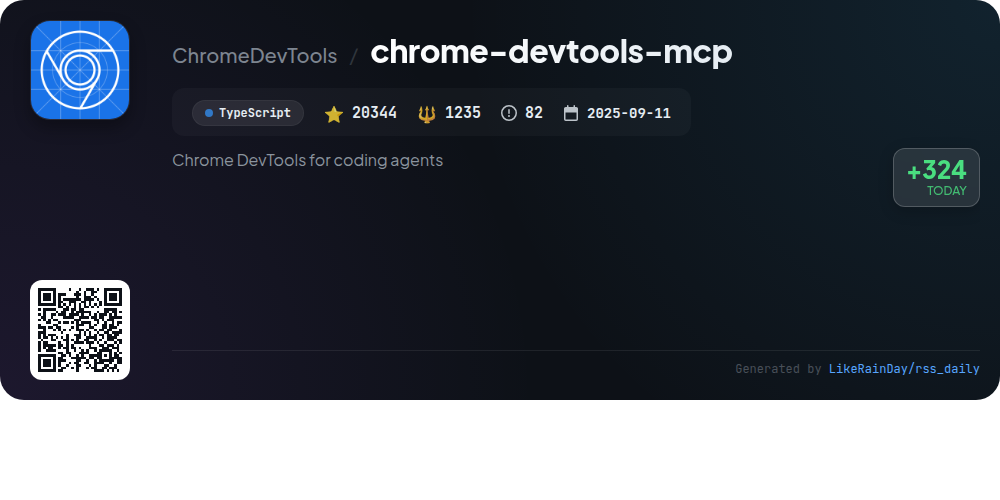
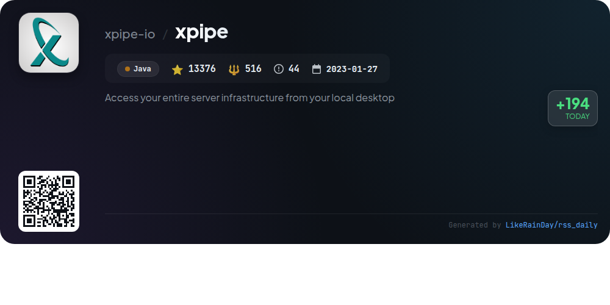

# 📊 🌟 GitHub Trending Daily - 2026-01-12

> > 📅 Daily Picks of GitHub Trending Repositories | Powered by Smart Algorithms

## 📋 Overview

**10** Projects | **292353** ⭐ | **27669** 🍴

**Top Languages:** `TypeScript` (6) · `Java` (1) · `JavaScript` (1)

**Updated:** 2026-01-12 01:09 UTC

**Categories:**

- 🌟 Daily Top 10 (10 items)

---

## 🌟 Daily Top 10

### 1. [opencode](https://github.com/anomalyco/opencode)

> 🤖 **Why Recommend**  
> *OpenCode is an open-source AI coding agent designed for efficient software development. It features two built-in agents: a full-access "build" agent for development tasks and a read-only "plan" agent for code exploration. Users can seamlessly switch between agents using the Tab key. The project is built in TypeScript and supports a variety of installation methods, including desktop applications for macOS, Windows, and Linux. OpenCode emphasizes a terminal user interface (TUI) and is provider-agnostic, allowing integration with various AI models. Join the community on Discord for support and collaboration.*

- ⭐ 61780 stars
- 💻 TypeScript
- 📅 Updated: 2026-01-12

### 2. [UI-TARS-desktop](https://github.com/bytedance/UI-TARS-desktop)

> 🤖 **Why Recommend**  
> *UI-TARS-desktop is an open-source multimodal AI agent stack that enhances desktop interaction through natural language control and advanced visual recognition. It features both local and remote operators for seamless computer and browser management. Key highlights include precise mouse and keyboard control, cross-platform support, and real-time feedback. With a focus on human-like task completion, UI-TARS integrates with various real-world tools and offers a user-friendly GUI for enhanced productivity. The project has garnered over 22,770 stars on GitHub, reflecting its popularity and utility.*

- ⭐ 22770 stars
- 💻 TypeScript
- 📅 Updated: 2026-01-12

### 3. [twenty](https://github.com/twentyhq/twenty)

> 🤖 **Why Recommend**  
> *Twenty is an open-source CRM designed as a modern alternative to Salesforce, emphasizing community-driven development. Key features include customizable layouts, object and field management, role-based permissions, and workflow automation. It supports integration with emails, calendar events, and more. Built with TypeScript, NestJS, and React, Twenty prioritizes user experience, drawing inspiration from contemporary tools like Notion and Airtable. The project fosters collaboration through Discord and encourages contributions, making it a versatile option for businesses seeking affordable CRM solutions.*

- ⭐ 38650 stars
- 💻 TypeScript
- 📅 Updated: 2026-01-12

### 4. [plane](https://github.com/makeplane/plane)

> 🤖 **Why Recommend**  
> *Plane is an open-source project management platform designed as an alternative to Jira, Linear, Monday, and ClickUp. It enables teams to manage tasks, sprints, and documentation efficiently. Key features include customizable work items, cycle tracking with burn-down charts, modular project organization, and real-time analytics. Users can choose between a managed Plane Cloud service or self-hosting options via Docker or Kubernetes. With a vibrant community and active development, Plane provides a modern solution for streamlined project workflows.*

- ⭐ 43542 stars
- 💻 TypeScript
- 📅 Updated: 2026-01-12

### 5. [chrome-devtools-mcp](https://github.com/ChromeDevTools/chrome-devtools-mcp)

> 🤖 **Why Recommend**  
> *chrome-devtools-mcp is a powerful TypeScript library enabling AI coding agents like Gemini and Copilot to control and inspect live Chrome browsers using a Model-Context-Protocol (MCP) server. With over 20,000 stars, it offers core features such as performance insights, advanced browser debugging, and reliable automation via Puppeteer. Users can analyze network requests, capture screenshots, and perform in-depth performance analysis. The library supports various configurations for seamless integration with multiple MCP clients, ensuring a robust development experience.*

- ⭐ 20344 stars
- 💻 TypeScript
- 📅 Updated: 2026-01-12

### 6. [ConvertX](https://github.com/C4illin/ConvertX)

> 🤖 **Why Recommend**  
> *ConvertX is a self-hosted file converter that supports over 1000 formats, built with TypeScript, Bun, and Elysia. Key features include batch processing, password protection, and multi-account support. It utilizes various converters like Inkscape for vector images, FFmpeg for video, and LibreOffice for documents. The project is easily deployable via Docker, allowing users to run it locally. With 14,584 stars on GitHub, ConvertX is a robust solution for users needing versatile file conversion capabilities.*

- ⭐ 14584 stars
- 💻 TypeScript
- 📅 Updated: 2026-01-12

### 7. [awesome-copilot](https://github.com/github/awesome-copilot)

> 🤖 **Why Recommend**  
> *Awesome Copilot is a community-driven repository designed to enhance your GitHub Copilot experience with specialized agents, prompts, and instructions. Key features include tailored agents for specific workflows, task-focused prompts for coding and documentation, coding standards and best practices, and curated collections of related resources. The MCP Server facilitates easy integration and installation of these customizations. With over 17,000 stars, it offers a comprehensive toolkit for developers seeking to maximize productivity and access expert guidance across various programming domains.*

- ⭐ 17103 stars
- 💻 JavaScript
- 📅 Updated: 2026-01-12

### 8. [open-meteo](https://github.com/open-meteo/open-meteo)

> 🤖 **Why Recommend**  
> *Open-Meteo is a free, open-source Weather Forecast API designed for non-commercial use, boasting over 4,340 stars on GitHub. It offers hourly weather forecasts for up to 16 days, utilizing high-resolution global and regional models with updates every hour for Europe and North America. Key features include a Historical Weather API, Marine Forecast API, and Air Quality API. No API key is required, ensuring easy access with fast response times. Users can run their own API using Docker, and the service emphasizes transparency by providing full source code and data attribution under CC BY 4.0.*

- ⭐ 4340 stars
- 💻 Swift
- 📅 Updated: 2026-01-12

### 9. [xpipe](https://github.com/xpipe-io/xpipe)

> 🤖 **Why Recommend**  
> *XPipe is a powerful connection hub that enables seamless access to your entire server infrastructure from your local desktop. It supports SSH, Docker, VNC, RDP, Kubernetes, and various cloud services, allowing users to manage and organize connections effortlessly. Key features include a versatile scripting system, a file browser for remote file management, and a customizable terminal launcher. XPipe ensures data security with a cryptographically secure vault and integrates with local tools without requiring setup on remote systems, making it an essential tool for IT professionals.*

- ⭐ 13376 stars
- 💻 Java
- 📅 Updated: 2026-01-12

### 10. [codex](https://github.com/openai/codex)

> 🤖 **Why Recommend**  
> *Codex is a lightweight coding agent from OpenAI, designed to run locally in your terminal. With over 55,800 stars on GitHub, it allows seamless integration into your development workflow via command-line interface (CLI). Easily installable via npm or Homebrew, Codex enhances coding efficiency by providing AI-powered assistance. It also supports integration with popular code editors like VS Code. Users can access additional functionalities by signing in with their ChatGPT account or using an API key. Comprehensive documentation and contributing guidelines are available.*

- ⭐ 55864 stars
- 💻 Rust
- 📅 Updated: 2026-01-12

---

## 📡 RSS Subscription

Subscribe via RSS to get daily trending updates:

- 🔔 [RSS XML] (../../daily-top.xml)
- 🔔 [Daily Report] (../../GITHUB_TODAY.md)
- 🔔 [Daily Top 10](../../daily-top.xml)

---

*⚡ Powered by Smart Trending Algorithm | Generated at 2026-01-12 01:09:59 UTC
