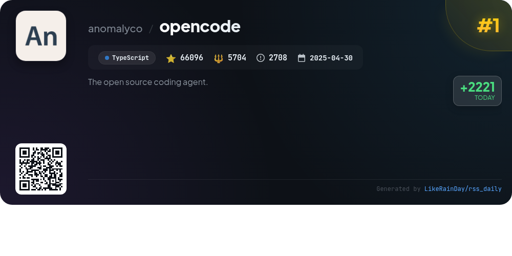
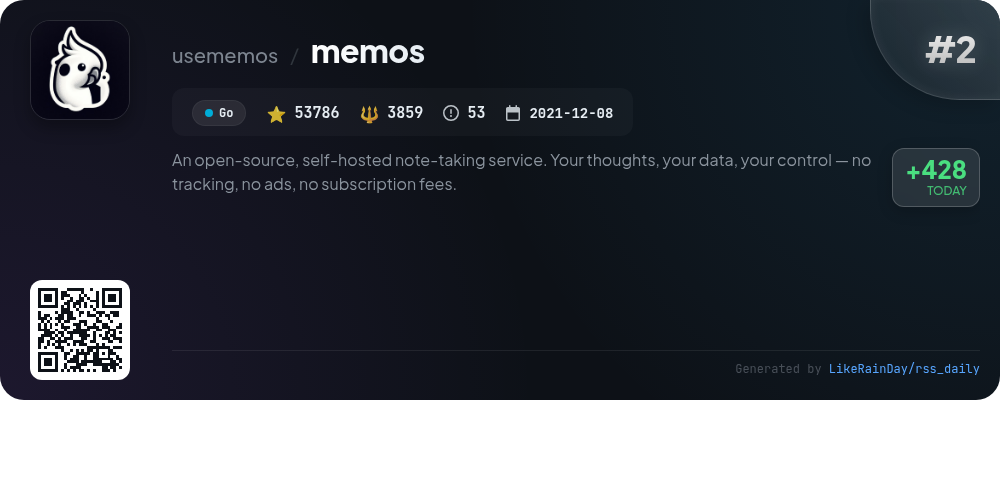
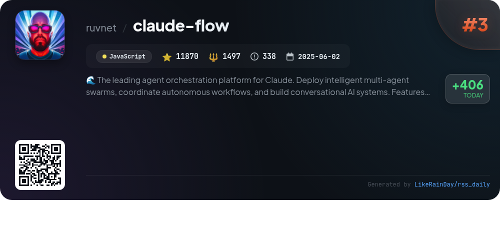
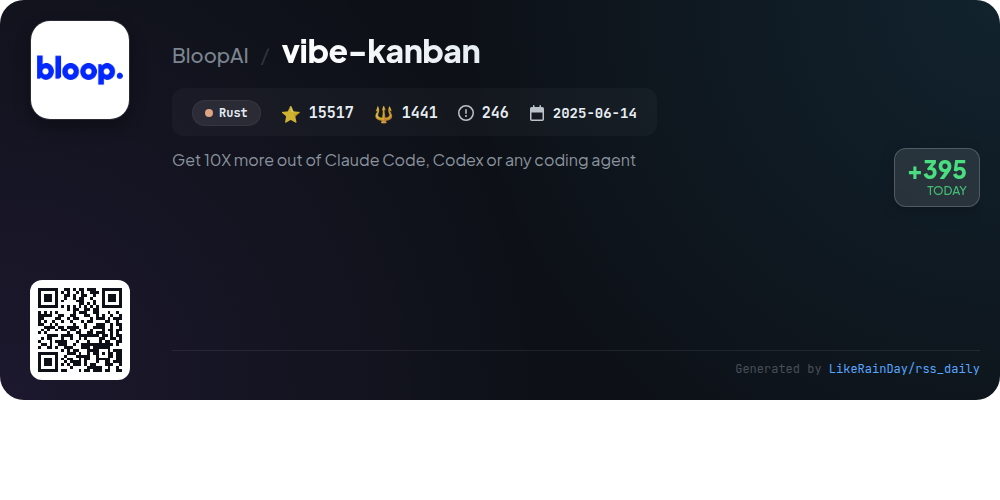
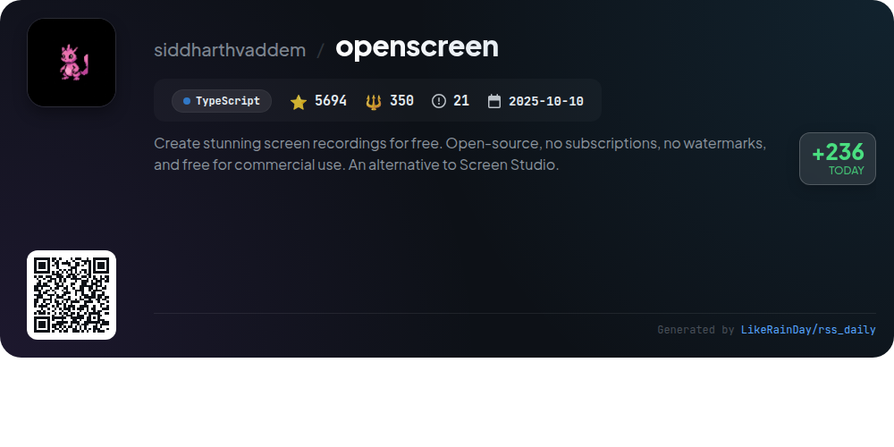
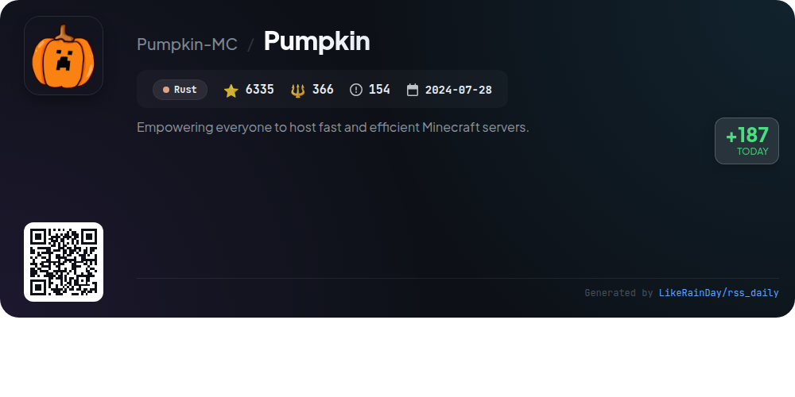
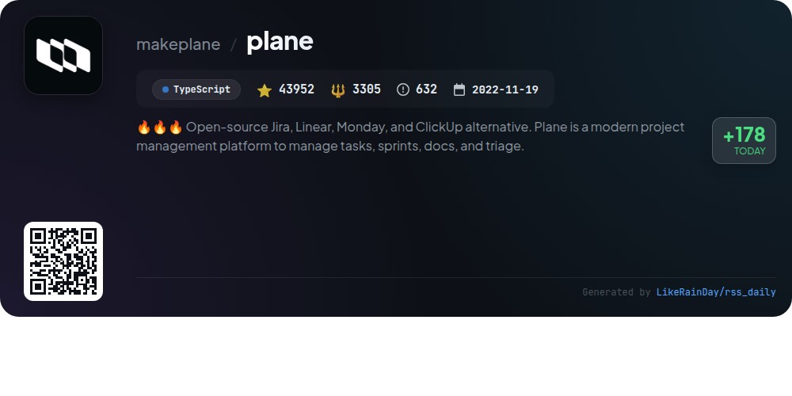
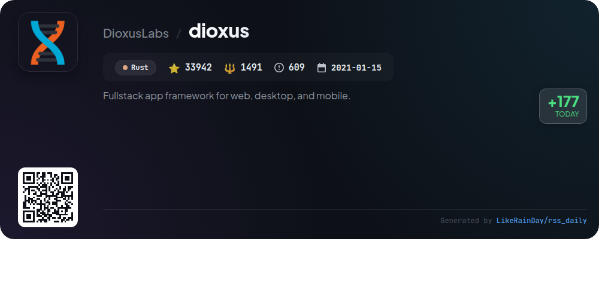
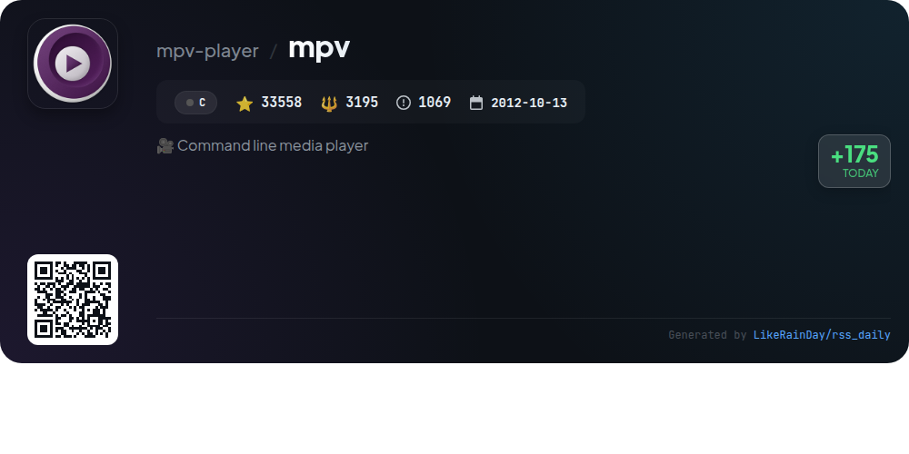
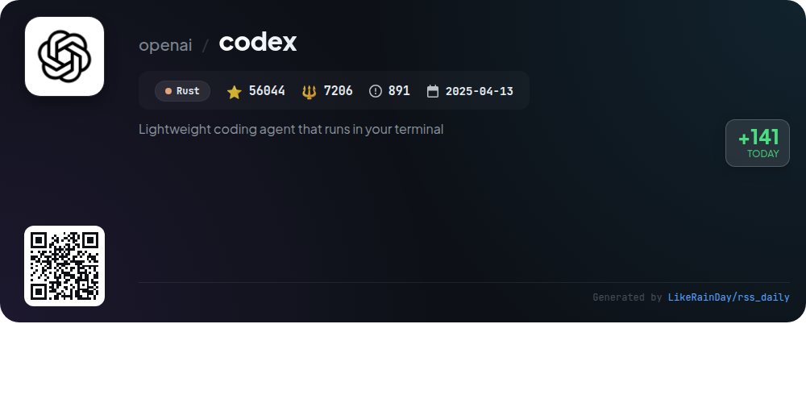

# 📊 🌟 GitHub Trending Daily - 2026-01-13

> > 📅 每日精选 GitHub 热门仓库 | 基于智能算法推荐

## 📋 Overview

**10** 个项目 | **326794** ⭐ | **28414** 🍴

**热门语言:** `Rust` (4) · `TypeScript` (3) · `Go` (1)

**更新时间:** 2026-01-13 12:32 UTC

**分类分布:**

- 🌟 每日 Top 10 精选 (10 项)

---

## 🌟 每日 Top 10 精选

### 1. [opencode](https://github.com/anomalyco/opencode)

> 🤖 **推荐理由**  
> *OpenCode is an open-source AI coding agent built in TypeScript, boasting over 66,000 stars. It offers two main agents: a full-access "build" agent for development and a read-only "plan" agent for code exploration. With built-in support for various AI models, OpenCode is provider-agnostic and features a terminal user interface (TUI) aimed at enhancing developer productivity. Available as a desktop app for multiple platforms, it also supports extensive customization and configuration. Join the community on Discord for support and collaboration.*

- ⭐ 66096 stars
- 💻 TypeScript
- 📅 Updated: 2026-01-13

### 2. [memos](https://github.com/usememos/memos)

> 🤖 **推荐理由**  
> *Memos is an open-source, self-hosted note-taking service designed for privacy and data ownership. Built with Go and React, it offers lightning-fast performance and no tracking, ads, or subscription fees. Key features include Markdown support, easy deployment via Docker, full REST and gRPC APIs for developer integration, and a beautiful, responsive interface. Memos enables instant access to your notes while ensuring complete control over your data. Try the live demo or host it yourself to experience seamless knowledge management.*

- ⭐ 53786 stars
- 💻 Go
- 📅 Updated: 2026-01-13

### 3. [claude-flow](https://github.com/ruvnet/claude-flow)

> 🤖 **推荐理由**  
> *Claude-Flow v2.7.0 is an enterprise-grade AI orchestration platform designed for deploying intelligent multi-agent systems and coordinating workflows. Key features include 25 natural language-activated Claude Skills, AgentDB integration for 96x-164x faster semantic vector search, a hybrid memory system, and a dynamic agent architecture. The platform supports advanced hooks for automated workflows, GitHub integration, and offers a robust toolkit of 100 MCP tools. With a focus on efficiency and orchestration, Claude-Flow is ranked #1 in agent-based frameworks, with 11,870 stars on GitHub.*

- ⭐ 11870 stars
- 💻 JavaScript
- 📅 Updated: 2026-01-13

### 4. [vibe-kanban](https://github.com/BloopAI/vibe-kanban)

> 🤖 **推荐理由**  
> *Vibe Kanban is a powerful tool designed to enhance productivity with AI coding agents like Claude Code and Codex. With over 15,000 stars, it enables seamless switching and orchestration of multiple coding agents, facilitating task management, work reviews, and remote project access via SSH. Key features include centralized agent configuration, parallel execution, and quick server startup. The project is built in Rust and offers comprehensive documentation, installation guides, and community support through GitHub Discussions.*

- ⭐ 15517 stars
- 💻 Rust
- 📅 Updated: 2026-01-13

### 5. [openscreen](https://github.com/siddharthvaddem/openscreen)

> 🤖 **推荐理由**  
> *OpenScreen is a free, open-source screen recording tool designed as a straightforward alternative to Screen Studio. With features like full-screen recording, customizable manual zooms, video cropping, background options, motion blur, and annotation tools, it caters to users seeking essential functionalities without subscriptions or watermarks. OpenScreen is suitable for personal and commercial use, allowing modifications and distribution. Built with TypeScript, React, and Electron, it is currently in beta, inviting contributions to enhance its capabilities.*

- ⭐ 5694 stars
- 💻 TypeScript
- 📅 Updated: 2026-01-13

### 6. [Pumpkin](https://github.com/Pumpkin-MC/Pumpkin)

> 🤖 **推荐理由**  
> *Pumpkin is a fast and efficient Minecraft server built in Rust, boasting 6,335 stars on GitHub. Key features include multi-threading for performance, compatibility with the latest Java and Bedrock versions, robust security measures, and high configurability. Users can enjoy extensive functionalities such as world loading, player management, and customizable server settings. The project supports plugin development and offers a variety of networking capabilities like encryption and packet compression. Join the active community on Discord or contribute to the ongoing development!*

- ⭐ 6335 stars
- 💻 Rust
- 📅 Updated: 2026-01-13

### 7. [plane](https://github.com/makeplane/plane)

> 🤖 **推荐理由**  
> *Plane is an open-source project management platform designed as an alternative to Jira, Linear, Monday, and ClickUp, boasting over 43,000 stars. It offers features like efficient task management, cycles for tracking progress, customizable workflow views, and analytics for real-time insights. Users can opt for Plane Cloud for quick setup or self-host for data control. With community engagement on Discord and GitHub, Plane encourages contributions and feedback to enhance its evolving capabilities. Ideal for teams seeking organized project management without the chaos.*

- ⭐ 43952 stars
- 💻 TypeScript
- 📅 Updated: 2026-01-13

### 8. [dioxus](https://github.com/DioxusLabs/dioxus)

> 🤖 **推荐理由**  
> *Dioxus is a fullstack app framework built in Rust, enabling seamless development for web, desktop, and mobile platforms from a single codebase. Key features include ergonomic state management, zero-config setup, integrated hot-reloading, and a robust CLI for bundling applications. Dioxus supports native mobile development for iOS and Android and offers first-class server-side rendering capabilities. With an active community and comprehensive documentation, Dioxus is designed for rapid iteration and deployment of lightweight applications across various environments.*

- ⭐ 33942 stars
- 💻 Rust
- 📅 Updated: 2026-01-13

### 9. [mpv](https://github.com/mpv-player/mpv)

> 🤖 **推荐理由**  
> *mpv is a versatile command line media player, supporting a wide range of audio and video formats along with subtitles. Built in C, it boasts hardware decoding options and shader-based video rendering for enhanced playback quality. Key features include extensive customization via user scripts, detailed documentation, and active community support through GitHub and IRC. The player is compatible with modern operating systems like Linux, Windows, and macOS, and is maintained under the GPLv2 license. With over 33,000 stars on GitHub, mpv is a popular choice for media enthusiasts.*

- ⭐ 33558 stars
- 💻 C
- 📅 Updated: 2026-01-13

### 10. [codex](https://github.com/openai/codex)

> 🤖 **推荐理由**  
> *Codex is a lightweight coding agent from OpenAI that runs locally in your terminal, designed for seamless integration into your development workflow. With over 56,000 stars, it supports installation via npm or Homebrew and allows users to execute commands with ease. Codex can be enhanced by signing into a ChatGPT account, leveraging features from various subscription plans. For IDE integration, users can install Codex in popular editors like VS Code. Comprehensive documentation and contribution guidelines are available in the repository.*

- ⭐ 56044 stars
- 💻 Rust
- 📅 Updated: 2026-01-13

---

## 📡 RSS订阅

通过 RSS 订阅，第一时间获取每日精选项目：

- 🔔 [RSS 订阅源] (../../daily-top.xml)
- 🔔 [每日简报] (../../GITHUB_TODAY_CN.md)
- 🔔 [每日 Top 10 精选](../../daily-top.xml)

---

*⚡ Powered by Smart Trending Algorithm | Generated at 2026-01-13 12:32:07 UTC
