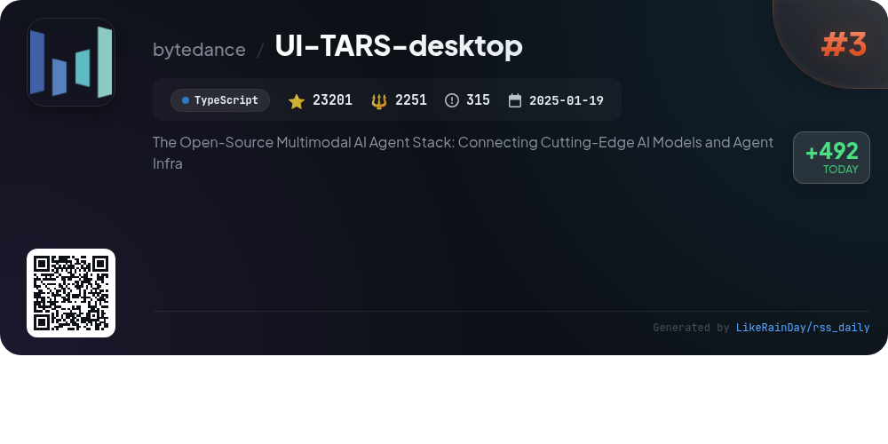
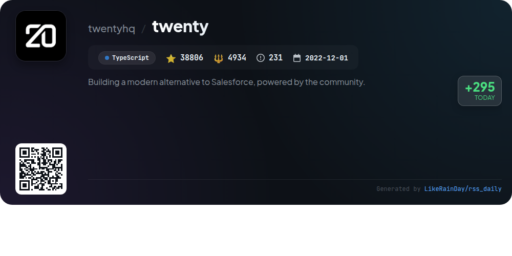
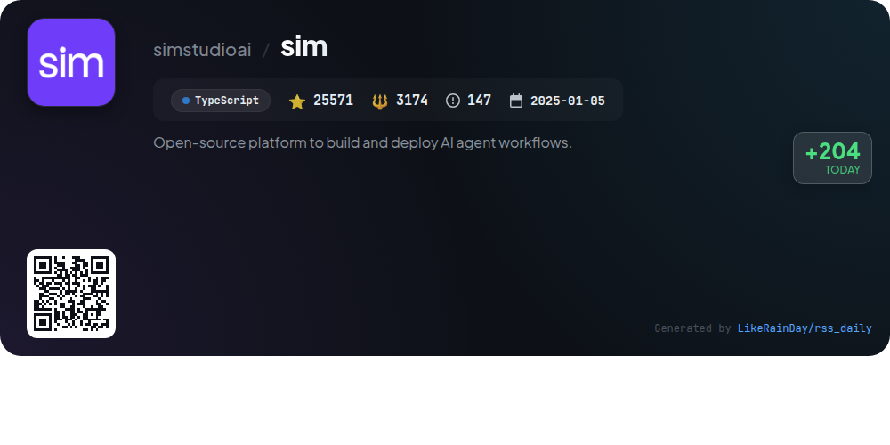
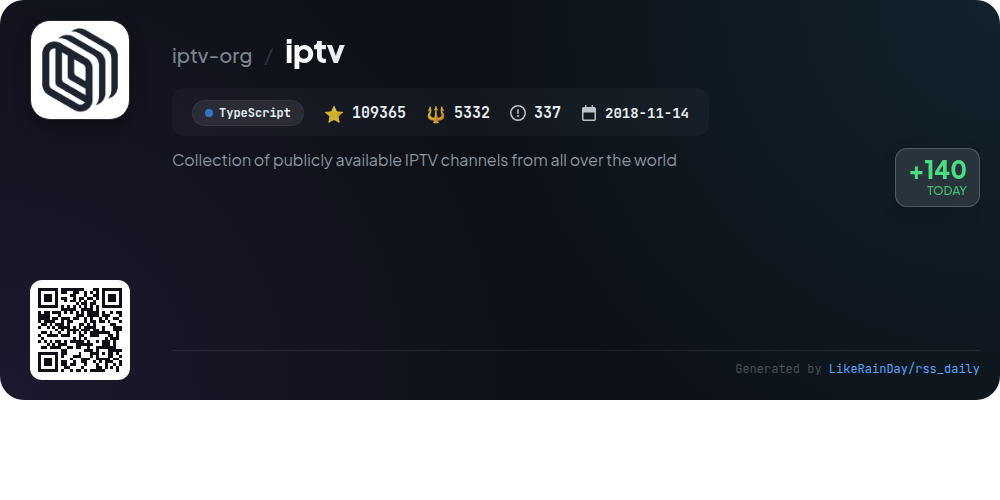
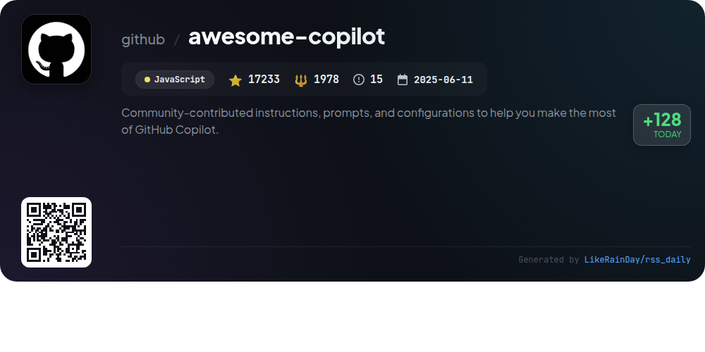

# 📊 🌟 GitHub Trending Daily - 2026-01-13

> > 📅 每日精选 GitHub 热门仓库 | 基于智能算法推荐

## 📋 Overview

**10** 个项目 | **427273** ⭐ | **36001** 🍴

**热门语言:** `TypeScript` (7) · `Rust` (2) · `JavaScript` (1)

**更新时间:** 2026-01-13 01:03 UTC

**分类分布:**

- 🌟 每日 Top 10 精选 (10 项)

---

## 🌟 每日 Top 10 精选

### 1. [opencode](https://github.com/anomalyco/opencode)

> 🤖 **推荐理由**  
> *OpenCode is an open-source AI coding agent built with TypeScript, boasting over 64,700 stars on GitHub. It features two primary agents: "build," for full development access, and "plan," a read-only agent ideal for code exploration. Users can install it via various package managers or download a desktop app for macOS, Windows, and Linux. OpenCode supports multiple AI models, including those from Claude and OpenAI, and is designed for terminal use, emphasizing client/server architecture for flexible deployment. Join the community on Discord for support and collaboration.*

- ⭐ 64770 stars
- 💻 TypeScript
- 📅 Updated: 2026-01-13

### 2. [plane](https://github.com/makeplane/plane)

> 🤖 **推荐理由**  
> *Plane is an open-source project management platform designed as an alternative to Jira, Linear, Monday, and ClickUp, with 43,875 stars on GitHub. Core features include efficient task management with a rich text editor, cycle tracking with burn-down charts, customizable workflow views, and analytics for real-time insights. Plane offers a cloud service for quick setup or self-hosting options for data control. Engage with the community on Discord or GitHub, and explore detailed documentation for installation and usage.*

- ⭐ 43875 stars
- 💻 TypeScript
- 📅 Updated: 2026-01-13

### 3. [UI-TARS-desktop](https://github.com/bytedance/UI-TARS-desktop)

> 🤖 **推荐理由**  
> *UI-TARS-desktop is an open-source multimodal AI agent stack, featuring a desktop application that facilitates native GUI interactions. Key highlights include natural language control powered by advanced Vision-Language models, screenshot and visual recognition capabilities, and precise mouse and keyboard control. It supports both local and remote operations across multiple platforms (Windows, MacOS, Browser) while ensuring data privacy through local processing. The project aims to enhance productivity with intuitive interfaces and seamless integration with real-world tools.*

- ⭐ 23201 stars
- 💻 TypeScript
- 📅 Updated: 2026-01-13

### 4. [ConvertX](https://github.com/C4illin/ConvertX)

> 🤖 **推荐理由**  
> *ConvertX is a self-hosted online file converter supporting over 1000 formats, built with TypeScript, Bun, and Elysia. Key features include batch processing, password protection, and multiple user accounts. It integrates various converters like Inkscape, FFmpeg, and Calibre, enabling seamless conversion between diverse file types. The project boasts over 14,000 stars on GitHub and offers easy deployment via Docker. Users can customize settings through environment variables, ensuring flexibility and security. Contributions and enhancements are welcomed through pull requests.*

- ⭐ 14853 stars
- 💻 TypeScript
- 📅 Updated: 2026-01-13

### 5. [twenty](https://github.com/twentyhq/twenty)

> 🤖 **推荐理由**  
> *Twenty is an open-source CRM designed as a modern alternative to Salesforce, focusing on community-driven development. Key features include customizable layouts, object and field personalization, role-based permissions, and workflow automation. It supports integrations for emails, calendar events, and files, enhancing user experience inspired by tools like Notion and Airtable. Built with TypeScript, React, and NestJS, it encourages collaboration through a roadmap and community engagement on platforms like Discord. With over 38,000 stars, Twenty aims to democratize CRM access and functionality.*

- ⭐ 38806 stars
- 💻 TypeScript
- 📅 Updated: 2026-01-13

### 6. [sim](https://github.com/simstudioai/sim)

> 🤖 **推荐理由**  
> *Sim is an open-source platform for building and deploying AI agent workflows, boasting over 25,000 stars on GitHub. Users can design workflows visually, integrate vector databases for content-specific querying, and utilize a Copilot feature that aids in generating nodes and troubleshooting through natural language. Available as a cloud-hosted service or self-hosted via Docker, Sim supports local AI models and requires a PostgreSQL database with the pgvector extension for enhanced AI functionality. The platform is built with TypeScript, Next.js, and Bun, ensuring a modern tech stack.*

- ⭐ 25571 stars
- 💻 TypeScript
- 📅 Updated: 2026-01-13

### 7. [dioxus](https://github.com/DioxusLabs/dioxus)

> 🤖 **推荐理由**  
> *Dioxus is a fullstack app framework built in Rust, enabling developers to create cross-platform applications for web, desktop, and mobile from a single codebase. Key features include ergonomic state management, instant hot-reloading, and built-in support for server-side rendering. Dioxus offers first-class integration with Axum for backend services and supports various rendering options, including webview and WGPU. With a focus on performance, it allows for app sizes under 50kb for web and under 5mb for desktop/mobile. Comprehensive documentation and an active community support developers in harnessing its capabilities.*

- ⭐ 33608 stars
- 💻 Rust
- 📅 Updated: 2026-01-13

### 8. [codex](https://github.com/openai/codex)

> 🤖 **推荐理由**  
> *Codex is a lightweight coding agent from OpenAI that runs directly in your terminal, designed for developers seeking local coding assistance. With over 55,991 stars, it offers quick installation via npm or Homebrew and supports integration with code editors like VS Code. Codex enhances coding efficiency by allowing users to sign in with their ChatGPT account for added functionality. For cloud-based services, Codex Web is available at chatgpt.com/codex. The project is open-source and features comprehensive documentation for installation and usage.*

- ⭐ 55991 stars
- 💻 Rust
- 📅 Updated: 2026-01-13

### 9. [iptv](https://github.com/iptv-org/iptv)

> 🤖 **推荐理由**  
> *IPTV is a comprehensive collection of publicly available IPTV channels from around the world, hosted on GitHub. With over 109,000 stars, it offers users easy access to live streaming by simply pasting playlist links into compatible video players. Key features include a main playlist, Electronic Program Guide (EPG) downloads, and an API for integration. The project emphasizes community contributions and provides resources for users, including FAQs and discussions. All content is user-submitted, ensuring a dynamic and legal collection of streaming options.*

- ⭐ 109365 stars
- 💻 TypeScript
- 📅 Updated: 2026-01-13

### 10. [awesome-copilot](https://github.com/github/awesome-copilot)

> 🤖 **推荐理由**  
> *Awesome Copilot is a community-driven repository designed to enhance your GitHub Copilot experience through curated agents, prompts, and instructions. Key features include specialized agents for tailored workflows, task-specific prompts for efficient coding, and best practice instructions to ensure quality standards. The project also offers curated collections organized by themes, enhancing discoverability. An MCP Server simplifies the installation of these customizations in your editor. With over 17,000 stars, it provides a robust toolkit for developers seeking to maximize productivity and coding efficiency.*

- ⭐ 17233 stars
- 💻 JavaScript
- 📅 Updated: 2026-01-13

---

## 📡 RSS订阅

通过 RSS 订阅，第一时间获取每日精选项目：

- 🔔 [RSS 订阅源] (../../daily-top.xml)
- 🔔 [每日简报] (../../GITHUB_TODAY_CN.md)
- 🔔 [每日 Top 10 精选](../../daily-top.xml)

---

*⚡ Powered by Smart Trending Algorithm | Generated at 2026-01-13 01:03:09 UTC
