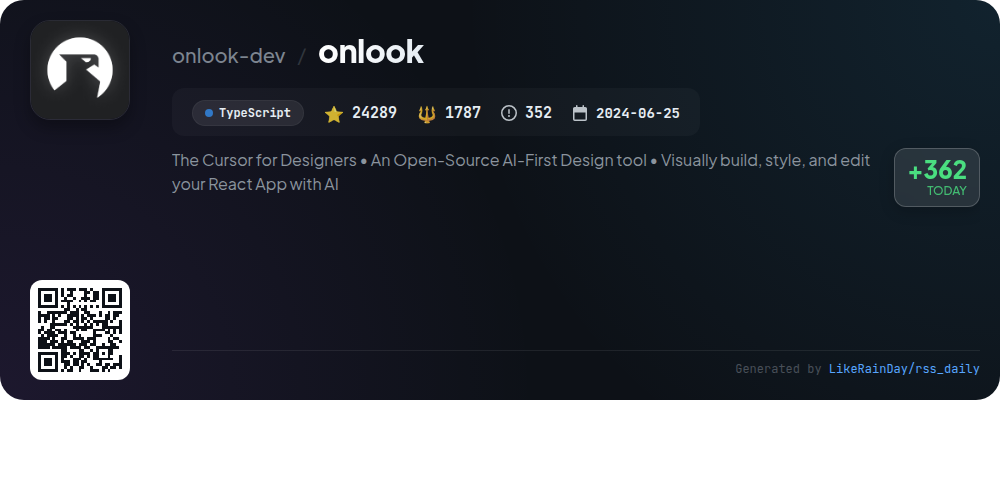
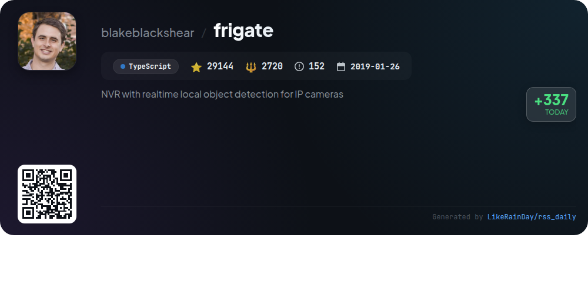

# 📊 🌟 GitHub Trending Daily - 2026-01-14

> > 📅 每日精选 GitHub 热门仓库 | 基于智能算法推荐

## 📋 Overview

**10** 个项目 | **294051** ⭐ | **22820** 🍴

**热门语言:** `TypeScript` (5) · `Rust` (3) · `JavaScript` (1)

**更新时间:** 2026-01-14 12:31 UTC

**分类分布:**

- 🌟 每日 Top 10 精选 (10 项)

---

## 🌟 每日 Top 10 精选

### 1. [opencode](https://github.com/anomalyco/opencode)

> 🤖 **推荐理由**  
> *OpenCode is an open-source AI coding agent built in TypeScript, boasting over 68,000 stars on GitHub. It features two built-in agents: "build" for full development access and "plan" for read-only analysis, making it suitable for both coding and exploring codebases. OpenCode supports various installation methods across platforms and includes a BETA desktop app. It emphasizes a terminal user interface and a client/server architecture, allowing remote usage. Notably, it's provider-agnostic, enabling integration with multiple AI models. Join the community on Discord for support and collaboration.*

- ⭐ 68446 stars
- 💻 TypeScript
- 📅 Updated: 2026-01-14

### 2. [dioxus](https://github.com/DioxusLabs/dioxus)

> 🤖 **推荐理由**  
> *Dioxus is a fullstack app framework built in Rust, enabling developers to create cross-platform applications for web, desktop, and mobile from a single codebase. With over 34,000 stars, it features zero-config setup, instant hot-reloading, and ergonomic state management akin to React and Svelte. Dioxus supports powerful backend integration via Server Functions and offers built-in tools for SSR, WebSockets, and file handling. Its modular architecture allows customization, while comprehensive documentation ensures ease of use. Ideal for rapid, beautiful app development.*

- ⭐ 34059 stars
- 💻 Rust
- 📅 Updated: 2026-01-14

### 3. [memos](https://github.com/usememos/memos)

> 🤖 **推荐理由**  
> *Memos is an open-source, self-hosted note-taking service designed for privacy and data ownership. With over 54,000 stars on GitHub, it offers features like full Markdown support, zero telemetry, and no subscription fees. Built with Go and React, Memos ensures fast performance and easy deployment via Docker. Key highlights include a clean interface, mobile responsiveness, and full REST and gRPC APIs for developer-friendly integration. Whether for personal notes or team wikis, Memos provides complete control over your data without ads or vendor lock-in.*

- ⭐ 54026 stars
- 💻 Go
- 📅 Updated: 2026-01-14

### 4. [onlook](https://github.com/onlook-dev/onlook)

> 🤖 **推荐理由**  
> *Onlook is an open-source, AI-first design tool that empowers developers and designers to visually build, style, and edit React applications. With a user-friendly interface, it allows quick app creation using templates or from scratch, real-time editing, and seamless integration with TailwindCSS and Next.js. Key features include a visual editor, live code preview, management of brand assets, and collaborative tools. Users can deploy apps instantly and leverage AI capabilities for enhanced design workflows. Join the community to contribute and explore at onlook.com.*

- ⭐ 24289 stars
- 💻 TypeScript
- 📅 Updated: 2026-01-14

### 5. [vibe-kanban](https://github.com/BloopAI/vibe-kanban)

> 🤖 **推荐理由**  
> *Vibe Kanban enhances productivity by streamlining interactions with AI coding agents like Claude Code and Codex. It allows users to effortlessly switch between agents, orchestrate tasks in parallel, and monitor progress. Key features include centralized configuration management, SSH access for remote project handling, and quick server setup. With 15,892 stars on GitHub, Vibe Kanban is a powerful tool for developers, facilitating efficient planning and code review. Comprehensive documentation and community support are available for seamless integration and usage.*

- ⭐ 15892 stars
- 💻 Rust
- 📅 Updated: 2026-01-14

### 6. [claude-flow](https://github.com/ruvnet/claude-flow)

> 🤖 **推荐理由**  
> *Claude-Flow is a leading enterprise AI orchestration platform designed for deploying intelligent multi-agent swarms and coordinating autonomous workflows. Key features include 25 natural language-activated skills, AgentDB v1.3.9 integration for enhanced vector search, and a hybrid memory system for improved performance. It supports comprehensive automation with 100+ MCP tools and dynamic agent architecture. With native Claude Code support, users can build sophisticated conversational AI systems efficiently. Ranked #1 in agent-based frameworks, it streamlines complex AI-powered development workflows.*

- ⭐ 11941 stars
- 💻 JavaScript
- 📅 Updated: 2026-01-14

### 7. [frigate](https://github.com/blakeblackshear/frigate)

> 🤖 **推荐理由**  
> *Frigate is a powerful, local NVR designed for real-time object detection with IP cameras, integrating seamlessly with Home Assistant. Built using TypeScript, it utilizes OpenCV and TensorFlow for efficient AI-driven detection, minimizing resource use while maximizing performance. Key features include GPU support, low-overhead motion detection, video recording based on detected objects, 24/7 recording, and RTSP re-streaming. The platform also supports MQTT for easy system integration, offers a live dashboard, and includes a built-in mask and zone editor for enhanced control.*

- ⭐ 29144 stars
- 💻 TypeScript
- 📅 Updated: 2026-01-14

### 8. [Pumpkin](https://github.com/Pumpkin-MC/Pumpkin)

> 🤖 **推荐理由**  
> *Pumpkin is a high-performance Minecraft server built in Rust, designed for speed, efficiency, and customization. With over 6,400 stars on GitHub, it supports the latest Java and Bedrock versions while maintaining Vanilla mechanics. Key features include multi-threading for optimized performance, robust security measures, and extensive configurability. It offers player management, world handling, and plugin support, making it a flexible choice for server administrators. Join the community on Discord for updates and contribute to its development at [PumpkinMC.org](https://pumpkinmc.org/).*

- ⭐ 6401 stars
- 💻 Rust
- 📅 Updated: 2026-01-14

### 9. [openscreen](https://github.com/siddharthvaddem/openscreen)

> 🤖 **推荐理由**  
> *OpenScreen is a free, open-source screen recording tool that serves as a simplified alternative to Screen Studio, allowing users to create high-quality product demos without subscriptions or watermarks. Key features include full-screen or app-specific recording, customizable zooms, video cropping, various background options, motion blur effects, annotations, and multiple export resolutions. Designed for both personal and commercial use, OpenScreen offers a user-friendly interface while remaining in beta. Contributions are welcome, and the project is built using Electron, React, and TypeScript.*

- ⭐ 5795 stars
- 💻 TypeScript
- 📅 Updated: 2026-01-14

### 10. [plane](https://github.com/makeplane/plane)

> 🤖 **推荐理由**  
> *Plane is an open-source project management platform designed as an alternative to Jira, Linear, Monday, and ClickUp. With over 44,000 stars on GitHub, it offers features like task management with a rich text editor, customizable cycles for tracking progress, and modular project organization. Users can access real-time analytics, create tailored views, and utilize AI-driven note-taking with Plane Pages. It supports easy setup via Plane Cloud or self-hosting options. Join the community on Discord for collaboration and feedback.*

- ⭐ 44058 stars
- 💻 TypeScript
- 📅 Updated: 2026-01-14

---

## 📡 RSS订阅

通过 RSS 订阅，第一时间获取每日精选项目：

- 🔔 [RSS 订阅源] (../../daily-top.xml)
- 🔔 [每日简报] (../../GITHUB_TODAY_CN.md)
- 🔔 [每日 Top 10 精选](../../daily-top.xml)

---

*⚡ Powered by Smart Trending Algorithm | Generated at 2026-01-14 12:31:22 UTC
