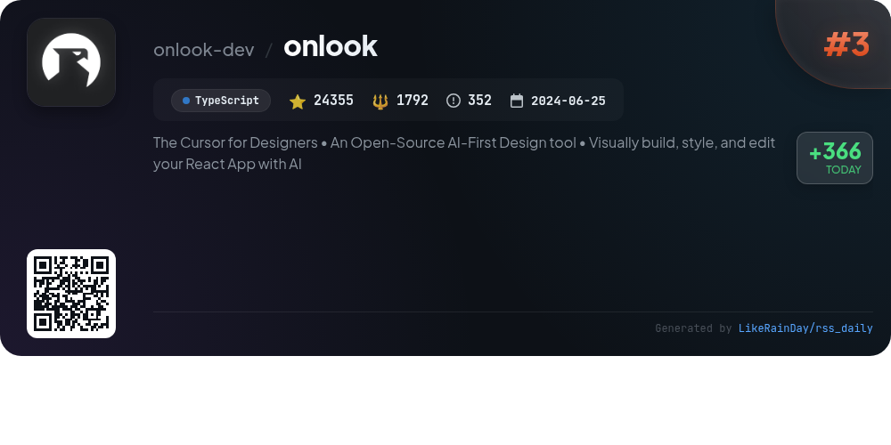
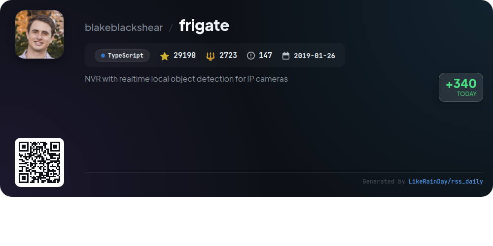
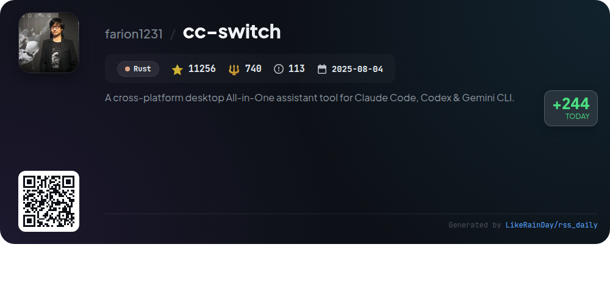
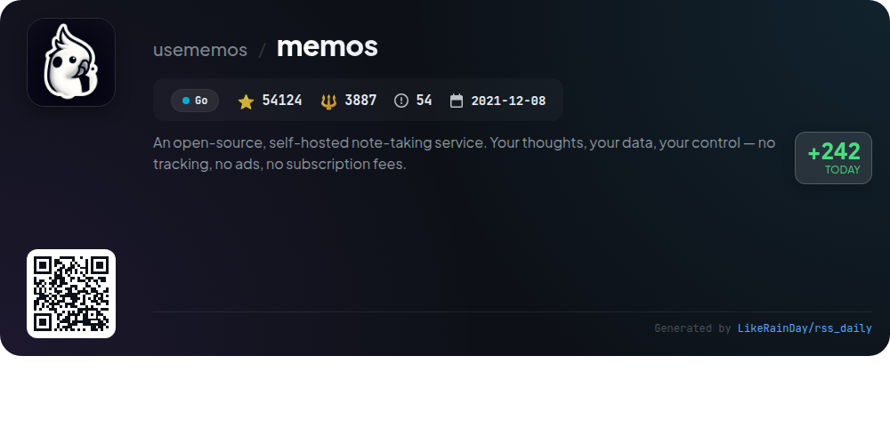
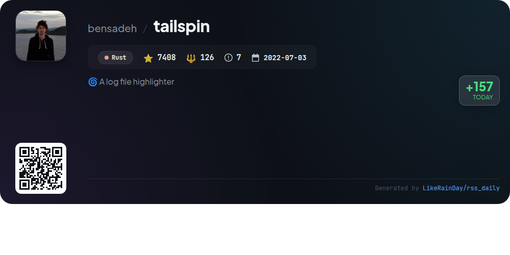

# 📊 🌟 GitHub Trending Daily - 2026-01-15

> > 📅 每日精选 GitHub 热门仓库 | 基于智能算法推荐

## 📋 Overview

**10** 个项目 | **235808** ⭐ | **21758** 🍴

**热门语言:** `TypeScript` (4) · `Rust` (3) · `JavaScript` (1)

**更新时间:** 2026-01-15 01:05 UTC

**分类分布:**

- 🌟 每日 Top 10 精选 (10 项)

---

## 🌟 每日 Top 10 精选

### 1. [opencode](https://github.com/anomalyco/opencode)

> 🤖 **推荐理由**  
> *OpenCode is an open-source AI coding agent designed to enhance development workflows. It features two built-in agents: a full-access "build" agent for coding tasks and a read-only "plan" agent for code exploration. With support for multiple platforms (Windows, macOS, Linux), it offers a seamless installation process and a desktop app. OpenCode is provider-agnostic, allowing integration with various AI models. Unique for its terminal-focused user interface, it aims to maximize terminal capabilities. Join the community on Discord for support and collaboration.*

- ⭐ 69321 stars
- 💻 TypeScript
- 📅 Updated: 2026-01-15

### 2. [datahaven](https://github.com/datahaven-xyz/datahaven)

> 🤖 **推荐理由**  
> *DataHaven is an EVM-compatible decentralized storage network, leveraging StorageHub and secured by EigenLayer. It offers verifiable, production-scale storage for AI training data and Web3 applications. Key features include cryptographic proof of data integrity through Merkle trees, a two-tier storage provider model (Main and Backup Storage Providers), Ethereum restaking for validator security, and a trustless cross-chain bridge via Snowbridge. DataHaven supports smart contracts and is designed for applications requiring tamper-proof data storage, such as AI, IoT, and real-world asset management.*

- ⭐ 3073 stars
- 💻 Rust
- 📅 Updated: 2026-01-15

### 3. [onlook](https://github.com/onlook-dev/onlook)

> 🤖 **推荐理由**  
> *Onlook is an open-source, AI-first design tool that empowers designers to visually build and edit React applications using Next.js and TailwindCSS. With features like a Figma-like UI for real-time editing, instant app creation from templates, and an integrated code editor, users can seamlessly manage brand assets and collaborate in real-time. Onlook supports deploying apps quickly, offers AI-driven capabilities for enhanced functionality, and is actively seeking contributors to expand its features. Explore more at [onlook.com](https://onlook.com).*

- ⭐ 24355 stars
- 💻 TypeScript
- 📅 Updated: 2026-01-15

### 4. [frigate](https://github.com/blakeblackshear/frigate)

> 🤖 **推荐理由**  
> *Frigate is a powerful NVR solution designed for IP cameras, featuring real-time local object detection using AI with OpenCV and TensorFlow. It integrates seamlessly with Home Assistant, optimizing resource usage by detecting objects only when necessary. Key features include GPU support for enhanced performance, low-overhead motion detection, MQTT communication for easy integration, and versatile recording options. Frigate also offers a user-friendly live dashboard, streamlined review workflow, and built-in editing tools for masks and zones. The project is open-source under the MIT License.*

- ⭐ 29190 stars
- 💻 TypeScript
- 📅 Updated: 2026-01-15

### 5. [cc-switch](https://github.com/farion1231/cc-switch)

> 🤖 **推荐理由**  
> *cc-switch is a cross-platform desktop assistant tool designed for Claude Code, Codex, and Gemini CLI, built in Rust. With over 11,000 stars, it offers seamless provider management with one-click switching, a user-friendly interface, and integrated skills and prompts management. Key features include SQLite-based data storage, multi-language support (English, Chinese, Japanese), and auto-launch capabilities. The app also supports cloud sync, API latency testing, and a user-friendly MCP server management system. Sponsored by Z.ai, PackyCode, and AIGoCode, it enhances the AI coding experience for developers.*

- ⭐ 11256 stars
- 💻 Rust
- 📅 Updated: 2026-01-15

### 6. [memos](https://github.com/usememos/memos)

> 🤖 **推荐理由**  
> *Memos is an open-source, self-hosted note-taking service designed for privacy and control, ensuring no tracking, ads, or subscription fees. Built with Go and React, it offers lightning-fast performance and supports full markdown for easy note-taking. Key features include complete data ownership, zero telemetry, a simple one-line Docker installation, and extensive REST and gRPC APIs for developers. Memos is ideal for personal notes, team wikis, and knowledge management. Try the live demo or explore documentation to get started.*

- ⭐ 54124 stars
- 💻 Go
- 📅 Updated: 2026-01-15

### 7. [awesome-copilot](https://github.com/github/awesome-copilot)

> 🤖 **推荐理由**  
> *Awesome Copilot is a community-driven repository designed to enhance your GitHub Copilot experience with a collection of custom agents, prompts, and instructions. Key features include specialized agents for specific workflows, task-specific prompts for code generation and documentation, comprehensive coding standards, and curated collections organized by themes. The MCP Server facilitates easy integration of these resources into various editors. With over 17,500 stars, this project is a valuable toolkit for improving productivity and access to best practices in coding.*

- ⭐ 17564 stars
- 💻 JavaScript
- 📅 Updated: 2026-01-15

### 8. [FossFLOW](https://github.com/stan-smith/FossFLOW)

> 🤖 **推荐理由**  
> *FossFLOW is an open-source Progressive Web App for creating stunning isometric infrastructure diagrams, built with TypeScript and React. It features multilingual support in 9 languages, a user-friendly interface, and an improved connector tool for easy diagram creation. Users can save diagrams locally, export/import as JSON, and enjoy offline functionality. Quick deployment is available via Docker. The project is actively maintained, with a roadmap for future enhancements. Join the community and contribute to this innovative diagramming tool!*

- ⭐ 16313 stars
- 💻 TypeScript
- 📅 Updated: 2026-01-15

### 9. [DevOps-Projects](https://github.com/NotHarshhaa/DevOps-Projects)

> 🤖 **推荐理由**  
> *DevOps-Projects is a comprehensive GitHub repository designed for aspiring DevOps engineers, offering hands-on learning through real-world projects. Spanning beginner to advanced levels, it covers key DevOps concepts such as automated deployment, CI/CD pipelines, and infrastructure as code using AWS services like EC2 and RDS. The repository features detailed guides, practical solutions, and a modern showcase website built with Next.js. Additionally, it integrates DevOps with technologies like machine learning and containerization, fostering community engagement and collaboration.*

- ⭐ 3204 stars
- 💻 Java
- 📅 Updated: 2026-01-15

### 10. [tailspin](https://github.com/bensadeh/tailspin)

> 🤖 **推荐理由**  
> *🌀 A log file highlighter. popular project, actively maintained, recently updated*

- ⭐ 7408 stars
- 🍴 126 forks
- 💻 Rust
- 📅 Updated: 2026-01-15

---

## 📡 RSS订阅

通过 RSS 订阅，第一时间获取每日精选项目：

- 🔔 [RSS 订阅源] (../../daily-top.xml)
- 🔔 [每日简报] (../../GITHUB_TODAY_CN.md)
- 🔔 [每日 Top 10 精选](../../daily-top.xml)

---

*⚡ Powered by Smart Trending Algorithm | Generated at 2026-01-15 01:05:00 UTC
