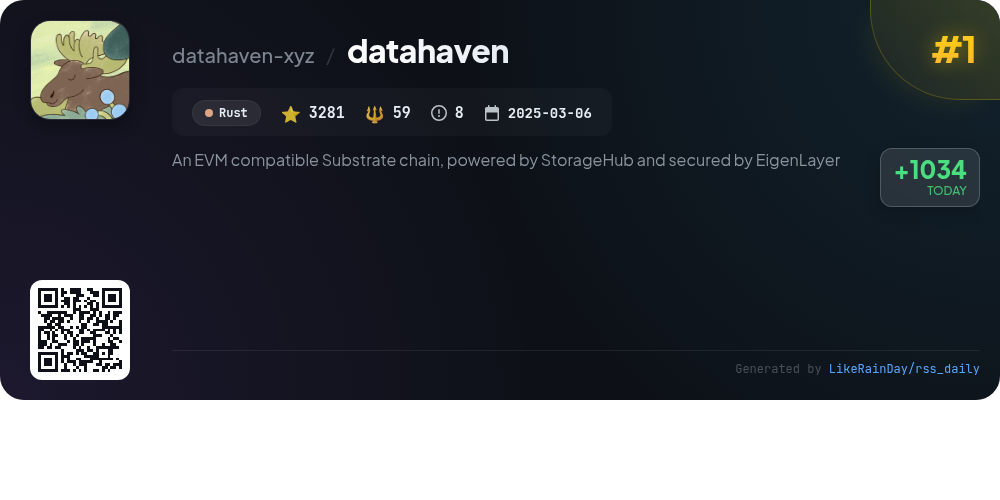
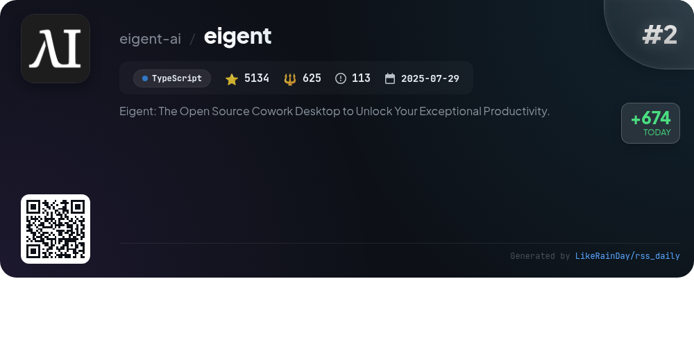
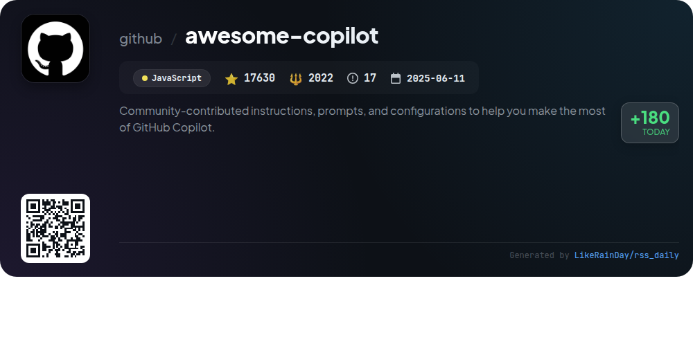
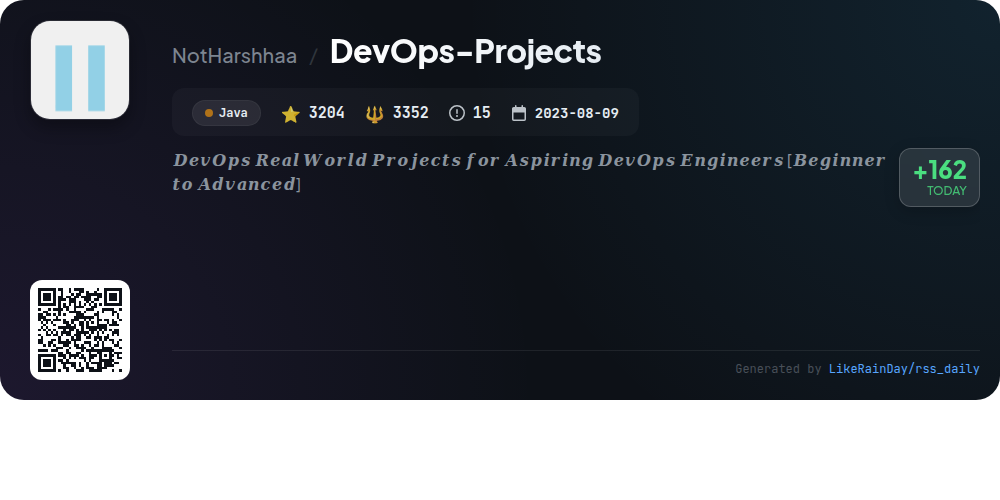
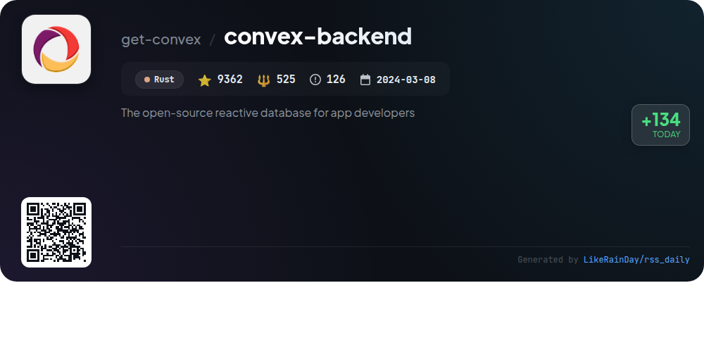
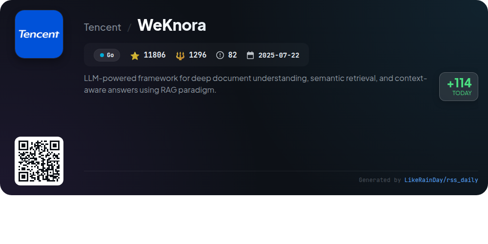
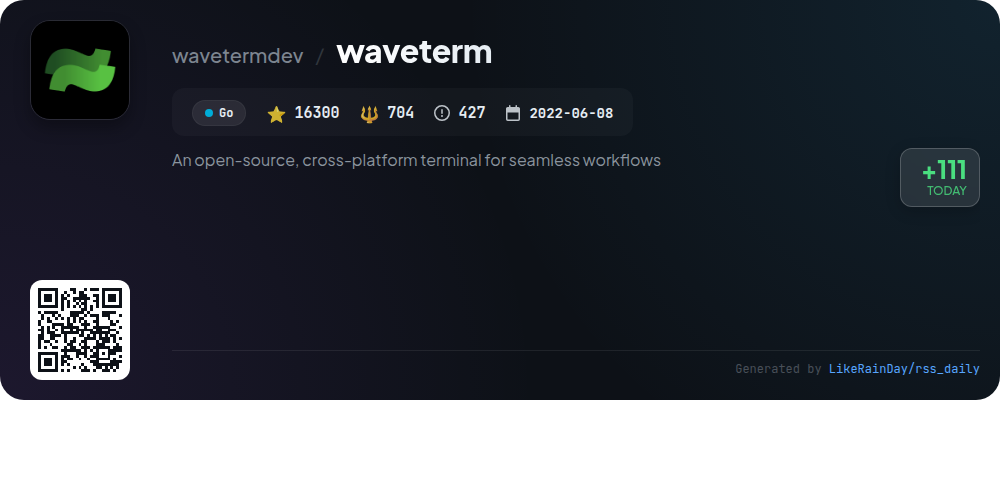

# 📊 🌟 GitHub Trending Daily - 2026-01-15

> > 📅 Daily Picks of GitHub Trending Repositories | Powered by Smart Algorithms

## 📋 Overview

**10** Projects | **131340** ⭐ | **14090** 🍴

**Top Languages:** `TypeScript` (3) · `Go` (3) · `Rust` (2)

**Updated:** 2026-01-15 12:31 UTC

**Categories:**

- 🌟 Daily Top 10 (10 items)

---

## 🌟 Daily Top 10

### 1. [datahaven](https://github.com/datahaven-xyz/datahaven)

> 🤖 **Why Recommend**  
> *DataHaven is an AI-first decentralized storage network built on an EVM-compatible Substrate chain, leveraging StorageHub and secured by EigenLayer's restaking protocol. It offers verifiable, production-scale storage with features like chunked file storage, cryptographic proofs, and a two-tier provider network comprising Main and Backup Storage Providers. DataHaven supports Ethereum smart contracts, enabling seamless integration with existing Web3 tools. Key highlights include trustless cross-chain messaging via Snowbridge, ensuring data integrity and redundancy for AI training data and Web3 applications.*

- ⭐ 3281 stars
- 💻 Rust
- 📅 Updated: 2026-01-15

### 2. [eigent](https://github.com/eigent-ai/eigent)

> 🤖 **Why Recommend**  
> *Eigent is an open-source cowork desktop application designed to enhance productivity through a customizable AI workforce. Key features include zero setup, multi-agent coordination for complex workflows, and support for local deployment, ensuring data privacy. It integrates with various tools via the Model Context Protocol (MCP) and supports custom models. Ideal for both individual and enterprise users, Eigent also offers a cloud-hosted option for managed infrastructure. With a focus on transparency and community involvement, Eigent is built on the CAMEL-AI framework and fosters innovation in task automation.*

- ⭐ 5134 stars
- 💻 TypeScript
- 📅 Updated: 2026-01-15

### 3. [daytona](https://github.com/daytonaio/daytona)

> 🤖 **Why Recommend**  
> *Daytona is a secure and elastic infrastructure designed for running AI-generated code, boasting over 46,500 stars on GitHub. Key features include lightning-fast sandbox creation (under 90ms), isolated runtime execution to safeguard infrastructure, and support for massive parallelization of AI workflows. Daytona offers programmatic control through various APIs and unlimited sandbox persistence. It supports OCI/Docker images and provides SDKs for both Python and TypeScript, making it accessible for developers. For detailed documentation, visit [daytona.io](https://www.daytona.io/docs).*

- ⭐ 46564 stars
- 💻 TypeScript
- 📅 Updated: 2026-01-15

### 4. [awesome-copilot](https://github.com/github/awesome-copilot)

> 🤖 **Why Recommend**  
> *Awesome Copilot is a community-driven repository designed to enhance your GitHub Copilot experience. It offers specialized agents, prompts, and instructions tailored for various programming languages and workflows. Key features include Awesome Agents for enhanced capabilities, task-specific Awesome Prompts for generating code and documentation, and comprehensive Awesome Instructions that establish coding standards. With curated collections and an MCP Server for easy integration, users can quickly access resources to boost productivity and maintain best practices in software development.*

- ⭐ 17630 stars
- 💻 JavaScript
- 📅 Updated: 2026-01-15

### 5. [FossFLOW](https://github.com/stan-smith/FossFLOW)

> 🤖 **Why Recommend**  
> *FossFLOW is an open-source Progressive Web App for creating stunning isometric infrastructure diagrams. Built with TypeScript and React, it offers offline support and a multilingual interface in nine languages. Key features include a user-friendly component library, click-based connector tool for easy item connections, and various storage options (session, JSON export/import). FossFLOW also supports Docker deployment for quick setup. With 16,335 stars on GitHub, it invites contributions and fosters collaboration, ensuring open access to diagramming capabilities.*

- ⭐ 16335 stars
- 💻 TypeScript
- 📅 Updated: 2026-01-15

### 6. [DevOps-Projects](https://github.com/NotHarshhaa/DevOps-Projects)

> 🤖 **Why Recommend**  
> *DevOps-Projects is a comprehensive GitHub repository designed for aspiring DevOps engineers, offering hands-on projects ranging from beginner to advanced levels. Key features include detailed guides for deploying scalable systems on AWS, use of CI/CD pipelines, and integration with various technologies such as Docker and machine learning. Projects cover automated deployment, monitoring, and security practices, making it a valuable learning hub. The repository fosters community engagement and contributions, encouraging users to enhance their skills through real-world applications.*

- ⭐ 3224 stars
- 💻 Java
- 📅 Updated: 2026-01-15

### 7. [convex-backend](https://github.com/get-convex/convex-backend)

> 🤖 **Why Recommend**  
> *Convex is an open-source reactive database designed for web app developers, enabling data fetching and business logic execution with strong consistency through pure TypeScript. It features a cloud platform with a generous free tier, facilitating the development of dynamic, live-updating applications without infrastructure concerns. Convex also supports self-hosting with features like a dashboard, CLI, and compatibility with various tools. Community support is available through Discord, and contributions are welcomed. Explore more in the documentation at convex.dev.*

- ⭐ 9362 stars
- 💻 Rust
- 📅 Updated: 2026-01-15

### 8. [go-concurrency-exercises](https://github.com/loong/go-concurrency-exercises)

> 🤖 **Why Recommend**  
> *The "go-concurrency-exercises" repository offers hands-on exercises designed to teach Go concurrency patterns through practical application. With 1,704 stars, it provides real-life challenges such as Producer-Consumer, race condition scenarios, and graceful SIGINT handling. Users are guided to edit `main.go` to solve problems, with test cases available for validation. The project emphasizes a "learning by doing" approach, encouraging community interaction via Discord and Slack for support and code reviews.*

- ⭐ 1704 stars
- 💻 Go
- 📅 Updated: 2026-01-15

### 9. [WeKnora](https://github.com/Tencent/WeKnora)

> 🤖 **Why Recommend**  
> *WeKnora is an LLM-powered framework designed for deep document understanding and semantic retrieval, utilizing the Retrieval-Augmented Generation (RAG) paradigm. Key features include Agent Mode for intelligent Q&A, support for multiple knowledge base types, and advanced document parsing from various formats. It offers customizable retrieval strategies, web search integration, and flexible deployment options. WeKnora enhances knowledge management across sectors such as enterprise, research, and medical fields, ensuring secure, context-aware user interactions.*

- ⭐ 11806 stars
- 💻 Go
- 📅 Updated: 2026-01-15

### 10. [waveterm](https://github.com/wavetermdev/waveterm)

> 🤖 **Why Recommend**  
> *WaveTerm is an open-source, cross-platform terminal designed to enhance workflows by integrating graphical capabilities directly within the terminal environment. Key features include a drag-and-drop interface for organizing terminal blocks and tools, a built-in code editor with syntax highlighting, and a rich file preview system. Wave AI, a context-aware assistant, helps with debugging and file operations. It supports seamless remote connections, secure secret storage, and a powerful command management system. Available on macOS, Linux, and Windows, WaveTerm aims to streamline modern development tasks efficiently.*

- ⭐ 16300 stars
- 💻 Go
- 📅 Updated: 2026-01-15

---

## 📡 RSS Subscription

Subscribe via RSS to get daily trending updates:

- 🔔 [RSS XML] (../../daily-top.xml)
- 🔔 [Daily Report] (../../GITHUB_TODAY.md)
- 🔔 [Daily Top 10](../../daily-top.xml)

---

*⚡ Powered by Smart Trending Algorithm | Generated at 2026-01-15 12:31:16 UTC
