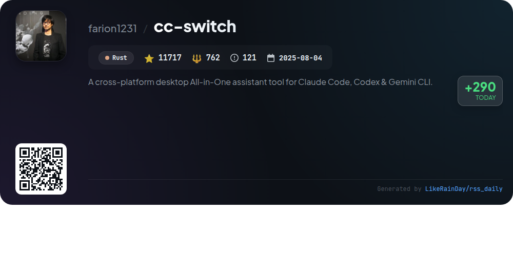
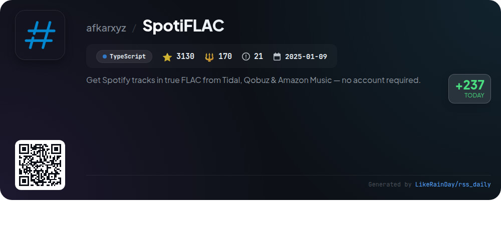
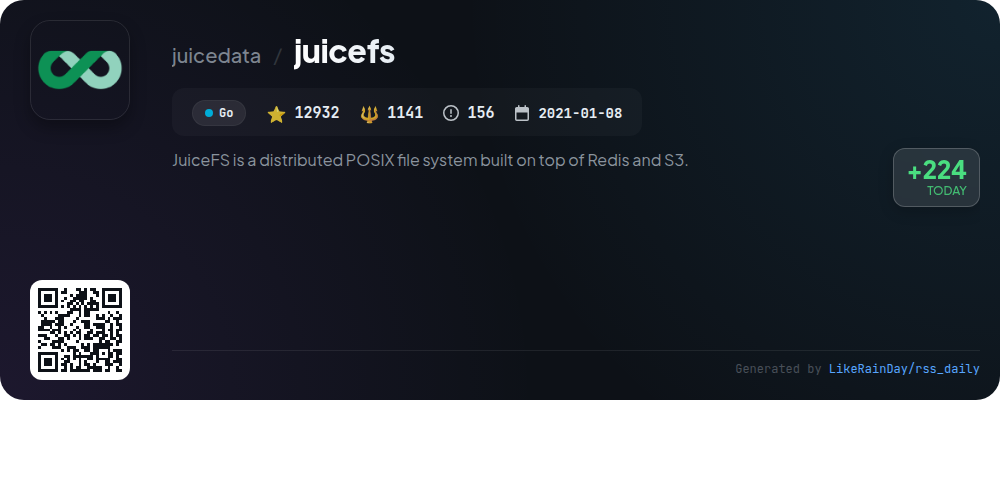
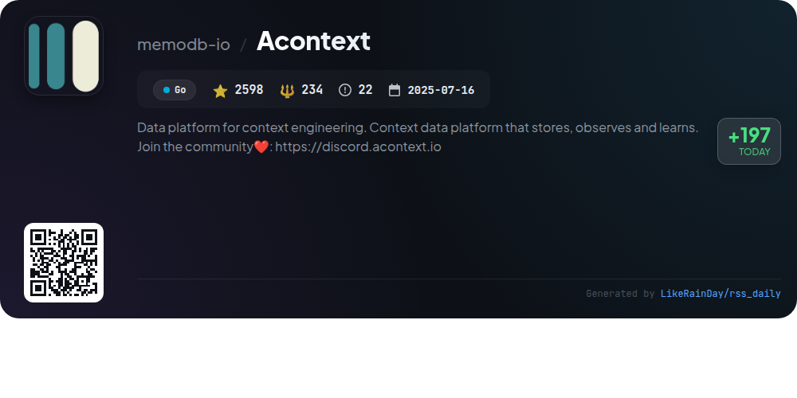

# 📊 🌟 GitHub Trending Daily - 2026-01-16

> > 📅 每日精选 GitHub 热门仓库 | 基于智能算法推荐

## 📋 Overview

**10** 个项目 | **113322** ⭐ | **9606** 🍴

**热门语言:** `TypeScript` (4) · `Go` (4) · `Rust` (1)

**更新时间:** 2026-01-16 12:29 UTC

**分类分布:**

- 🌟 每日 Top 10 精选 (10 项)

---

## 🌟 每日 Top 10 精选

### 1. [eigent](https://github.com/eigent-ai/eigent)

> 🤖 **推荐理由**  
> *Eigent is an open-source cowork desktop application designed to enhance productivity through a customizable AI workforce. It features a Multi-Agent Coordination system for parallel task execution, zero setup requirements, and local deployment for data privacy. Key highlights include comprehensive model support, integration with Model Context Protocol (MCP) tools, and a Human-in-the-Loop mechanism for task management. Ideal for enterprises, Eigent supports SSO and access control, making it a versatile solution for automating complex workflows efficiently.*

- ⭐ 7229 stars
- 💻 TypeScript
- 📅 Updated: 2026-01-16

### 2. [Handy](https://github.com/cjpais/Handy)

> 🤖 **推荐理由**  
> *Handy is a free, open-source speech-to-text application that operates offline, prioritizing privacy and extensibility. Built with Tauri (Rust + React/TypeScript), it allows users to transcribe speech directly into any text field using customizable keyboard shortcuts. Key features include local processing with Whisper and Parakeet models, support for multiple platforms (Windows, macOS, Linux), and a simple interface designed for ease of use. The project actively encourages community contributions and offers detailed documentation for setup and development.*

- ⭐ 11573 stars
- 💻 TypeScript
- 📅 Updated: 2026-01-16

### 3. [LocalAI](https://github.com/mudler/LocalAI)

> 🤖 **推荐理由**  
> *LocalAI is a free, open-source alternative to OpenAI, enabling local AI inference on consumer-grade hardware without requiring a GPU. It serves as a drop-in REST API replacement, supporting text, audio, video, and image generation, along with voice cloning and decentralized P2P inference. Key features include a variety of backends for LLMs, audio processing, and image generation, alongside advanced capabilities like Model Context Protocol (MCP) for agentic functionalities. LocalAI integrates seamlessly into existing workflows, offering a comprehensive suite of AI tools.*

- ⭐ 42070 stars
- 💻 Go
- 📅 Updated: 2026-01-16

### 4. [cc-switch](https://github.com/farion1231/cc-switch)

> 🤖 **推荐理由**  
> *cc-switch is a cross-platform All-in-One assistant tool for Claude Code, Codex, and Gemini CLI, built with Rust and Tauri. It features a dual-layer SQLite + JSON architecture for data management, a redesigned UI, and support for multiple languages. Key capabilities include seamless provider switching, skills and prompts management, and synchronization across devices. Users benefit from integration with services like PackyCode and AIGoCode for reliable API access. With over 11,700 stars, cc-switch offers a robust solution for efficient AI coding workflows.*

- ⭐ 11717 stars
- 💻 Rust
- 📅 Updated: 2026-01-16

### 5. [AionUi](https://github.com/iOfficeAI/AionUi)

> 🤖 **推荐理由**  
> *AionUi is a free, open-source coworking platform for command-line AI tools like Gemini CLI, Claude Code, and Codex, supporting macOS, Windows, and Linux. With a user-friendly graphical interface, it offers features such as multi-agent support, local data security, smart file management, and real-time previews for various document formats. AionUi enables efficient batch processing, intelligent organization of files, and remote access via WebUI. This unified platform enhances workflow by allowing multiple simultaneous sessions and flexible model switching, making it ideal for AI office automation.*

- ⭐ 3974 stars
- 💻 TypeScript
- 📅 Updated: 2026-01-16

### 6. [SpotiFLAC](https://github.com/afkarxyz/SpotiFLAC)

> 🤖 **推荐理由**  
> *SpotiFLAC is a free tool that allows users to download Spotify tracks in true FLAC format from Tidal, Qobuz, and Amazon Music without needing an account. Built in TypeScript, it has garnered over 3,130 stars on GitHub. Core features include easy audio fetching via third-party APIs, compatibility with Windows, macOS, and Linux, and no risk of account suspension as it operates independently of Spotify. The project is intended for educational and private use only and emphasizes user compliance with local laws and platform terms.*

- ⭐ 3130 stars
- 💻 TypeScript
- 📅 Updated: 2026-01-16

### 7. [juicefs](https://github.com/juicedata/juicefs)

> 🤖 **推荐理由**  
> *JuiceFS is a high-performance, distributed POSIX file system built on Redis and S3, designed for cloud-native environments. It provides seamless integration with big data and AI platforms, enabling massive cloud storage to function like local storage. Key features include full POSIX and Hadoop compatibility, an S3-compatible interface, strong consistency, and global file locks. JuiceFS supports various object storage solutions, offers robust performance metrics, data encryption, and compression. It is production-ready, with extensive documentation and community support available.*

- ⭐ 12932 stars
- 💻 Go
- 📅 Updated: 2026-01-16

### 8. [WeKnora](https://github.com/Tencent/WeKnora)

> 🤖 **推荐理由**  
> *WeKnora is an LLM-powered framework for deep document understanding and semantic retrieval, leveraging the RAG paradigm for context-aware answers. Key features include an Agent Mode for advanced interactions, support for multiple knowledge base types, efficient hybrid retrieval strategies, and integration with web search engines. It supports various document formats and offers intuitive UI, RESTful APIs, and secure deployment options. Ideal for enterprise knowledge management, academic research, and technical support, WeKnora enhances knowledge discovery and user engagement.*

- ⭐ 11979 stars
- 💻 Go
- 📅 Updated: 2026-01-16

### 9. [cursor-talk-to-figma-mcp](https://github.com/grab/cursor-talk-to-figma-mcp)

> 🤖 **推荐理由**  
> *Cursor Talk to Figma MCP integrates Cursor AI with Figma, enabling programmatic design manipulation and reading. Key features include a TypeScript MCP server, a Figma plugin for communication, and a WebSocket server facilitating real-time interaction. Notable capabilities include bulk text replacement, instance override propagation, and comprehensive document and selection tools. The project supports efficient design automation, annotations, prototyping, and styling operations, significantly enhancing workflow efficiency for designers. With over 6,120 stars, it is a valuable asset for design automation.*

- ⭐ 6120 stars
- 💻 JavaScript
- 📅 Updated: 2026-01-16

### 10. [Acontext](https://github.com/memodb-io/Acontext)

> 🤖 **推荐理由**  
> *Acontext is a powerful data platform designed for context engineering, enabling the development of cloud-native AI agents. It offers unified message storage across various modalities, built-in context editing, and robust task observation to enhance agent performance. Key features include self-learning capabilities through experience agents, a comprehensive dashboard for monitoring agent success rates, and persistent storage options using PostgreSQL, Redis, and S3. Acontext streamlines agent management and empowers users to build scalable, efficient AI solutions. Join the community at https://discord.acontext.io.*

- ⭐ 2598 stars
- 💻 Go
- 📅 Updated: 2026-01-16

---

## 📡 RSS订阅

通过 RSS 订阅，第一时间获取每日精选项目：

- 🔔 [RSS 订阅源] (../../daily-top.xml)
- 🔔 [每日简报] (../../GITHUB_TODAY_CN.md)
- 🔔 [每日 Top 10 精选](../../daily-top.xml)

---

*⚡ Powered by Smart Trending Algorithm | Generated at 2026-01-16 12:29:42 UTC
