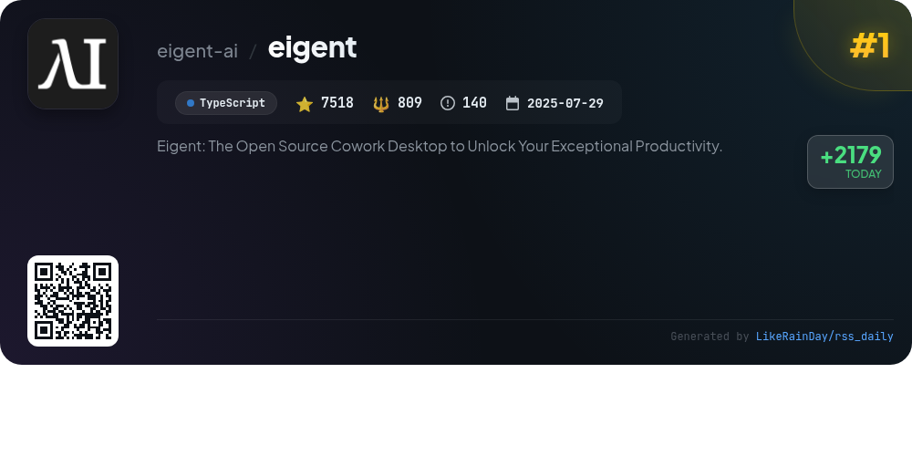
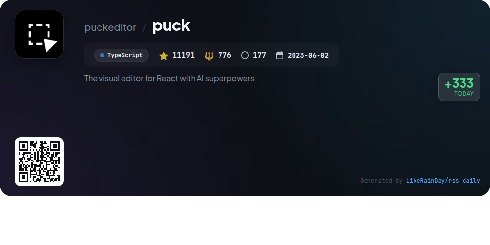
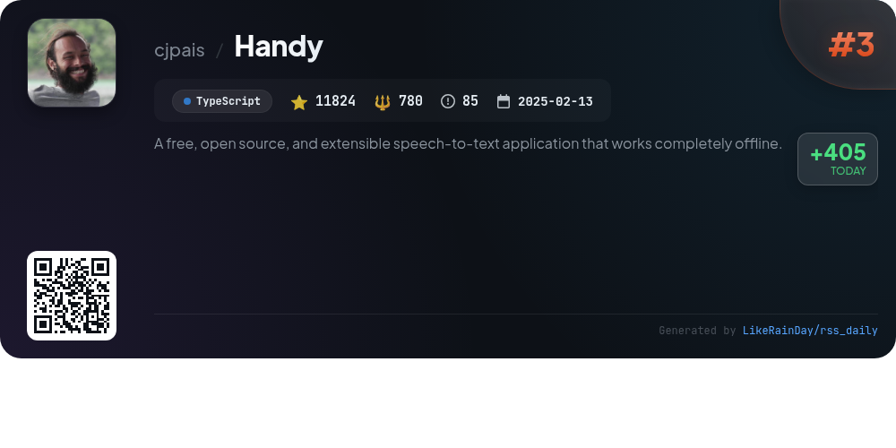
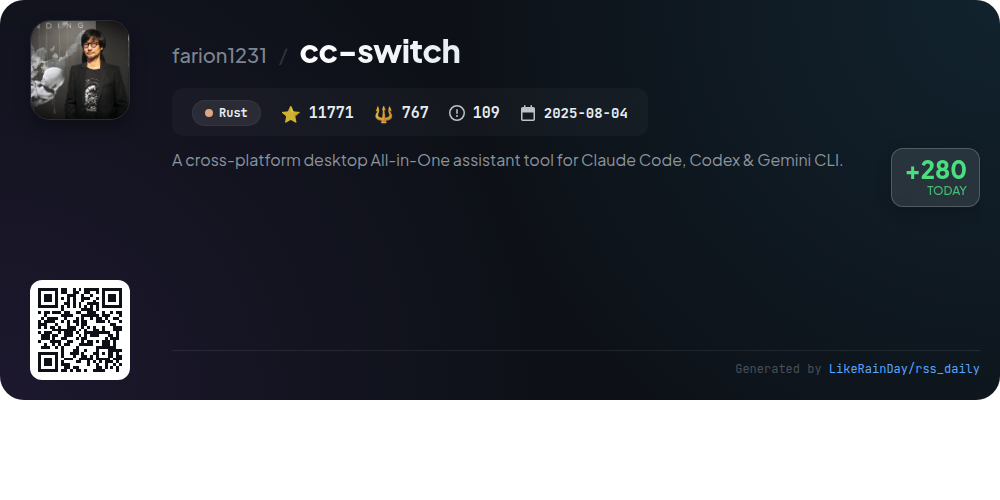
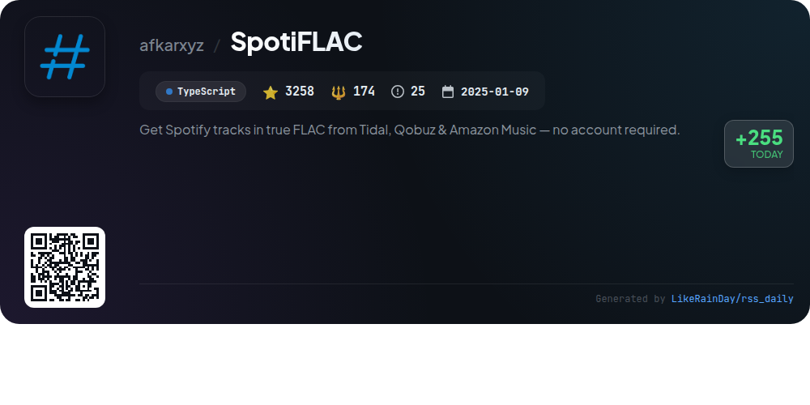
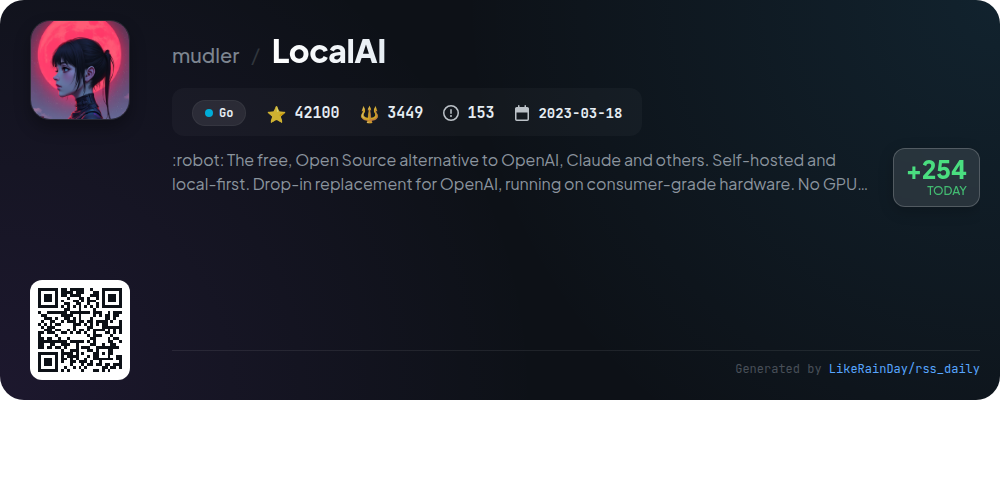
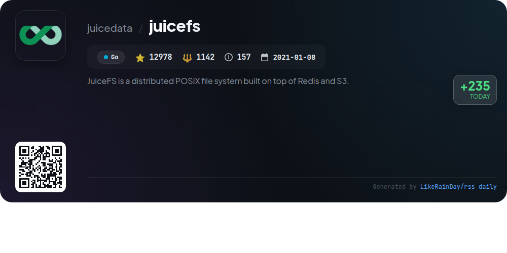
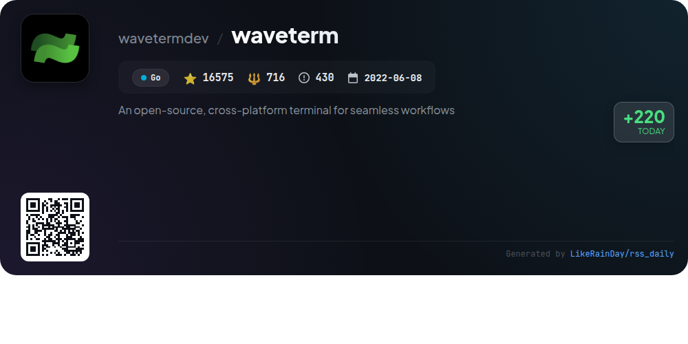
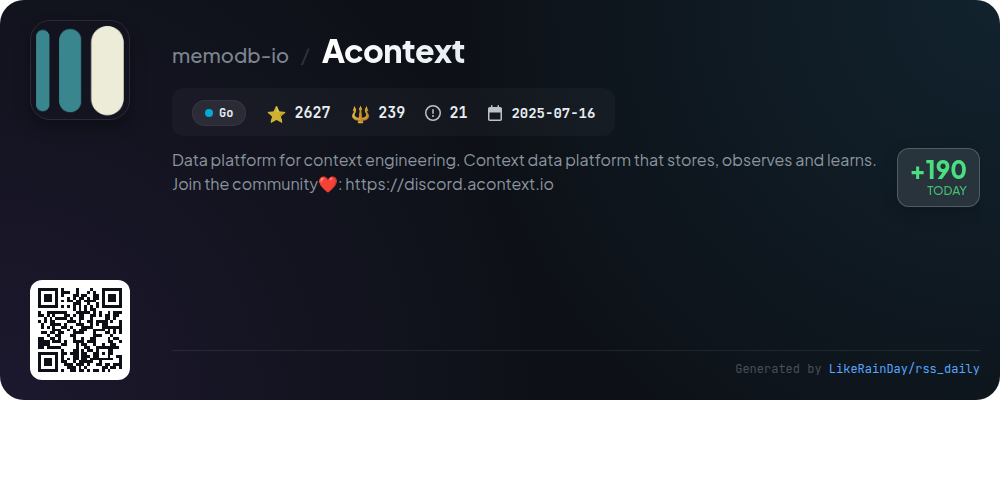
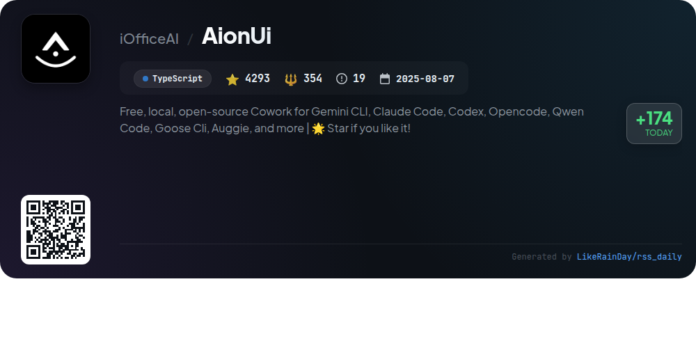

# 📊 🌟 GitHub Trending Daily - 2026-01-17

> > 📅 Daily Picks of GitHub Trending Repositories | Powered by Smart Algorithms

## 📋 Overview

**10** Projects | **123982** ⭐ | **9196** 🍴

**Top Languages:** `TypeScript` (5) · `Go` (4) · `Rust` (1)

**Updated:** 2026-01-17 01:04 UTC

**Categories:**

- 🌟 Daily Top 10 (10 items)

---

## 🌟 Daily Top 10

### 1. [eigent](https://github.com/eigent-ai/eigent)

> 🤖 **Why Recommend**  
> *Eigent is an open-source cowork desktop application designed to enhance productivity by enabling users to build, manage, and deploy a custom AI workforce. Key features include a multi-agent coordination system for handling complex workflows, local deployment for data privacy, and support for custom models. Eigent supports zero setup, integrates with Model Context Protocol (MCP) tools, and offers enterprise features like SSO and access control. It operates with a focus on transparency and community-driven development, making it an ideal solution for automated task execution.*

- ⭐ 7518 stars
- 💻 TypeScript
- 📅 Updated: 2026-01-17

### 2. [puck](https://github.com/puckeditor/puck)

> 🤖 **Why Recommend**  
> *Puck is an open-source visual editor for React.js, designed to create custom drag-and-drop experiences using React components. With over 11,000 stars, it integrates seamlessly into various React environments, including Next.js, without vendor lock-in. Key features include modularity, ownership of data, and an easy setup with `npm` or `create-puck-app`. Puck supports extensive customization through configuration and offers community resources on Discord and GitHub. Licensed under MIT, it’s suitable for both internal and commercial applications.*

- ⭐ 11049 stars
- 💻 TypeScript
- 📅 Updated: 2026-01-17

### 3. [Handy](https://github.com/cjpais/Handy)

> 🤖 **Why Recommend**  
> *Handy is a free, open-source speech-to-text application that operates entirely offline, prioritizing user privacy. Built with Tauri (Rust + React/TypeScript), it offers seamless transcription by pressing a customizable keyboard shortcut, speaking, and automatically pasting the text into any application. Key features include local processing with Whisper and Parakeet models, voice activity detection, and compatibility across Windows, macOS, and Linux. Handy encourages extensibility and community contributions, aiming to provide an adaptable tool for diverse user needs.*

- ⭐ 11824 stars
- 💻 TypeScript
- 📅 Updated: 2026-01-17

### 4. [cc-switch](https://github.com/farion1231/cc-switch)

> 🤖 **Why Recommend**  
> *cc-switch is a cross-platform desktop assistant tool for Claude Code, Codex, and Gemini CLI, built with Rust and Tauri, boasting over 11,700 stars. Key features include seamless provider management, skills and prompts systems, and a new SQLite + JSON architecture for data storage. Users benefit from quick switching between AI configurations, auto-scan capabilities for skills, and a unified MCP server management interface. Supported on Windows, macOS, and Linux, cc-switch enhances coding efficiency with integrated API services and multilingual support.*

- ⭐ 11771 stars
- 💻 Rust
- 📅 Updated: 2026-01-17

### 5. [SpotiFLAC](https://github.com/afkarxyz/SpotiFLAC)

> 🤖 **Why Recommend**  
> *SpotiFLAC is a free tool that allows users to download Spotify tracks in high-quality FLAC format from Tidal, Qobuz, and Amazon Music without needing an account. The project, developed in TypeScript, boasts over 3,200 stars on GitHub and provides a straightforward interface for audio retrieval via third-party APIs. It is compatible with Windows, macOS, and Linux. SpotiFLAC operates independently of Spotify accounts, ensuring user privacy. The software is intended for educational purposes and is not affiliated with any streaming service.*

- ⭐ 3258 stars
- 💻 TypeScript
- 📅 Updated: 2026-01-17

### 6. [LocalAI](https://github.com/mudler/LocalAI)

> 🤖 **Why Recommend**  
> *LocalAI is a free, open-source alternative to OpenAI, designed for local-first, self-hosted AI inference on consumer-grade hardware without the need for GPUs. It offers a comprehensive range of features, including text generation, audio and video synthesis, image generation, voice cloning, and decentralized P2P inference. Compatible with various model families, LocalAI supports a drop-in replacement for OpenAI's API. Its modular architecture allows for easy backend installation and customization, making it a versatile tool for developers seeking to leverage AI technologies.*

- ⭐ 42089 stars
- 💻 Go
- 📅 Updated: 2026-01-16

### 7. [juicefs](https://github.com/juicedata/juicefs)

> 🤖 **Why Recommend**  
> *JuiceFS is a high-performance, distributed POSIX file system built on Redis and S3, designed for cloud-native environments. It supports seamless integration with big data and AI platforms while maintaining POSIX and Hadoop compatibility. Key features include strong consistency, low latency, global file locks, data encryption, and support for various object storage services like AWS S3 and Google Cloud Storage. JuiceFS allows scalable, shareable storage that can be utilized as local storage without code modifications, making it ideal for production environments.*

- ⭐ 12978 stars
- 💻 Go
- 📅 Updated: 2026-01-17

### 8. [waveterm](https://github.com/wavetermdev/waveterm)

> 🤖 **Why Recommend**  
> *WaveTerm is an open-source, cross-platform terminal designed for seamless workflows, combining traditional terminal functions with graphical capabilities. Key features include a flexible drag-and-drop interface, built-in editor, rich file previews, a context-aware AI assistant, and customizable command blocks. It supports quick remote connections and secure secret storage, enhancing productivity across macOS, Linux, and Windows. The Wave AI assistant reads terminal output and facilitates file operations, making it an invaluable tool for developers seeking efficient command line management.*

- ⭐ 16575 stars
- 💻 Go
- 📅 Updated: 2026-01-17

### 9. [Acontext](https://github.com/memodb-io/Acontext)

> 🤖 **Why Recommend**  
> *Acontext is a Go-based context data platform designed for building cloud-native AI agents. It offers robust context engineering features, including unified message storage across various modalities, context editing, and seamless artifact management. Acontext enables real-time observation of agent tasks and user feedback while facilitating self-learning through experience agents. Key highlights include a comprehensive dashboard for monitoring agent performance, easy integration with PostgreSQL, Redis, and S3, and a supportive community on Discord. Join the evolution of AI agents at Acontext.io.*

- ⭐ 2627 stars
- 💻 Go
- 📅 Updated: 2026-01-17

### 10. [AionUi](https://github.com/iOfficeAI/AionUi)

> 🤖 **Why Recommend**  
> *AionUi is a free, open-source platform designed for seamless collaboration with CLI AI agents like Gemini CLI, Claude Code, and Codex. With over 4,293 stars on GitHub, it offers a user-friendly graphical interface, multi-model support, and local data security. Key features include multi-agent mode, smart file management, real-time previews for various formats, and AI image generation. AionUi also supports remote access via a WebUI, ensuring easy operation across devices. It's compatible with macOS, Windows, and Linux, making it a versatile tool for AI-driven office automation.*

- ⭐ 4293 stars
- 💻 TypeScript
- 📅 Updated: 2026-01-17

---

## 📡 RSS Subscription

Subscribe via RSS to get daily trending updates:

- 🔔 [RSS XML] (../../daily-top.xml)
- 🔔 [Daily Report] (../../GITHUB_TODAY.md)
- 🔔 [Daily Top 10](../../daily-top.xml)

---

*⚡ Powered by Smart Trending Algorithm | Generated at 2026-01-17 01:04:39 UTC
