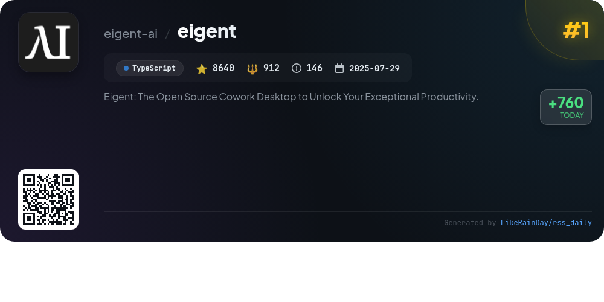
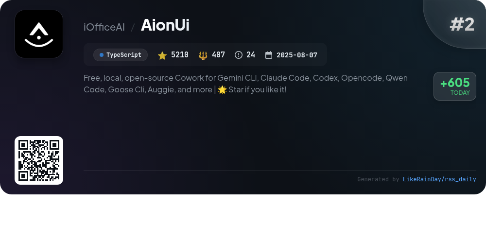
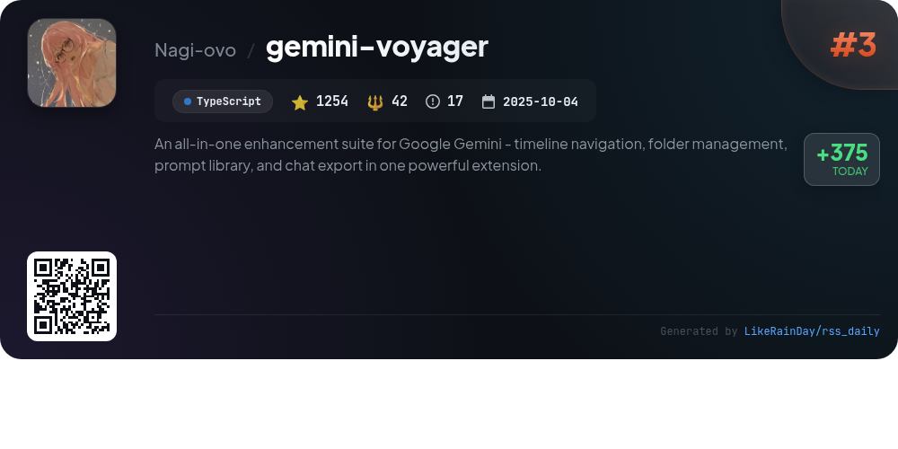
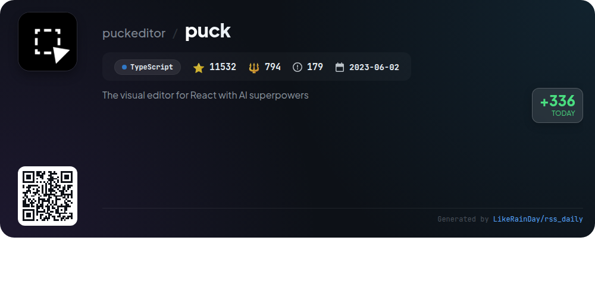
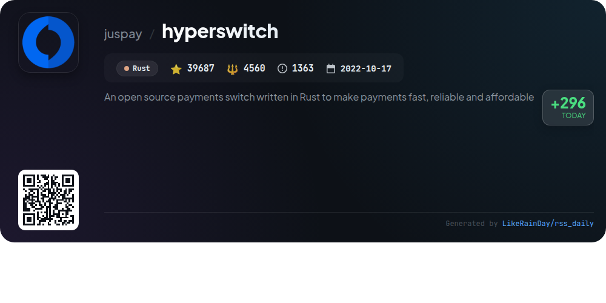
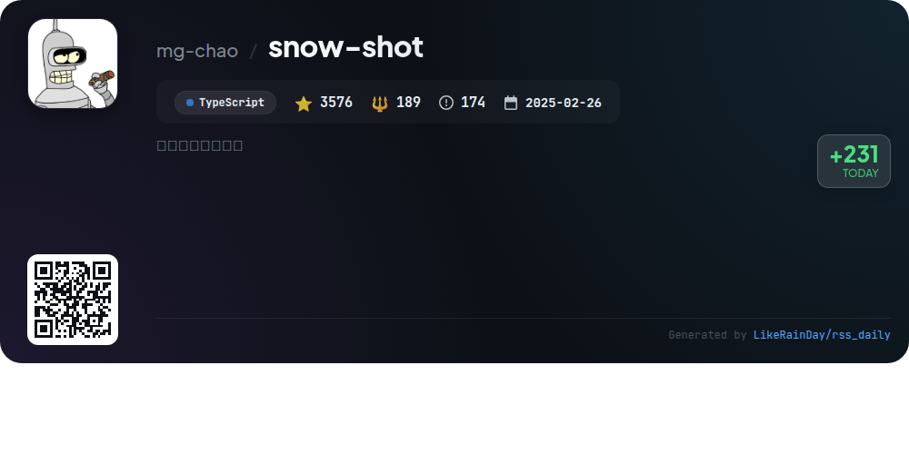
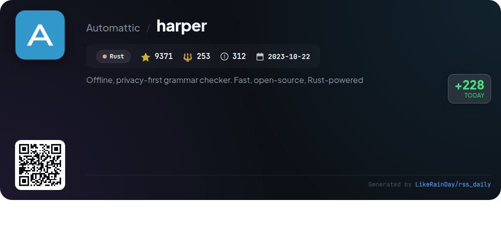
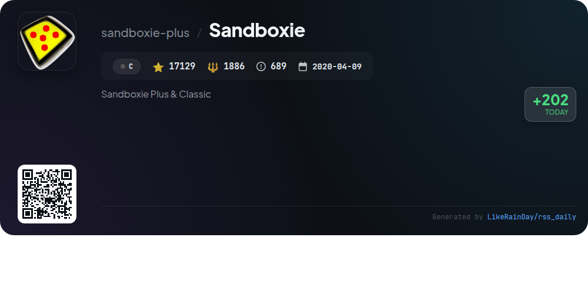
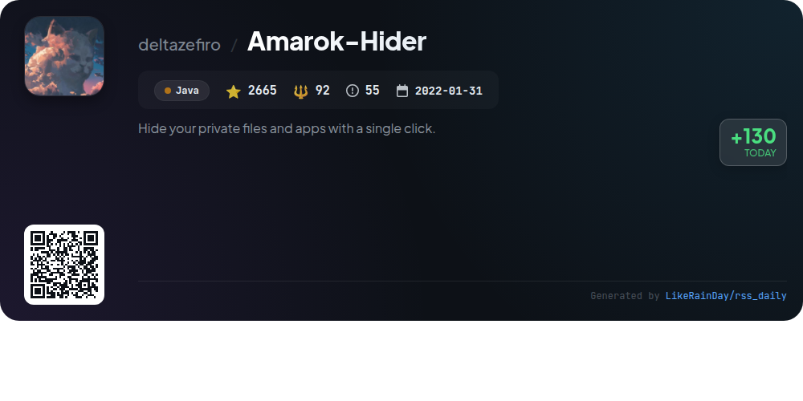

# 📊 🌟 GitHub Trending Daily - 2026-01-18

> > 📅 每日精选 GitHub 热门仓库 | 基于智能算法推荐

## 📋 Overview

**10** 个项目 | **104597** ⭐ | **9993** 🍴

**热门语言:** `TypeScript` (6) · `Rust` (2) · `Java` (1)

**更新时间:** 2026-01-18 12:26 UTC

**分类分布:**

- 🌟 每日 Top 10 精选 (10 项)

---

## 🌟 每日 Top 10 精选

### 1. [eigent](https://github.com/eigent-ai/eigent)

> 🤖 **推荐理由**  
> *Eigent is an open-source cowork desktop application designed to enhance productivity by enabling users to build, manage, and deploy a custom AI workforce. Key features include zero-setup local deployment, multi-agent coordination for complex workflows, and comprehensive model support. It integrates seamlessly with various tools via the Model Context Protocol (MCP) and supports human-in-the-loop interactions for task management. With a focus on privacy, customization, and enterprise features like SSO, Eigent empowers users to automate their workflows efficiently.*

- ⭐ 9119 stars
- 💻 TypeScript
- 📅 Updated: 2026-01-18

### 2. [AionUi](https://github.com/iOfficeAI/AionUi)

> 🤖 **推荐理由**  
> *AionUi is a free, open-source platform designed for seamless collaboration with command-line AI tools like Gemini CLI, Claude Code, and Codex. With over 5,210 stars, it features a user-friendly graphical interface, multi-agent support, and local data security. Key highlights include automatic detection of CLI tools, smart file management, an integrated preview panel for 9+ file formats, and multi-task parallel processing. AionUi also offers remote access via WebUI, making it accessible from any device while ensuring data remains secure.*

- ⭐ 5210 stars
- 💻 TypeScript
- 📅 Updated: 2026-01-18

### 3. [gemini-voyager](https://github.com/Nagi-ovo/gemini-voyager)

> 🤖 **推荐理由**  
> *An all-in-one enhancement suite for Google Gemini - timeline navigation, folder management, prompt library, and chat export in one powerful extension.. popular project, recently updated*

- ⭐ 1254 stars
- 🍴 42 forks
- 💻 TypeScript
- 📅 Updated: 2026-01-18

### 4. [puck](https://github.com/puckeditor/puck)

> 🤖 **推荐理由**  
> *Puck is an open-source visual editor for React.js, enabling users to create custom drag-and-drop experiences effortlessly. With modular components and compatibility with various React environments, including Next.js, Puck offers full data ownership without vendor lock-in. Key features include a simple installation process, extensive documentation, and community support via Discord. Users can quickly set up applications using pre-configured recipes like Next.js and Remix. Licensed under MIT, Puck is suitable for both internal and commercial use.*

- ⭐ 11532 stars
- 💻 TypeScript
- 📅 Updated: 2026-01-18

### 5. [hyperswitch](https://github.com/juspay/hyperswitch)

> 🤖 **推荐理由**  
> *Hyperswitch is an open-source payments switch built in Rust, designed to provide a fast, reliable, and affordable payments infrastructure. With over 39,000 stars on GitHub, it offers a modular architecture that allows businesses to customize their payment processing needs without vendor lock-in. Key features include advanced cost observability, intelligent routing, PCI-compliant vault services, and support for various payment methods like cards and wallets. Hyperswitch emphasizes developer experience and community-driven development, making it a versatile choice for modern payment solutions.*

- ⭐ 39687 stars
- 💻 Rust
- 📅 Updated: 2026-01-18

### 6. [snow-shot](https://github.com/mg-chao/snow-shot)

> 🤖 **推荐理由**  
> *Snow Shot is a powerful and user-friendly screenshot tool designed for both Windows and macOS, boasting over 3,500 stars on GitHub. Key features include a plugin system for added functionalities like video recording and AI chat, a variety of annotation tools (shapes, text, mosaics), intelligent window recognition for precise captures, customizable keyboard shortcuts for efficiency, and multiple saving options. As an open-source project, it benefits from active community support and continuous updates. Explore more at the official website and community forums.*

- ⭐ 3576 stars
- 💻 TypeScript
- 📅 Updated: 2026-01-18

### 7. [harper](https://github.com/Automattic/harper)

> 🤖 **推荐理由**  
> *Harper is an offline, privacy-first grammar checker built with Rust, designed for speed and efficiency. With over 9,371 stars on GitHub, it offers quick linting of English text, requiring minimal memory compared to competitors like Grammarly and LanguageTool. Harper prioritizes user privacy, performing checks locally without sending data to external servers. It supports extensibility for other languages and integrates seamlessly with popular editors like Visual Studio Code, Neovim, and Emacs. Discover more at writewithharper.com.*

- ⭐ 9371 stars
- 💻 Rust
- 📅 Updated: 2026-01-18

### 8. [Personal_AI_Infrastructure](https://github.com/danielmiessler/Personal_AI_Infrastructure)

> 🤖 **推荐理由**  
> *Personal_AI_Infrastructure (PAI) is an open-source platform designed to enhance human capabilities through personalized AI. With over 5,000 stars on GitHub, PAI emphasizes goal-oriented, continuous learning, and user-centric customization. Key features include a robust memory system, a unique algorithm for task execution, and customizable packs for specific capabilities like content generation and research automation. PAI aims to democratize AI access, allowing users from all backgrounds to utilize advanced AI tools without technical barriers.*

- ⭐ 5054 stars
- 💻 TypeScript
- 📅 Updated: 2026-01-18

### 9. [Sandboxie](https://github.com/sandboxie-plus/Sandboxie)

> 🤖 **推荐理由**  
> *Sandboxie is an open-source sandbox-based isolation software for Windows, providing a secure environment to run untrusted applications without affecting the host system. It offers two editions: Plus, featuring a modern Qt-based UI with advanced functionalities like Snapshot Manager, privacy mode, and customizable settings; and Classic, with limited features. Key highlights include unlimited sandboxes, a network firewall per sandbox, and enhanced security options. The project is community-driven, aiming to enhance user experience while maintaining high compatibility and security.*

- ⭐ 17129 stars
- 💻 C
- 📅 Updated: 2026-01-18

### 10. [Amarok-Hider](https://github.com/deltazefiro/Amarok-Hider)

> 🤖 **推荐理由**  
> *Amarok-Hider is a lightweight Android privacy tool that allows users to hide files and apps with a single click, boasting 2,665 stars on GitHub. Unlike traditional encryption, Amarok offers instant concealment by obfuscating signatures or adjusting permissions. Key features include one-click privacy, root-free app hiding, a panic button for instant concealment, and a disguise mode. Users can secure access with passwords or fingerprints and toggle visibility via a quick settings tile. Amarok is ideal for users seeking fast, non-encrypted privacy solutions.*

- ⭐ 2665 stars
- 💻 Java
- 📅 Updated: 2026-01-18

---

## 📡 RSS订阅

通过 RSS 订阅，第一时间获取每日精选项目：

- 🔔 [RSS 订阅源] (../../daily-top.xml)
- 🔔 [每日简报] (../../GITHUB_TODAY_CN.md)
- 🔔 [每日 Top 10 精选](../../daily-top.xml)

---

*⚡ Powered by Smart Trending Algorithm | Generated at 2026-01-18 12:26:56 UTC
