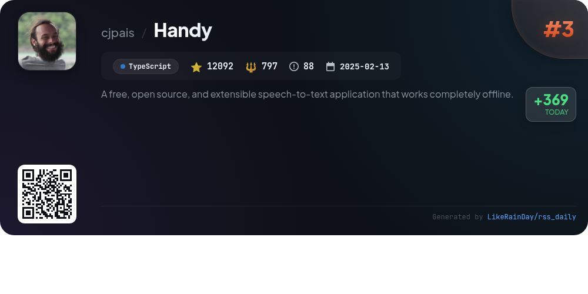
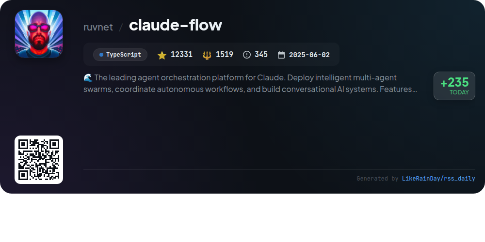
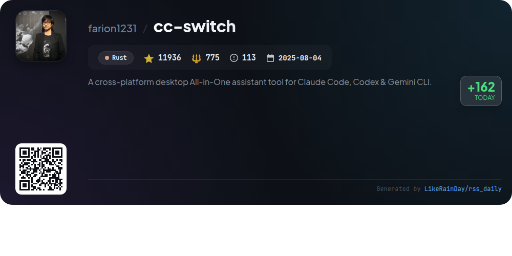
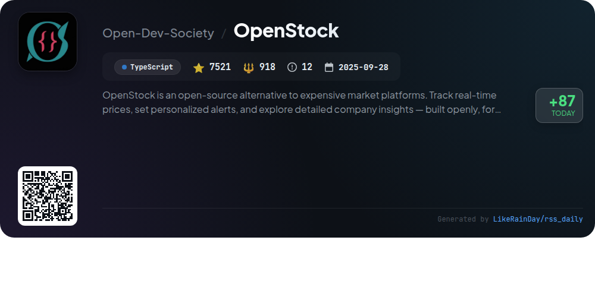
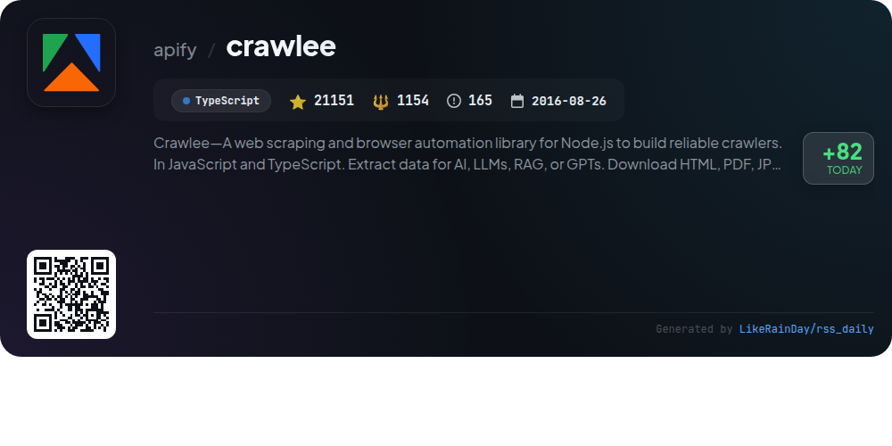
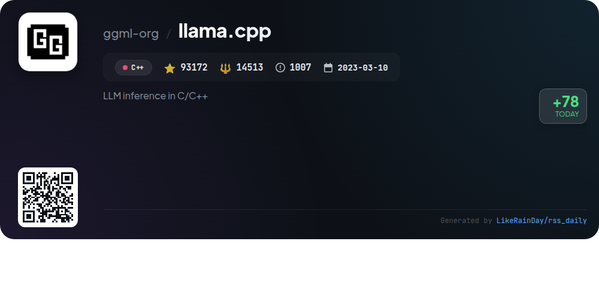

# 📊 🌟 GitHub Trending Daily - 2026-01-18

> > 📅 Daily Picks of GitHub Trending Repositories | Powered by Smart Algorithms

## 📋 Overview

**10** Projects | **192463** ⭐ | **22014** 🍴

**Top Languages:** `TypeScript` (7) · `Rust` (2) · `C++` (1)

**Updated:** 2026-01-18 01:11 UTC

**Categories:**

- 🌟 Daily Top 10 (10 items)

---

## 🌟 Daily Top 10

### 1. [eigent](https://github.com/eigent-ai/eigent)

> 🤖 **Why Recommend**  
> *Eigent is an open-source cowork desktop application designed to enhance productivity by enabling users to build and manage a custom AI workforce. Key features include zero setup, multi-agent coordination for complex workflows, local deployment, and comprehensive model support. It integrates seamlessly with various tools and offers human-in-the-loop capabilities for task management. With enterprise-grade features like SSO and access control, Eigent aims to empower users to automate tasks effectively while ensuring data privacy and customization.*

- ⭐ 8640 stars
- 💻 TypeScript
- 📅 Updated: 2026-01-18

### 2. [AionUi](https://github.com/iOfficeAI/AionUi)

> 🤖 **Why Recommend**  
> *AionUi is a free, open-source coworking platform designed for seamless interaction with multiple command-line AI tools like Gemini CLI, Claude Code, and Codex. Key features include auto-detection of local CLI tools, a unified graphical interface, multi-session support, and smart file management. Users benefit from real-time previews of AI-generated content in various formats, AI image generation, and remote access via a WebUI. With local data security and cross-platform compatibility (macOS, Windows, Linux), AionUi enhances AI office automation and user experience.*

- ⭐ 4909 stars
- 💻 TypeScript
- 📅 Updated: 2026-01-18

### 3. [Handy](https://github.com/cjpais/Handy)

> 🤖 **Why Recommend**  
> *Handy is a free, open-source speech-to-text application that operates entirely offline, ensuring user privacy. Built with Tauri (Rust + React/TypeScript), it transcribes speech locally using Whisper models and Parakeet V3 for efficient processing. Key features include customizable keyboard shortcuts, cross-platform compatibility (Windows, macOS, Linux), and automatic language detection. Users can easily configure settings and contribute to the project, making it a highly extensible tool for personalized needs. With over 12,000 stars, Handy aims to be the go-to solution for accessible speech transcription.*

- ⭐ 12092 stars
- 💻 TypeScript
- 📅 Updated: 2026-01-18

### 4. [puck](https://github.com/puckeditor/puck)

> 🤖 **Why Recommend**  
> *Puck is an open-source visual editor for React.js, enabling users to create custom drag-and-drop experiences with ease. It integrates seamlessly into various React environments, including Next.js, ensuring data ownership without vendor lock-in. Key features include modular components, real-time editing, and a quick start with pre-configured apps via `create-puck-app`. The project is actively supported by a community on Discord and offers comprehensive documentation for developers. Licensed under MIT, Puck is suitable for both internal and commercial applications.*

- ⭐ 11391 stars
- 💻 TypeScript
- 📅 Updated: 2026-01-18

### 5. [claude-flow](https://github.com/ruvnet/claude-flow)

> 🤖 **Why Recommend**  
> *Claude-Flow is a leading agent orchestration platform that enables deployment of intelligent, multi-agent swarms to coordinate autonomous workflows and build conversational AI systems. Key features include enterprise-grade architecture, support for over 54 specialized agents, RAG integration, and native Claude Code compatibility via the MCP protocol. It offers self-learning capabilities through the ReasoningBank, ensuring continuous improvement. With built-in security measures and a plugin system for extensibility, Claude-Flow streamlines complex software engineering tasks efficiently.*

- ⭐ 12331 stars
- 💻 TypeScript
- 📅 Updated: 2026-01-18

### 6. [harper](https://github.com/Automattic/harper)

> 🤖 **Why Recommend**  
> *Harper is an offline, privacy-first grammar checker built in Rust, designed to be fast and lightweight. Unlike competitors, it operates without sending data to servers, ensuring user privacy. Harper offers quick linting with minimal memory usage—taking milliseconds for document checks, making it suitable even for low-resource environments. Currently supporting English, its extensible core invites contributions for additional languages. Integrations are available for popular editors like Visual Studio Code and Neovim, enhancing its versatility. With over 9,300 stars on GitHub, Harper is a robust choice for grammar checking.*

- ⭐ 9320 stars
- 💻 Rust
- 📅 Updated: 2026-01-18

### 7. [cc-switch](https://github.com/farion1231/cc-switch)

> 🤖 **Why Recommend**  
> *cc-switch is a cross-platform desktop assistant tool for managing Claude Code, Codex, and Gemini CLI, built with Rust and Tauri. It boasts over 11,900 stars and offers features like provider management, speed testing, prompt management, and skills discovery. The latest version (3.9.1) introduces a dual-layer architecture for enhanced data synchronization and a revamped UI. Users can seamlessly switch between APIs, manage multiple configurations, and benefit from integration with various sponsors like Z.ai and PackyCode for improved coding experiences.*

- ⭐ 11936 stars
- 💻 Rust
- 📅 Updated: 2026-01-18

### 8. [OpenStock](https://github.com/Open-Dev-Society/OpenStock)

> 🤖 **Why Recommend**  
> *OpenStock is an open-source stock market platform designed to provide a free alternative to expensive market services. Key features include real-time price tracking, personalized alerts, user-specific watchlists, and detailed company insights through TradingView and Finnhub APIs. Built with Next.js, TypeScript, and Tailwind CSS, it offers secure email/password authentication and a polished UI with dark mode. OpenStock promotes community-driven development, ensuring that all tools remain accessible and transparent. Join the movement for open knowledge and resources.*

- ⭐ 7521 stars
- 💻 TypeScript
- 📅 Updated: 2026-01-18

### 9. [crawlee](https://github.com/apify/crawlee)

> 🤖 **Why Recommend**  
> *Crawlee is a powerful web scraping and browser automation library for Node.js, designed for building reliable crawlers in JavaScript and TypeScript. With support for both HTTP and headless browser crawling, it features automatic proxy rotation, customizable lifecycles, and persistent URL queues. Users can extract various file types and scrape JSON APIs effortlessly. Crawlee integrates with Puppeteer, Playwright, Cheerio, and JSDOM, and offers a user-friendly CLI for project setup. Ideal for AI data extraction, it operates seamlessly on the Apify platform.*

- ⭐ 21151 stars
- 💻 TypeScript
- 📅 Updated: 2026-01-17

### 10. [llama.cpp](https://github.com/ggml-org/llama.cpp)

> 🤖 **Why Recommend**  
> *llama.cpp is a high-performance library for large language model (LLM) inference implemented in C/C++. With over 93,000 stars on GitHub, it offers seamless compatibility across various hardware, including Apple Silicon and NVIDIA GPUs. Key features include support for multiple quantization formats, custom CUDA kernels, and a lightweight OpenAI-compatible API server. Users can easily install via Docker or package managers, run models locally or from Hugging Face, and utilize tools for model conversion and quantization. The project also supports multimodal capabilities and various programming bindings.*

- ⭐ 93172 stars
- 💻 C++
- 📅 Updated: 2026-01-18

---

## 📡 RSS Subscription

Subscribe via RSS to get daily trending updates:

- 🔔 [RSS XML] (../../daily-top.xml)
- 🔔 [Daily Report] (../../GITHUB_TODAY.md)
- 🔔 [Daily Top 10](../../daily-top.xml)

---

*⚡ Powered by Smart Trending Algorithm | Generated at 2026-01-18 01:11:57 UTC
