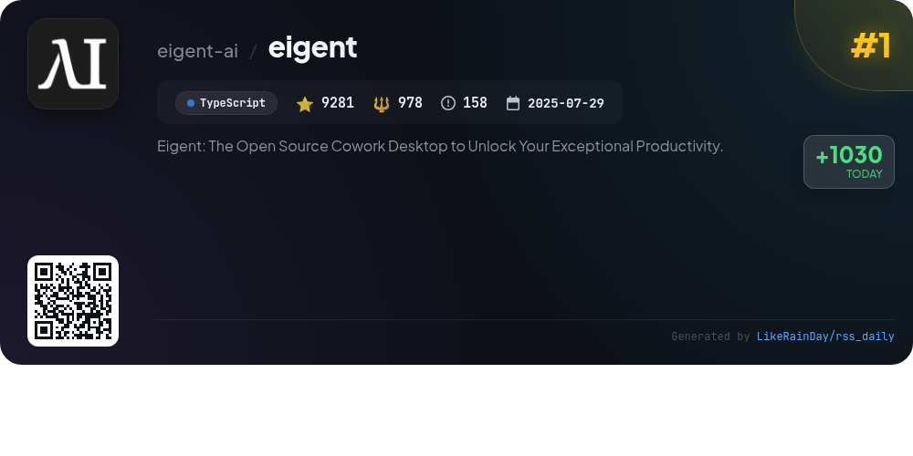
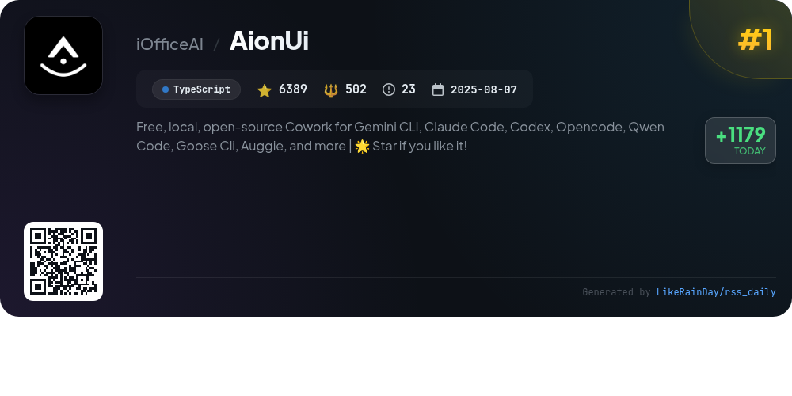
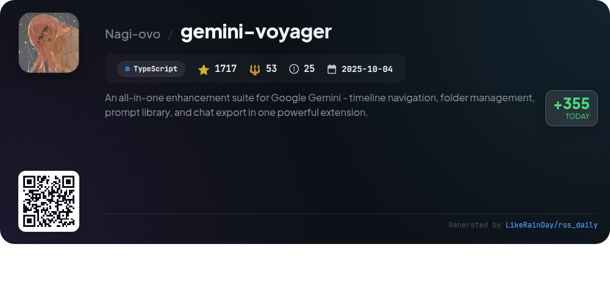
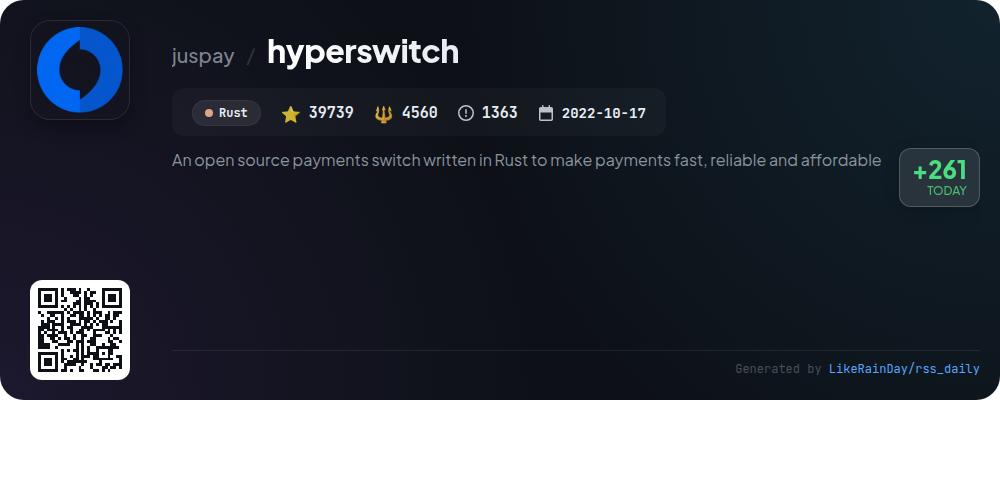
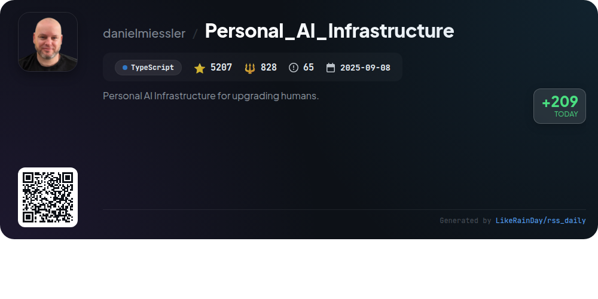
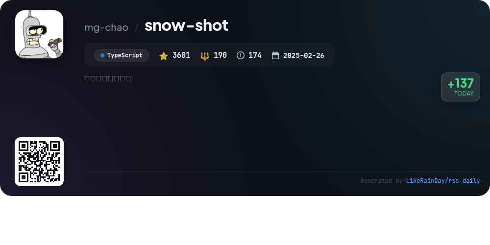
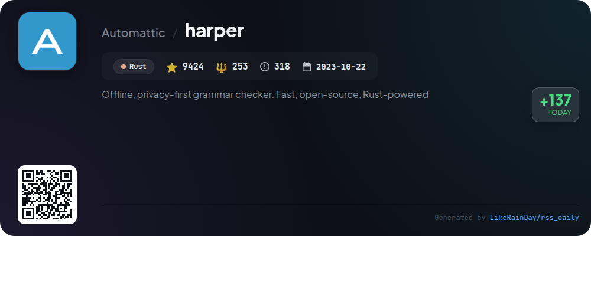
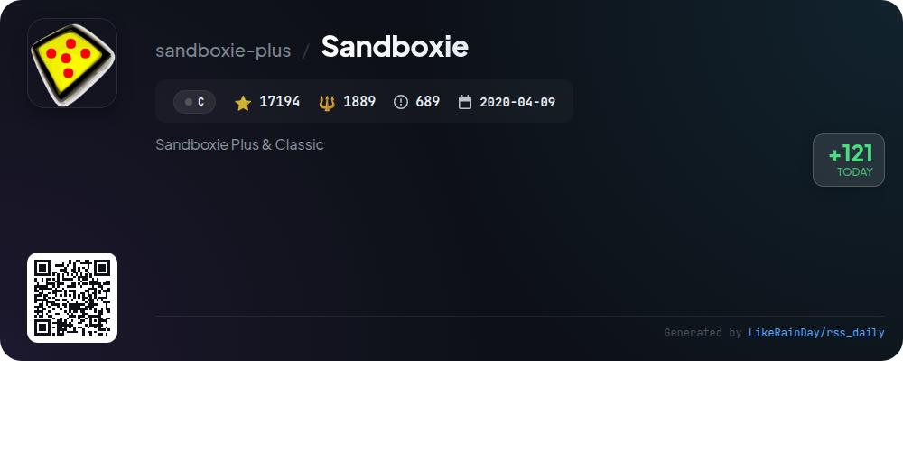
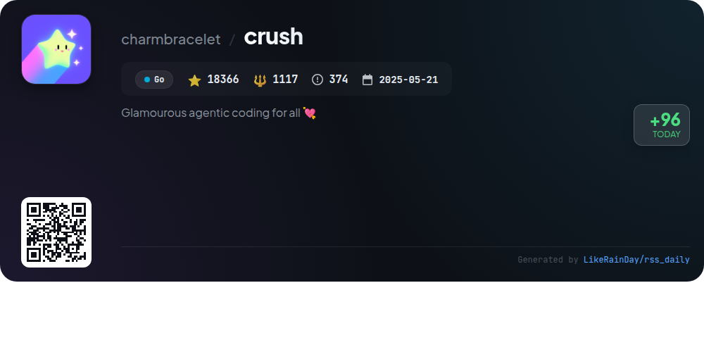

# 📊 🌟 GitHub Trending Daily - 2026-01-19

> > 📅 每日精选 GitHub 热门仓库 | 基于智能算法推荐

## 📋 Overview

**10** 个项目 | **121279** ⭐ | **11084** 🍴

**热门语言:** `TypeScript` (6) · `Rust` (2) · `Go` (1)

**更新时间:** 2026-01-19 01:10 UTC

**分类分布:**

- 🌟 每日 Top 10 精选 (10 项)

---

## 🌟 每日 Top 10 精选

### 1. [eigent](https://github.com/eigent-ai/eigent)

> 🤖 **推荐理由**  
> *Eigent is an open-source cowork desktop application designed to enhance productivity through a customizable AI workforce. Key features include zero setup for local deployment, multi-agent coordination for complex workflows, and robust enterprise capabilities like SSO and access control. Users can employ specialized agents for tasks ranging from coding to document management, ensuring efficient parallel execution. With comprehensive model support and integration of Model Context Protocol (MCP) tools, Eigent fosters automation while prioritizing data privacy. Engage with a community-driven ecosystem and explore limitless use cases.*

- ⭐ 9281 stars
- 💻 TypeScript
- 📅 Updated: 2026-01-19

### 2. [AionUi](https://github.com/iOfficeAI/AionUi)

> 🤖 **推荐理由**  
> *AionUi is a free, open-source coworking platform designed for seamless interaction with multiple AI command-line tools like Gemini CLI, Claude Code, and Codex. It features a user-friendly graphical interface, multi-agent support, and local data security. Key highlights include automatic detection of CLI tools, smart file management, real-time preview of AI-generated content across various formats, and WebUI mode for remote access. AionUi enhances productivity with independent session management, multi-model switching, and customizable interfaces, making it a robust solution for AI office automation.*

- ⭐ 5619 stars
- 💻 TypeScript
- 📅 Updated: 2026-01-19

### 3. [gemini-voyager](https://github.com/Nagi-ovo/gemini-voyager)

> 🤖 **推荐理由**  
> *An all-in-one enhancement suite for Google Gemini - timeline navigation, folder management, prompt library, and chat export in one powerful extension.. popular project, recently updated*

- ⭐ 1381 stars
- 🍴 47 forks
- 💻 TypeScript
- 📅 Updated: 2026-01-19

### 4. [puck](https://github.com/puckeditor/puck)

> 🤖 **推荐理由**  
> *Puck is a powerful, open-source visual editor for React.js that streamlines the creation of custom drag-and-drop experiences. With seamless integration across React environments, including Next.js, it ensures data ownership with no vendor lock-in. Key features include modular components, easy installation, and a rich community for support and extensions. Puck is licensed under MIT, making it suitable for both internal and commercial use. Explore its capabilities through the [documentation](https://puckeditor.com/docs) and [demo](https://demo.puckeditor.com/edit).*

- ⭐ 11565 stars
- 💻 TypeScript
- 📅 Updated: 2026-01-19

### 5. [hyperswitch](https://github.com/juspay/hyperswitch)

> 🤖 **推荐理由**  
> *Hyperswitch is an open-source payments switch built in Rust, designed to enhance payment processing with speed, reliability, and cost-efficiency. With over 39,000 stars, it offers a modular architecture that allows businesses to integrate essential payment modules like cost observability, revenue recovery, and intelligent routing without vendor lock-in. Key features include a PCI-compliant vault for secure payment storage, automated reconciliation, and support for multiple payment methods. Hyperswitch enables seamless integration and developer-friendly customization, making it a versatile solution for modern payment infrastructures.*

- ⭐ 39739 stars
- 💻 Rust
- 📅 Updated: 2026-01-19

### 6. [Personal_AI_Infrastructure](https://github.com/danielmiessler/Personal_AI_Infrastructure)

> 🤖 **推荐理由**  
> *Personal_AI_Infrastructure (PAI) is an open-source project designed to empower individuals by providing a personalized AI platform that continuously learns and adapts to users' goals and preferences. Key features include persistent memory, customizable skills, a modular architecture with 23 Packs for various capabilities, and a focus on user-centric design. PAI aids in self-discovery, enhances productivity for individuals and teams, and ensures accessibility to advanced AI tools. With over 5,100 stars on GitHub, PAI is a comprehensive solution for maximizing human potential through AI.*

- ⭐ 5144 stars
- 💻 TypeScript
- 📅 Updated: 2026-01-19

### 7. [snow-shot](https://github.com/mg-chao/snow-shot)

> 🤖 **推荐理由**  
> *Snow Shot is a versatile screenshot tool designed for ease of use and efficiency, available on Windows and macOS. Key features include a plugin system for added functionalities like video recording and AI interactions, a variety of annotation tools (shapes, text, mosaics), smart window recognition for precise captures, customizable shortcuts for quick access, and multiple saving options (local, clipboard, pinned). As an open-source project with an active community, it is regularly updated based on user feedback. Visit [Snow Shot](https://snowshot.top) for downloads and more information.*

- ⭐ 3601 stars
- 💻 TypeScript
- 📅 Updated: 2026-01-19

### 8. [harper](https://github.com/Automattic/harper)

> 🤖 **推荐理由**  
> *Harper is a fast, offline, and privacy-focused grammar checker built with Rust. Designed to overcome the limitations of competitors like Grammarly and LanguageTool, Harper provides quick document linting with minimal memory usage, ensuring user privacy by processing data locally. Currently supporting English, it offers extensibility for additional languages. Harper integrates seamlessly with various editors, including Visual Studio Code and Neovim, and can even run via WebAssembly. With over 9,400 stars on GitHub, it’s an open-source solution for efficient grammar checking.*

- ⭐ 9424 stars
- 💻 Rust
- 📅 Updated: 2026-01-18

### 9. [Sandboxie](https://github.com/sandboxie-plus/Sandboxie)

> 🤖 **推荐理由**  
> *Sandboxie is a sandbox-based isolation software for Windows that enables secure execution of applications without altering the host system. It offers two editions, Plus and Classic, with Plus featuring a modern UI and enhanced functionalities such as Snapshot Manager, privacy protection, customizable restrictions, and a network firewall per sandbox. Users can create unlimited sandboxes, control system access, and utilize various tools to enhance functionality. With over 17,000 stars on GitHub, Sandboxie is a community-driven project that prioritizes security and user customization.*

- ⭐ 17159 stars
- 💻 C
- 📅 Updated: 2026-01-19

### 10. [crush](https://github.com/charmbracelet/crush)

> 🤖 **推荐理由**  
> *Crush is a terminal-based coding assistant designed for seamless integration with various LLMs via OpenAI and Anthropic APIs. Key features include multi-model support, context preservation during sessions, and extensibility through Model Context Protocols (MCPs). It enhances coding workflows with Language Server Protocol (LSP) support and operates across multiple platforms, including Windows, macOS, and Linux. Built on the robust Charm ecosystem, Crush is ideal for developers seeking a flexible, powerful tool to streamline their coding processes.*

- ⭐ 18366 stars
- 💻 Go
- 📅 Updated: 2026-01-19

---

## 📡 RSS订阅

通过 RSS 订阅，第一时间获取每日精选项目：

- 🔔 [RSS 订阅源] (../../daily-top.xml)
- 🔔 [每日简报] (../../GITHUB_TODAY_CN.md)
- 🔔 [每日 Top 10 精选](../../daily-top.xml)

---

*⚡ Powered by Smart Trending Algorithm | Generated at 2026-01-19 01:10:54 UTC
