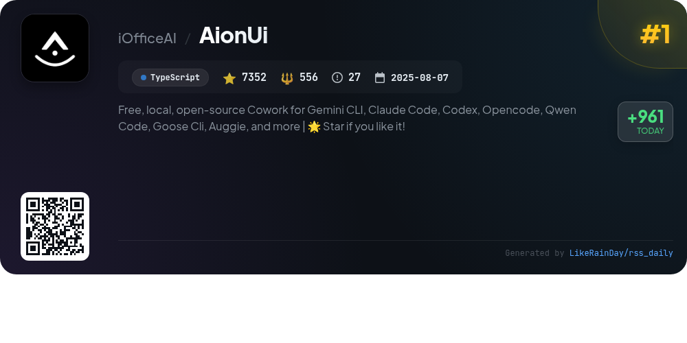
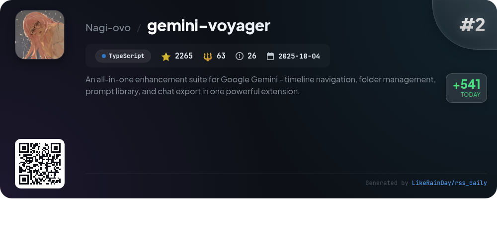
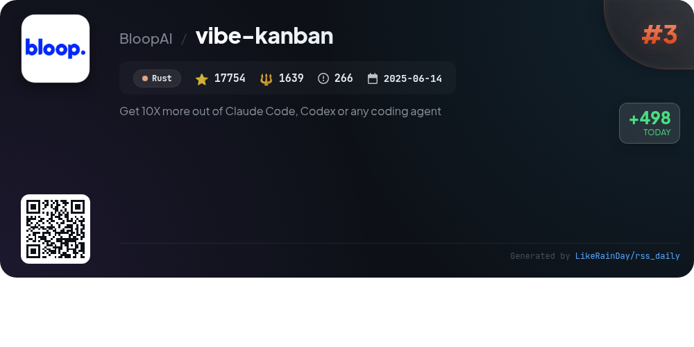
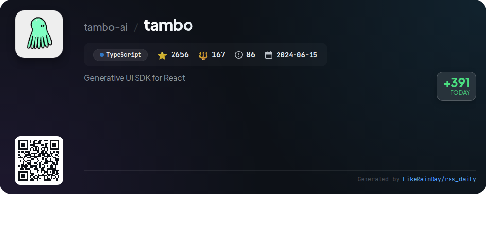
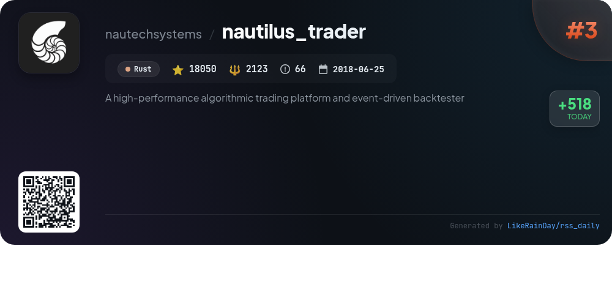
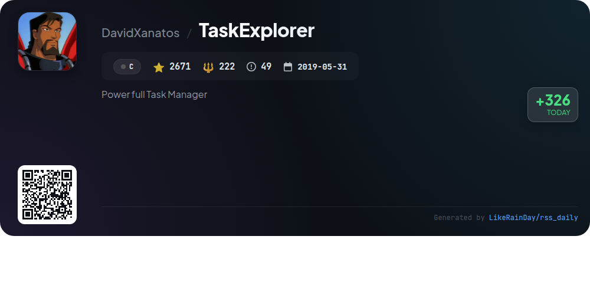
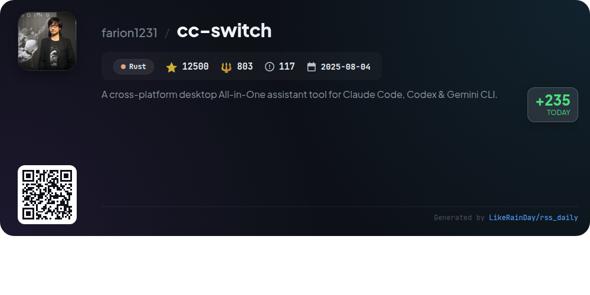
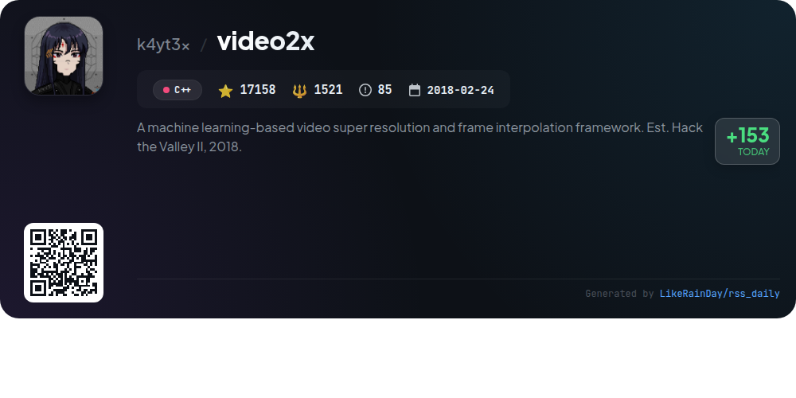
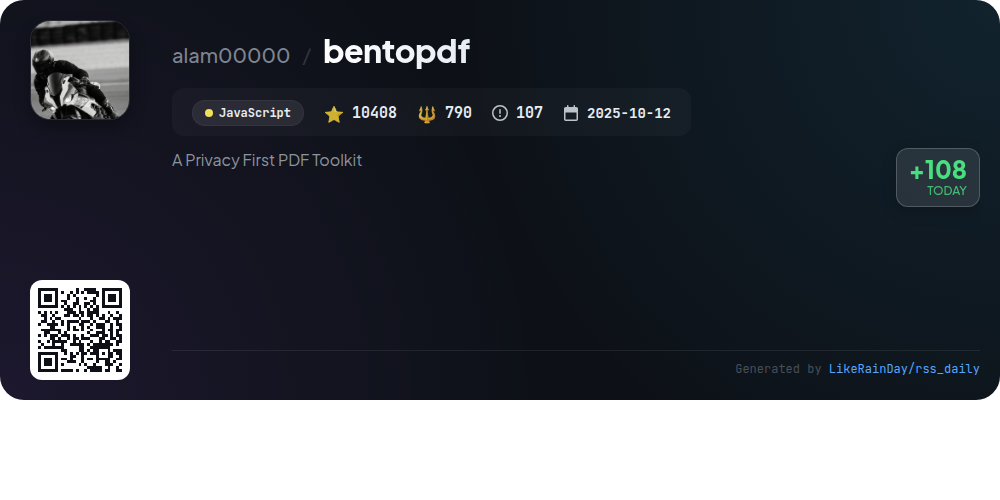

# 📊 🌟 GitHub Trending Daily - 2026-01-20

> > 📅 每日精选 GitHub 热门仓库 | 基于智能算法推荐

## 📋 Overview

**10** 个项目 | **115760** ⭐ | **10203** 🍴

**热门语言:** `Rust` (3) · `TypeScript` (3) · `C++` (1)

**更新时间:** 2026-01-20 15:08 UTC

**分类分布:**

- 🌟 每日 Top 10 精选 (10 项)

---

## 🌟 每日 Top 10 精选

### 1. [AionUi](https://github.com/iOfficeAI/AionUi)

> 🤖 **推荐理由**  
> *AionUi is a free, open-source coworking platform designed for command-line AI tools like Gemini CLI, Claude Code, and Codex. With over 7,500 stars on GitHub, it features a user-friendly graphical interface, multi-agent support, and local data security. Key highlights include auto-detection of CLI tools, smart file management, real-time preview of AI-generated content in 9+ formats, and web UI access from any device. AionUi ensures efficient workflows while maintaining data privacy, making it ideal for enhancing productivity in AI-driven tasks.*

- ⭐ 7502 stars
- 💻 TypeScript
- 📅 Updated: 2026-01-20

### 2. [gemini-voyager](https://github.com/Nagi-ovo/gemini-voyager)

> 🤖 **推荐理由**  
> *An all-in-one enhancement suite for Google Gemini - timeline navigation, folder management, prompt library, and chat export in one powerful extension.. popular project, recently updated*

- ⭐ 2265 stars
- 🍴 63 forks
- 💻 TypeScript
- 📅 Updated: 2026-01-20

### 3. [vibe-kanban](https://github.com/BloopAI/vibe-kanban)

> 🤖 **推荐理由**  
> *Vibe Kanban is an innovative Rust-based tool designed to enhance productivity with AI coding agents like Claude Code and Codex. With 17,754 stars, it allows users to seamlessly switch between coding agents, orchestrate tasks in parallel, and track project statuses. Key features include easy project reviews, centralized configuration management, and remote SSH access for project editing. Vibe Kanban streamlines the coding process, making it easier to manage and maximize the efficiency of multiple agents. Comprehensive documentation is available on the official website.*

- ⭐ 17754 stars
- 💻 Rust
- 📅 Updated: 2026-01-20

### 4. [tambo](https://github.com/tambo-ai/tambo)

> 🤖 **推荐理由**  
> *Tambo is a generative UI SDK for React, enabling the creation of adaptive applications that respond dynamically to user input. With 2,810 stars on GitHub, it offers features like AI-driven component selection, persistent interactable components, and integration with various LLM providers. Tambo supports both cloud and self-hosted solutions, allowing for flexibility in deployment. Key highlights include MCP integration, local tools for browser functions, and a rich component library. Its user-friendly approach simplifies workflows, making it ideal for diverse user needs.*

- ⭐ 2810 stars
- 💻 TypeScript
- 📅 Updated: 2026-01-20

### 5. [nautilus_trader](https://github.com/nautechsystems/nautilus_trader)

> 🤖 **推荐理由**  
> *NautilusTrader is a high-performance, open-source algorithmic trading platform designed in Rust, enabling quantitative traders to backtest and deploy automated strategies seamlessly in a Python-native environment. Key features include fast, reliable event-driven architecture, support for multiple asset classes, advanced execution types, and a flexible modular design for API integrations. It offers robust backtesting capabilities with nanosecond resolution and identical strategy code for live trading. With a focus on safety and performance, NautilusTrader is ideal for professional trading firms.*

- ⭐ 18246 stars
- 💻 Rust
- 📅 Updated: 2026-01-20

### 6. [TaskExplorer](https://github.com/DavidXanatos/TaskExplorer)

> 🤖 **推荐理由**  
> *TaskExplorer is a powerful task management tool designed to monitor and analyze running applications with real-time data. Its efficient interface consolidates information into accessible panels, including detailed views on threads, memory, handles, sockets, and modules. Users can diagnose performance issues, edit process memory, and monitor system resources through robust performance graphs. Compatible with Windows 7 and above, TaskExplorer is built on the Qt Framework and aims for future Linux support. With 2,671 stars on GitHub, it offers comprehensive insights for optimizing system performance.*

- ⭐ 2671 stars
- 💻 C
- 📅 Updated: 2026-01-20

### 7. [cc-switch](https://github.com/farion1231/cc-switch)

> 🤖 **推荐理由**  
> *cc-switch is a cross-platform desktop assistant tool for Claude Code, Codex, and Gemini CLI, built with Rust and Tauri. With over 12,500 stars, it offers seamless provider management, skill and prompt management systems, and robust API endpoint testing. Key features include a dual-layer data architecture for enhanced sync capabilities, a user-friendly interface supporting English, Chinese, and Japanese, and auto-launch on startup. Sponsored by Z.ai and partners, cc-switch provides access to advanced AI coding tools and services, ensuring efficient coding experiences for developers.*

- ⭐ 12500 stars
- 💻 Rust
- 📅 Updated: 2026-01-20

### 8. [video2x](https://github.com/k4yt3x/video2x)

> 🤖 **推荐理由**  
> *Video2X is a powerful machine learning framework for video super resolution and frame interpolation, established in 2018. Its latest version (6.0.0) features a complete rewrite in C/C++, ensuring faster performance and enhanced output quality. Key highlights include cross-platform support for Windows and Linux, a new GUI for easy installation, and support for advanced models like Anime4K, Real-ESRGAN, and RIFE. Users can also leverage Docker for easy deployment or use Google Colab for access to powerful GPUs. Comprehensive documentation is available for guidance.*

- ⭐ 17158 stars
- 💻 C++
- 📅 Updated: 2026-01-20

### 9. [bitchat](https://github.com/permissionlesstech/bitchat)

> 🤖 **推荐理由**  
> *bitchat is a decentralized peer-to-peer messaging app featuring a dual transport architecture that combines local Bluetooth mesh networks for offline communication with the Nostr protocol for global connectivity. Key features include location-based channels, intelligent message routing, end-to-end encryption, and an IRC-style command interface. The app prioritizes user privacy by eliminating accounts and identifiers. Available for iOS and macOS, bitchat supports emergency data wipe and offers performance optimizations, making it ideal for use in remote areas and disaster scenarios.*

- ⭐ 24433 stars
- 💻 Swift
- 📅 Updated: 2026-01-20

### 10. [bentopdf](https://github.com/alam00000/bentopdf)

> 🤖 **推荐理由**  
> *BentoPDF is a powerful, privacy-first PDF toolkit that runs entirely client-side, ensuring your files remain secure. With over 50 tools, users can manipulate, edit, merge, and convert PDFs directly in the browser without server-side processing. Key features include merging, splitting, and organizing PDFs, creating fillable forms, and extensive conversion options (e.g., images and documents to PDF). It supports self-hosting and offers dual licensing (AGPL-3.0 and commercial). Join the community on Discord for support and contributions.*

- ⭐ 10421 stars
- 💻 JavaScript
- 📅 Updated: 2026-01-20

---

## 📡 RSS订阅

通过 RSS 订阅，第一时间获取每日精选项目：

- 🔔 [RSS 订阅源] (../../daily-top.xml)
- 🔔 [每日简报] (../../GITHUB_TODAY_CN.md)
- 🔔 [每日 Top 10 精选](../../daily-top.xml)

---

*⚡ Powered by Smart Trending Algorithm | Generated at 2026-01-20 15:08:55 UTC
