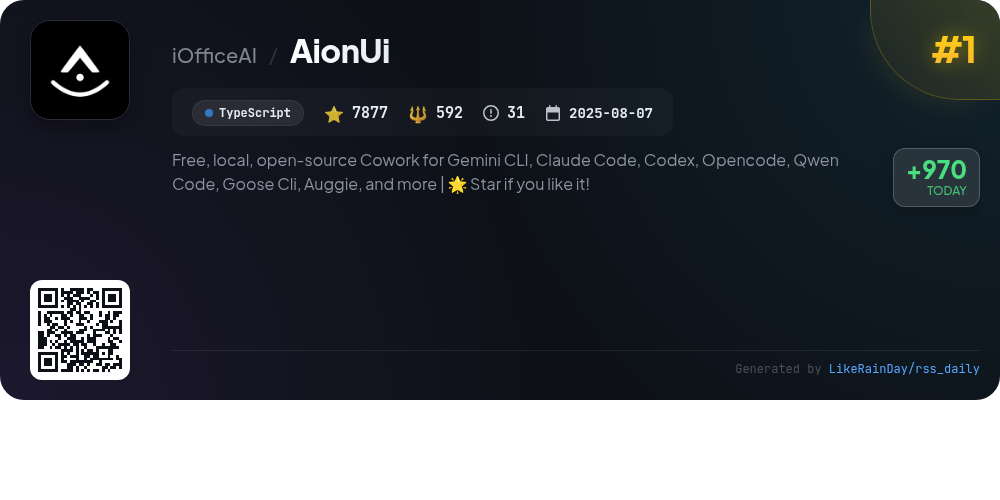
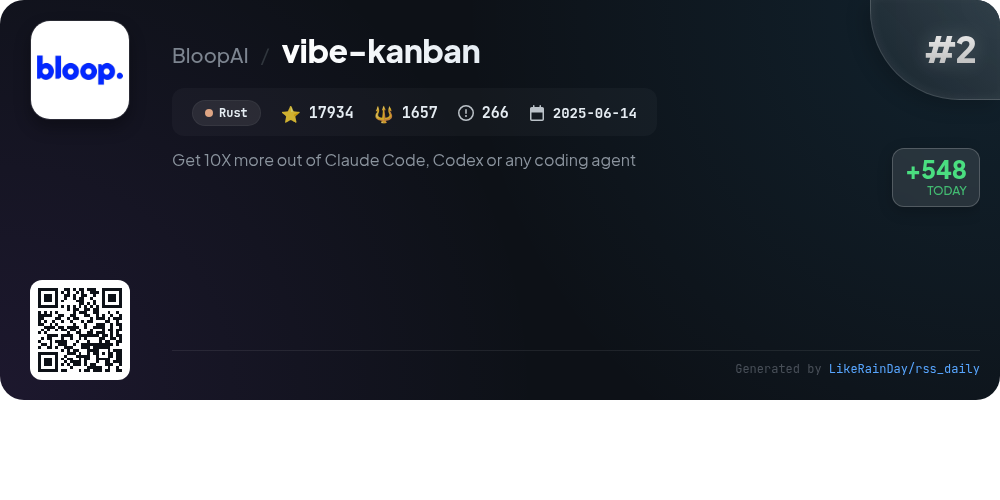
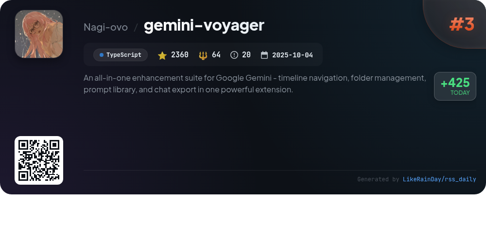
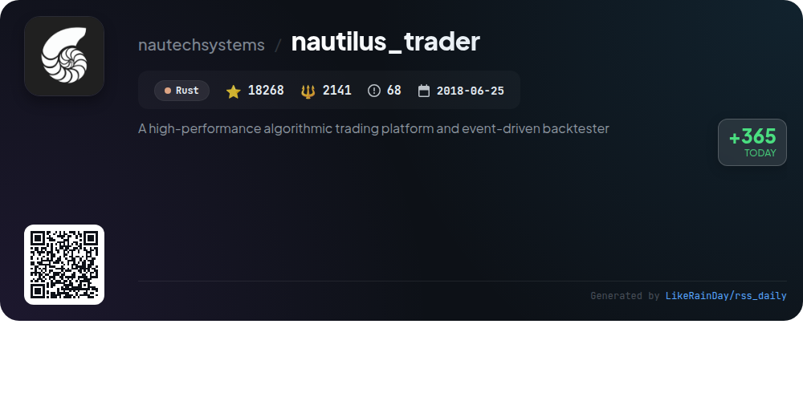
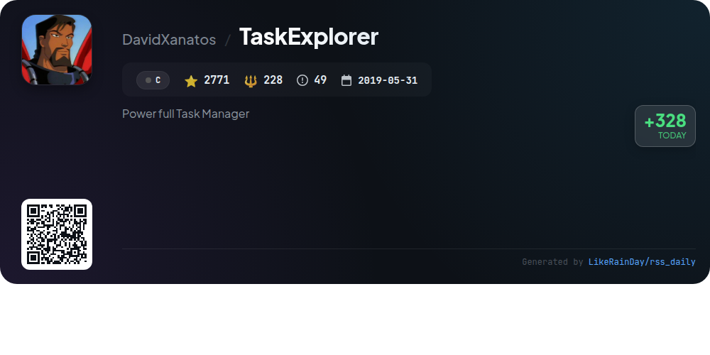
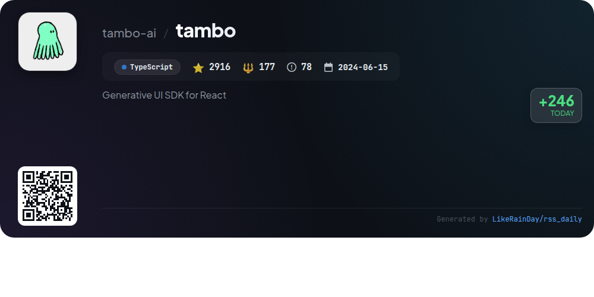
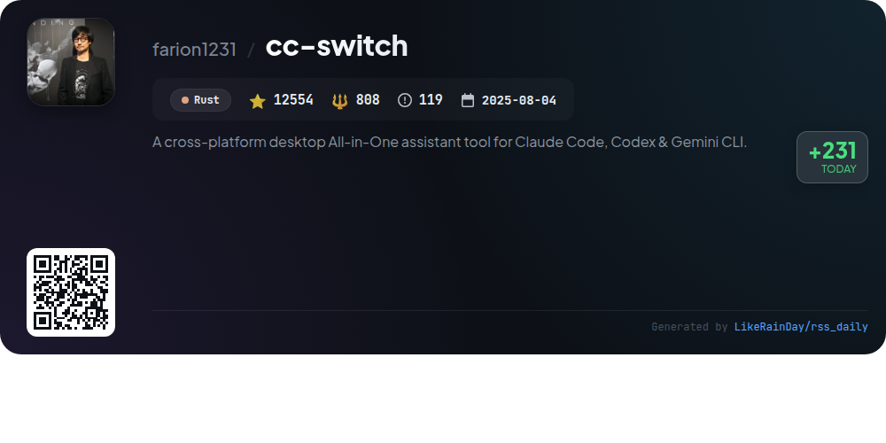
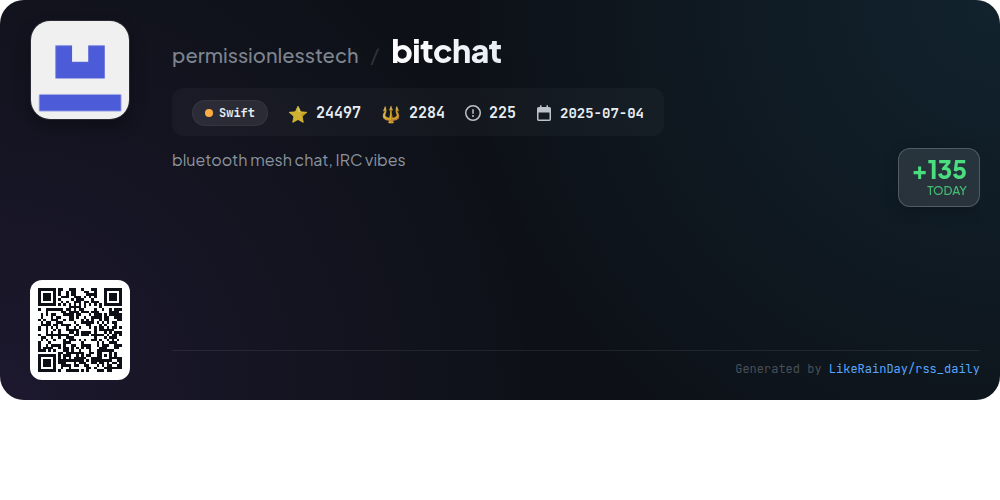
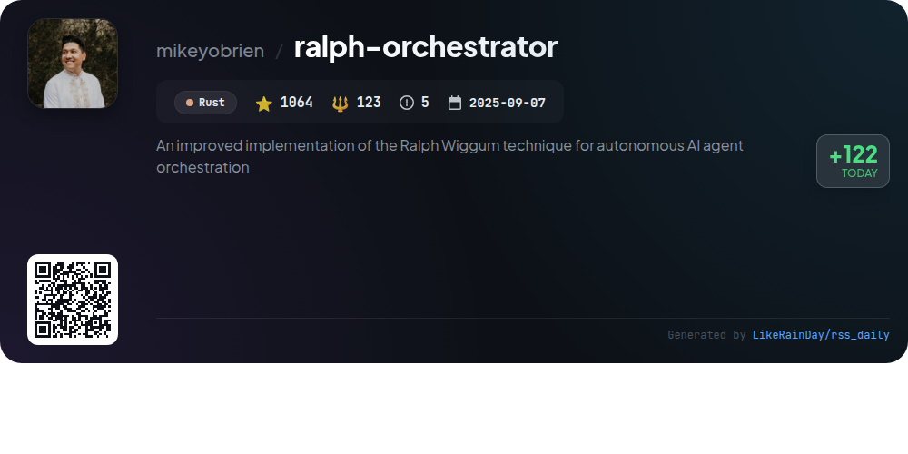
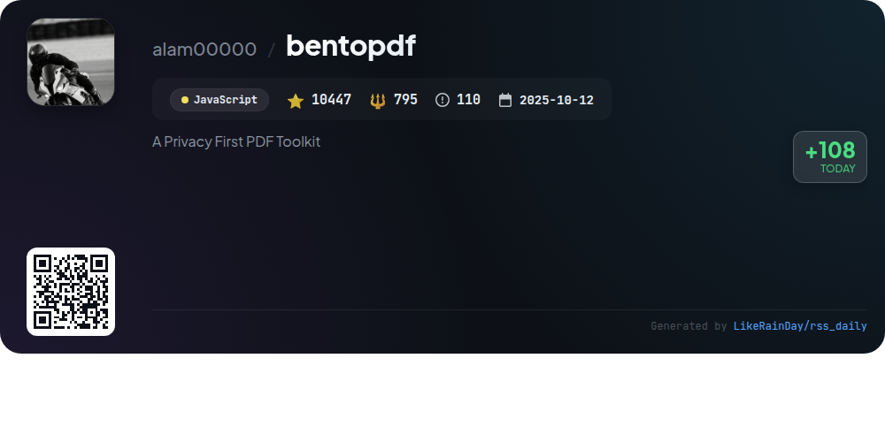

# 📊 🌟 GitHub Trending Daily - 2026-01-21

> > 📅 每日精选 GitHub 热门仓库 | 基于智能算法推荐

## 📋 Overview

**10** 个项目 | **100688** ⭐ | **8869** 🍴

**热门语言:** `Rust` (4) · `TypeScript` (3) · `JavaScript` (1)

**更新时间:** 2026-01-21 02:22 UTC

**分类分布:**

- 🌟 每日 Top 10 精选 (10 项)

---

## 🌟 每日 Top 10 精选

### 1. [AionUi](https://github.com/iOfficeAI/AionUi)

> 🤖 **推荐理由**  
> *AionUi is a free, open-source coworking platform for command-line AI tools like Gemini CLI, Claude Code, and Codex. With 7,877 stars on GitHub, it features a unified graphical interface, multi-model support, and local data security. Key highlights include multi-session chat with independent context, smart file management, real-time preview for 9+ formats, and AI image generation. AionUi is cross-platform, compatible with macOS, Windows, and Linux, and supports remote access via WebUI, making it an ideal choice for enhancing AI productivity and collaboration.*

- ⭐ 7877 stars
- 💻 TypeScript
- 📅 Updated: 2026-01-21

### 2. [vibe-kanban](https://github.com/BloopAI/vibe-kanban)

> 🤖 **推荐理由**  
> *Vibe Kanban is an innovative tool designed to enhance productivity with AI coding agents like Claude Code and Codex. It allows seamless switching and orchestration of multiple agents, enabling parallel or sequential execution. Key features include task status tracking, centralized configuration management, and remote project access via SSH. With over 17,934 stars on GitHub, Vibe Kanban streamlines the development workflow, making it easier to manage coding tasks efficiently. For installation and documentation, visit [vibekanban.com](https://vibekanban.com).*

- ⭐ 17934 stars
- 💻 Rust
- 📅 Updated: 2026-01-21

### 3. [gemini-voyager](https://github.com/Nagi-ovo/gemini-voyager)

> 🤖 **推荐理由**  
> *An all-in-one enhancement suite for Google Gemini - timeline navigation, folder management, prompt library, and chat export in one powerful extension.. popular project, recently updated*

- ⭐ 2360 stars
- 🍴 64 forks
- 💻 TypeScript
- 📅 Updated: 2026-01-21

### 4. [nautilus_trader](https://github.com/nautechsystems/nautilus_trader)

> 🤖 **推荐理由**  
> *NautilusTrader is a high-performance, open-source algorithmic trading platform built in Rust, with a focus on safety and speed. It enables quantitative traders to backtest and deploy automated trading strategies seamlessly in a Python-native environment. Key features include an event-driven architecture, support for diverse asset classes, advanced order types, and multi-venue capabilities for high-frequency trading. The platform integrates with various APIs, offers customizable components, and is designed for both backtesting and live trading, ensuring consistency and reduced operational risk.*

- ⭐ 18268 stars
- 💻 Rust
- 📅 Updated: 2026-01-21

### 5. [TaskExplorer](https://github.com/DavidXanatos/TaskExplorer)

> 🤖 **推荐理由**  
> *TaskExplorer is a powerful task management tool designed to provide in-depth insights into running applications. It features a streamlined interface that displays real-time data on processes, memory, threads, and handles in accessible panels. Key functionalities include a detailed Thread Panel for diagnosing issues, a Memory Panel for editing process memory, and a Socket Panel for monitoring network connections. Users can also view system resource usage with performance graphs. Built on the Qt Framework, TaskExplorer is compatible with Windows 7 and higher, with plans for a Linux version.*

- ⭐ 2771 stars
- 💻 C
- 📅 Updated: 2026-01-21

### 6. [tambo](https://github.com/tambo-ai/tambo)

> 🤖 **推荐理由**  
> *Tambo is a generative UI SDK for React, enabling developers to create adaptive applications that respond to user needs through natural language interactions. Key features include AI-driven component selection, support for generative and interactable components, and seamless integration with various LLM providers. Tambo offers both a free cloud backend and self-hosting options, along with built-in MCP integrations for enhanced functionality. Developers can leverage a pre-built component library and customizable templates to expedite app development while ensuring a tailored user experience.*

- ⭐ 2916 stars
- 💻 TypeScript
- 📅 Updated: 2026-01-21

### 7. [cc-switch](https://github.com/farion1231/cc-switch)

> 🤖 **推荐理由**  
> *cc-switch is a cross-platform desktop assistant tool designed for managing Claude Code, Codex, and Gemini CLI interfaces. Built with Rust and Tauri, it offers seamless provider management, skills and prompts systems, and MCP server management. Key features include a dual-layer architecture for data persistence, auto-launch on startup, multi-language support, and an intuitive UI with enhanced visual hierarchy. With over 12,500 stars, it supports Windows, macOS, and Linux, and integrates with multiple API relay services for optimal coding experiences.*

- ⭐ 12554 stars
- 💻 Rust
- 📅 Updated: 2026-01-21

### 8. [bitchat](https://github.com/permissionlesstech/bitchat)

> 🤖 **推荐理由**  
> *bitchat is a decentralized peer-to-peer messaging app utilizing a dual transport architecture, combining Bluetooth mesh networks for offline communication and the Nostr protocol for global connectivity. Key features include intelligent message routing, location-based channels, end-to-end encryption, and an IRC-style command interface. The app prioritizes privacy with no accounts or phone numbers, and offers a universal experience for both iOS and macOS. It's designed for situations like protests and emergencies, functioning without internet access while maintaining robust features for global chat.*

- ⭐ 24497 stars
- 💻 Swift
- 📅 Updated: 2026-01-21

### 9. [ralph-orchestrator](https://github.com/mikeyobrien/ralph-orchestrator)

> 🤖 **推荐理由**  
> *Ralph Orchestrator is a Rust-based orchestration framework designed for autonomous AI agent task completion using the Ralph Wiggum technique. Key features include two operation modes (Traditional for simple loops and Hat-Based for structured workflows with specialized personas), multi-backend support (e.g., Claude Code, Kiro), an event-driven coordination model, and over 20 pre-configured workflow presets. Additional highlights are an interactive TUI for real-time monitoring and session recording for debugging. Ralph Orchestrator is actively developed and aims to streamline complex automation tasks.*

- ⭐ 1064 stars
- 💻 Rust
- 📅 Updated: 2026-01-21

### 10. [bentopdf](https://github.com/alam00000/bentopdf)

> 🤖 **推荐理由**  
> *BentoPDF is a privacy-first, client-side PDF toolkit that allows users to manipulate, edit, merge, and process PDF files directly in the browser without server-side processing. Key features include merging, splitting, and organizing PDFs, as well as converting various formats to and from PDF. The toolkit supports over 50 tools and is fully self-hostable via Docker or static hosting. With a focus on security and performance, BentoPDF offers a dual licensing model: a free AGPL option and a commercial license for proprietary use.*

- ⭐ 10447 stars
- 💻 JavaScript
- 📅 Updated: 2026-01-21

---

## 📡 RSS订阅

通过 RSS 订阅，第一时间获取每日精选项目：

- 🔔 [RSS 订阅源] (../../daily-top.xml)
- 🔔 [每日简报] (../../GITHUB_TODAY_CN.md)
- 🔔 [每日 Top 10 精选](../../daily-top.xml)

---

*⚡ Powered by Smart Trending Algorithm | Generated at 2026-01-21 02:22:26 UTC
