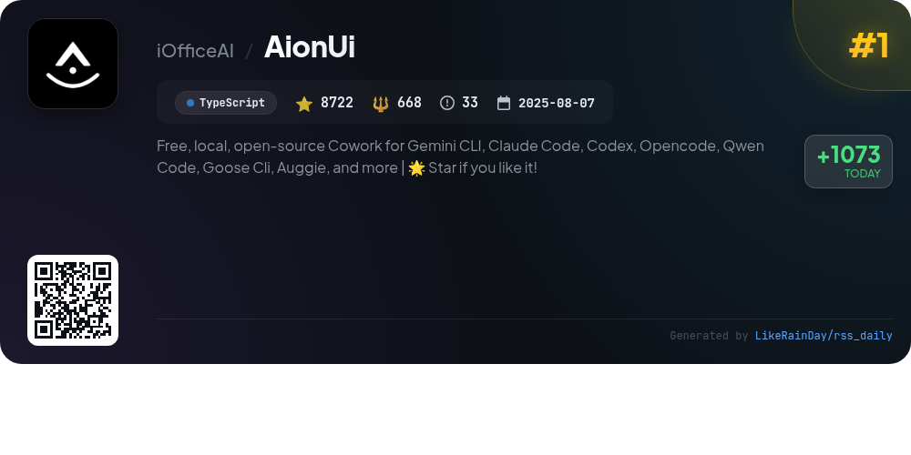
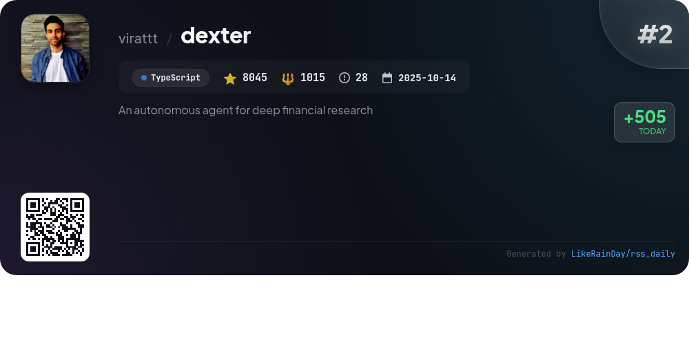
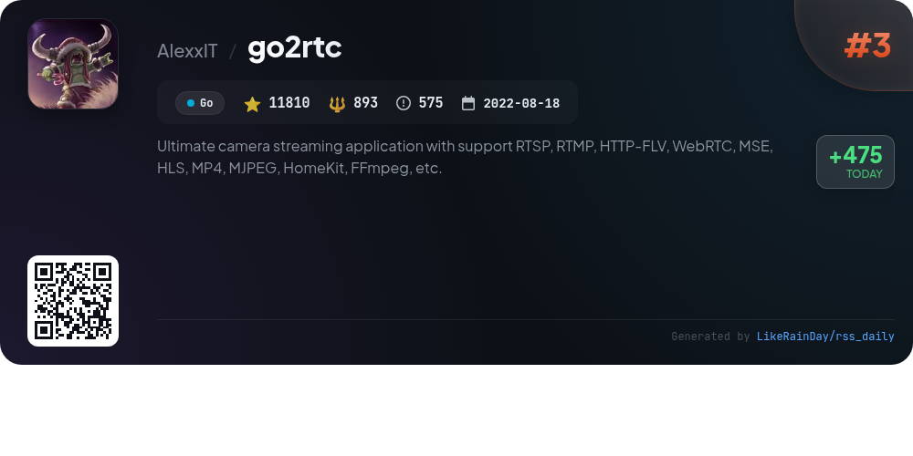
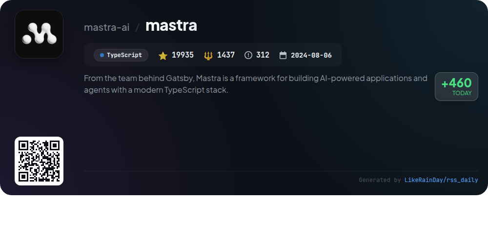
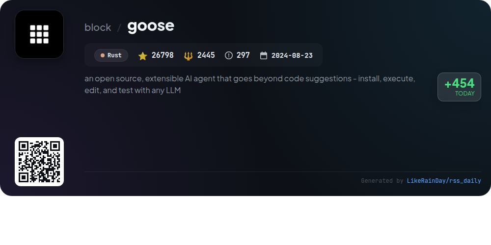
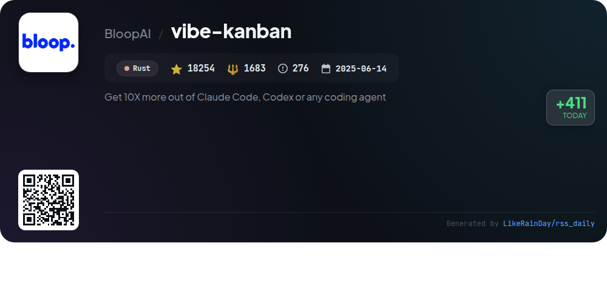
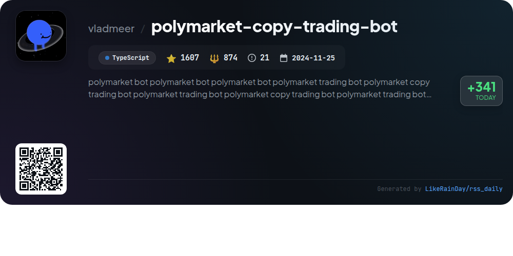
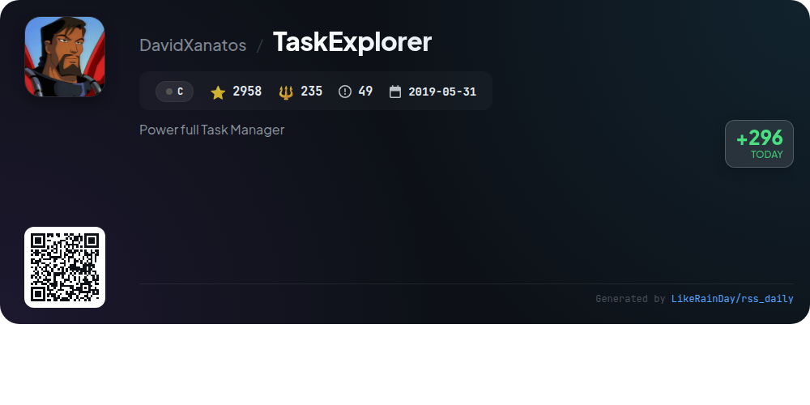
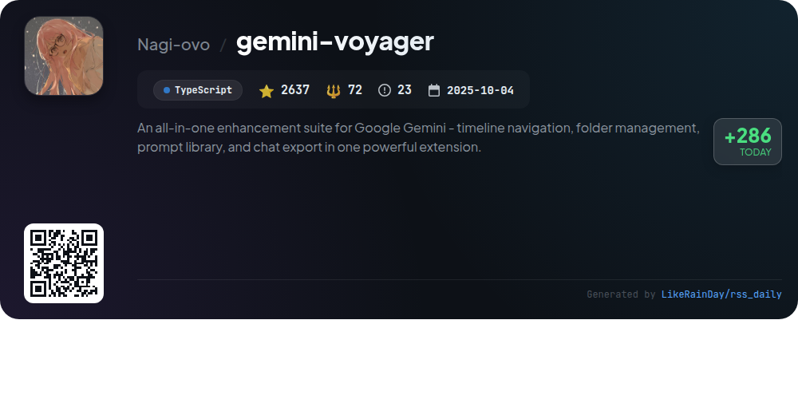
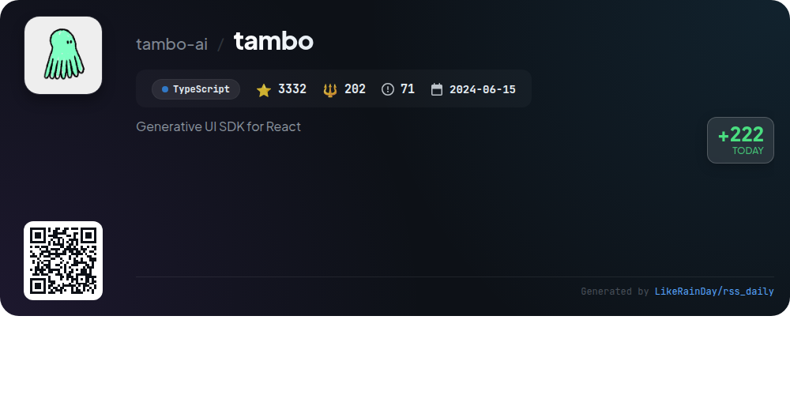

# 📊 🌟 GitHub Trending Daily - 2026-01-22

> > 📅 Daily Picks of GitHub Trending Repositories | Powered by Smart Algorithms

## 📋 Overview

**10** Projects | **104098** ⭐ | **9524** 🍴

**Top Languages:** `TypeScript` (6) · `Rust` (2) · `Go` (1)

**Updated:** 2026-01-22 02:22 UTC

**Categories:**

- 🌟 Daily Top 10 (10 items)

---

## 🌟 Daily Top 10

### 1. [AionUi](https://github.com/iOfficeAI/AionUi)

> 🤖 **Why Recommend**  
> *AionUi is an open-source, cross-platform coworking tool designed for seamless interaction with command-line AI agents like Gemini CLI, Claude Code, and Codex. Key features include a unified graphical interface, multi-agent support, local data security, and smart file management. Users can engage in multiple independent sessions, utilize real-time previews for various file formats, and access the platform remotely via WebUI. AionUi is free to use and enhances productivity by simplifying AI workflows and automating tasks, making it an ideal choice for users seeking efficient AI collaboration.*

- ⭐ 8722 stars
- 💻 TypeScript
- 📅 Updated: 2026-01-22

### 2. [dexter](https://github.com/virattt/dexter)

> 🤖 **Why Recommend**  
> *Dexter is an autonomous financial research agent designed to analyze complex financial queries through intelligent task planning and real-time market data. Key features include automated decomposition of tasks, self-execution using various financial data tools, and self-validation to refine results for confidence in outputs. It accesses critical financial statements and incorporates safety features like loop detection. Built with TypeScript, Dexter requires a Bun runtime and API keys for optimal performance. With over 8,000 stars, it's a powerful tool for deep financial analysis.*

- ⭐ 8045 stars
- 💻 TypeScript
- 📅 Updated: 2026-01-22

### 3. [go2rtc](https://github.com/AlexxIT/go2rtc)

> 🤖 **Why Recommend**  
> *go2rtc is a powerful camera streaming application built in Go, supporting protocols like RTSP, WebRTC, HTTP-FLV, and more. With over 11,800 stars, it offers zero-dependency, low-latency streaming from various sources, including USB cameras and HomeKit devices. Key features include on-the-fly transcoding via FFmpeg, multi-source codec negotiation for two-way audio, and integration capabilities with smart home platforms. Users can publish streams to popular services like YouTube and Telegram, making go2rtc a versatile solution for real-time video applications.*

- ⭐ 11810 stars
- 💻 Go
- 📅 Updated: 2026-01-22

### 4. [mastra](https://github.com/mastra-ai/mastra)

> 🤖 **Why Recommend**  
> *Mastra is a powerful framework for building AI-powered applications and agents using a modern TypeScript stack. Key features include model routing for 40+ providers, autonomous agent creation for complex tasks, and a graph-based workflow engine for orchestrating multi-step processes. Mastra also supports human-in-the-loop functionality, context management, and seamless integration with React and Node.js. With built-in observability and evaluation tools, it facilitates the development of reliable AI products. Start your journey with easy setup and comprehensive documentation.*

- ⭐ 19935 stars
- 💻 TypeScript
- 📅 Updated: 2026-01-22

### 5. [goose](https://github.com/block/goose)

> 🤖 **Why Recommend**  
> *goose is an open-source AI agent designed to automate engineering tasks, enhancing developer productivity. Built in Rust, it offers capabilities beyond simple code suggestions, including project creation, code execution, debugging, and workflow orchestration. Compatible with any LLM and supporting multi-model configurations, goose integrates seamlessly with MCP servers. Available as a desktop app and CLI, it adapts to various workflows, making it ideal for prototyping and managing complex pipelines. Join the community on Discord and explore extensive documentation and tutorials.*

- ⭐ 26798 stars
- 💻 Rust
- 📅 Updated: 2026-01-22

### 6. [vibe-kanban](https://github.com/BloopAI/vibe-kanban)

> 🤖 **Why Recommend**  
> *Vibe Kanban is a powerful tool designed to enhance productivity by leveraging AI coding agents like Claude Code and Codex. Key features include seamless switching between agents, orchestration of parallel or sequential tasks, and centralized configuration management. Users can easily review work, track task statuses, and launch development servers. The platform supports remote project access via SSH and offers extensive documentation for setup and usage. With 18,254 stars on GitHub, Vibe Kanban is a valuable asset for developers aiming to streamline their coding workflows.*

- ⭐ 18254 stars
- 💻 Rust
- 📅 Updated: 2026-01-22

### 7. [polymarket-copy-trading-bot](https://github.com/vladmeer/polymarket-copy-trading-bot)

> 🤖 **Why Recommend**  
> *The Polymarket Copy Trading Bot is an automated trading solution that replicates the trades of top Polymarket performers in real-time. Key features include smart position sizing, multi-trader support, real-time execution, and performance tracking via MongoDB. The bot monitors trader activity continuously, executes orders based on calculated sizes, and provides integrated risk management. It supports multiple configurations for users and leverages APIs for efficient trade monitoring. An advanced version offers enhanced features like real-time data streaming and automated trade management.*

- ⭐ 1607 stars
- 💻 TypeScript
- 📅 Updated: 2026-01-22

### 8. [TaskExplorer](https://github.com/DavidXanatos/TaskExplorer)

> 🤖 **Why Recommend**  
> *TaskExplorer is a powerful task management tool that provides in-depth insights into running applications. With a user-friendly interface, it offers real-time data on processes without clutter. Key features include a Thread Panel for stack traces, a Memory Panel for editing process memory, and a Handles Panel for monitoring open handles. It also includes a Socket Panel for network connections and various performance monitoring tools. Built with the Qt Framework, it supports Windows 7 and above, with plans for a Linux version, making it a versatile choice for system performance optimization.*

- ⭐ 2958 stars
- 💻 C
- 📅 Updated: 2026-01-22

### 9. [gemini-voyager](https://github.com/Nagi-ovo/gemini-voyager)

> 🤖 **Why Recommend**  
> *An all-in-one enhancement suite for Google Gemini - timeline navigation, folder management, prompt library, and chat export in one powerful extension.. popular project, recently updated*

- ⭐ 2637 stars
- 🍴 72 forks
- 💻 TypeScript
- 📅 Updated: 2026-01-22

### 10. [tambo](https://github.com/tambo-ai/tambo)

> 🤖 **Why Recommend**  
> *Tambo is a generative UI SDK for React that enables developers to create adaptive applications using AI-driven components. With Tambo, components render dynamically based on user input, allowing both novice and experienced users to interact seamlessly. Core features include support for generative and interactable components, easy integrations with tools like Linear and Slack, and a choice between Tambo Cloud or self-hosted solutions. Developers can leverage existing templates, a pre-built component library, and local tool execution for enhanced functionality. Tambo supports multiple LLM providers and offers a free tier for users.*

- ⭐ 3332 stars
- 💻 TypeScript
- 📅 Updated: 2026-01-22

---

## 📡 RSS Subscription

Subscribe via RSS to get daily trending updates:

- 🔔 [RSS XML] (../../daily-top.xml)
- 🔔 [Daily Report] (../../GITHUB_TODAY.md)
- 🔔 [Daily Top 10](../../daily-top.xml)

---

*⚡ Powered by Smart Trending Algorithm | Generated at 2026-01-22 02:22:55 UTC
