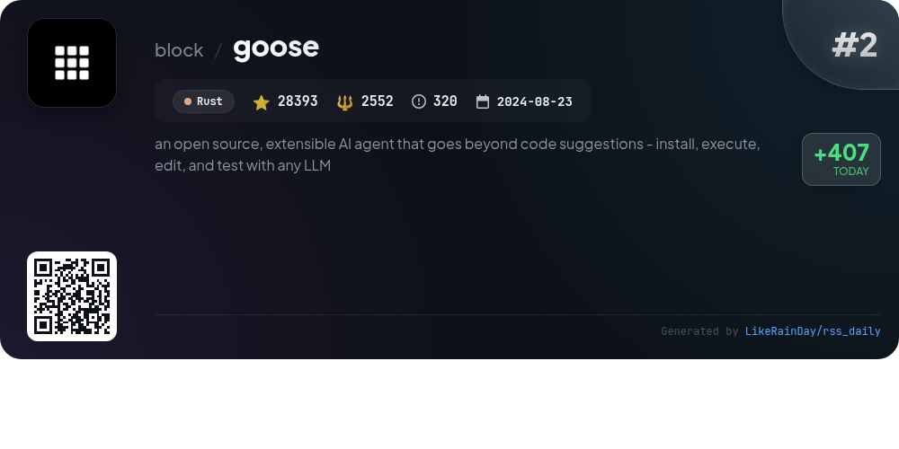
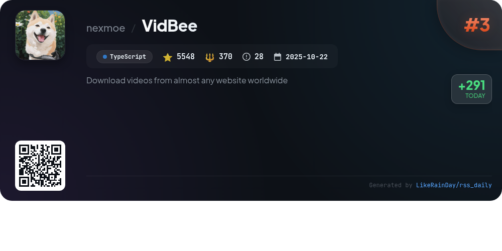
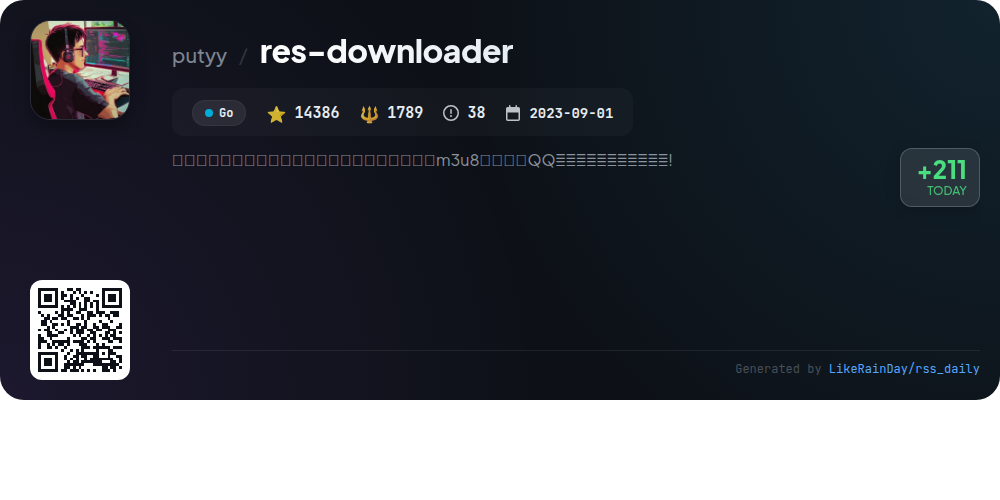
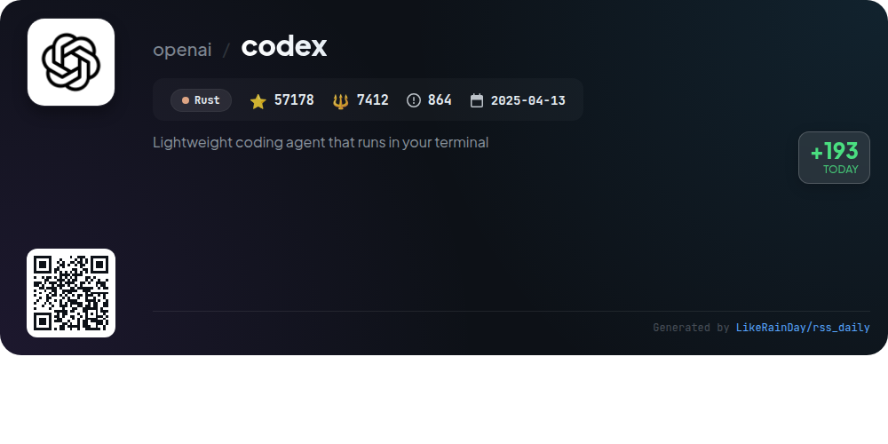
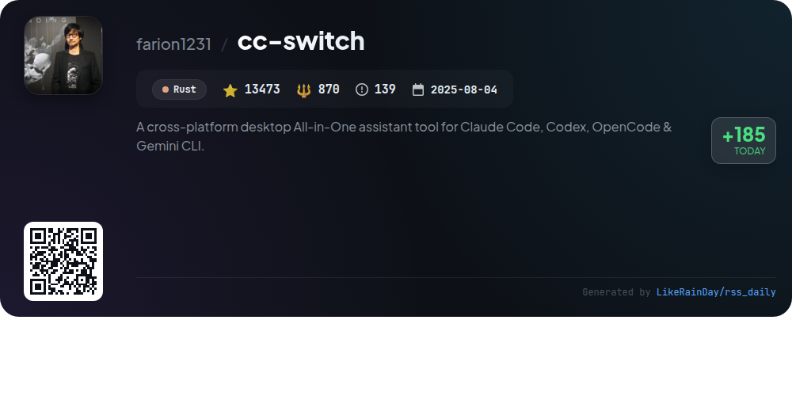
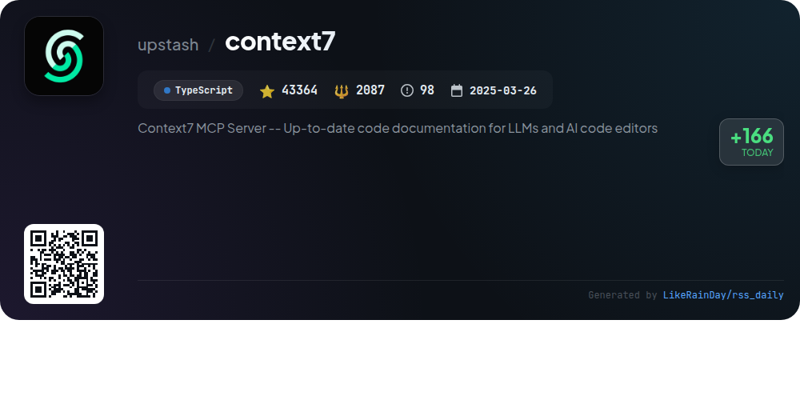
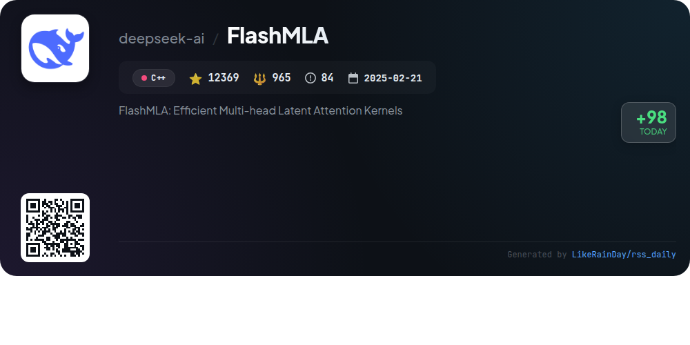
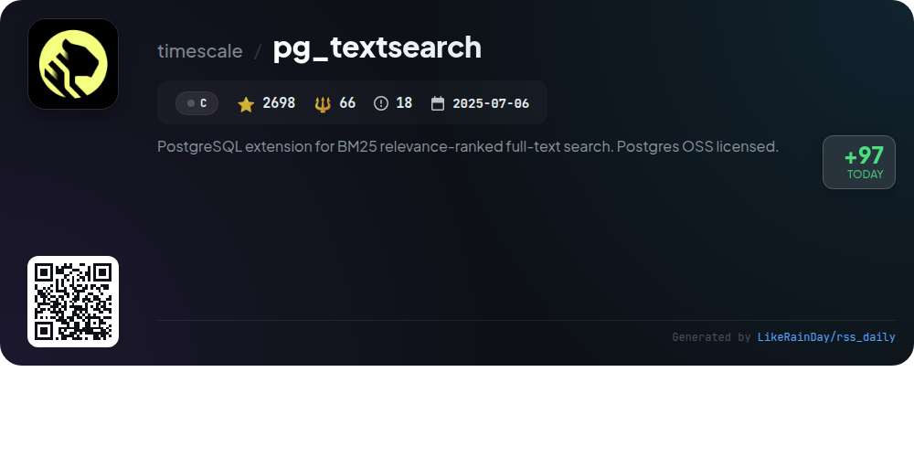

# 📊 🌟 GitHub Trending Daily - 2026-01-25

> > 📅 Daily Picks of GitHub Trending Repositories | Powered by Smart Algorithms

## 📋 Overview

**10** Projects | **225832** ⭐ | **20039** 🍴

**Top Languages:** `TypeScript` (3) · `Rust` (3) · `Go` (1)

**Updated:** 2026-01-25 02:29 UTC

**Categories:**

- 🌟 Daily Top 10 (10 items)

---

## 🌟 Daily Top 10

### 1. [remotion](https://github.com/remotion-dev/remotion)

> 🤖 **Why Recommend**  
> *Remotion is a powerful framework for programmatically creating videos using React, allowing developers to leverage web technologies like CSS, Canvas, and SVG. Key features include reusable components, fast refresh, and access to a rich package ecosystem. Users can harness programming logic for dynamic video creation, integrating APIs and algorithms for unique effects. Notable projects include "GitHub Unwrapped" and various showcase videos. With extensive documentation and a supportive community, Remotion empowers developers to innovate in video production. Get started easily with `npx create-video@latest`.*

- ⭐ 29598 stars
- 💻 TypeScript
- 📅 Updated: 2026-01-25

### 2. [goose](https://github.com/block/goose)

> 🤖 **Why Recommend**  
> *Goose is an open-source AI agent designed to automate complex engineering tasks. Beyond mere code suggestions, it can build, execute, and debug projects autonomously while interacting with external APIs. Its flexible architecture supports any LLM, optimizing for performance and cost. Available as both a desktop app and CLI, Goose seamlessly integrates with existing workflows, making it ideal for developers looking to enhance productivity. Key features include multi-model configuration, workflow orchestration, and comprehensive documentation and tutorials. Join the community on Discord and explore its capabilities!*

- ⭐ 28393 stars
- 💻 Rust
- 📅 Updated: 2026-01-25

### 3. [VidBee](https://github.com/nexmoe/VidBee)

> 🤖 **Why Recommend**  
> *VidBee is an open-source video downloader that enables users to download videos and audio from over 1000 websites globally, including popular platforms like YouTube, TikTok, and Instagram. Built with Electron and powered by yt-dlp, it features a modern, intuitive interface with one-click operations, real-time progress tracking, and comprehensive download queue management. A standout feature is the RSS auto-download, allowing users to automatically subscribe to feeds and download new content from favorite creators effortlessly. Join the vibrant open-source community and enhance your downloading experience with VidBee.*

- ⭐ 5548 stars
- 💻 TypeScript
- 📅 Updated: 2026-01-25

### 4. [res-downloader](https://github.com/putyy/res-downloader)

> 🤖 **Why Recommend**  
> *res-downloader is a cross-platform resource downloader built with Go and Wails, featuring a user-friendly interface. It supports a variety of media types including videos, audio, images, m3u8 streams, and live broadcasts. Compatible with platforms such as WeChat, Douyin, Kuaishou, and QQ Music, it offers proxy settings for accessing restricted content. Key highlights include easy installation, multi-platform support (Windows, macOS, Linux), and efficient resource management. The tool is designed for educational purposes and aims to simplify the resource downloading process for users.*

- ⭐ 14386 stars
- 💻 Go
- 📅 Updated: 2026-01-25

### 5. [codex](https://github.com/openai/codex)

> 🤖 **Why Recommend**  
> *Codex is a lightweight coding agent from OpenAI that operates directly in your terminal, built in Rust. With over 57,000 stars on GitHub, it allows seamless code generation and debugging. Users can install it globally using npm or Homebrew and run it with a simple command. Codex can also be integrated into popular IDEs like VS Code. For those using ChatGPT, signing in enhances its functionality as part of various subscription plans. Comprehensive documentation and community support are available, making it a valuable tool for developers.*

- ⭐ 57178 stars
- 💻 Rust
- 📅 Updated: 2026-01-25

### 6. [cc-switch](https://github.com/farion1231/cc-switch)

> 🤖 **Why Recommend**  
> *cc-switch is a cross-platform All-in-One assistant tool for Claude Code, Codex, and Gemini CLI, developed in Rust. With over 13,000 stars, it offers seamless provider management, skills and prompts management systems, and enhanced MCP server management. Key features include a dual-layer storage architecture, auto-launch on startup, and multi-language support (English, Chinese, Japanese). It integrates with various API relay services, providing users with fast, stable AI coding experiences. The application supports Windows, macOS, and Linux, ensuring broad accessibility for developers.*

- ⭐ 13473 stars
- 💻 Rust
- 📅 Updated: 2026-01-25

### 7. [context7](https://github.com/upstash/context7)

> 🤖 **Why Recommend**  
> *Context7 is an MCP Server designed to provide up-to-date code documentation for LLMs and AI code editors. With over 43,000 stars on GitHub, it ensures accurate, version-specific code examples directly in your prompts, eliminating outdated or hallucinated information. Core features include seamless integration with various IDEs, support for multiple languages, and tools to resolve library IDs and query documentation efficiently. Users can enhance their coding experience by adding rules for automatic context retrieval and leveraging OAuth for secure access.*

- ⭐ 43364 stars
- 💻 TypeScript
- 📅 Updated: 2026-01-25

### 8. [awesome-copilot](https://github.com/github/awesome-copilot)

> 🤖 **Why Recommend**  
> *Awesome Copilot is a community-driven repository that enhances GitHub Copilot functionality through a collection of custom agents, prompts, and instructions. With over 18,000 stars, it offers specialized tools across various programming languages and workflows, including curated collections for specific tasks, best practices, and coding standards. Key features include Awesome Agents for specific workflows, task-specific Awesome Prompts, and comprehensive coding guidelines. An MCP Server simplifies the installation and management of these resources, optimizing the Copilot experience for developers.*

- ⭐ 18825 stars
- 💻 JavaScript
- 📅 Updated: 2026-01-25

### 9. [FlashMLA](https://github.com/deepseek-ai/FlashMLA)

> 🤖 **Why Recommend**  
> *FlashMLA is a high-performance library of optimized attention kernels by DeepSeek, designed to enhance the efficiency of multi-head latent attention mechanisms. It features both sparse and dense attention kernels for prefill and decoding stages, achieving up to 660 TFlops on advanced GPU architectures. Key highlights include token-level sparse attention with FP8 KV caching and dense MHA operations. The library supports CUDA 12.8 and above, ensuring compatibility with modern deep learning frameworks like PyTorch 2.0. FlashMLA is instrumental for developers leveraging attention models in AI applications.*

- ⭐ 12369 stars
- 💻 C++
- 📅 Updated: 2026-01-25

### 10. [pg_textsearch](https://github.com/timescale/pg_textsearch)

> 🤖 **Why Recommend**  
> *PostgreSQL extension for BM25 relevance-ranked full-text search. Postgres OSS licensed.. popular project, recently updated*

- ⭐ 2698 stars
- 🍴 66 forks
- 💻 C
- 📅 Updated: 2026-01-25

---

## 📡 RSS Subscription

Subscribe via RSS to get daily trending updates:

- 🔔 [RSS XML] (../../daily-top.xml)
- 🔔 [Daily Report] (../../GITHUB_TODAY.md)
- 🔔 [Daily Top 10](../../daily-top.xml)

---

*⚡ Powered by Smart Trending Algorithm | Generated at 2026-01-25 02:29:59 UTC
