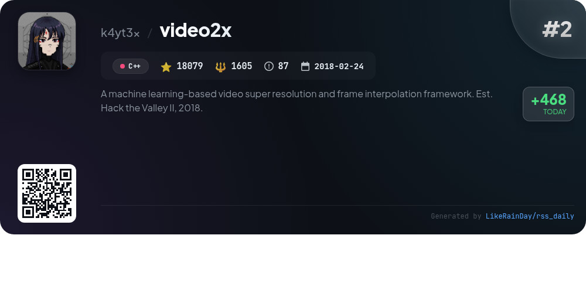
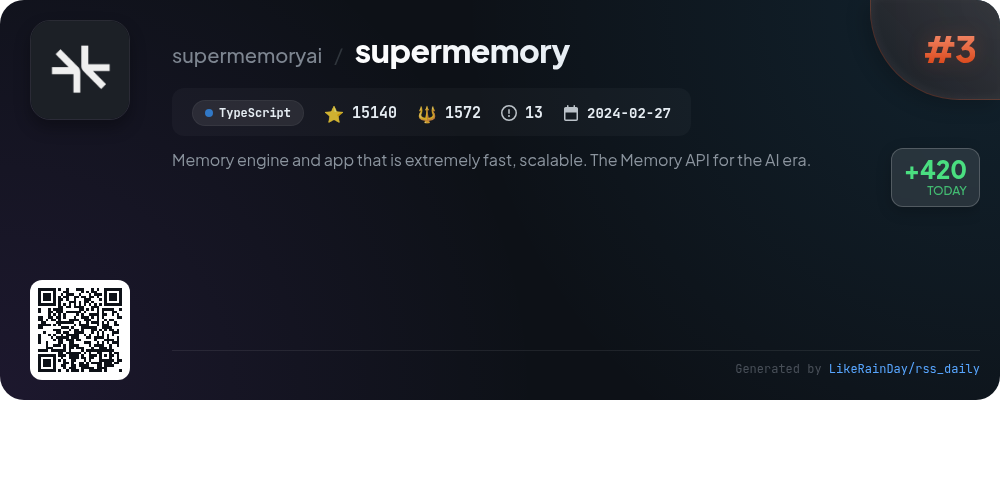
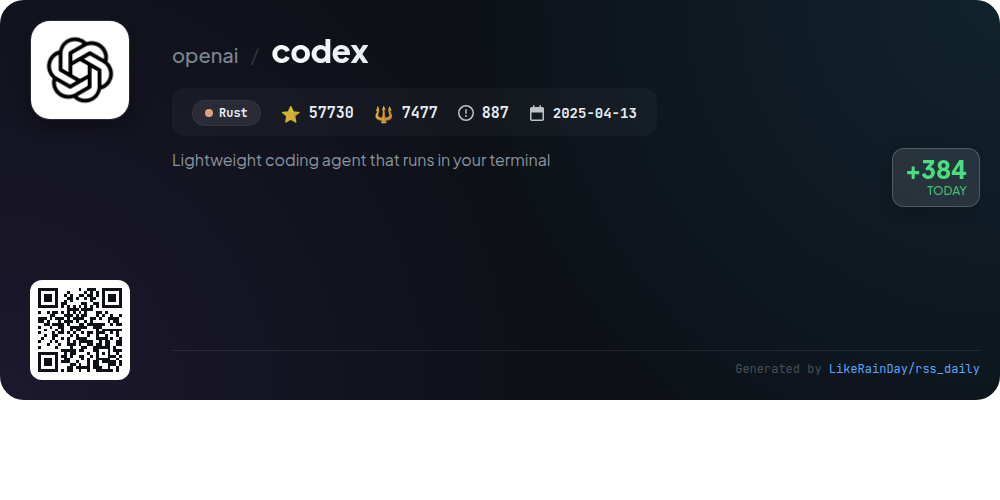
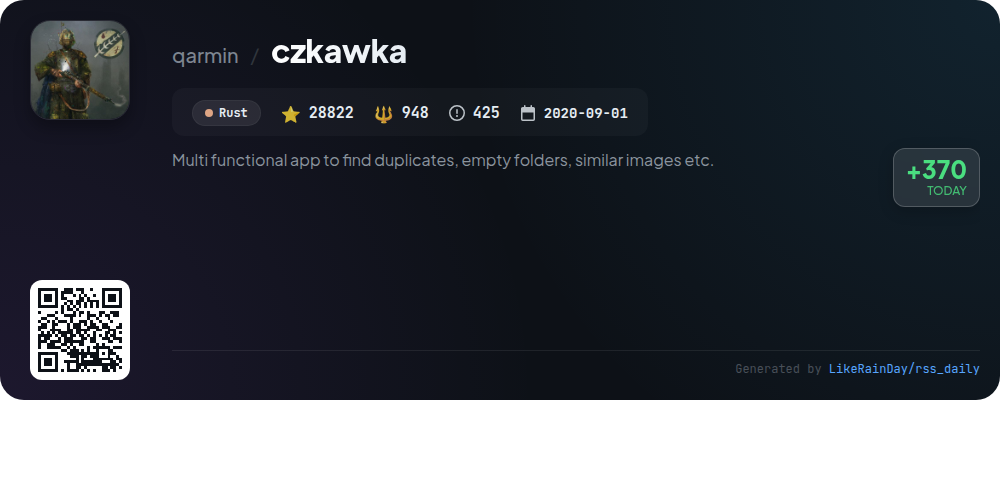
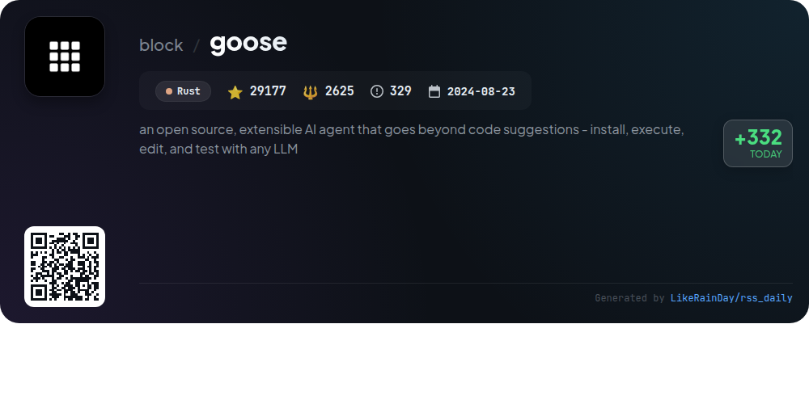
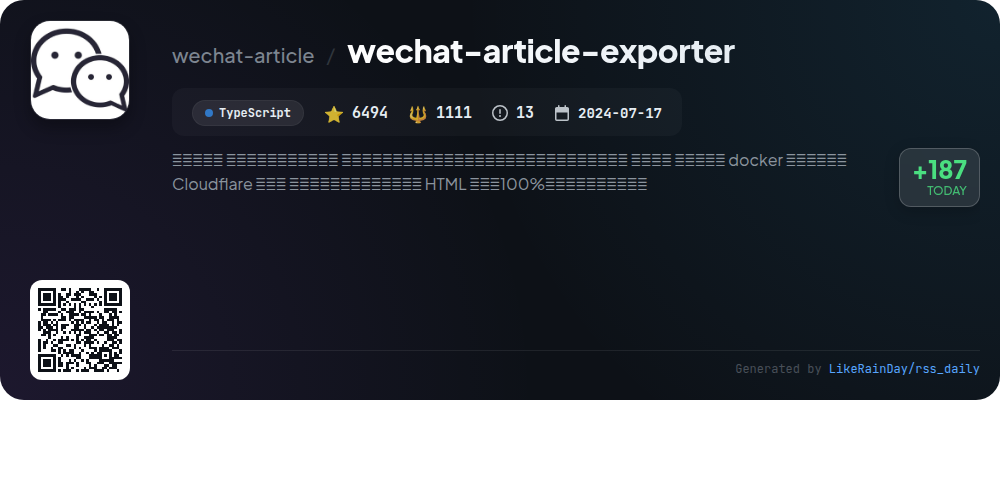
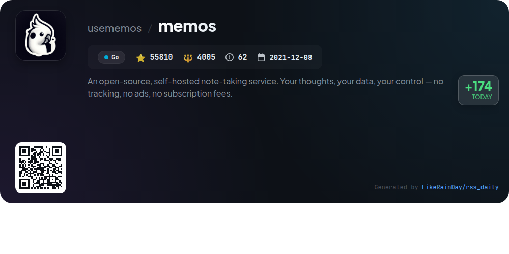
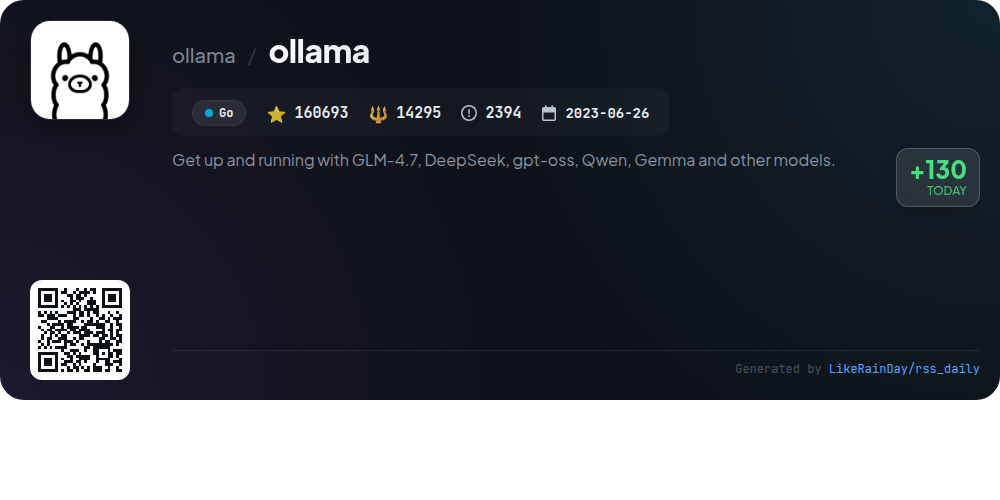
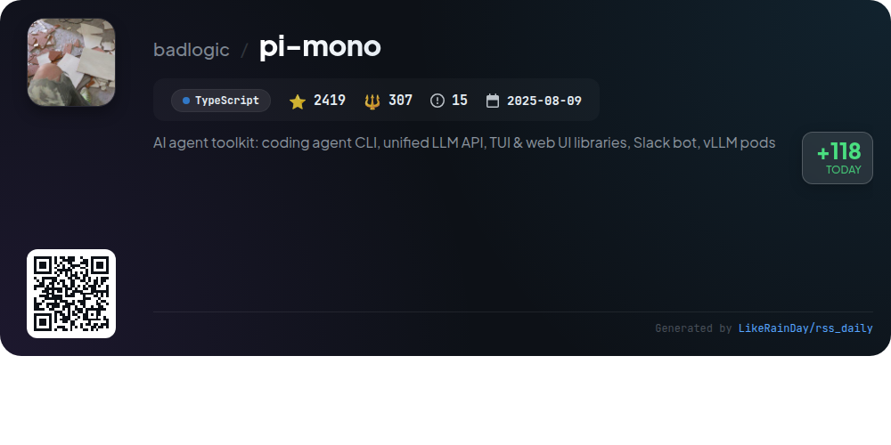

# 📊 🌟 GitHub Trending Daily - 2026-01-27

> > 📅 Daily Picks of GitHub Trending Repositories | Powered by Smart Algorithms

## 📋 Overview

**10** Projects | **406420** ⭐ | **35876** 🍴

**Top Languages:** `TypeScript` (4) · `Rust` (3) · `Go` (2)

**Updated:** 2026-01-27 02:25 UTC

**Categories:**

- 🌟 Daily Top 10 (10 items)

---

## 🌟 Daily Top 10

### 1. [remotion](https://github.com/remotion-dev/remotion)

> 🤖 **Why Recommend**  
> *Remotion is a powerful framework for creating videos programmatically using React, allowing developers to leverage web technologies like CSS, Canvas, and WebGL. It supports reusable components and programming concepts, enabling the creation of dynamic video content through code. With over 32,000 stars on GitHub, Remotion showcases projects like GitHub Unwrapped and personalized videos from Fireship. To get started, simply run `npx create-video@latest`. Comprehensive documentation and API references are available at remotion.dev. Note: a special license may be required for commercial use.*

- ⭐ 32056 stars
- 💻 TypeScript
- 📅 Updated: 2026-01-27

### 2. [video2x](https://github.com/k4yt3x/video2x)

> 🤖 **Why Recommend**  
> *Video2X is a machine learning-based framework for video super resolution and frame interpolation, originally established at Hack the Valley II in 2018. With over 18,000 stars, it features a complete C/C++ rewrite in version 6.0.0, offering enhanced speed, cross-platform support for Windows and Linux, and vastly improved output quality using advanced models like Anime4K v4 and Real-ESRGAN. The project supports both upscaling and frame interpolation, provides a user-friendly GUI for Windows, and includes Docker images for easy deployment. Comprehensive documentation and a Google Colab option enable accessibility for all users.*

- ⭐ 18079 stars
- 💻 C++
- 📅 Updated: 2026-01-27

### 3. [supermemory](https://github.com/supermemoryai/supermemory)

> 🤖 **Why Recommend**  
> *Supermemory is a fast, scalable memory engine and app designed for the AI era, allowing users to save and organize crucial information effortlessly. Key features include adding memories from various sources (URLs, PDFs, plain text), interacting with stored content via natural language chat, and seamless integration with major AI tools through Supermemory MCP. The platform provides a browser extension for quick memory saving and a Raycast extension for efficient memory management. Developers can access APIs and self-host options, making it ideal for personal and enterprise use.*

- ⭐ 15140 stars
- 💻 TypeScript
- 📅 Updated: 2026-01-27

### 4. [codex](https://github.com/openai/codex)

> 🤖 **Why Recommend**  
> *Codex is a lightweight coding agent by OpenAI that runs locally in your terminal, offering seamless integration with various IDEs like VS Code. With over 57,700 stars on GitHub, it supports installation via npm or Homebrew and provides an intuitive CLI experience. Users can connect Codex to their ChatGPT accounts for enhanced functionality, making it a versatile tool for developers. Key features include local execution, cloud-based options, and comprehensive documentation for installation and usage. Codex is licensed under the Apache-2.0 License.*

- ⭐ 57730 stars
- 💻 Rust
- 📅 Updated: 2026-01-27

### 5. [czkawka](https://github.com/qarmin/czkawka)

> 🤖 **Why Recommend**  
> *Czkawka is a highly efficient, multi-functional application written in Rust, designed to help users find and remove unnecessary files, such as duplicates, empty folders, and similar images. With a modern GUI through Krokiet and a GTK 4 frontend, it operates across multiple platforms, including Linux, Windows, and macOS. Key features include advanced duplicate detection, cache support for faster scans, and tools for identifying big files, broken files, and similar media. Czkawka is open-source, ad-free, and prioritizes user privacy, making it a reliable choice for file management.*

- ⭐ 28822 stars
- 💻 Rust
- 📅 Updated: 2026-01-27

### 6. [goose](https://github.com/block/goose)

> 🤖 **Why Recommend**  
> *Goose is an open-source AI agent designed to automate complex engineering tasks. Built in Rust, it transcends code suggestions, enabling users to build, execute, debug, and manage projects autonomously. Compatible with any LLM, Goose supports multi-model configurations for optimized performance and integrates seamlessly with MCP servers. Available as both a desktop app and CLI, it enhances developer workflows, allowing for rapid prototyping and innovation. Key features include extensive documentation, tutorials, and community support via Discord and other platforms.*

- ⭐ 29177 stars
- 💻 Rust
- 📅 Updated: 2026-01-27

### 7. [wechat-article-exporter](https://github.com/wechat-article/wechat-article-exporter)

> 🤖 **Why Recommend**  
> *wechat-article-exporter is an online tool for batch downloading WeChat public account articles, allowing users to export reading and comment data without any setup. Key features include support for multiple file formats (HTML, JSON, Excel, etc.), ensuring 100% preservation of article layout in HTML, and caching to minimize API requests. It offers article filtering, collection downloads, and exports data like comments and views. The project supports Docker and Cloudflare deployment, and provides an open API. With over 6,494 stars, it is a valuable resource for WeChat content management.*

- ⭐ 6494 stars
- 💻 TypeScript
- 📅 Updated: 2026-01-27

### 8. [memos](https://github.com/usememos/memos)

> 🤖 **Why Recommend**  
> *Memos is an open-source, self-hosted note-taking service that emphasizes privacy and user control. Built with Go and React, it offers fast performance without tracking or ads. Key features include full markdown support, complete data ownership, simple Docker deployment, and extensive REST and gRPC APIs for integration. Users can easily customize and scale their experience, with no subscription fees. Memos is ideal for personal notes, team wikis, and knowledge management, ensuring your data remains secure on your own infrastructure. Try the live demo or check the documentation for more information.*

- ⭐ 55810 stars
- 💻 Go
- 📅 Updated: 2026-01-27

### 9. [ollama](https://github.com/ollama/ollama)

> 🤖 **Why Recommend**  
> *Ollama is a powerful framework for running large language models like GLM-4.7, DeepSeek, gpt-oss, and more, designed for easy local deployment on macOS, Windows, and Linux. It offers a wide library of models, customizable prompts, and a REST API for seamless integration. Key features include model creation with Modelfiles, support for GGUF and Safetensors imports, and community-driven extensions. With over 160,000 stars on GitHub, Ollama facilitates rapid development in AI, catering to both developers and researchers.*

- ⭐ 160693 stars
- 💻 Go
- 📅 Updated: 2026-01-27

### 10. [pi-mono](https://github.com/badlogic/pi-mono)

> 🤖 **Why Recommend**  
> *Pi Mono is an AI agent toolkit focused on building and managing LLM deployments. It features a unified multi-provider LLM API, an interactive coding agent CLI, and tools for both terminal and web UI integration. Key components include the Slack bot for message delegation, vLLM pod management CLI, and comprehensive state management for agents. With over 2,419 stars on GitHub, Pi Mono supports seamless AI interactions and development, making it a valuable resource for developers and organizations looking to leverage AI technologies effectively.*

- ⭐ 2419 stars
- 💻 TypeScript
- 📅 Updated: 2026-01-27

---

## 📡 RSS Subscription

Subscribe via RSS to get daily trending updates:

- 🔔 [RSS XML] (../../daily-top.xml)
- 🔔 [Daily Report] (../../GITHUB_TODAY.md)
- 🔔 [Daily Top 10](../../daily-top.xml)

---

*⚡ Powered by Smart Trending Algorithm | Generated at 2026-01-27 02:25:19 UTC
