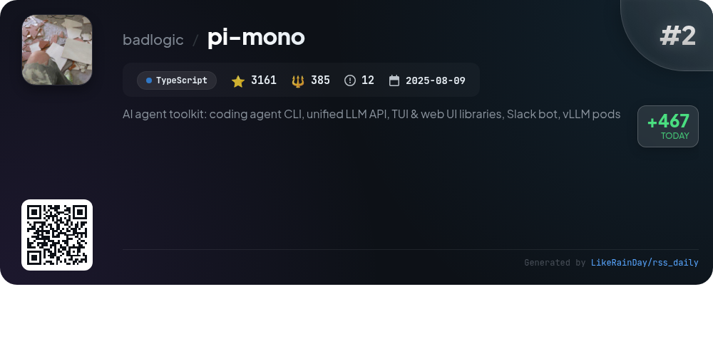
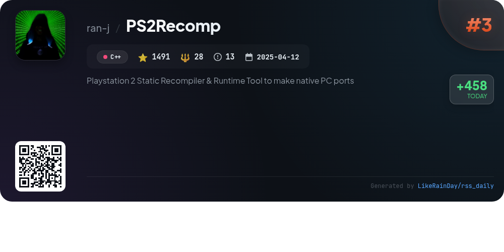
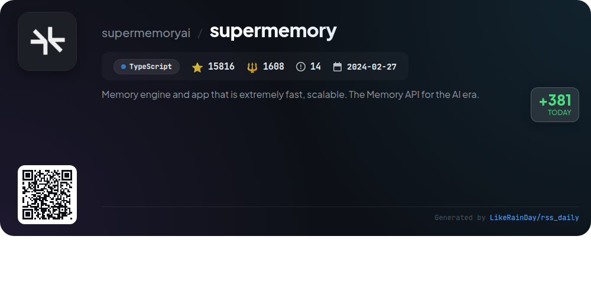
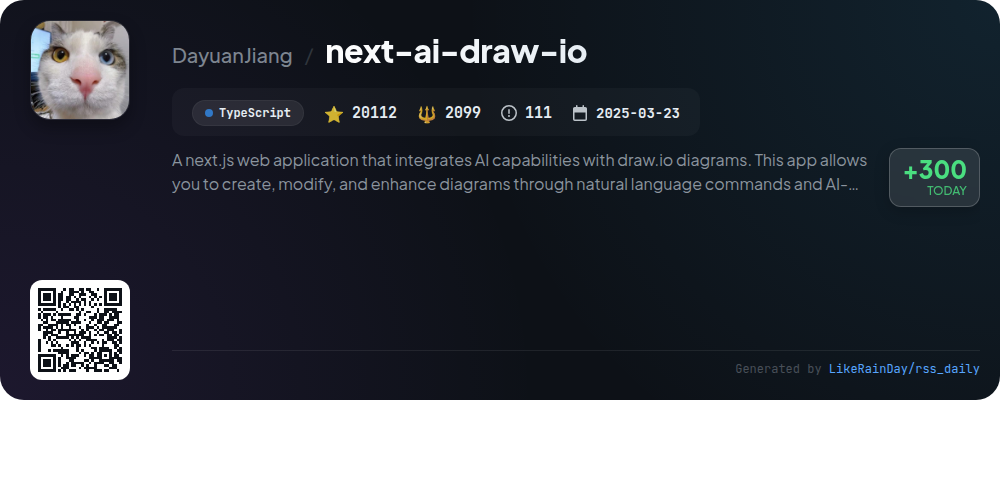
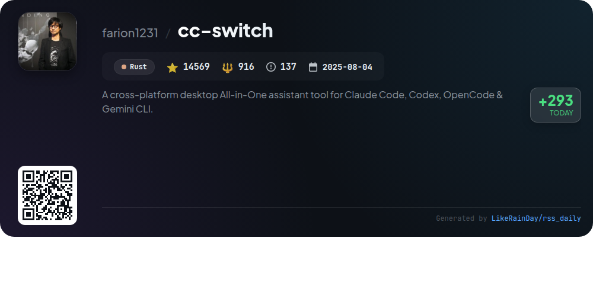
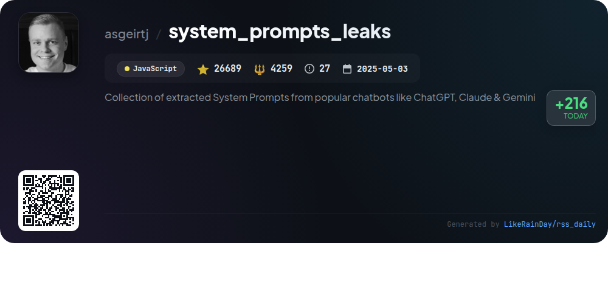
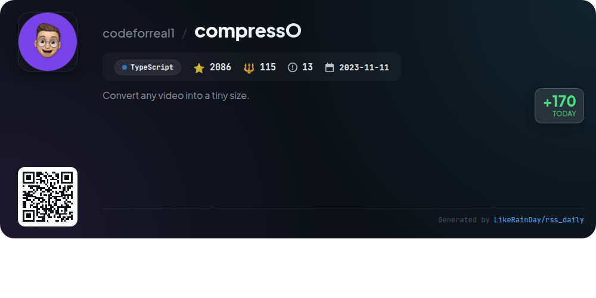
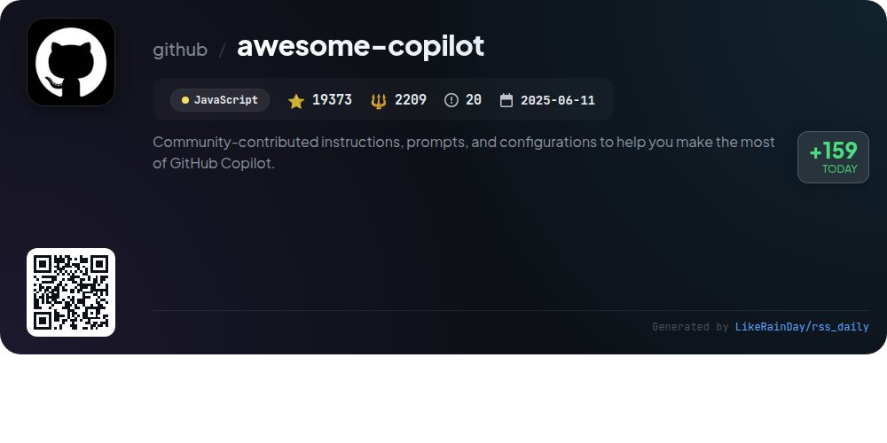

# 📊 🌟 GitHub Trending Daily - 2026-01-29

> > 📅 Daily Picks of GitHub Trending Repositories | Powered by Smart Algorithms

## 📋 Overview

**10** Projects | **227993** ⭐ | **28485** 🍴

**Top Languages:** `TypeScript` (5) · `JavaScript` (2) · `C++` (1)

**Updated:** 2026-01-29 02:37 UTC

**Categories:**

- 🌟 Daily Top 10 (10 items)

---

## 🌟 Daily Top 10

### 1. [moltbot](https://github.com/moltbot/moltbot)

> 🤖 **Why Recommend**  
> *Moltbot is a versatile personal AI assistant designed to operate across various platforms and messaging channels, including WhatsApp, Telegram, Discord, and more. With a local-first architecture, it ensures fast, always-on performance, customizable via an onboarding wizard. Key features include multi-channel support, voice interaction on macOS/iOS/Android, and an integrated live canvas for visual tasks. It supports various AI models, including OpenAI and Anthropic, enabling tailored responses. Ideal for users seeking a personal, secure, and powerful assistant experience.*

- ⭐ 90298 stars
- 💻 TypeScript
- 📅 Updated: 2026-01-29

### 2. [pi-mono](https://github.com/badlogic/pi-mono)

> 🤖 **Why Recommend**  
> *pi-mono is an AI agent toolkit featuring a coding agent CLI, unified LLM API, and libraries for TUI and web UI development. Key components include a multi-provider LLM API, an interactive coding agent CLI, a Slack bot for message delegation, and tools for managing vLLM deployments on GPU pods. With over 3,161 stars on GitHub, this TypeScript project facilitates building and deploying advanced AI agents, providing essential tools for developers and enhancing AI interactions through both terminal and web interfaces.*

- ⭐ 3161 stars
- 💻 TypeScript
- 📅 Updated: 2026-01-29

### 3. [PS2Recomp](https://github.com/ran-j/PS2Recomp)

> 🤖 **Why Recommend**  
> *PS2Recomp is an experimental static recompiler for PlayStation 2 ELF binaries, enabling native PC ports without traditional emulation. Key features include translating MIPS R5900 instructions to C++, support for 128-bit MMI instructions, and configurable output via TOML files. It parses ELF files, decodes instructions, and generates runnable C++ code with options for function stubbing and skipping. Users can create custom configurations for input files and patches. A basic runtime for memory management and system calls is provided, though support for some PS2 features remains limited.*

- ⭐ 1491 stars
- 💻 C++
- 📅 Updated: 2026-01-29

### 4. [supermemory](https://github.com/supermemoryai/supermemory)

> 🤖 **Why Recommend**  
> *Supermemory is a fast, scalable memory engine and app designed for the AI era, offering an intuitive platform for saving and organizing important information. Key features include the ability to add memories from various formats (URLs, PDFs, text), interact with stored content through natural language chat, and seamless integration with AI tools via Supermemory MCP. Users can enhance their experience with a browser extension for direct saving from web pages and a Raycast extension for quick access. The project encourages contributions and provides extensive documentation for developers.*

- ⭐ 15816 stars
- 💻 TypeScript
- 📅 Updated: 2026-01-29

### 5. [vault](https://github.com/hashicorp/vault)

> 🤖 **Why Recommend**  
> *Vault is a powerful tool for managing secrets, encryption, and privileged access. Key features include secure secret storage with encryption, dynamic secrets generation on-demand (e.g., AWS credentials), and comprehensive audit logging. Vault also offers lease management and automatic revocation of secrets, enhancing security. It supports various backend storage options and provides extensive documentation, tutorials, and certification exams for users. With over 34,000 stars on GitHub, Vault is widely recognized for its robust capabilities in security automation.*

- ⭐ 34398 stars
- 💻 Go
- 📅 Updated: 2026-01-29

### 6. [next-ai-draw-io](https://github.com/DayuanJiang/next-ai-draw-io)

> 🤖 **Why Recommend**  
> *Next AI Draw.io is a Next.js web application that enhances draw.io diagrams with AI capabilities. Users can create, modify, and visualize diagrams using natural language commands. Key features include LLM-powered diagram generation, image-based replication, PDF and text file uploads, and AI reasoning display. It supports cloud architecture diagrams for AWS, GCP, and Azure, and offers animated connectors for dynamic visuals. The app allows real-time interaction with AI and provides comprehensive version control. Multi-provider support ensures flexibility in AI usage.*

- ⭐ 20112 stars
- 💻 TypeScript
- 📅 Updated: 2026-01-29

### 7. [cc-switch](https://github.com/farion1231/cc-switch)

> 🤖 **Why Recommend**  
> *cc-switch is a powerful cross-platform desktop assistant tool built in Rust, supporting Claude Code, Codex, and Gemini CLI. With over 14,500 stars, it features a dual-layer architecture using SQLite and JSON for data management, enabling cloud sync functionality. Key highlights include a redesigned UI, skills and prompts management systems, and easy provider switching. The tool integrates multiple API configurations, offers speed testing, and supports multiple languages. It is backed by various sponsors, ensuring robust performance and reliability for developers.*

- ⭐ 14569 stars
- 💻 Rust
- 📅 Updated: 2026-01-29

### 8. [system_prompts_leaks](https://github.com/asgeirtj/system_prompts_leaks)

> 🤖 **Why Recommend**  
> *System Prompts Leaks is a JavaScript project that hosts a collection of extracted system prompts from popular chatbots, including ChatGPT, Claude, and Gemini. With 26,689 stars, it serves as a valuable resource for developers and researchers interested in understanding the internal dialogues of these AI systems. The project encourages community contributions through pull requests, fostering collaboration and expansion of the prompt collection. Key highlights include a comprehensive archive of system messages and a visual star history chart to track its popularity over time.*

- ⭐ 26689 stars
- 💻 JavaScript
- 📅 Updated: 2026-01-29

### 9. [compressO](https://github.com/codeforreal1/compressO)

> 🤖 **Why Recommend**  
> *CompressO is a free, open-source video compression app designed for Linux, Windows, and MacOS. Powered by FFmpeg, it allows users to convert videos into significantly smaller sizes while working entirely offline. Key features include drag-and-drop functionality, video muting, and a user-friendly interface. It’s built using Tauri and Vite, ensuring cross-platform compatibility. The app includes various installation options for different systems and offers ongoing updates, with future plans for batch compression. Available under the AGPL 3.0 License.*

- ⭐ 2086 stars
- 💻 TypeScript
- 📅 Updated: 2026-01-29

### 10. [awesome-copilot](https://github.com/github/awesome-copilot)

> 🤖 **Why Recommend**  
> *Awesome Copilot is a community-driven repository offering custom instructions, prompts, and configurations to enhance your GitHub Copilot experience. Key features include specialized agents for various workflows, task-specific prompts for coding and documentation, coding standards instructions, and curated collections of resources. The MCP Server allows easy installation of these enhancements directly into your editor. With over 19,000 stars, it empowers developers to improve productivity, adopt best practices, and access expert-level guidance tailored to their needs. Contributions are welcomed to expand this collaborative resource.*

- ⭐ 19373 stars
- 💻 JavaScript
- 📅 Updated: 2026-01-29

---

## 📡 RSS Subscription

Subscribe via RSS to get daily trending updates:

- 🔔 [RSS XML] (../../daily-top.xml)
- 🔔 [Daily Report] (../../GITHUB_TODAY.md)
- 🔔 [Daily Top 10](../../daily-top.xml)

---

*⚡ Powered by Smart Trending Algorithm | Generated at 2026-01-29 02:37:20 UTC
