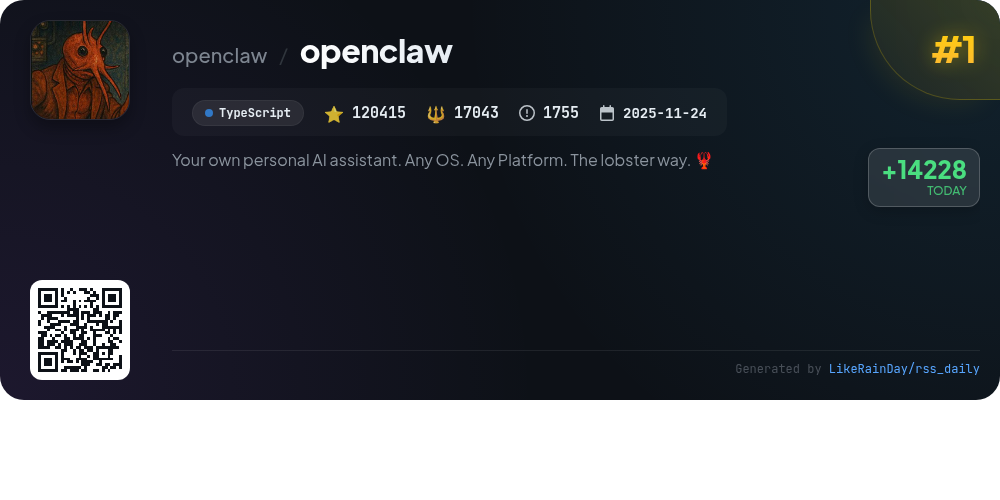
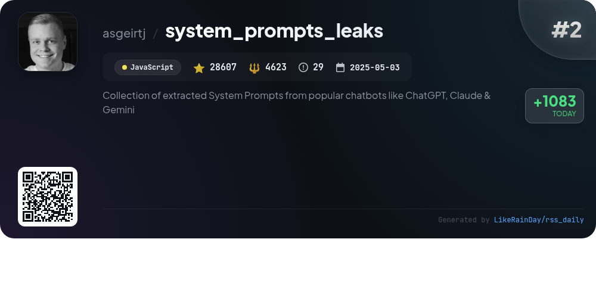
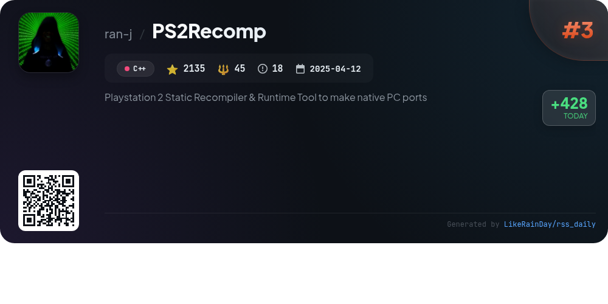
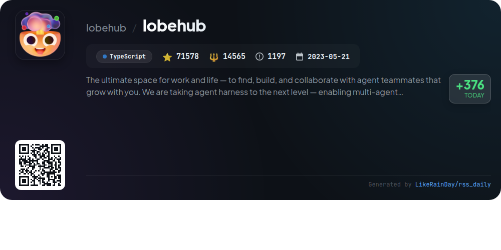
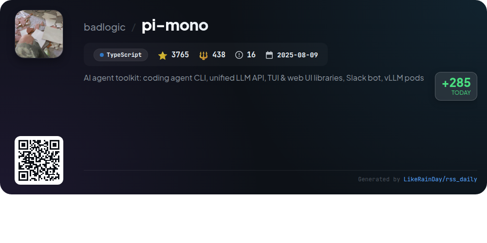
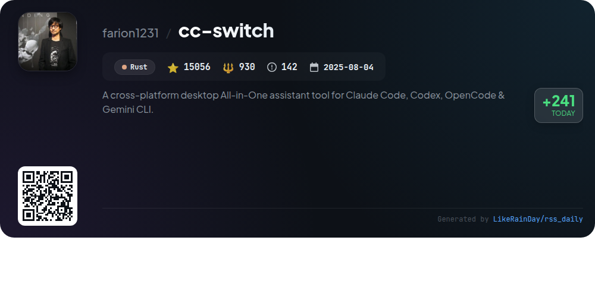
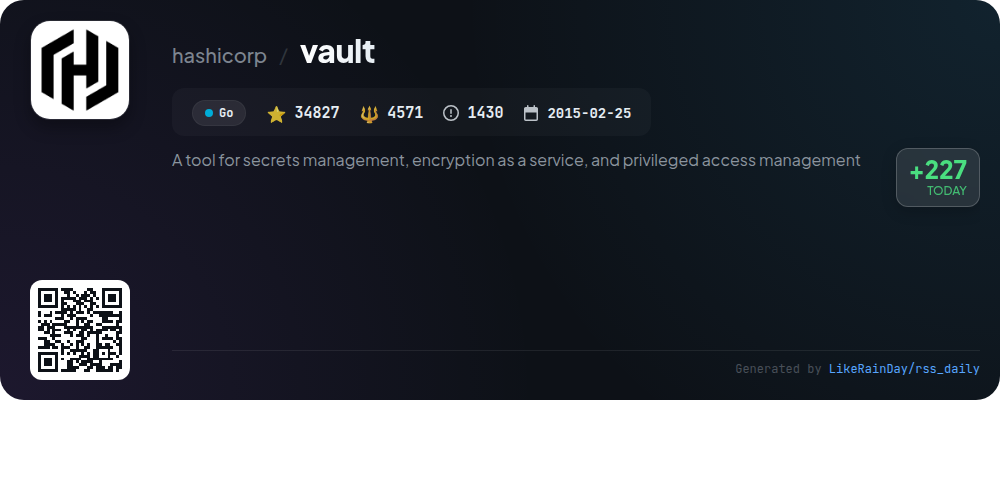
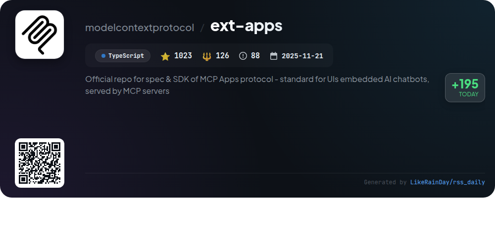
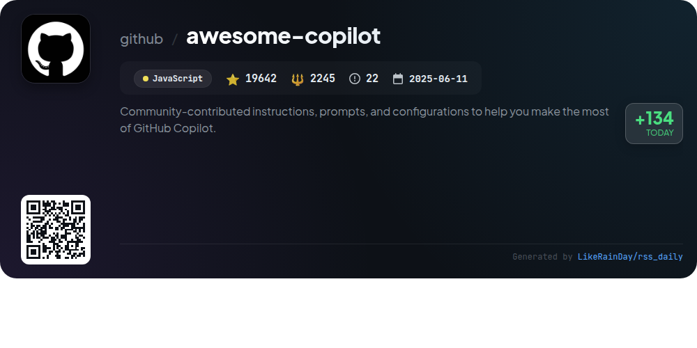
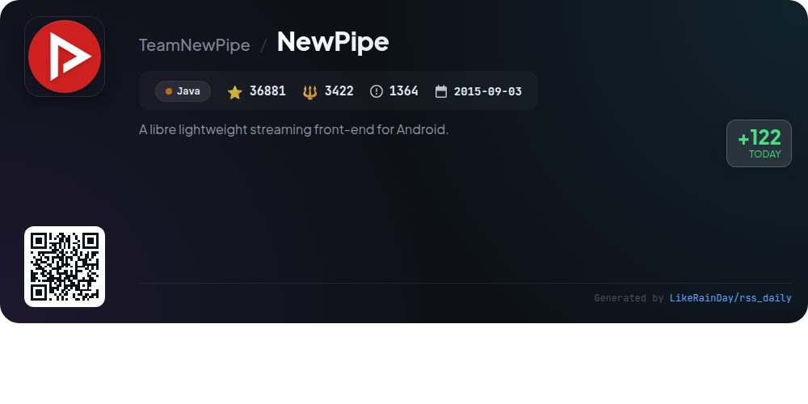

# 📊 🌟 GitHub Trending Daily - 2026-01-31

> > 📅 Daily Picks of GitHub Trending Repositories | Powered by Smart Algorithms

## 📋 Overview

**10** Projects | **333929** ⭐ | **48008** 🍴

**Top Languages:** `TypeScript` (4) · `JavaScript` (2) · `C++` (1)

**Updated:** 2026-01-31 02:33 UTC

**Categories:**

- 🌟 Daily Top 10 (10 items)

---

## 🌟 Daily Top 10

### 1. [openclaw](https://github.com/openclaw/openclaw)

> 🤖 **Why Recommend**  
> *OpenClaw is a personal AI assistant that operates locally across various platforms and channels, including WhatsApp, Telegram, Discord, and more. With over 120,000 stars on GitHub, it offers a multi-channel inbox, voice interaction, and an intuitive onboarding wizard. Key features include a local-first gateway for managing sessions, multi-agent routing, live canvas for visual tasks, and seamless integration with tools and automation. Built using TypeScript, it supports multiple AI models, providing a fast, always-on assistant tailored for individual users. Visit openclaw.ai for more information.*

- ⭐ 120415 stars
- 💻 TypeScript
- 📅 Updated: 2026-01-31

### 2. [system_prompts_leaks](https://github.com/asgeirtj/system_prompts_leaks)

> 🤖 **Why Recommend**  
> *The "system_prompts_leaks" project is a curated collection of extracted system prompts from popular chatbots like ChatGPT, Claude, and Gemini. With over 28,600 stars, it serves as a valuable resource for developers and researchers interested in understanding chatbot behaviors and capabilities. The repository encourages community contributions through pull requests, fostering collaboration and knowledge sharing. Key highlights include accessibility to various system messages and an engaging star history chart that tracks its popularity over time.*

- ⭐ 28607 stars
- 💻 JavaScript
- 📅 Updated: 2026-01-31

### 3. [PS2Recomp](https://github.com/ran-j/PS2Recomp)

> 🤖 **Why Recommend**  
> *PS2Recomp is an experimental static recompiler for PlayStation 2 ELF binaries, enabling native PC ports without traditional emulation. It translates MIPS R5900 instructions into C++ and supports PS2-specific MMI instructions, relocations, and overlays. Key features include configurable TOML files, function stubbing, and single/multi-file output options. The tool requires CMake 3.20+, a C++20 compiler, and SSE4/AVX support. Users can customize configurations for input/output and instruction patches. A basic runtime implementation is provided for executing recompiled code.*

- ⭐ 2135 stars
- 💻 C++
- 📅 Updated: 2026-01-31

### 4. [lobehub](https://github.com/lobehub/lobehub)

> 🤖 **Why Recommend**  
> *LobeHub is an innovative platform designed for seamless collaboration between humans and AI agents, fostering a co-evolving network. Core features include the Agent Builder for personalized AI teams, Agent Groups for collaborative workflows, and a rich plugin ecosystem for enhanced functionality. Users can access over 10,000 skills, utilize a desktop app, and experience real-time internet search and multi-modal support. With features like branching conversations and personal memory, LobeHub transforms productivity, making it the ultimate workspace for modern teams.*

- ⭐ 71578 stars
- 💻 TypeScript
- 📅 Updated: 2026-01-31

### 5. [pi-mono](https://github.com/badlogic/pi-mono)

> 🤖 **Why Recommend**  
> *pi-mono is an AI agent toolkit focused on building and managing AI agents and LLM deployments. Key features include a unified LLM API supporting multiple providers (OpenAI, Anthropic, etc.), an interactive coding agent CLI, a Slack bot for message delegation, and libraries for terminal and web UIs. Additionally, it offers tools for managing vLLM deployments on GPU pods. With 3,765 stars, this TypeScript-based project provides essential resources for developers looking to integrate AI capabilities into their applications.*

- ⭐ 3765 stars
- 💻 TypeScript
- 📅 Updated: 2026-01-31

### 6. [cc-switch](https://github.com/farion1231/cc-switch)

> 🤖 **Why Recommend**  
> *cc-switch is a cross-platform desktop assistant tool designed for Claude Code, Codex, and Gemini CLI, built with Rust and leveraging Tauri. It features a dual-layer architecture for data management, a redesigned user interface, and auto-launch capabilities. Users can easily switch between AI providers, manage skills and prompts, and perform API speed tests. The tool supports multiple languages and offers cloud sync functionality. Key integrations include PackyCode and AIGoCode for enhanced coding experiences. With over 15,000 stars, cc-switch is a robust solution for developers seeking efficient AI coding tools.*

- ⭐ 15056 stars
- 💻 Rust
- 📅 Updated: 2026-01-31

### 7. [vault](https://github.com/hashicorp/vault)

> 🤖 **Why Recommend**  
> *Vault is a powerful tool for secrets management, encryption as a service, and privileged access management, boasting over 34,000 stars on GitHub. Key features include secure secret storage with encryption, dynamic secrets generation for databases and cloud services, data encryption without storage, lease management for secrets, and robust revocation capabilities. Vault provides a unified interface for managing sensitive data, detailed audit logging, and support for various storage backends. Comprehensive documentation and tutorials are available to facilitate user onboarding and certification.*

- ⭐ 34827 stars
- 💻 Go
- 📅 Updated: 2026-01-31

### 8. [ext-apps](https://github.com/modelcontextprotocol/ext-apps)

> 🤖 **Why Recommend**  
> *The ext-apps project provides an SDK and specification for the MCP Apps protocol, enabling interactive UIs in AI chatbots powered by MCP servers. Key features include standardized UI delivery, bidirectional communication between tools and UIs, and support for diverse frameworks such as React and Vue. The SDK caters to both app and host developers, facilitating the creation and integration of interactive elements like charts and forms within chat clients. The project includes numerous example applications and a stable specification, enhancing the development of engaging chatbot experiences.*

- ⭐ 1023 stars
- 💻 TypeScript
- 📅 Updated: 2026-01-31

### 9. [awesome-copilot](https://github.com/github/awesome-copilot)

> 🤖 **Why Recommend**  
> *Awesome Copilot is a community-driven repository offering a rich collection of custom agents, prompts, instructions, and configurations to enhance the GitHub Copilot experience. Key features include specialized agents for diverse workflows, task-specific prompts for efficient coding, comprehensive instructions for coding standards, and curated collections organized by themes. The MCP Server facilitates easy installation of these resources directly into your editor. With over 19,600 stars, this project empowers developers to boost productivity through best practices and specialized assistance.*

- ⭐ 19642 stars
- 💻 JavaScript
- 📅 Updated: 2026-01-31

### 10. [NewPipe](https://github.com/TeamNewPipe/NewPipe)

> 🤖 **Why Recommend**  
> *NewPipe is a libre, lightweight streaming front-end for Android, supporting popular services like YouTube, PeerTube, Bandcamp, and SoundCloud. With over 36,000 stars on GitHub, it offers features such as 4K video playback, background audio streaming, a popup mode, live streaming, and the ability to create playlists without requiring user accounts. The project is currently undergoing significant codebase improvements to enhance stability. NewPipe prioritizes user privacy, avoiding data collection and proprietary libraries, making it ideal for devices without Google services.*

- ⭐ 36881 stars
- 💻 Java
- 📅 Updated: 2026-01-31

---

## 📡 RSS Subscription

Subscribe via RSS to get daily trending updates:

- 🔔 [RSS XML] (../../daily-top.xml)
- 🔔 [Daily Report] (../../GITHUB_TODAY.md)
- 🔔 [Daily Top 10](../../daily-top.xml)

---

*⚡ Powered by Smart Trending Algorithm | Generated at 2026-01-31 02:33:02 UTC
