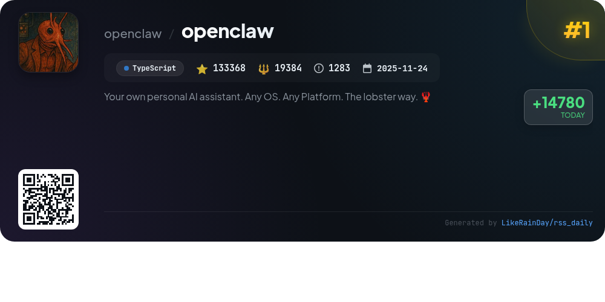
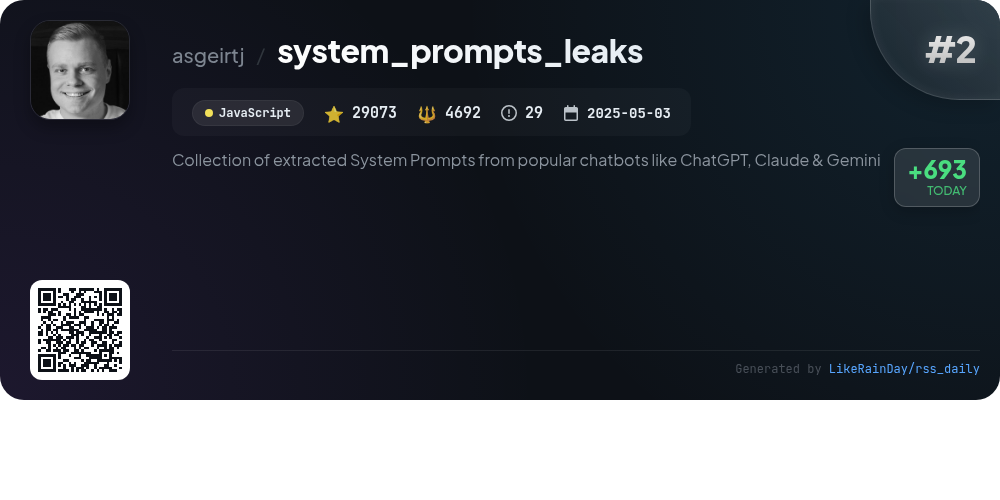
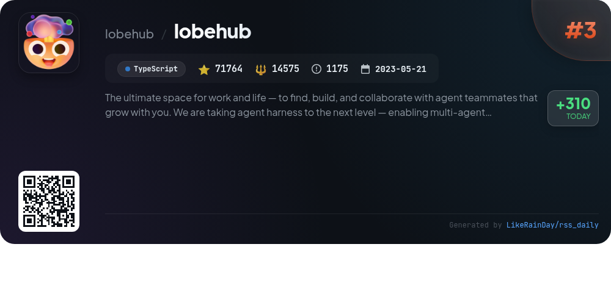
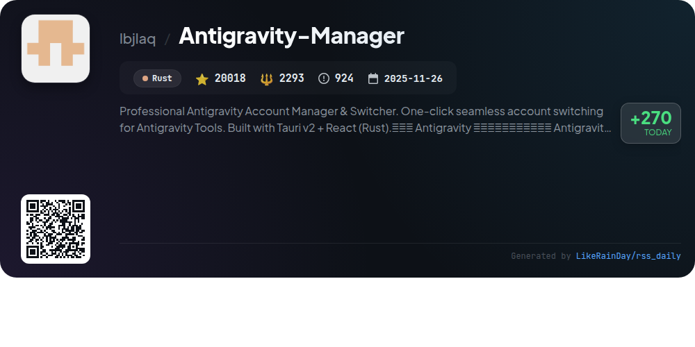
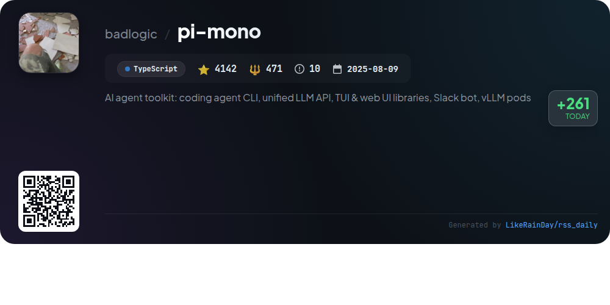
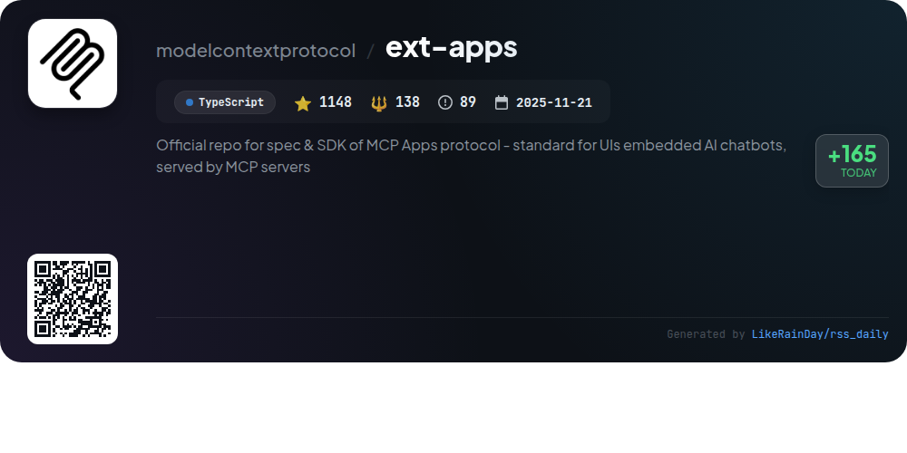
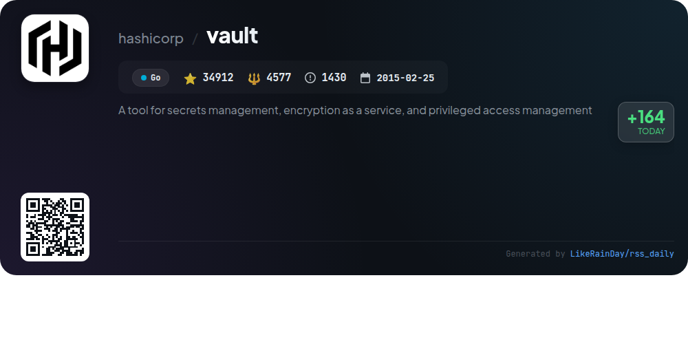
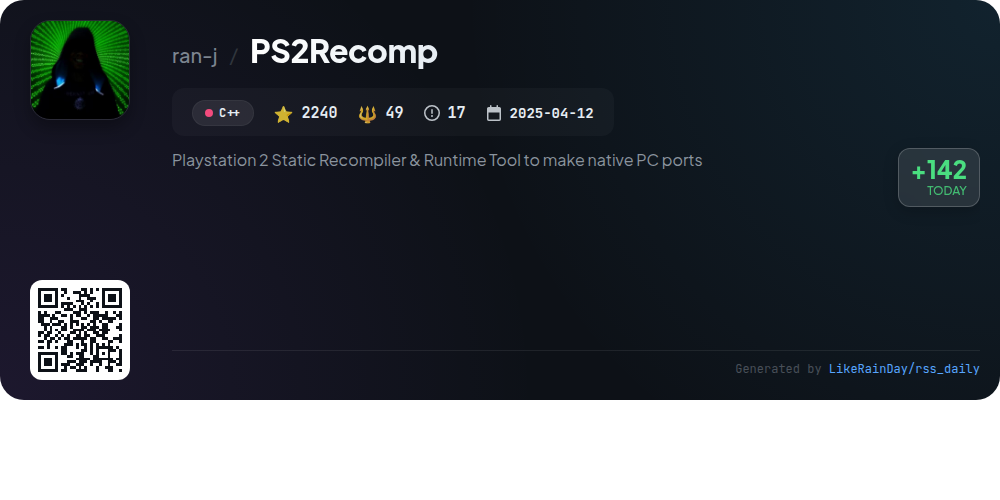
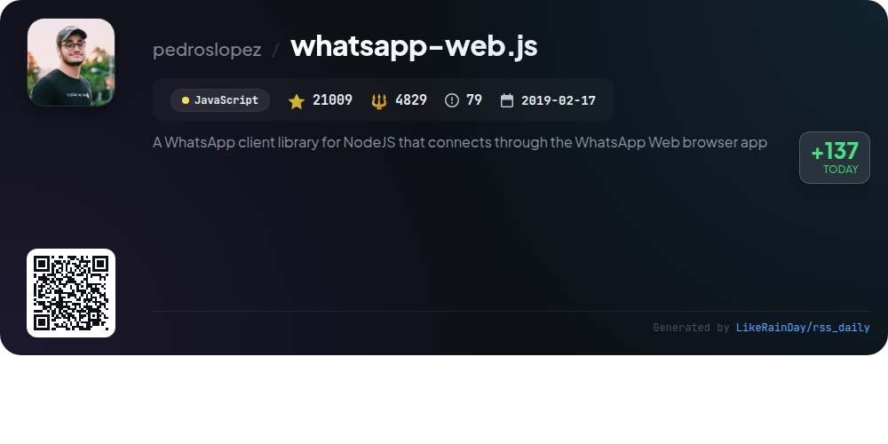
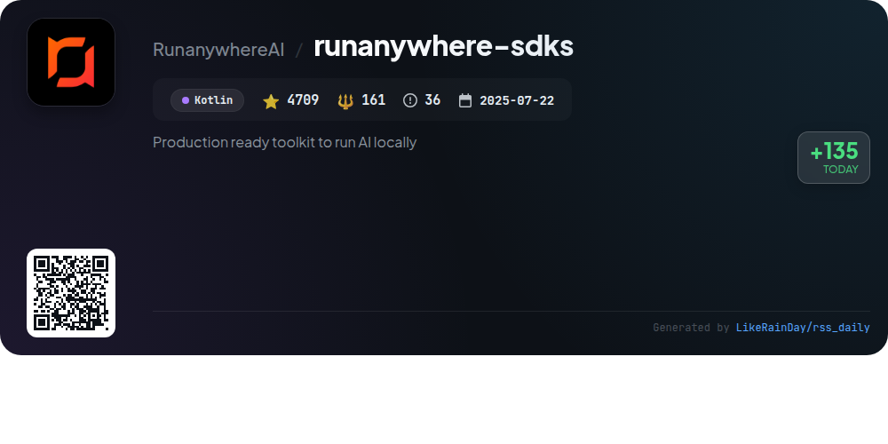

# 📊 🌟 GitHub Trending Daily - 2026-02-01

> > 📅 每日精选 GitHub 热门仓库 | 基于智能算法推荐

## 📋 Overview

**10** 个项目 | **322383** ⭐ | **51169** 🍴

**热门语言:** `TypeScript` (4) · `JavaScript` (2) · `Go` (1)

**更新时间:** 2026-02-01 02:59 UTC

**分类分布:**

- 🌟 每日 Top 10 精选 (10 项)

---

## 🌟 每日 Top 10 精选

### 1. [openclaw](https://github.com/openclaw/openclaw)

> 🤖 **推荐理由**  
> *OpenClaw is a versatile personal AI assistant that operates across multiple platforms, including WhatsApp, Telegram, Slack, and Discord. It features a local-first Gateway for managing sessions and channels, multi-channel inbox capabilities, and voice interaction modes for macOS, iOS, and Android. Key highlights include voice wake functionality, a live Canvas for visual tasks, and integration with various AI models like Anthropic and OpenAI. The onboarding wizard simplifies setup across devices, making it a fast, always-on assistant tailored for individual use.*

- ⭐ 133368 stars
- 💻 TypeScript
- 📅 Updated: 2026-02-01

### 2. [system_prompts_leaks](https://github.com/asgeirtj/system_prompts_leaks)

> 🤖 **推荐理由**  
> *The "system_prompts_leaks" project is a curated collection of extracted system prompts from leading chatbots, including ChatGPT, Claude, and Gemini. With over 29,000 stars, this JavaScript-based repository invites contributions through pull requests, fostering community engagement. Key features include easy access to developer messages and system prompts, enabling developers and researchers to study chatbot behaviors and functionalities. The project also showcases a star history chart, reflecting its growing popularity and user interest.*

- ⭐ 29073 stars
- 💻 JavaScript
- 📅 Updated: 2026-02-01

### 3. [lobehub](https://github.com/lobehub/lobehub)

> 🤖 **推荐理由**  
> *LobeHub is an innovative platform for collaborative work, enabling users to create and interact with AI agents as team members. Key features include multi-agent collaboration, a user-friendly Agent Builder, and a marketplace for plugins that enhance functionality. LobeHub supports local and remote databases, voice interactions (TTS/STT), text-to-image generation, and personalized agent memory. The platform emphasizes seamless integration and user experience with a desktop app, mobile adaptation, and PWA support, making it a versatile tool for both developers and users.*

- ⭐ 71764 stars
- 💻 TypeScript
- 📅 Updated: 2026-02-01

### 4. [Antigravity-Manager](https://github.com/lbjlaq/Antigravity-Manager)

> 🤖 **推荐理由**  
> *Antigravity-Manager is a professional account management tool for Antigravity services, enabling seamless one-click account switching. Built with Tauri and React, it supports OAuth 2.0 authorization, intelligent account monitoring, and real-time quota management. Key features include smart dashboard analytics, API proxy capabilities for protocol conversion, multi-account support with OAuth, and advanced model routing for optimized API calls. With over 20,000 stars on GitHub, it is designed for developers and AI enthusiasts seeking efficient local AI gateways.*

- ⭐ 20018 stars
- 💻 Rust
- 📅 Updated: 2026-02-01

### 5. [pi-mono](https://github.com/badlogic/pi-mono)

> 🤖 **推荐理由**  
> *pi-mono is an AI agent toolkit designed for building and managing AI agents and LLM deployments. Core features include a unified LLM API supporting various providers (OpenAI, Anthropic, Google), an interactive coding agent CLI, a Slack bot for message delegation, and libraries for terminal and web UIs. The toolkit also offers CLI support for managing vLLM deployments on GPU pods. With over 4,100 stars on GitHub, pi-mono is a versatile solution for developers looking to integrate AI capabilities into their applications.*

- ⭐ 4142 stars
- 💻 TypeScript
- 📅 Updated: 2026-02-01

### 6. [ext-apps](https://github.com/modelcontextprotocol/ext-apps)

> 🤖 **推荐理由**  
> *The ext-apps project is the official repository for the MCP Apps protocol, providing a standard for integrating interactive UIs within AI chatbots on MCP servers. With over 1,100 stars, it offers an SDK in TypeScript that enables app developers to create UI elements like charts and forms that render inline in conversations. Key features include bi-directional communication, tool definitions for UI resources, and support for various frameworks through React hooks. The project includes examples demonstrating real-world applications and offers installation instructions for both app and host developers.*

- ⭐ 1148 stars
- 💻 TypeScript
- 📅 Updated: 2026-02-01

### 7. [vault](https://github.com/hashicorp/vault)

> 🤖 **推荐理由**  
> *Vault is a powerful tool for secrets management, encryption as a service, and privileged access management, built in Go. With over 34,000 stars, it provides secure secret storage, dynamic secret generation, data encryption, leasing, and revocation features. Vault enables tight access control, detailed audit logs, and on-demand secret generation for various systems like AWS. It simplifies managing secrets for modern applications while ensuring security and compliance. Comprehensive documentation, tutorials, and certification exams are available to support users and developers.*

- ⭐ 34912 stars
- 💻 Go
- 📅 Updated: 2026-02-01

### 8. [PS2Recomp](https://github.com/ran-j/PS2Recomp)

> 🤖 **推荐理由**  
> *PS2Recomp is an experimental static recompiler for PlayStation 2 ELF binaries, transforming them into C++ code for native PC ports. Key features include the translation of MIPS R5900 instructions, support for PS2-specific 128-bit MMI instructions, and configurable output options using TOML files. The tool parses ELF files, decodes functions, and generates runnable C++ code, enabling PS2 games to run without traditional emulation. A basic runtime is provided to manage memory and system calls. Limitations include partial support for VU1 microcode and certain hardware components.*

- ⭐ 2240 stars
- 💻 C++
- 📅 Updated: 2026-02-01

### 9. [whatsapp-web.js](https://github.com/pedroslopez/whatsapp-web.js)

> 🤖 **推荐理由**  
> *whatsapp-web.js is a powerful Node.js library that enables developers to integrate WhatsApp functionalities through the WhatsApp Web browser app. With over 21,000 stars on GitHub, it supports multi-device capabilities, message handling (sending/receiving text, media, and stickers), group management, and user interactions like mentions and reactions. The library uses Puppeteer for a stable connection but warns that using it may lead to account blocking, as WhatsApp prohibits unofficial clients. Comprehensive documentation and an active community on Discord enhance user support.*

- ⭐ 21009 stars
- 💻 JavaScript
- 📅 Updated: 2026-02-01

### 10. [runanywhere-sdks](https://github.com/RunanywhereAI/runanywhere-sdks)

> 🤖 **推荐理由**  
> *RunAnywhere is a production-ready toolkit for integrating on-device AI into mobile applications, allowing features like LLM chat, speech-to-text, and text-to-speech to run locally without cloud dependency. Key highlights include support for various models (e.g., Llama, Whisper), fast performance, and enhanced privacy. The SDKs are available for Swift (iOS/macOS), Kotlin (Android), React Native, and Flutter. With over 4,700 stars on GitHub, RunAnywhere empowers developers to create responsive, privacy-focused AI applications effortlessly.*

- ⭐ 4709 stars
- 💻 Kotlin
- 📅 Updated: 2026-02-01

---

## 📡 RSS订阅

通过 RSS 订阅，第一时间获取每日精选项目：

- 🔔 [RSS 订阅源] (../../daily-top.xml)
- 🔔 [每日简报] (../../GITHUB_TODAY_CN.md)
- 🔔 [每日 Top 10 精选](../../daily-top.xml)

---

*⚡ Powered by Smart Trending Algorithm | Generated at 2026-02-01 02:59:12 UTC
