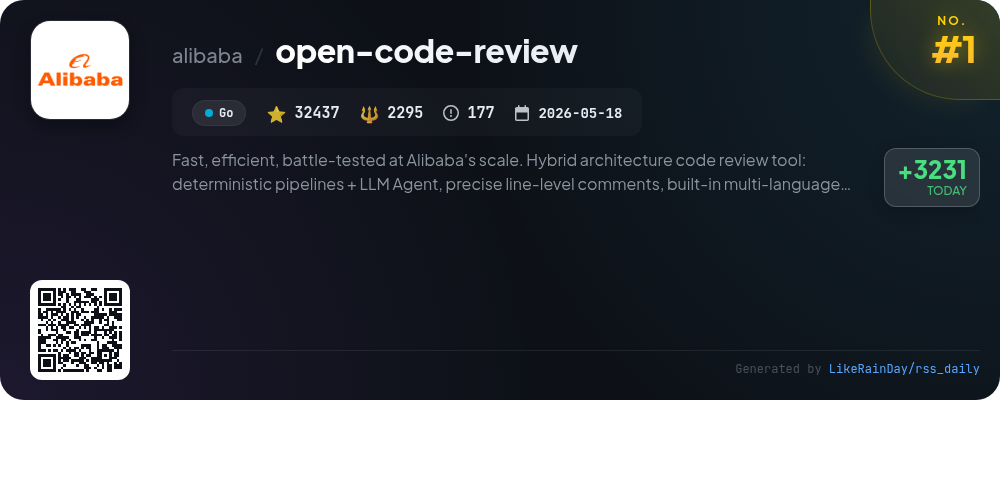
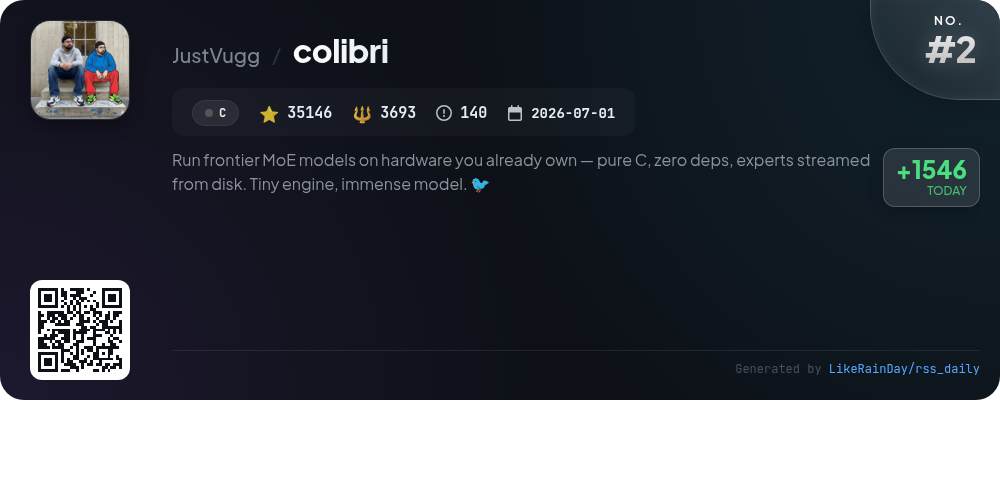
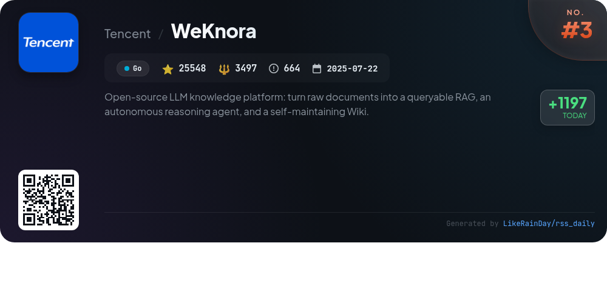
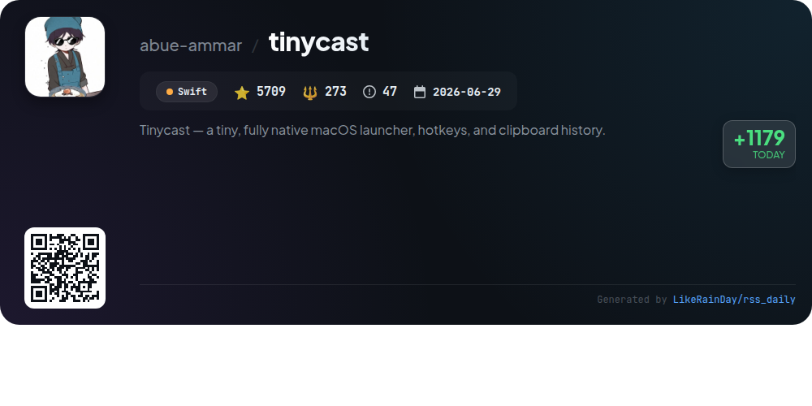
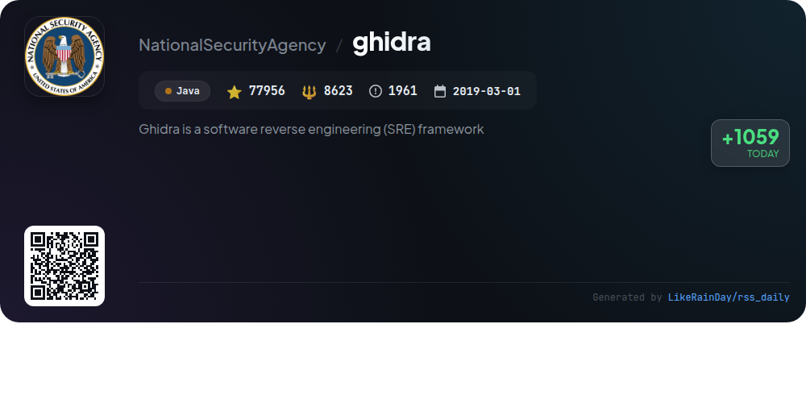
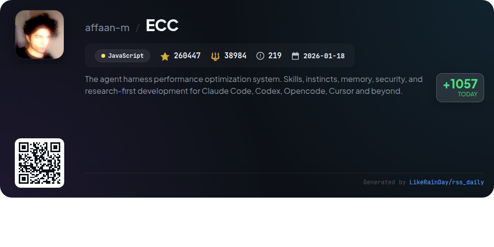
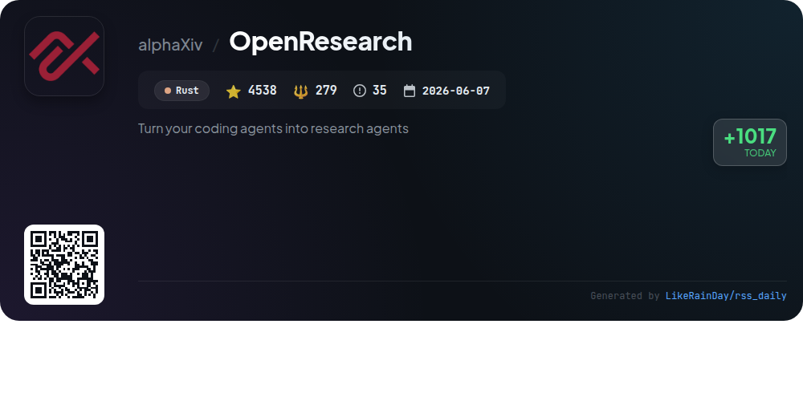
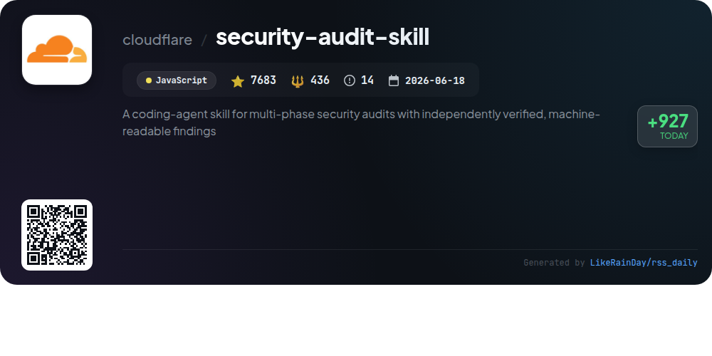
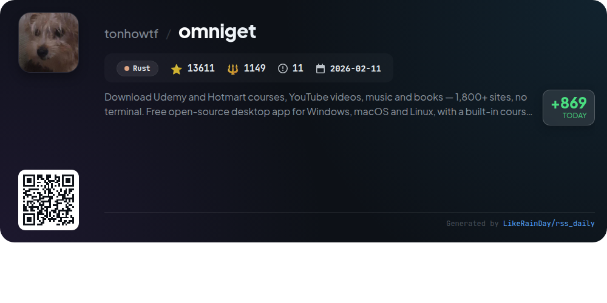
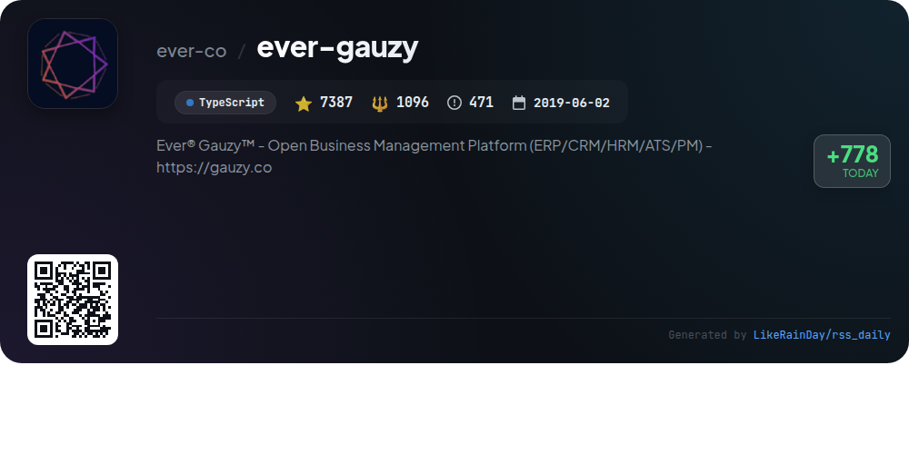

# 📊 🌟 GitHub Trending Daily - 2026-09-17

> > 📅 每日精选 GitHub 热门仓库 | 基于智能算法推荐

## 📋 Overview

**10** 个项目 | **470462** ⭐ | **60325** 🍴

**热门语言:** `JavaScript` (2) · `Rust` (2) · `Go` (2)

**更新时间:** 2026-09-17 04:29 UTC

**分类分布:**

- 🌟 每日 Top 10 精选 (10 项)

---

## 🌟 每日 Top 10 精选

### 1. [open-code-review](https://github.com/alibaba/open-code-review)

> 🤖 **推荐理由**  
> *Open Code Review is an AI-powered code review tool developed by Alibaba, designed for efficient, scalable code analysis. Key features include deterministic pipelines for precise line-level feedback, a built-in multi-language ruleset (covering NPE, thread-safety, XSS, SQL injection), and compatibility with OpenAI and Anthropic models. The tool excels in generating structured comments and auditing entire files, significantly enhancing review quality while reducing false positives. With a focus on hybrid architecture, Open Code Review is battle-tested for large-scale applications and is open-source for community use.*

- ⭐ 32437 stars
- 💻 Go
- 📅 Updated: 2026-09-17

### 2. [colibri](https://github.com/JustVugg/colibri)

> 🤖 **推荐理由**  
> *Colibrì is a lightweight inference engine designed to run frontier Mixture-of-Experts (MoE) models, ranging from 744 billion to 2.8 trillion parameters, on consumer-grade hardware without dependencies. It utilizes a unique memory multitiering approach, treating VRAM, RAM, and storage as a unified hierarchy, optimizing performance and accessibility. The engine supports multiple model families, including GLM-5.2 and Kimi K3, and provides a web dashboard for real-time monitoring. Its focus on reproducible experiments fosters an open research environment for inference optimization.*

- ⭐ 35146 stars
- 💻 C
- 📅 Updated: 2026-09-17

### 3. [WeKnora](https://github.com/Tencent/WeKnora)

> 🤖 **推荐理由**  
> *WeKnora is an open-source LLM knowledge platform designed for enterprise document understanding and autonomous reasoning. Key features include a RAG-based Q&A system, a ReAct agent for orchestrating multi-step tasks, and a self-maintaining Wiki Mode that generates interlinked markdown knowledge bases. It supports document ingestion from multiple sources, handles various file formats, and offers extensive integrations with 20+ LLM providers. With enterprise-ready RBAC, cross-session memory, and a modular architecture, WeKnora transforms scattered documents into a dynamic, queryable knowledge asset.*

- ⭐ 25548 stars
- 💻 Go
- 📅 Updated: 2026-09-17

### 4. [tinycast](https://github.com/abue-ammar/tinycast)

> 🤖 **推荐理由**  
> *Tinycast is a lightweight, fully native macOS launcher designed for efficiency, utilizing under 100 MB of RAM. Key features include a global hotkey for quick access, fuzzy app and file search, clipboard history, and customizable snippets. Users can manage windows, execute shell commands, and access calendar events seamlessly. Tinycast also supports AI chat, integrates with Apple Shortcuts, and offers Raycast extension compatibility without third-party dependencies. Open-source and free, it prioritizes user privacy with no telemetry.*

- ⭐ 5709 stars
- 💻 Swift
- 📅 Updated: 2026-09-17

### 5. [ghidra](https://github.com/NationalSecurityAgency/ghidra)

> 🤖 **推荐理由**  
> *Ghidra is a powerful software reverse engineering (SRE) framework developed by the NSA, designed for analyzing compiled code across multiple platforms, including Windows, macOS, and Linux. Key features include disassembly, decompilation, scripting capabilities, and support for various processor instruction sets and executable formats. Ghidra allows users to create custom extensions and scripts using Java or Python. With a focus on cybersecurity, it provides deep insights into vulnerabilities, making it a vital tool for SRE analysts. The project is open source and supports collaborative development.*

- ⭐ 77956 stars
- 💻 Java
- 📅 Updated: 2026-09-17

### 6. [ECC](https://github.com/affaan-m/ECC)

> 🤖 **推荐理由**  
> *ECC is a performance optimization system for coding agents like Claude Code and Codex, designed to enhance development workflows. Key features include 68 specialized agents for planning, reviewing, and security, alongside 292 reusable skills and 94 command shims. ECC automates processes with hooks for memory persistence and context management, enabling continuous learning and security scanning through AgentShield. It supports guided installation across various platforms, with a focus on optimizing context usage and improving coding practices.*

- ⭐ 260447 stars
- 💻 JavaScript
- 📅 Updated: 2026-09-17

### 7. [OpenResearch](https://github.com/alphaXiv/OpenResearch)

> 🤖 **推荐理由**  
> *OpenResearch is a local-first workspace designed to transform coding agents like Claude Code, Codex, OpenCode, and Cursor into research agents. With features like parallel exploration, reproducible experiments, and evidence tracking, it enables users to conduct autonomous research loops, from idea generation to experimentation. The platform supports local and remote compute options, ensuring ownership of research artifacts. Additionally, it offers a CLI for easy integration and management of projects, providing a robust environment for innovative research without compromising data privacy.*

- ⭐ 4538 stars
- 💻 Rust
- 📅 Updated: 2026-09-17

### 8. [security-audit-skill](https://github.com/cloudflare/security-audit-skill)

> 🤖 **推荐理由**  
> *A coding-agent skill for multi-phase security audits with independently verified, machine-readable findings. popular project, actively maintained, recently updated*

- ⭐ 7683 stars
- 🍴 436 forks
- 💻 JavaScript
- 📅 Updated: 2026-09-17

### 9. [omniget](https://github.com/tonhowtf/omniget)

> 🤖 **推荐理由**  
> *OmniGet is a free, open-source desktop app for Windows, macOS, and Linux that allows users to download content from over 1,800 sites, including Udemy, Hotmart, YouTube, and more, without needing a terminal. Key features include a built-in media player, PDF/EPUB reader, and a music library. Users can easily paste links, manage downloads with advanced options, and utilize tools for transcription, conversion, and study aids. With no ads or telemetry, OmniGet prioritizes user privacy while offering extensive functionality through plugins and a robust tools section.*

- ⭐ 13611 stars
- 💻 Rust
- 📅 Updated: 2026-09-17

### 10. [ever-gauzy](https://github.com/ever-co/ever-gauzy)

> 🤖 **推荐理由**  
> *Ever® Gauzy™ is an open business management platform designed for collaborative and on-demand economies, encompassing ERP, CRM, HRM, ATS, and project management features. Key highlights include employee time tracking, financial and cost management, inventory control, and comprehensive reporting. The platform offers headless APIs for easy integration, a customizable dashboard, and multi-currency support. It’s built with TypeScript, leveraging modern technologies like Angular and NestJS. Available as a SaaS solution and for self-hosting, it caters to various organizational needs. Explore more at gauzy.co.*

- ⭐ 7387 stars
- 💻 TypeScript
- 📅 Updated: 2026-09-17

---

## 📡 RSS订阅

通过 RSS 订阅，第一时间获取每日精选项目：

- 🔔 [RSS 订阅源] (../../daily-top.xml)
- 🔔 [每日简报] (../../GITHUB_TODAY_CN.md)
- 🔔 [每日 Top 10 精选](../../daily-top.xml)

---

*⚡ Powered by Smart Trending Algorithm | Generated at 2026-09-17 04:29:11 UTC
