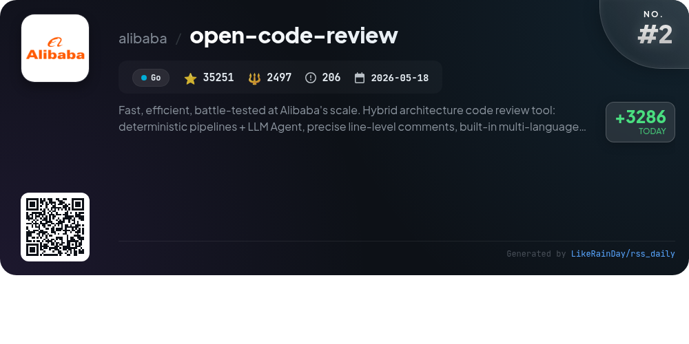
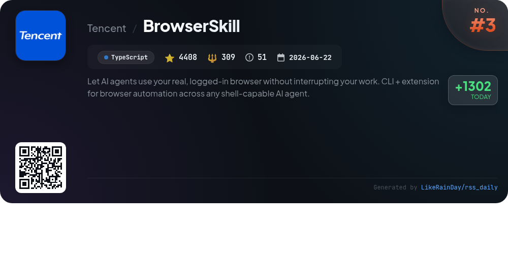
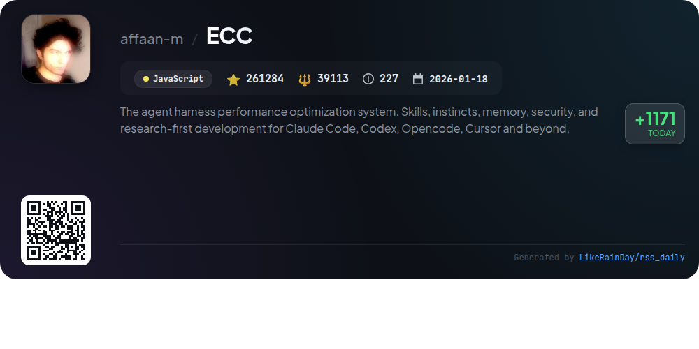
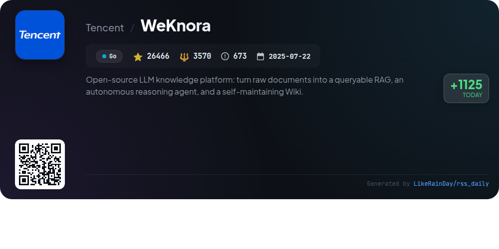
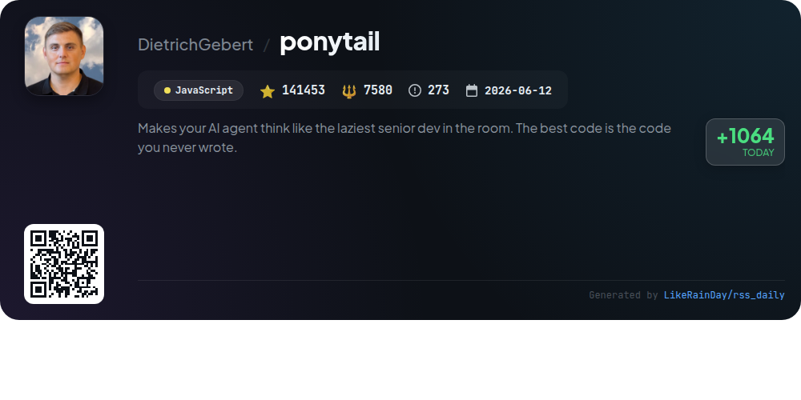
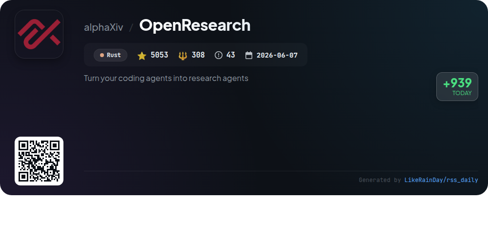
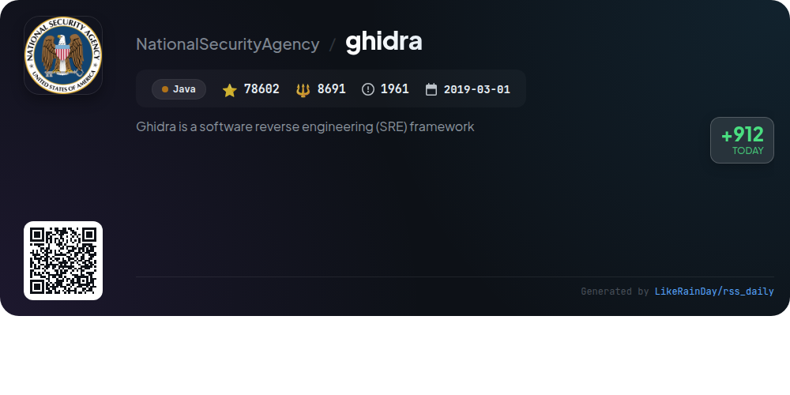
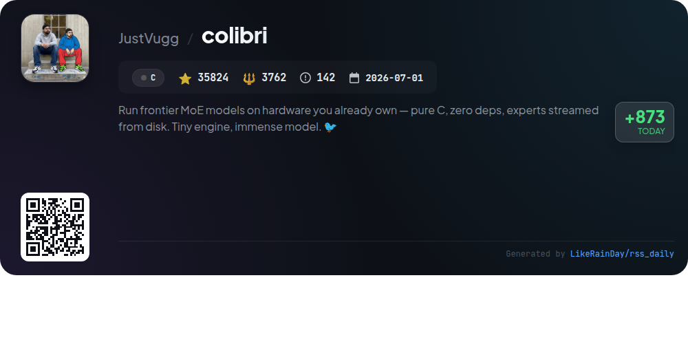
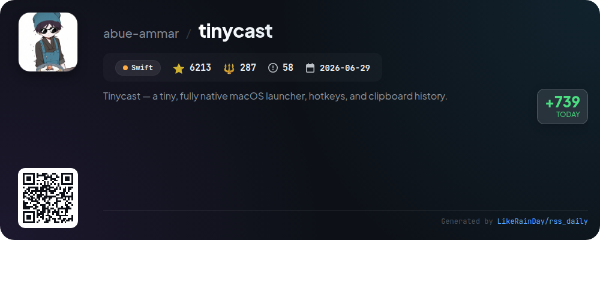

# 📊 🌟 GitHub Trending Daily - 2026-09-18

> > 📅 Daily Picks of GitHub Trending Repositories | Powered by Smart Algorithms

## 📋 Overview

**10** Projects | **605521** ⭐ | **66706** 🍴

**Top Languages:** `JavaScript` (3) · `Go` (2) · `Java` (1)

**Updated:** 2026-09-18 04:13 UTC

**Categories:**

- 🌟 Daily Top 10 (10 items)

---

## 🌟 Daily Top 10

### 1. [security-audit-skill](https://github.com/cloudflare/security-audit-skill)

> 🤖 **Why Recommend**  
> *A coding-agent skill for multi-phase security audits with independently verified, machine-readable findings. popular project, actively maintained, recently updated*

- ⭐ 10967 stars
- 🍴 589 forks
- 💻 JavaScript
- 📅 Updated: 2026-09-18

### 2. [open-code-review](https://github.com/alibaba/open-code-review)

> 🤖 **Why Recommend**  
> *Open Code Review is an AI-powered code review tool developed by Alibaba, designed for efficiency and scalability. It features a hybrid architecture combining deterministic pipelines with LLM agents to produce precise line-level comments. The tool supports a built-in multi-language ruleset addressing common vulnerabilities like NPE and SQL injection. Key highlights include fast reviews, configurable model endpoints, and deep context analysis. Open Code Review has served tens of thousands of developers, identifying millions of defects, making it a reliable choice for code quality assurance.*

- ⭐ 35251 stars
- 💻 Go
- 📅 Updated: 2026-09-18

### 3. [BrowserSkill](https://github.com/Tencent/BrowserSkill)

> 🤖 **Why Recommend**  
> *BrowserSkill is a TypeScript-based tool that enables AI agents to utilize your logged-in browser without disrupting your workflow. With over 4,400 stars on GitHub, it connects various AI agents (like Cursor, Claude Code, and Codex) through a CLI and a browser extension, allowing them to borrow open tabs and perform tasks while you continue working. Key features include real login state reuse, uninterrupted operation in a visible Agent Window, support for any shell-capable agent, and built-in human-in-loop capabilities for handling complex interactions like CAPTCHAs. Compatible with macOS, Linux, and Windows, it supports Chrome and Edge browsers, with Firefox support planned.*

- ⭐ 4408 stars
- 💻 TypeScript
- 📅 Updated: 2026-09-18

### 4. [ECC](https://github.com/affaan-m/ECC)

> 🤖 **Why Recommend**  
> *ECC is a powerful agent harness performance optimization system designed to enhance coding efficiency across platforms like Claude Code and Codex. It features 68 specialized agents, 292 skills for various development tasks, and 94 command shims for seamless integration. Key highlights include memory persistence, security scanning with AgentShield, and continuous learning capabilities. The system supports multi-harness configurations while providing a guided installation process. ECC is open source (MIT-licensed) and ideal for developers seeking to streamline workflows and enforce best practices in coding.*

- ⭐ 261284 stars
- 💻 JavaScript
- 📅 Updated: 2026-09-18

### 5. [WeKnora](https://github.com/Tencent/WeKnora)

> 🤖 **Why Recommend**  
> *WeKnora is an open-source LLM-powered knowledge platform designed for enterprise-level document understanding and autonomous reasoning. Its core features include RAG-based Q&A for quick information retrieval, a ReAct agent for orchestrating complex tasks, and a Wiki Mode for auto-generating interlinked markdown documents. WeKnora supports multi-source ingestion, advanced memory management, and offers integrations with 20+ LLM providers. It also features a modular architecture for easy deployment, extensive API capabilities, and tools for document editing and knowledge management, making it a versatile solution for transforming raw documents into an interactive knowledge base.*

- ⭐ 26466 stars
- 💻 Go
- 📅 Updated: 2026-09-18

### 6. [ponytail](https://github.com/DietrichGebert/ponytail)

> 🤖 **Why Recommend**  
> *Ponytail is a JavaScript project designed to enhance AI agents by promoting minimalistic coding practices, reflecting the ethos of a lazy senior developer. It significantly reduces code complexity, achieving up to 94% less code, 20% lower costs, and 27% faster execution while maintaining 100% safety standards. The plugin facilitates various commands, such as `/ponytail-review` for code audits and `/ponytail-gain` for performance metrics. With integration across multiple platforms, Ponytail aims to streamline development by encouraging code reuse and simplicity.*

- ⭐ 141453 stars
- 💻 JavaScript
- 📅 Updated: 2026-09-18

### 7. [OpenResearch](https://github.com/alphaXiv/OpenResearch)

> 🤖 **Why Recommend**  
> *OpenResearch is a local-first workspace designed for transforming coding agents into research agents. With over 5,000 stars on GitHub, it enables parallel exploration of research directions, reproducible experiments, and local ownership of projects and artifacts. Users can leverage models like Claude Code, Codex, OpenCode, or Cursor, and integrate with various compute environments, including local setups and cloud services. The platform supports autonomous research workflows, allowing multiple agents to collaborate seamlessly while maintaining an immutable experiment tree.*

- ⭐ 5053 stars
- 💻 Rust
- 📅 Updated: 2026-09-18

### 8. [ghidra](https://github.com/NationalSecurityAgency/ghidra)

> 🤖 **Why Recommend**  
> *Ghidra is an open-source software reverse engineering (SRE) framework developed by the NSA, featuring a comprehensive suite of high-end analysis tools for disassembly, decompilation, and scripting across various platforms (Windows, macOS, Linux). With support for multiple processor instruction sets and executable formats, Ghidra can operate in both interactive and automated modes. Users can extend its capabilities using Java or Python. Designed to facilitate complex SRE tasks, Ghidra enhances cybersecurity efforts by enabling deep analysis of code to uncover vulnerabilities.*

- ⭐ 78602 stars
- 💻 Java
- 📅 Updated: 2026-09-18

### 9. [colibri](https://github.com/JustVugg/colibri)

> 🤖 **Why Recommend**  
> *Colibrì is a lightweight inference engine for frontier Mixture-of-Experts (MoE) models, enabling users to run models with 744B to 2.8T parameters on consumer hardware without dependencies. It streamlines model storage, RAM, and VRAM into a unified hierarchy, optimizing performance across various setups. Key features include a single-file C implementation, support for multiple model families (GLM, Inkling, Kimi K3), and advanced techniques like learned caching and speculative decoding. Colibrì emphasizes accessibility, allowing users to run large models efficiently while maintaining high quality and correctness.*

- ⭐ 35824 stars
- 💻 C
- 📅 Updated: 2026-09-18

### 10. [tinycast](https://github.com/abue-ammar/tinycast)

> 🤖 **Why Recommend**  
> *Tinycast is a lightweight, native macOS launcher designed for efficiency, utilizing under 100 MB of RAM. Key features include a global hotkey for quick access, fuzzy search for apps and files, clipboard history, a built-in calculator, and seamless integration with Apple Shortcuts. Users can manage windows, execute custom commands, and use Markdown snippets. Tinycast supports Raycast extensions and offers AI chat capabilities. The project is open-source, free of third-party dependencies, and emphasizes user privacy with no telemetry.*

- ⭐ 6213 stars
- 💻 Swift
- 📅 Updated: 2026-09-18

---

## 📡 RSS Subscription

Subscribe via RSS to get daily trending updates:

- 🔔 [RSS XML] (../../daily-top.xml)
- 🔔 [Daily Report] (../../GITHUB_TODAY.md)
- 🔔 [Daily Top 10](../../daily-top.xml)

---

*⚡ Powered by Smart Trending Algorithm | Generated at 2026-09-18 04:13:44 UTC
