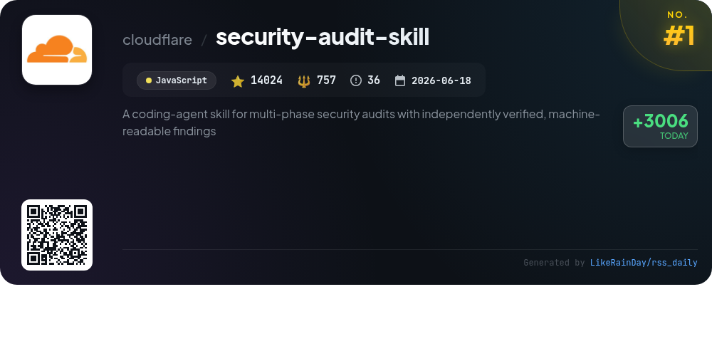
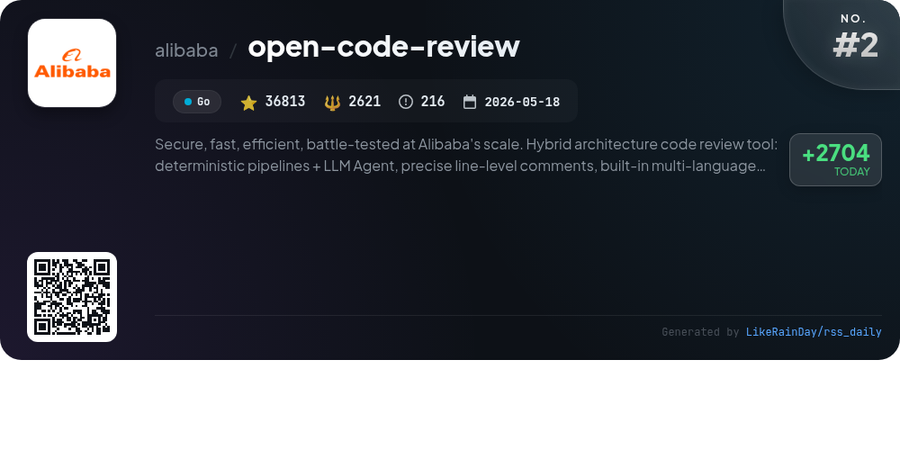
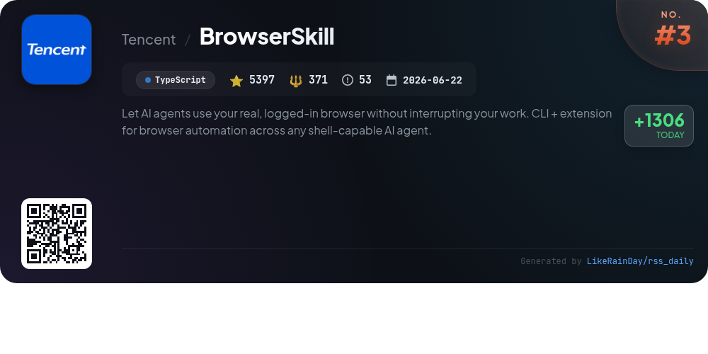
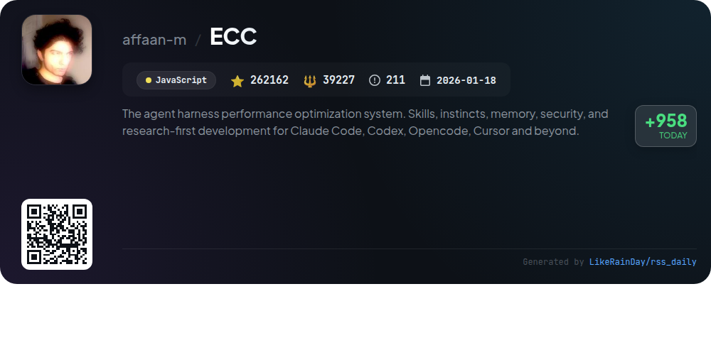
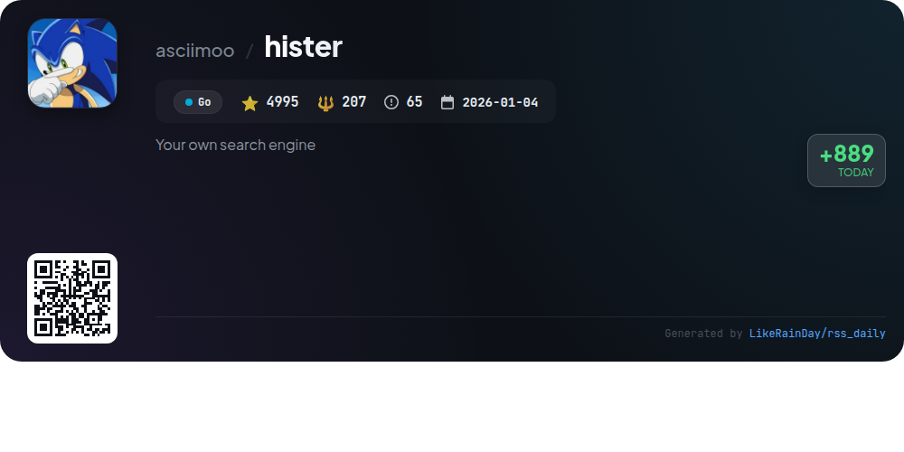
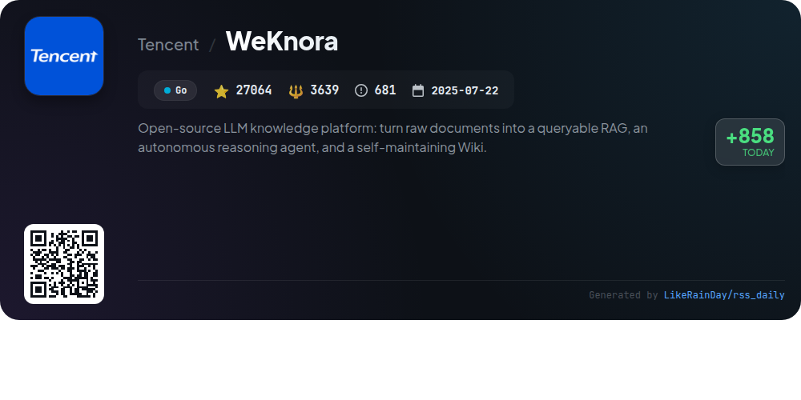
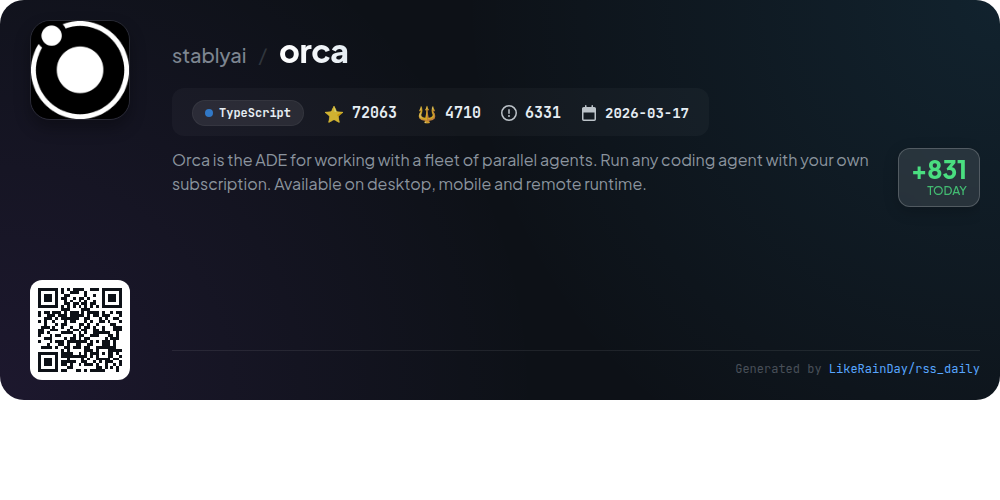
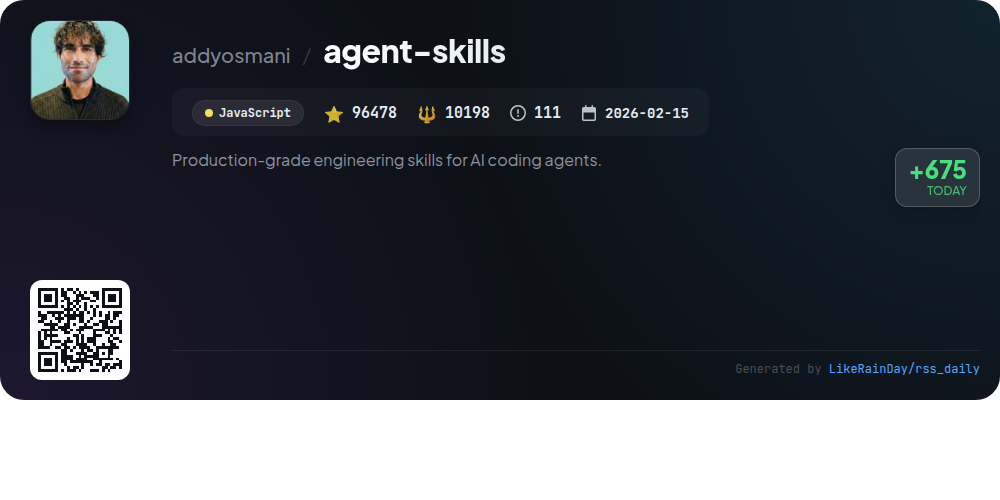
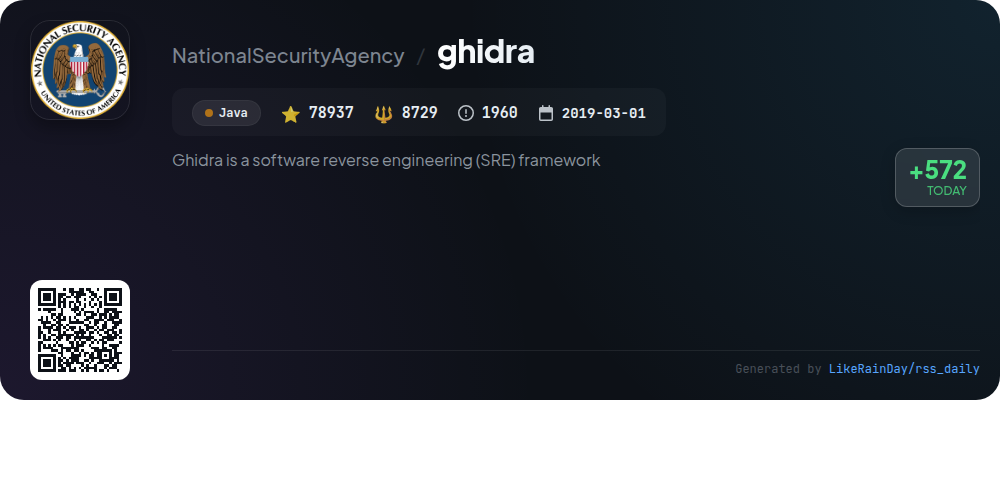
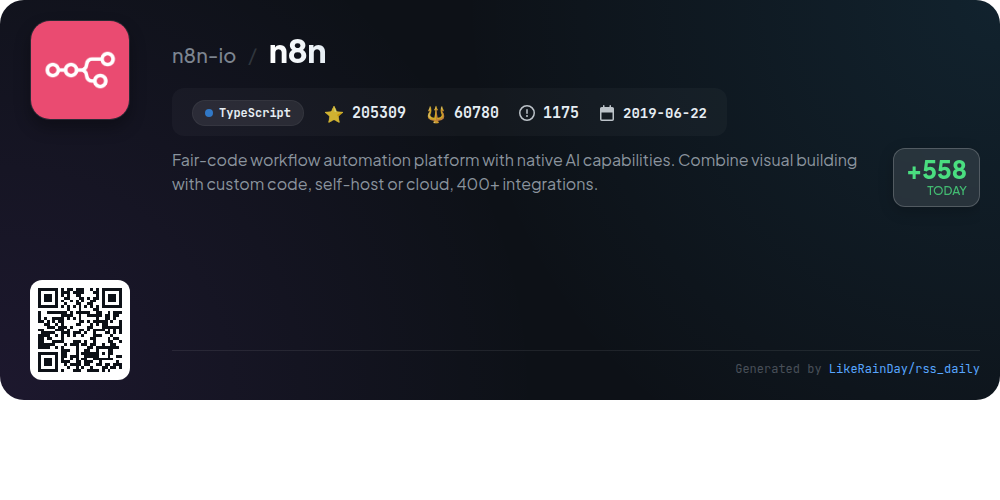

# 📊 🌟 GitHub Trending Daily - 2026-09-19

> > 📅 Daily Picks of GitHub Trending Repositories | Powered by Smart Algorithms

## 📋 Overview

**10** Projects | **803242** ⭐ | **131239** 🍴

**Top Languages:** `Go` (3) · `JavaScript` (3) · `TypeScript` (3)

**Updated:** 2026-09-19 04:10 UTC

**Categories:**

- 🌟 Daily Top 10 (10 items)

---

## 🌟 Daily Top 10

### 1. [security-audit-skill](https://github.com/cloudflare/security-audit-skill)

> 🤖 **Why Recommend**  
> *A coding-agent skill for multi-phase security audits with independently verified, machine-readable findings. popular project, actively maintained, recently updated*

- ⭐ 14024 stars
- 🍴 757 forks
- 💻 JavaScript
- 📅 Updated: 2026-09-19

### 2. [open-code-review](https://github.com/alibaba/open-code-review)

> 🤖 **Why Recommend**  
> *OpenCodeReview is a robust AI-powered code review tool developed by Alibaba, designed for secure and efficient performance at scale. It features deterministic pipelines combined with a powerful LLM agent, providing precise line-level comments and a built-in multi-language ruleset to detect issues like NPE, thread-safety, XSS, and SQL injection. The tool supports various platforms and integrates with OpenAI and Anthropic models. Key highlights include structured feedback, auditing capabilities for entire files, and superior precision in code defect detection, making it ideal for developers seeking comprehensive code quality assurance.*

- ⭐ 36813 stars
- 💻 Go
- 📅 Updated: 2026-09-19

### 3. [BrowserSkill](https://github.com/Tencent/BrowserSkill)

> 🤖 **Why Recommend**  
> *BrowserSkill is a TypeScript project enabling AI agents to operate within your existing, logged-in browser without disrupting your workflow. It connects various agents like Cursor, Claude Code, and Codex through a CLI and browser extension. Key features include the ability to reuse real login states, uninterrupted browsing (tasks run in a visible Agent Window), and built-in human-in-loop support for tasks requiring user intervention. Compatible with macOS, Linux, and Windows, it supports Chrome and Edge, with plans for Firefox. BrowserSkill streamlines automation across diverse AI agents, enhancing productivity and user experience.*

- ⭐ 5397 stars
- 💻 TypeScript
- 📅 Updated: 2026-09-19

### 4. [ECC](https://github.com/affaan-m/ECC)

> 🤖 **Why Recommend**  
> *ECC is a powerful performance optimization system designed for coding agents like Claude Code, Codex, and more. It features 68 specialized agents, 292 skills, and 94 commands for tasks such as planning, code review, and security auditing. ECC ensures a structured workflow through hooks and rules while enabling continuous learning and memory persistence. With tools like AgentShield for security scanning, it enhances coding efficiency and quality. The system supports various platforms, offering guided installations and a comprehensive developer experience for enhanced code management.*

- ⭐ 262162 stars
- 💻 JavaScript
- 📅 Updated: 2026-09-19

### 5. [hister](https://github.com/asciimoo/hister)

> 🤖 **Why Recommend**  
> *Hister is a private search engine enabling users to index and search the contents of visited web pages and local files. Key features include full-text indexing, automatic browser integration through Chrome and Firefox extensions, and powerful query capabilities with optional semantic search. Hister prioritizes user privacy with no telemetry or mandatory cloud services, allowing local or controlled infrastructure usage. Accessible via a web interface, terminal, or AI assistant, it supports multi-user environments, making it ideal for personal and shared document management.*

- ⭐ 4995 stars
- 💻 Go
- 📅 Updated: 2026-09-19

### 6. [WeKnora](https://github.com/Tencent/WeKnora)

> 🤖 **Why Recommend**  
> *WeKnora is an open-source LLM-powered knowledge platform designed for enterprise document understanding and semantic retrieval. Key features include RAG-based quick Q&A, an autonomous ReAct agent for multi-step reasoning, and a self-maintaining Wiki mode for turning raw documents into an interlinked markdown knowledge base. It supports multi-source ingestion, long-term memory, and extensive integrations with 20+ LLM providers and various document formats. WeKnora offers a modular architecture, enabling flexible deployments and comprehensive observability, making it a robust tool for knowledge management.*

- ⭐ 27064 stars
- 💻 Go
- 📅 Updated: 2026-09-19

### 7. [orca](https://github.com/stablyai/orca)

> 🤖 **Why Recommend**  
> *Orca is an advanced development environment (ADE) designed for managing a fleet of parallel coding agents across desktop, mobile, and remote platforms. Key features include parallel worktrees for running multiple agents simultaneously, a mobile companion app for monitoring tasks on-the-go, and integrated terminal splits. Users can drag files directly into prompts, utilize design mode for UI interactions, and manage GitHub tasks within the app. With support for various CLI agents, Orca streamlines workflows and enhances productivity for developers.*

- ⭐ 72063 stars
- 💻 TypeScript
- 📅 Updated: 2026-09-19

### 8. [agent-skills](https://github.com/addyosmani/agent-skills)

> 🤖 **Why Recommend**  
> *Agent Skills is a JavaScript project providing production-grade engineering skills for AI coding agents, boasting 96,478 stars. It encodes senior engineers' workflows, quality gates, and best practices into structured skills, allowing agents to execute tasks consistently across the development lifecycle. Key features include 25 skills covering defining, planning, building, verifying, reviewing, and shipping software, along with automated processes like `/build auto`. The project supports integration with various AI agents and emphasizes verification, clarity, and best practices to enhance software quality.*

- ⭐ 96478 stars
- 💻 JavaScript
- 📅 Updated: 2026-09-19

### 9. [ghidra](https://github.com/NationalSecurityAgency/ghidra)

> 🤖 **Why Recommend**  
> *Ghidra is a powerful software reverse engineering (SRE) framework developed by the NSA, featuring a suite of advanced tools for analyzing compiled code across Windows, macOS, and Linux. Key capabilities include disassembly, decompilation, graphing, and extensive scripting support in Java and Python. Ghidra is customizable and extensible, allowing users to create their own extensions and scripts. It addresses complex SRE challenges, aiding in the analysis of malicious code and enhancing cybersecurity efforts. With over 78,000 stars on GitHub, Ghidra is a leading tool in the SRE community.*

- ⭐ 78937 stars
- 💻 Java
- 📅 Updated: 2026-09-19

### 10. [n8n](https://github.com/n8n-io/n8n)

> 🤖 **Why Recommend**  
> *n8n is a fair-code workflow automation platform that empowers users to build and deploy AI agents and workflows with ease. It combines a visual interface with custom coding capabilities, supports self-hosting or cloud deployment, and offers over 1500 integrations. Key features include AI-native automation, model flexibility without vendor lock-in, enterprise-ready security, and extensive workflow templates. With n8n, users can operationalize complex AI workflows and leverage existing systems seamlessly, making it an ideal solution for both prototyping and production.*

- ⭐ 205309 stars
- 💻 TypeScript
- 📅 Updated: 2026-09-19

---

## 📡 RSS Subscription

Subscribe via RSS to get daily trending updates:

- 🔔 [RSS XML] (../../daily-top.xml)
- 🔔 [Daily Report] (../../GITHUB_TODAY.md)
- 🔔 [Daily Top 10](../../daily-top.xml)

---

*⚡ Powered by Smart Trending Algorithm | Generated at 2026-09-19 04:10:55 UTC
