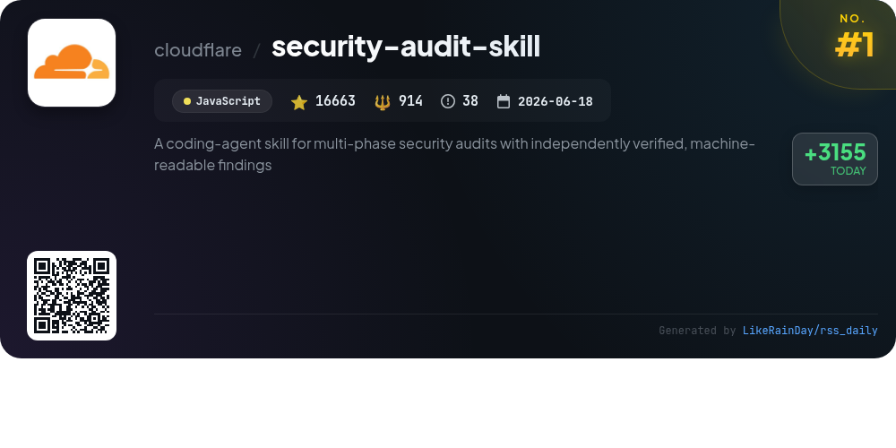
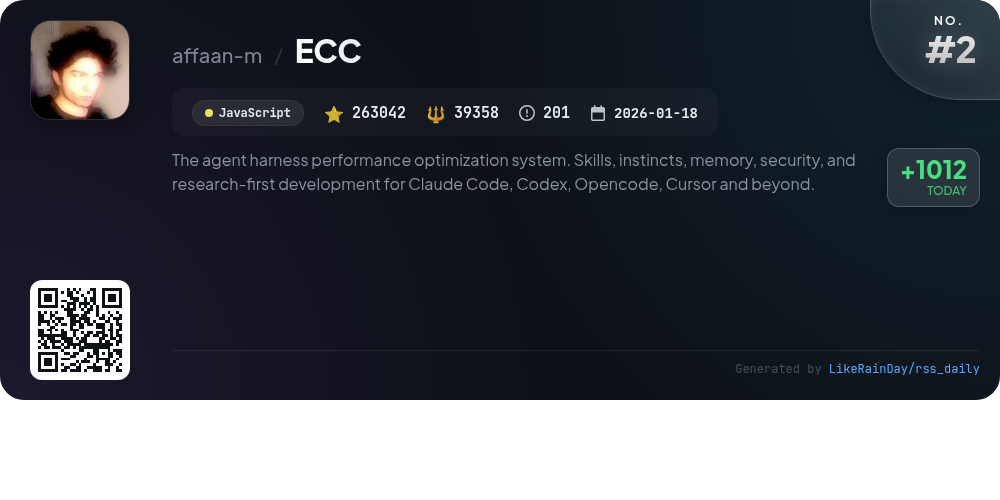
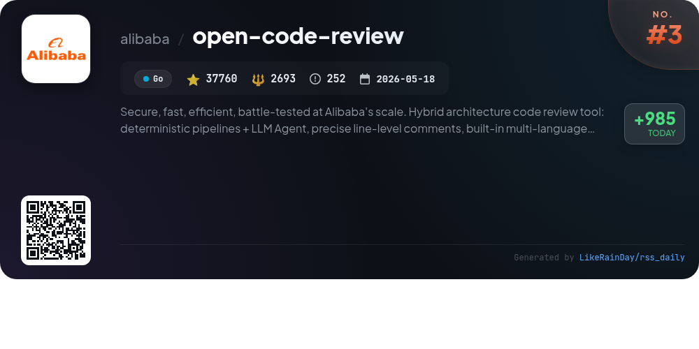
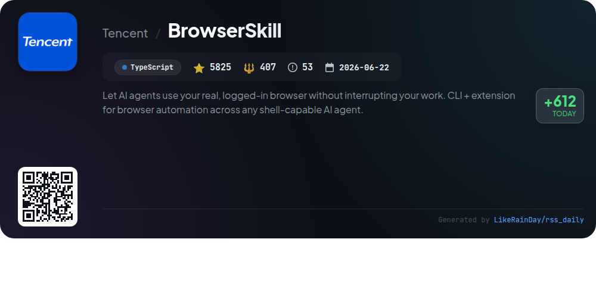
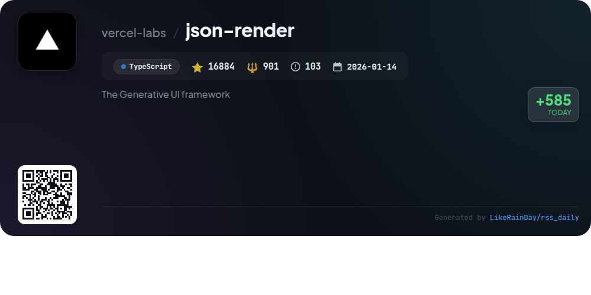
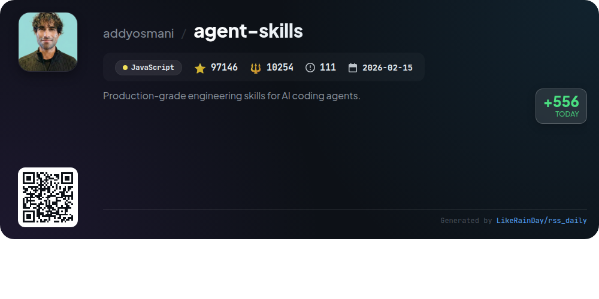
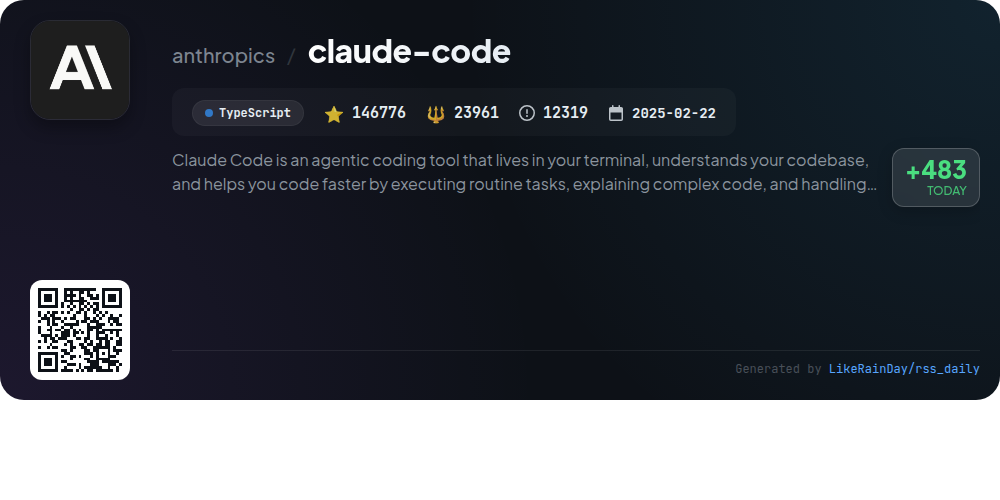
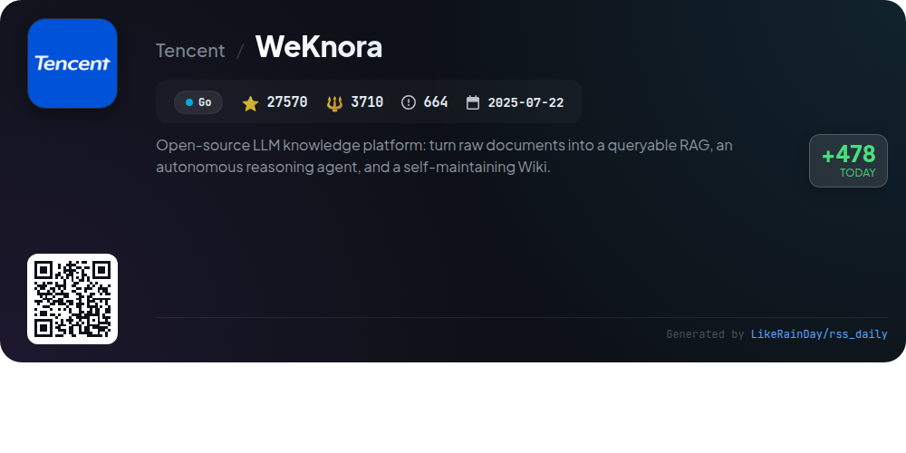
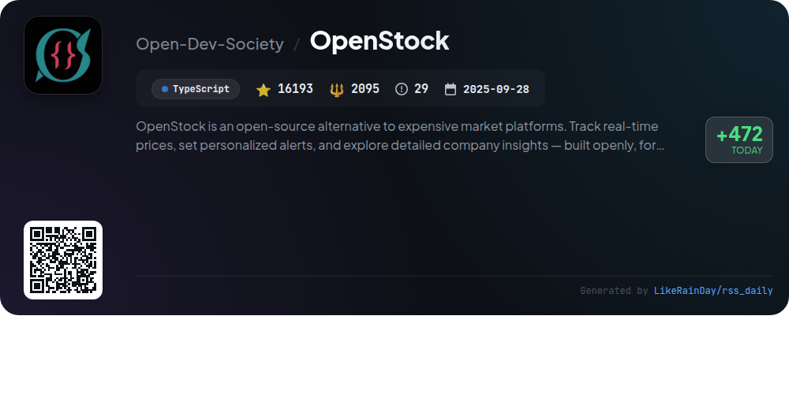
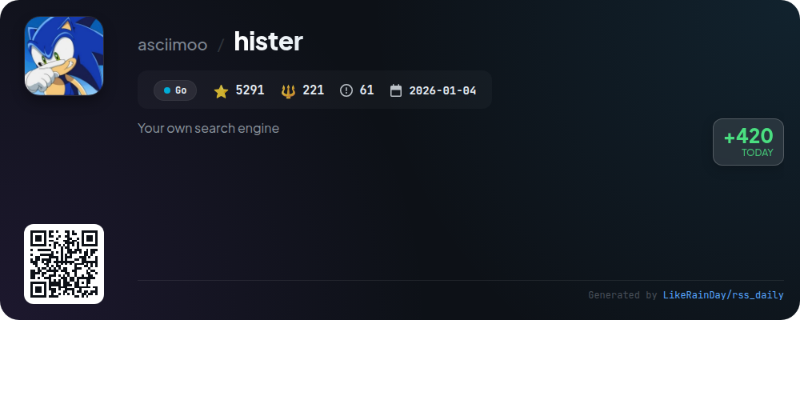

# 📊 🌟 GitHub Trending Daily - 2026-09-20

> > 📅 每日精选 GitHub 热门仓库 | 基于智能算法推荐

## 📋 Overview

**10** 个项目 | **633150** ⭐ | **84514** 🍴

**热门语言:** `TypeScript` (4) · `JavaScript` (3) · `Go` (3)

**更新时间:** 2026-09-20 04:29 UTC

**分类分布:**

- 🌟 每日 Top 10 精选 (10 项)

---

## 🌟 每日 Top 10 精选

### 1. [security-audit-skill](https://github.com/cloudflare/security-audit-skill)

> 🤖 **推荐理由**  
> *A coding-agent skill for multi-phase security audits with independently verified, machine-readable findings. popular project, actively maintained, recently updated*

- ⭐ 16663 stars
- 🍴 914 forks
- 💻 JavaScript
- 📅 Updated: 2026-09-20

### 2. [ECC](https://github.com/affaan-m/ECC)

> 🤖 **推荐理由**  
> *ECC is an advanced performance optimization system designed for coding agents like Claude Code, Codex, and others. It offers 68 specialized agents, 292 reusable skills, and 94 command shims, facilitating workflows like test-driven development, security reviews, and code refactoring. ECC enhances coding efficiency through memory persistence, continuous learning, and integrated security scanning via AgentShield. It supports various platforms, including Claude Code and Codex, ensuring a seamless integration experience. The project is open-source and actively maintained, with a strong community and sponsorship model.*

- ⭐ 263042 stars
- 💻 JavaScript
- 📅 Updated: 2026-09-20

### 3. [open-code-review](https://github.com/alibaba/open-code-review)

> 🤖 **推荐理由**  
> *Open Code Review is a hybrid AI-powered code review tool developed by Alibaba, designed for security, speed, and efficiency. It combines deterministic pipelines with a large language model (LLM) agent for precise line-level feedback. Key features include a built-in multi-language ruleset (covering NPE, thread-safety, XSS, SQL injection), the ability to read Git diffs, and comprehensive review capabilities, including full-file scans. With over 37,760 stars, it supports multiple platforms and integrates with popular AI coding agents like Claude and Codex, optimizing code quality at scale.*

- ⭐ 37760 stars
- 💻 Go
- 📅 Updated: 2026-09-20

### 4. [BrowserSkill](https://github.com/Tencent/BrowserSkill)

> 🤖 **推荐理由**  
> *BrowserSkill is a powerful tool that allows AI agents to utilize your logged-in browser seamlessly without disrupting your workflow. This TypeScript-based project supports a variety of AI agents, including Cursor and Claude Code, through its CLI and browser extension. Key features include reuse of existing login states, uninterrupted user experience with tasks running in a separate Agent Window, and built-in human-in-the-loop capabilities for handling complex interactions like CAPTCHAs. Compatible with macOS, Linux, and Windows, it enhances automation while maintaining user control.*

- ⭐ 5825 stars
- 💻 TypeScript
- 📅 Updated: 2026-09-20

### 5. [json-render](https://github.com/vercel-labs/json-render)

> 🤖 **推荐理由**  
> *json-render is a powerful Generative UI framework that enables the creation of dynamic, personalized user interfaces from natural language prompts while ensuring reliability. Key features include guardrailed AI component usage, predictable JSON output, and cross-platform compatibility (React, Vue, Svelte, Solid, and React Native). With 36 pre-built components, it supports diverse applications such as web, mobile, video, PDF, and email. Its streaming capabilities allow for progressive rendering, making it a versatile tool for developers seeking to enhance UI efficiency and creativity.*

- ⭐ 16884 stars
- 💻 TypeScript
- 📅 Updated: 2026-09-20

### 6. [agent-skills](https://github.com/addyosmani/agent-skills)

> 🤖 **推荐理由**  
> *Agent-skills is a cutting-edge JavaScript project designed to enhance AI coding agents with production-grade engineering skills. With over 97,000 stars, it stands out for its robust features that enable seamless integration of AI capabilities into coding workflows. Key highlights include advanced code generation, error handling, and optimization techniques, making it an invaluable resource for developers aiming to leverage AI in software development. This project provides essential tools and services that streamline coding processes, fostering innovation and efficiency in programming practices.*

- ⭐ 97146 stars
- 💻 JavaScript
- 📅 Updated: 2026-09-20

### 7. [claude-code](https://github.com/anthropics/claude-code)

> 🤖 **推荐理由**  
> *Claude Code is an innovative coding tool designed for terminal use, enhancing developer productivity by executing routine tasks, explaining complex code, and managing git workflows through natural language commands. With over 146,000 stars, it supports custom plugins for extended functionality. Claude Code offers seamless installation on various platforms and fosters community engagement through a dedicated Discord channel. Key features include error reporting via the `/bug` command and strict data privacy measures, ensuring user feedback is handled securely.*

- ⭐ 146776 stars
- 💻 TypeScript
- 📅 Updated: 2026-09-20

### 8. [WeKnora](https://github.com/Tencent/WeKnora)

> 🤖 **推荐理由**  
> *WeKnora is an open-source LLM-powered knowledge platform designed for enterprise document understanding and autonomous reasoning. Key features include RAG-based quick Q&A, a ReAct agent for multi-step tasks, and a self-maintaining Wiki Mode that converts raw documents into interlinked markdown pages. It supports cross-session long-term memory, multi-source document ingestion, and over 20 LLM integrations, enabling seamless Q&A via IM channels. WeKnora is modular, self-hostable, and offers extensive observability, making it ideal for transforming scattered documents into a dynamic knowledge asset.*

- ⭐ 27570 stars
- 💻 Go
- 📅 Updated: 2026-09-20

### 9. [OpenStock](https://github.com/Open-Dev-Society/OpenStock)

> 🤖 **推荐理由**  
> *OpenStock is an open-source stock market tracking platform, providing a free alternative to costly market services. Key features include real-time price tracking, personalized alerts, and comprehensive company insights. Built with Next.js and TypeScript, it offers user authentication, a customizable watchlist, and detailed market data through Finnhub and TradingView integration. OpenStock supports 30+ international exchanges and emphasizes community-driven development. It's designed for accessibility, ensuring everyone can utilize its robust financial tools without barriers.*

- ⭐ 16193 stars
- 💻 TypeScript
- 📅 Updated: 2026-09-20

### 10. [hister](https://github.com/asciimoo/hister)

> 🤖 **推荐理由**  
> *Hister is a private search engine that indexes the full content of web pages and local files, allowing users to search through their own data via a web interface, terminal, or AI assistant. Key features include privacy-focused operation with no telemetry, full-text indexing, automatic page indexing through browser extensions, and powerful querying capabilities. Hister supports semantic search, multi-user setups, and offers various installation methods like Docker and Homebrew. It prioritizes user control, enabling personalized search without reliance on third-party services.*

- ⭐ 5291 stars
- 💻 Go
- 📅 Updated: 2026-09-20

---

## 📡 RSS订阅

通过 RSS 订阅，第一时间获取每日精选项目：

- 🔔 [RSS 订阅源] (../../daily-top.xml)
- 🔔 [每日简报] (../../GITHUB_TODAY_CN.md)
- 🔔 [每日 Top 10 精选](../../daily-top.xml)

---

*⚡ Powered by Smart Trending Algorithm | Generated at 2026-09-20 04:29:21 UTC
