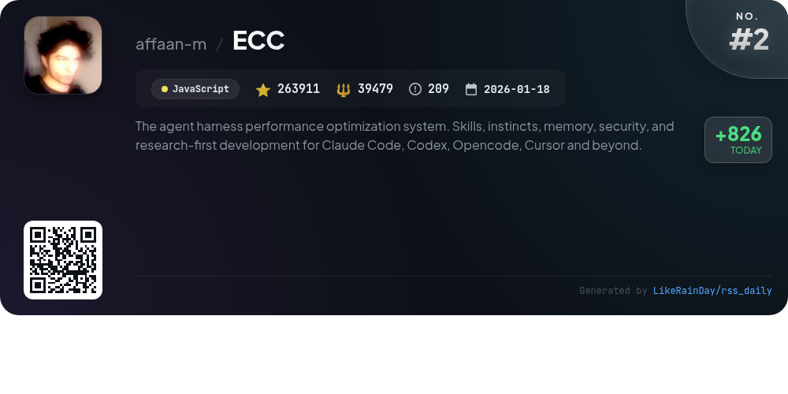
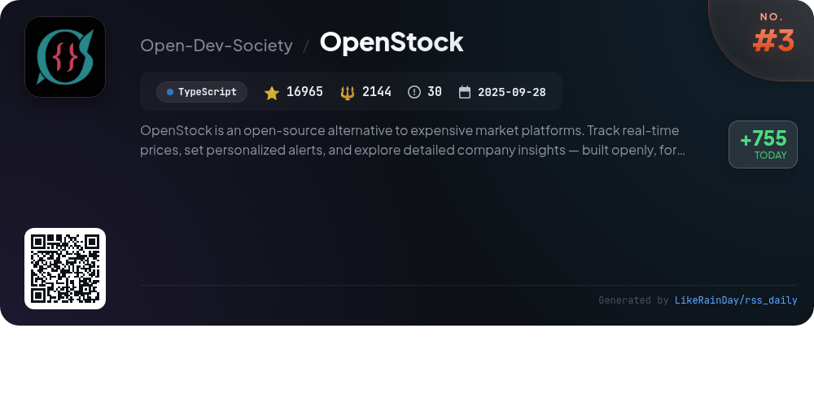
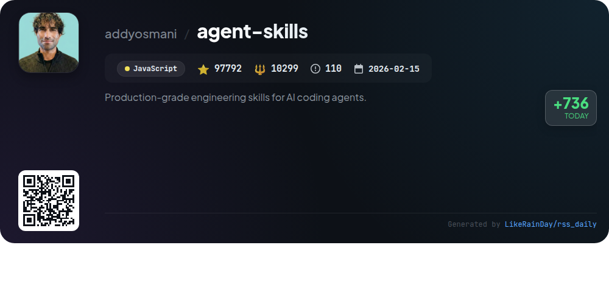
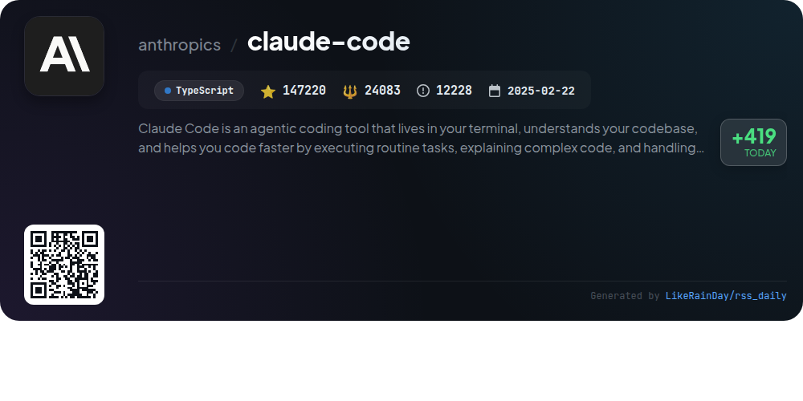
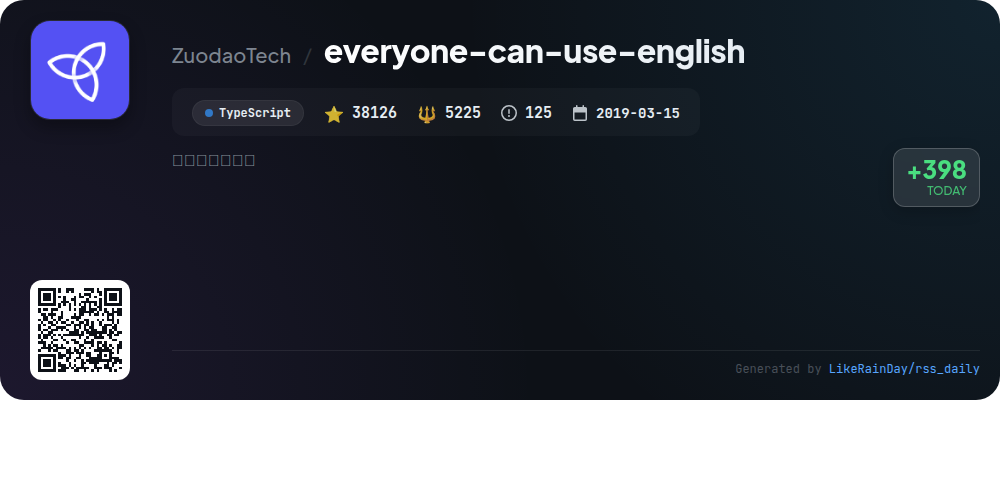
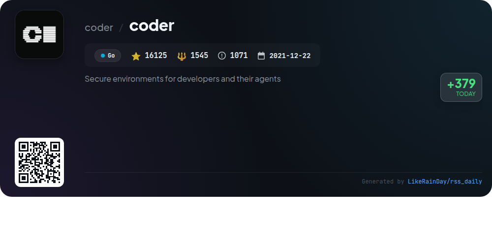
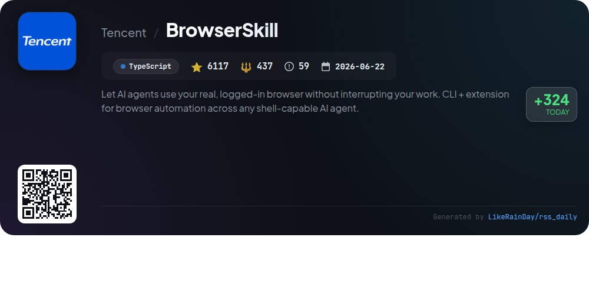
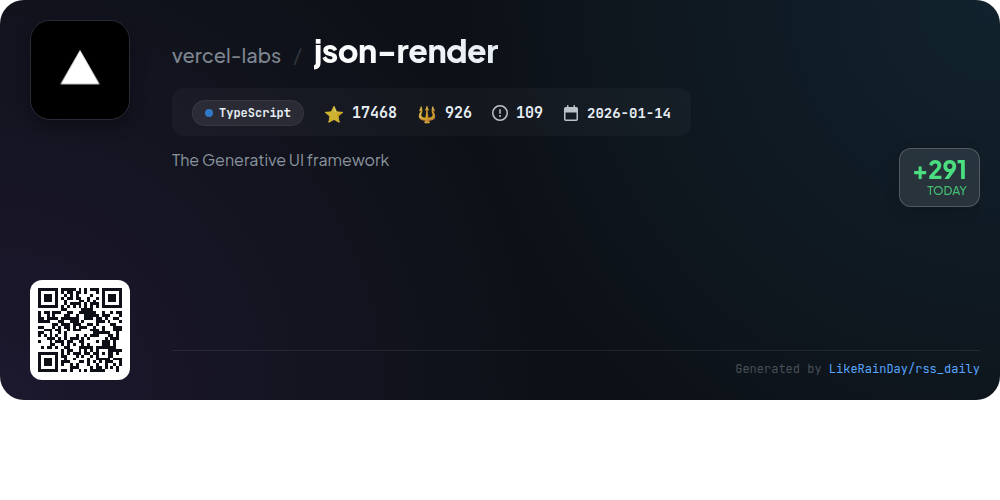
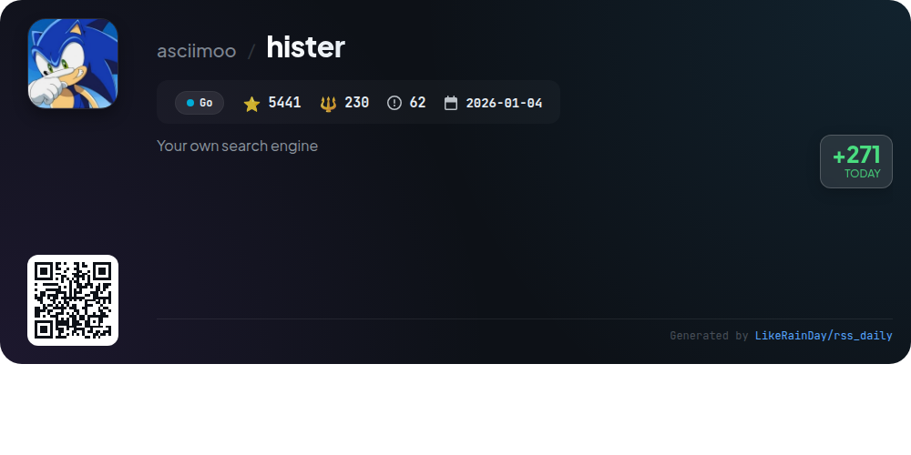

# 📊 🌟 GitHub Trending Daily - 2026-09-21

> > 📅 每日精选 GitHub 热门仓库 | 基于智能算法推荐

## 📋 Overview

**10** 个项目 | **627378** ⭐ | **85387** 🍴

**热门语言:** `TypeScript` (5) · `JavaScript` (3) · `Go` (2)

**更新时间:** 2026-09-21 04:27 UTC

**分类分布:**

- 🌟 每日 Top 10 精选 (10 项)

---

## 🌟 每日 Top 10 精选

### 1. [security-audit-skill](https://github.com/cloudflare/security-audit-skill)

> 🤖 **推荐理由**  
> *A coding-agent skill for multi-phase security audits with independently verified, machine-readable findings. popular project, actively maintained, recently updated*

- ⭐ 18213 stars
- 🍴 1019 forks
- 💻 JavaScript
- 📅 Updated: 2026-09-21

### 2. [ECC](https://github.com/affaan-m/ECC)

> 🤖 **推荐理由**  
> *ECC is an advanced agent harness performance optimization system designed for developers. It enhances coding workflows through 68 specialized agents, 292 reusable skills, and 94 command shims, promoting practices like Test-Driven Development (TDD) and security reviews. Key features include memory persistence, automated hooks for code quality enforcement, and AgentShield for security scanning. ECC integrates seamlessly with various platforms, including Claude Code, Codex, and Cursor, and supports project-specific configurations, making it a versatile tool for efficient software development.*

- ⭐ 263911 stars
- 💻 JavaScript
- 📅 Updated: 2026-09-21

### 3. [OpenStock](https://github.com/Open-Dev-Society/OpenStock)

> 🤖 **推荐理由**  
> *OpenStock is an open-source stock market platform designed to provide a free alternative to expensive market services. Key features include real-time price tracking, personalized alerts, and in-depth company insights, all built on a robust tech stack with Next.js, TypeScript, and Tailwind CSS. Users can create watchlists, access trading charts via TradingView, and receive automated email updates. OpenStock supports over 30 international exchanges and emphasizes community contributions, ensuring it remains free and accessible for everyone.*

- ⭐ 16965 stars
- 💻 TypeScript
- 📅 Updated: 2026-09-21

### 4. [agent-skills](https://github.com/addyosmani/agent-skills)

> 🤖 **推荐理由**  
> *Agent Skills is a production-grade toolkit for AI coding agents, offering structured workflows that emulate the best practices of senior engineers across the software development lifecycle. With 25 skills, it aids in defining, planning, building, verifying, reviewing, and shipping code. Key features include automated task generation, integration with 70+ agents, and specialized commands for each development phase. The project emphasizes quality, security, and performance, embedding crucial principles from Google's engineering culture to ensure robust, production-ready outputs.*

- ⭐ 97792 stars
- 💻 JavaScript
- 📅 Updated: 2026-09-21

### 5. [claude-code](https://github.com/anthropics/claude-code)

> 🤖 **推荐理由**  
> *Claude Code is an intelligent coding tool that integrates into your terminal, streamlining your coding process with natural language commands. It accelerates routine tasks, clarifies complex code, and manages git workflows. With plugins for extended functionality, it supports various installation methods across platforms. Engage with the community through Discord and report issues directly within the tool. Claude Code emphasizes user privacy with strict data safeguards. Explore more in the official documentation at [claude.com](https://code.claude.com/docs/en/overview).*

- ⭐ 147220 stars
- 💻 TypeScript
- 📅 Updated: 2026-09-21

### 6. [everyone-can-use-english](https://github.com/ZuodaoTech/everyone-can-use-english)

> 🤖 **推荐理由**  
> *The "everyone-can-use-english" project is a TypeScript-based initiative aimed at making English language learning accessible to all. With over 38,000 stars, it offers engaging tools and resources that enhance language acquisition through interactive exercises and real-world applications. Key features include user-friendly interfaces, adaptive learning paths, and community-driven content to support learners at all levels. This project fosters inclusivity and empowers individuals to gain confidence in their English skills, making language learning a more enjoyable experience for everyone.*

- ⭐ 38126 stars
- 💻 TypeScript
- 📅 Updated: 2026-09-21

### 7. [coder](https://github.com/coder/coder)

> 🤖 **推荐理由**  
> *Coder is a self-hosted platform for cloud development environments and AI coding agents, boasting over 16,000 stars on GitHub. It enables developers to define workspaces using Terraform, securely connect through Wireguard®, and automatically shut down idle resources to optimize costs. Key features include rapid onboarding, AI agent integration for coding tasks without sharing credentials, and centralized model governance. Coder supports multiple infrastructure options like EC2, Kubernetes, and Docker, along with a variety of integrations, making it an efficient solution for modern development teams.*

- ⭐ 16125 stars
- 💻 Go
- 📅 Updated: 2026-09-21

### 8. [BrowserSkill](https://github.com/Tencent/BrowserSkill)

> 🤖 **推荐理由**  
> *BrowserSkill is a powerful tool that enables AI agents to utilize your real, logged-in browser without disrupting your workflow. With a CLI and browser extension, it supports various agents like Cursor, Claude Code, and Codex. Key features include leveraging existing login states, running tasks in a separate Agent Window, and a built-in human-in-loop mechanism for handling CAPTCHAs and confirmations. Compatible with macOS, Linux, and Windows, it supports Chrome and Edge, with plans for Firefox. BrowserSkill offers seamless integration for automating tasks while you maintain control over your browsing experience.*

- ⭐ 6117 stars
- 💻 TypeScript
- 📅 Updated: 2026-09-21

### 9. [json-render](https://github.com/vercel-labs/json-render)

> 🤖 **推荐理由**  
> *json-render is a powerful Generative UI framework that allows users to create dynamic, personalized user interfaces from natural language prompts while maintaining reliability. With predefined components and actions, it ensures predictable JSON output. Key features include cross-platform support (React, Vue, Svelte, Solid, React Native), fast progressive rendering, and a library of 36 pre-built UI components. It supports various rendering formats such as PDFs, emails, and 3D scenes, while also offering state management and AI prompt generation capabilities for enhanced interactivity and customization.*

- ⭐ 17468 stars
- 💻 TypeScript
- 📅 Updated: 2026-09-21

### 10. [hister](https://github.com/asciimoo/hister)

> 🤖 **推荐理由**  
> *Hister is a private search engine that indexes and searches the content of web pages and local files, prioritizing user privacy with no telemetry or mandatory cloud services. Key features include full text indexing, automatic browser page indexing via extensions, powerful query capabilities, and multi-user support. Hister can be accessed through a web interface, terminal, or AI assistant. Users can import browser history and bookmarks, or index local directories. It offers optional semantic search and can be run locally or on user-controlled infrastructure.*

- ⭐ 5441 stars
- 💻 Go
- 📅 Updated: 2026-09-21

---

## 📡 RSS订阅

通过 RSS 订阅，第一时间获取每日精选项目：

- 🔔 [RSS 订阅源] (../../daily-top.xml)
- 🔔 [每日简报] (../../GITHUB_TODAY_CN.md)
- 🔔 [每日 Top 10 精选](../../daily-top.xml)

---

*⚡ Powered by Smart Trending Algorithm | Generated at 2026-09-21 04:27:12 UTC
