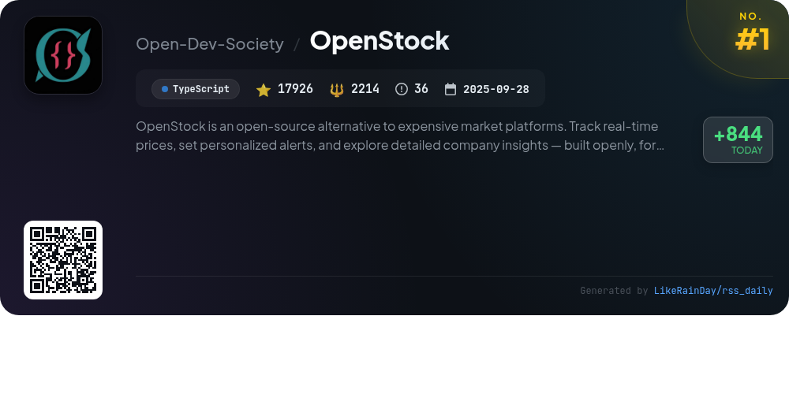
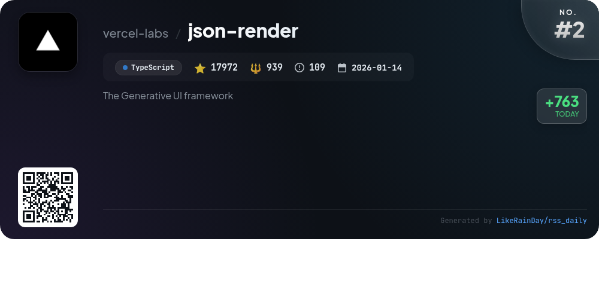
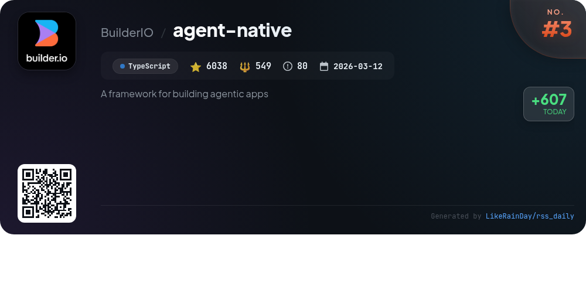
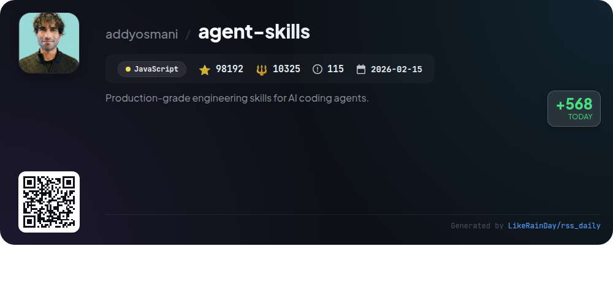
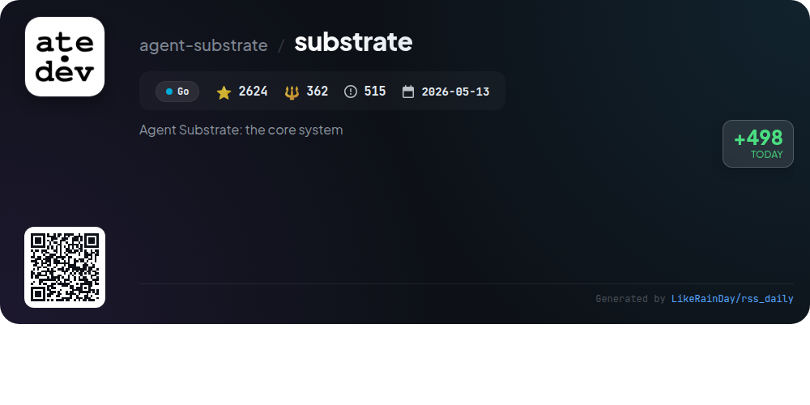
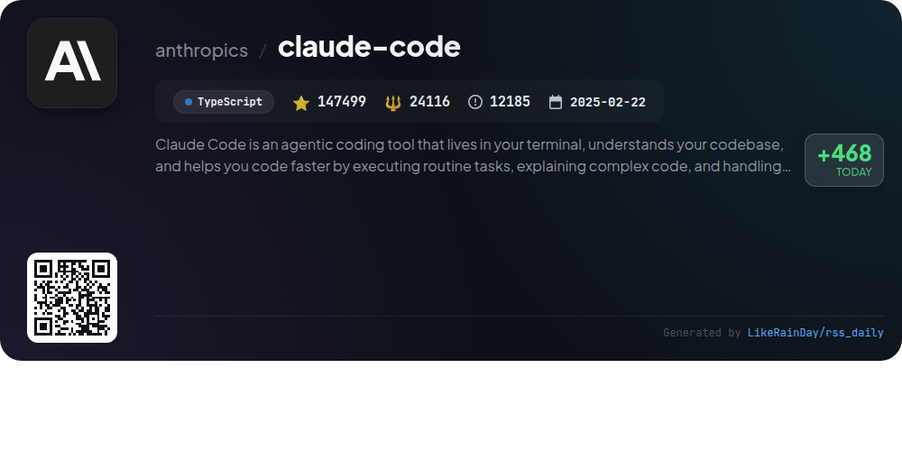
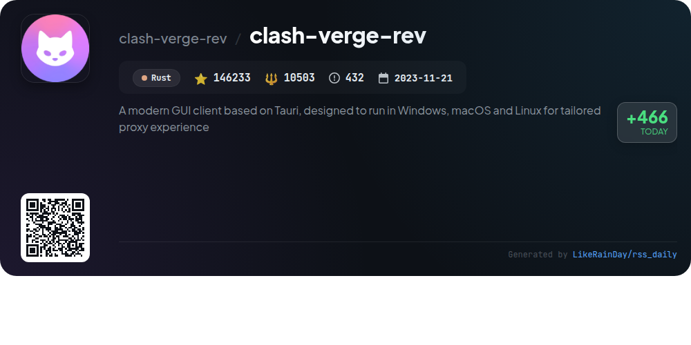
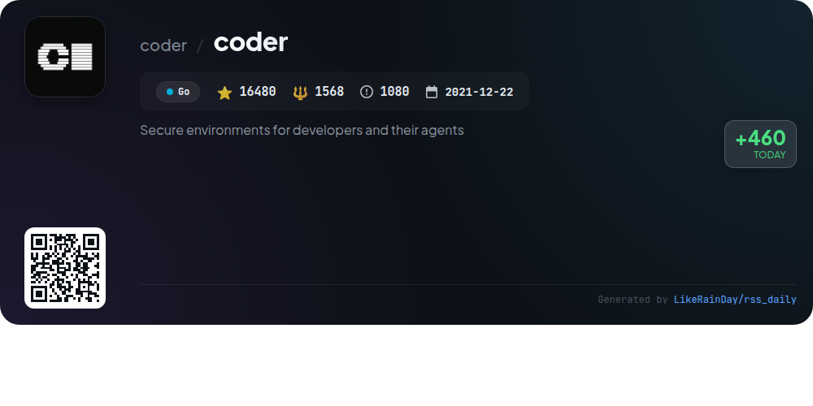
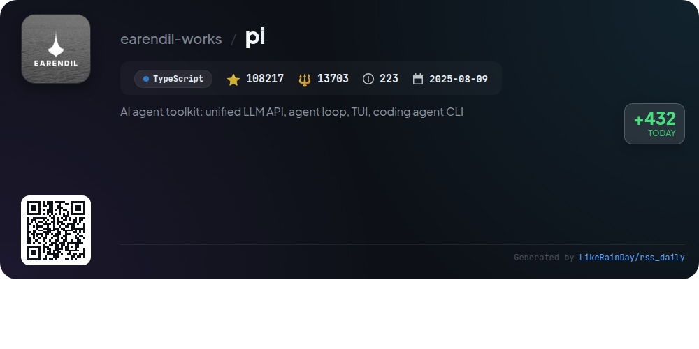
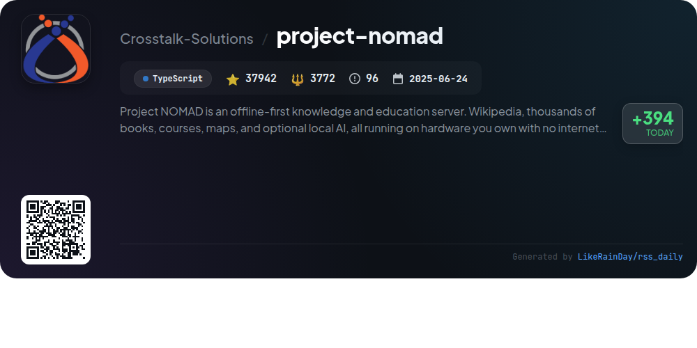

# 📊 🌟 GitHub Trending Daily - 2026-09-22

> > 📅 每日精选 GitHub 热门仓库 | 基于智能算法推荐

## 📋 Overview

**10** 个项目 | **599123** ⭐ | **68051** 🍴

**热门语言:** `TypeScript` (6) · `Go` (2) · `Rust` (1)

**更新时间:** 2026-09-22 04:23 UTC

**分类分布:**

- 🌟 每日 Top 10 精选 (10 项)

---

## 🌟 每日 Top 10 精选

### 1. [OpenStock](https://github.com/Open-Dev-Society/OpenStock)

> 🤖 **推荐理由**  
> *OpenStock is a free, open-source stock market platform that provides real-time price tracking, personalized alerts, and in-depth company insights. Built with Next.js and TypeScript, it features email/password authentication, a user-friendly watchlist, and robust market data integration via the Finnhub API and TradingView widgets. Users enjoy a polished UI with dark mode, global search functionality, and automated email updates. Designed for accessibility and community collaboration, OpenStock empowers users to engage with financial data without barriers.*

- ⭐ 17926 stars
- 💻 TypeScript
- 📅 Updated: 2026-09-22

### 2. [json-render](https://github.com/vercel-labs/json-render)

> 🤖 **推荐理由**  
> *json-render is a powerful Generative UI framework that enables the creation of dynamic, personalized interfaces using natural language prompts, while maintaining predictable output through defined components. It supports multiple platforms, including React, Vue, Svelte, SolidJS, and React Native, with 36 pre-built components for rapid development. Key features include AI-driven JSON specification generation, streaming responses, guardrails for safety, and state-driven dynamic properties. The framework also offers extensive integration options for video, PDF, and email rendering, making it versatile for various applications.*

- ⭐ 17972 stars
- 💻 TypeScript
- 📅 Updated: 2026-09-22

### 3. [agent-native](https://github.com/BuilderIO/agent-native)

> 🤖 **推荐理由**  
> *Agent-Native is an open-source TypeScript framework designed for creating agentic applications that integrate autonomous functionality with a user-friendly UI. Key features include shared actions for seamless interaction between agents and UIs, robust authentication, and support for automations and agent teams. It offers a PostgreSQL backend and includes various applications such as chat, design, and analytics. With over 6,000 stars on GitHub, it empowers developers to build versatile applications while retaining full control over their infrastructure. Explore more at agent-native.com.*

- ⭐ 6038 stars
- 💻 TypeScript
- 📅 Updated: 2026-09-22

### 4. [agent-skills](https://github.com/addyosmani/agent-skills)

> 🤖 **推荐理由**  
> *Agent Skills is a production-grade framework designed to enhance AI coding agents with structured workflows, quality gates, and best practices utilized by senior engineers. It features 25 skills that cover the entire development lifecycle, from defining and planning to building, verifying, reviewing, and shipping software. Key commands streamline processes, ensuring consistency and quality in code development. The project supports integration with various AI agents, enabling seamless installation and usage of skills. With a focus on verifiable outcomes and engineering discipline, Agent Skills elevates coding standards and practices.*

- ⭐ 98192 stars
- 💻 JavaScript
- 📅 Updated: 2026-09-22

### 5. [substrate](https://github.com/agent-substrate/substrate)

> 🤖 **推荐理由**  
> *Agent Substrate is a secure agent execution runtime built in Go, designed to manage millions of sandboxes with enhanced density and performance compared to standard container runtimes. Key features include sub-500ms resume operations, zero-trust isolation, and support for various sandbox technologies like microVMs and gVisor. It leverages Kubernetes for lifecycle management and scheduling, enabling efficient actor multiplexing and state persistence. With a focus on autonomy, Substrate supports diverse applications, including AI agents, and provides robust infrastructure management for scalable deployments.*

- ⭐ 2624 stars
- 💻 Go
- 📅 Updated: 2026-09-22

### 6. [claude-code](https://github.com/anthropics/claude-code)

> 🤖 **推荐理由**  
> *Claude Code is a powerful coding tool designed for terminal use, enabling developers to enhance their productivity. It understands your codebase, executing routine tasks, explaining complex code, and managing git workflows through natural language commands. Key features include installation via various methods (e.g., curl, Homebrew, PowerShell), a plugin system for extended functionality, and a user-friendly feedback mechanism. Join the Claude Developers Discord for community support. With 147,499 stars, Claude Code is a valuable asset for any developer looking to streamline their coding process.*

- ⭐ 147499 stars
- 💻 TypeScript
- 📅 Updated: 2026-09-22

### 7. [clash-verge-rev](https://github.com/clash-verge-rev/clash-verge-rev)

> 🤖 **推荐理由**  
> *Clash Verge Rev is a modern GUI client built on Tauri, offering a tailored proxy experience across Windows, macOS, and Linux. With over 146,000 stars, it features a sleek interface, customizable themes, and advanced configuration management, including support for the Clash.Meta kernel. Key highlights include a visual node editor, system proxy integration, and WebDav backup/sync capabilities. The project prioritizes user privacy, storing configurations locally. It supports multiple languages and offers stable and alpha releases for different user needs.*

- ⭐ 146233 stars
- 💻 Rust
- 📅 Updated: 2026-09-22

### 8. [coder](https://github.com/coder/coder)

> 🤖 **推荐理由**  
> *Coder is a self-hosted platform for secure cloud development environments and AI coding agents, designed for developers and their teams. Key features include defining workspaces with Terraform, automatic shutdown of idle resources to reduce costs, and rapid onboarding of developers. Coder allows the integration of various AI models without exposing sensitive credentials and provides centralized model governance. With support for Docker, Kubernetes, and VS Code, Coder enhances productivity while ensuring security and compliance in software development.*

- ⭐ 16480 stars
- 💻 Go
- 📅 Updated: 2026-09-22

### 9. [pi](https://github.com/earendil-works/pi)

> 🤖 **推荐理由**  
> *Pi is an AI agent toolkit designed to streamline interaction with large language models (LLMs). It features a unified LLM API supporting multiple providers (e.g., OpenAI, Anthropic), an interactive coding agent CLI, and a robust agent runtime for tool management and state handling. Key components include the `pi-coding-agent`, `pi-ai`, and `pi-agent-core`, along with a terminal UI library. The project emphasizes extensibility, vendor-neutral telemetry, and secure containerization options, making it ideal for developers seeking to enhance coding workflows with AI capabilities.*

- ⭐ 108217 stars
- 💻 TypeScript
- 📅 Updated: 2026-09-22

### 10. [project-nomad](https://github.com/Crosstalk-Solutions/project-nomad)

> 🤖 **推荐理由**  
> *Project NOMAD is an offline-first knowledge and education server designed to provide access to essential tools and resources without internet dependency. Key features include a local AI chat powered by Ollama, an offline Wikipedia via Kiwix, Khan Academy courses through Kolibri, and downloadable maps with ProtoMaps. It also offers data analysis tools via CyberChef, local note-taking with FlatNotes, and automatic updates. NOMAD is installable on Debian-based systems, making it a powerful solution for education and information accessibility anytime, anywhere.*

- ⭐ 37942 stars
- 💻 TypeScript
- 📅 Updated: 2026-09-22

---

## 📡 RSS订阅

通过 RSS 订阅，第一时间获取每日精选项目：

- 🔔 [RSS 订阅源] (../../daily-top.xml)
- 🔔 [每日简报] (../../GITHUB_TODAY_CN.md)
- 🔔 [每日 Top 10 精选](../../daily-top.xml)

---

*⚡ Powered by Smart Trending Algorithm | Generated at 2026-09-22 04:23:05 UTC
