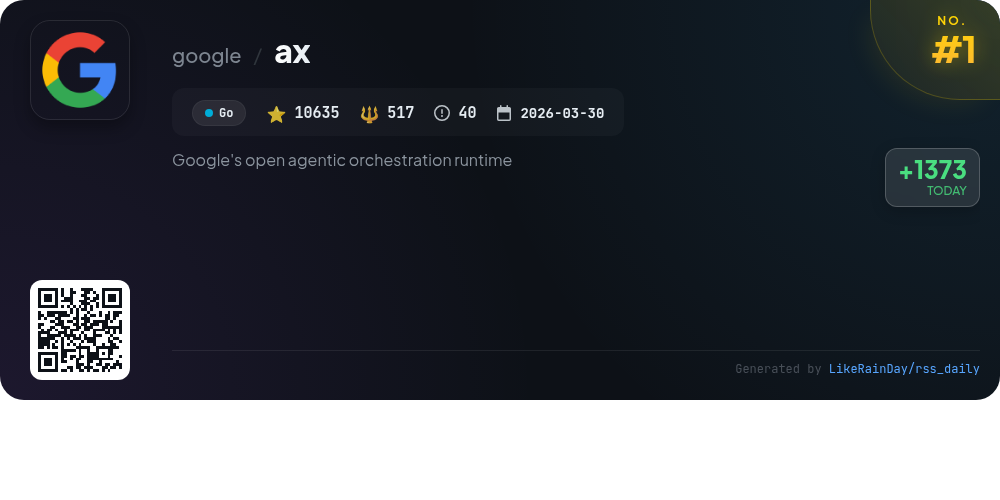
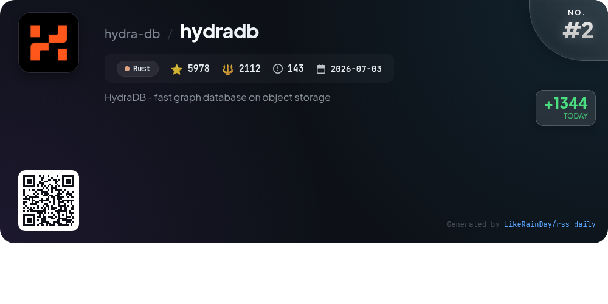
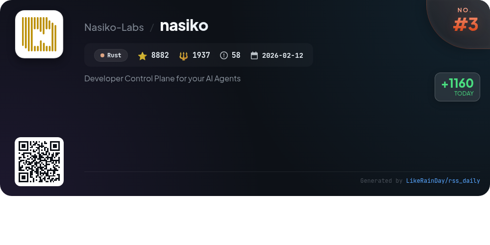
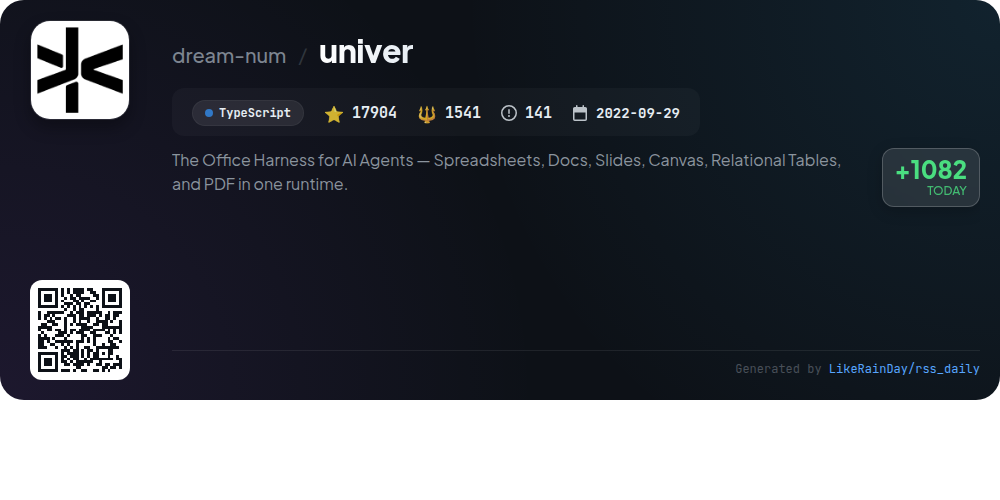
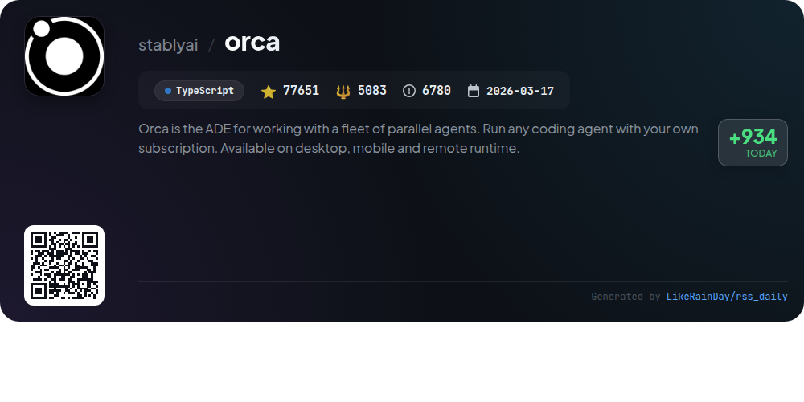
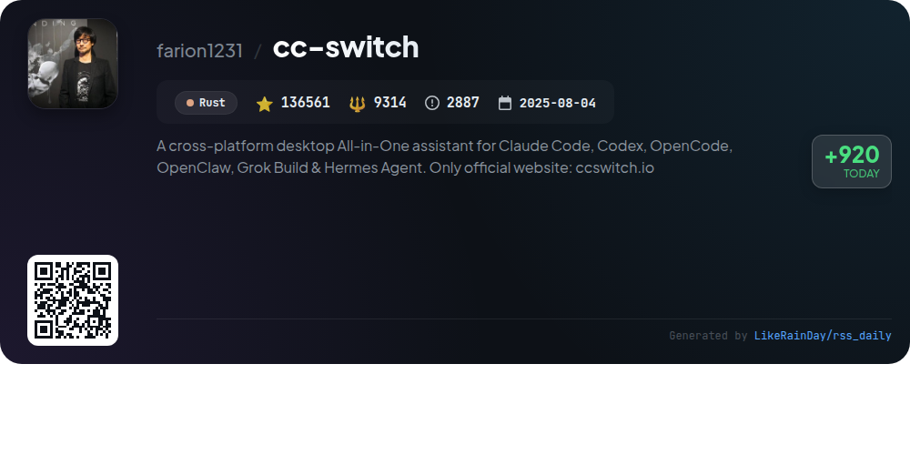
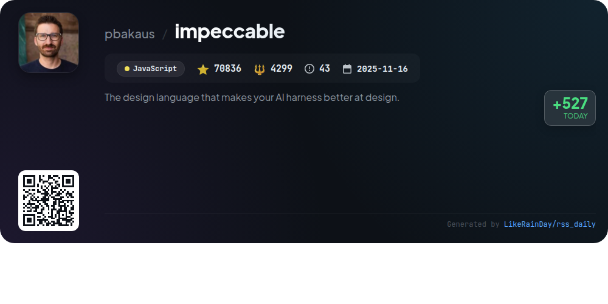
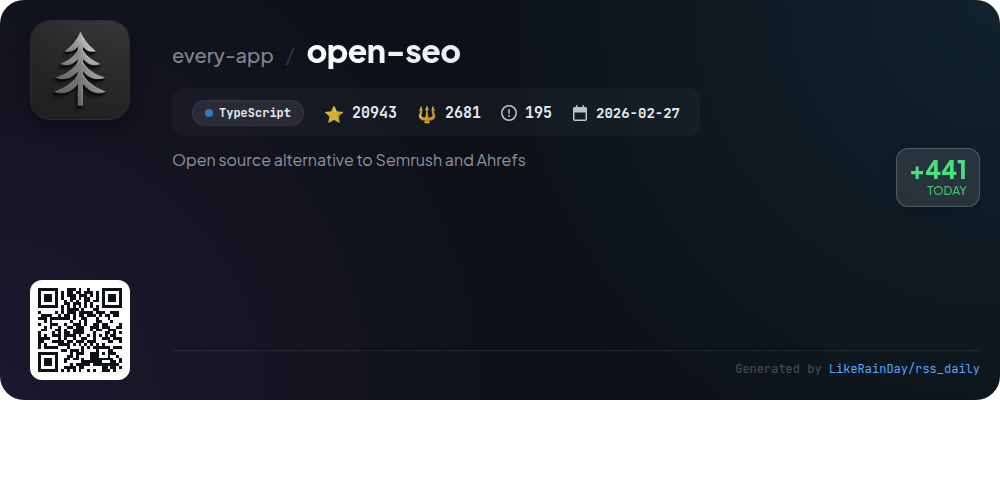
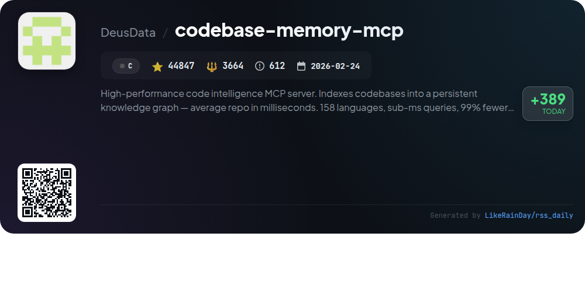
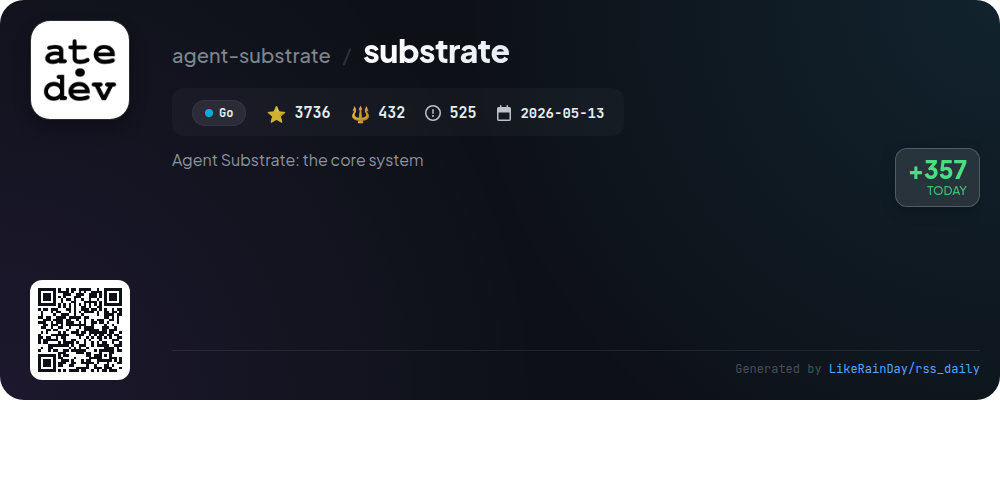

# 📊 🌟 GitHub Trending Daily - 2026-09-25

> > 📅 每日精选 GitHub 热门仓库 | 基于智能算法推荐

## 📋 Overview

**10** 个项目 | **397973** ⭐ | **31580** 🍴

**热门语言:** `Rust` (3) · `TypeScript` (3) · `Go` (2)

**更新时间:** 2026-09-25 04:29 UTC

**分类分布:**

- 🌟 每日 Top 10 精选 (10 项)

---

## 🌟 每日 Top 10 精选

### 1. [ax](https://github.com/google/ax)

> 🤖 **推荐理由**  
> *AX is Google's open-source orchestration runtime designed to execute billions of autonomous agent workloads efficiently in a Kubernetes cluster. Built on Agent Substrate, it offers a high-throughput, declarative approach to managing tasks with features like isolated sandboxes, pre-wired workspaces, and model configuration. Key functionalities include task suspension and resumption, live monitoring with `ax watch`, and interactive debugging via `ax ssh`. The CLI mimics `kubectl`, making it familiar for users. With over 10,600 stars, AX is still evolving, promising major updates ahead.*

- ⭐ 10635 stars
- 💻 Go
- 📅 Updated: 2026-09-25

### 2. [hydradb](https://github.com/hydra-db/hydradb)

> 🤖 **推荐理由**  
> *HydraDB is a high-performance, distributed graph database built on object storage, leveraging Rust for efficiency. Key features include durable S3-compatible storage, independent scaling of data nodes and indexers, and support for OpenCypher queries. It offers seamless Neo4j compatibility via Bolt connectivity and an HTTPS API. HydraDB ensures consistent reads with snapshot isolation and supports advanced graph-native execution using GraphBLAS. The architecture promotes modularity, allowing for efficient resource management and scalability. It also provides observability tools and Kubernetes integration for deployment.*

- ⭐ 5978 stars
- 💻 Rust
- 📅 Updated: 2026-09-25

### 3. [nasiko](https://github.com/Nasiko-Labs/nasiko)

> 🤖 **推荐理由**  
> *Nasiko is a Rust-based developer control plane for AI agents, enabling seamless deployment, routing, and management of A2A-speaking agents with a single command. Key features include an intelligent routing engine, full observability with OTel integration, flow guards to prevent runaway loops, and an embedded OCI registry for easy deployments. Agents are securely proxied, ensuring they are never publicly accessible. The platform supports multiple programming languages, allowing for a flexible agent ecosystem, while CLI-first commands streamline agent management and deployment.*

- ⭐ 8882 stars
- 💻 Rust
- 📅 Updated: 2026-09-25

### 4. [univer](https://github.com/dream-num/univer)

> 🤖 **推荐理由**  
> *Univer is an open-source Office SDK designed for creating embeddable productivity applications, integrating spreadsheets, documents, presentations, and more in one runtime. Key features include a customizable plugin architecture, a robust formula engine, and a unified Facade API for seamless functionality in both browser and Node.js environments. It supports headless operations for AI integration, allowing agents to interact with Office content programmatically. With extensive documentation and community support, Univer empowers developers to build collaborative and AI-enhanced tools efficiently.*

- ⭐ 17904 stars
- 💻 TypeScript
- 📅 Updated: 2026-09-25

### 5. [orca](https://github.com/stablyai/orca)

> 🤖 **推荐理由**  
> *Orca is an advanced development environment designed for managing a fleet of coding agents, enabling parallel execution with your own subscriptions. Key features include mobile companion apps for iOS and Android for remote monitoring, parallel worktrees for multi-agent collaboration, and Ghostty-class terminals for enhanced productivity. It supports seamless integration with GitHub and Linear, along with SSH worktrees for remote operations. With a focus on real-time interactions, notifications, and rich file handling, Orca streamlines workflows for developers on macOS, Windows, and Linux.*

- ⭐ 77651 stars
- 💻 TypeScript
- 📅 Updated: 2026-09-25

### 6. [cc-switch](https://github.com/farion1231/cc-switch)

> 🤖 **推荐理由**  
> *CC Switch is a cross-platform desktop app designed to manage multiple AI coding tools, including Claude Code, Codex, and Gemini CLI, from a single interface. Key features include one-click provider switching with over 50 presets, unified management of MCP servers and skills, and cloud sync capabilities. Users can track usage and costs with a detailed dashboard. Built with Tauri in Rust, it offers quick access from the system tray and supports Windows, macOS, and Linux. The app streamlines API configurations, enhancing workflow efficiency for developers.*

- ⭐ 136561 stars
- 💻 Rust
- 📅 Updated: 2026-09-25

### 7. [impeccable](https://github.com/pbakaus/impeccable)

> 🤖 **推荐理由**  
> *Impeccable is a design language tool for AI coding agents, featuring 24 commands and 61 deterministic rules for enhancing frontend design. Key features include a streamlined setup flow with `/impeccable init`, a shared design vocabulary, and real-time browser iteration. It helps avoid common design anti-patterns while offering commands for tasks like auditing, critiquing, and polishing designs. Compatible with various AI tools like GitHub Copilot and Claude Code, Impeccable focuses on creating high-quality, context-aware designs. Full documentation is available at impeccable.style.*

- ⭐ 70836 stars
- 💻 JavaScript
- 📅 Updated: 2026-09-25

### 8. [open-seo](https://github.com/every-app/open-seo)

> 🤖 **推荐理由**  
> *OpenSEO is a powerful open-source SEO tool designed as a cost-effective alternative to Semrush and Ahrefs. With over 20,000 stars on GitHub, it offers key features like keyword research, rank tracking, competitor insights, and site audits through a modern, user-friendly interface. Users can connect AI agents, customize workflows, and self-host via Docker or Cloudflare. OpenSEO operates on a pay-as-you-go basis using a DataForSEO API key, ensuring you only pay for what you use. A hosted version is available for $10/month, encouraging community engagement and contributions.*

- ⭐ 20943 stars
- 💻 TypeScript
- 📅 Updated: 2026-09-25

### 9. [codebase-memory-mcp](https://github.com/DeusData/codebase-memory-mcp)

> 🤖 **推荐理由**  
> *High-performance code intelligence MCP server. Indexes codebases into a persistent knowledge graph — average repo in milliseconds. 158 languages, su. popular project, actively maintained, recently updated*

- ⭐ 44847 stars
- 🍴 3664 forks
- 💻 C
- 📅 Updated: 2026-09-25

### 10. [substrate](https://github.com/agent-substrate/substrate)

> 🤖 **推荐理由**  
> *Agent Substrate is a secure agent execution runtime designed to efficiently manage millions of sandboxes, achieving 10x higher density than traditional container runtimes. It offers sub-500ms resume operations with over 500 activations per second, utilizing zero-trust kernel and network isolation. Key features include actor lifecycle management, state persistence, and high-performance multiplexing of stateful actors. Built on Kubernetes, it supports various sandbox technologies and is framework-agnostic, making it suitable for diverse agent applications. The project is pre-1.0 and encourages community contributions.*

- ⭐ 3736 stars
- 💻 Go
- 📅 Updated: 2026-09-25

---

## 📡 RSS订阅

通过 RSS 订阅，第一时间获取每日精选项目：

- 🔔 [RSS 订阅源] (../../daily-top.xml)
- 🔔 [每日简报] (../../GITHUB_TODAY_CN.md)
- 🔔 [每日 Top 10 精选](../../daily-top.xml)

---

*⚡ Powered by Smart Trending Algorithm | Generated at 2026-09-25 04:29:05 UTC
