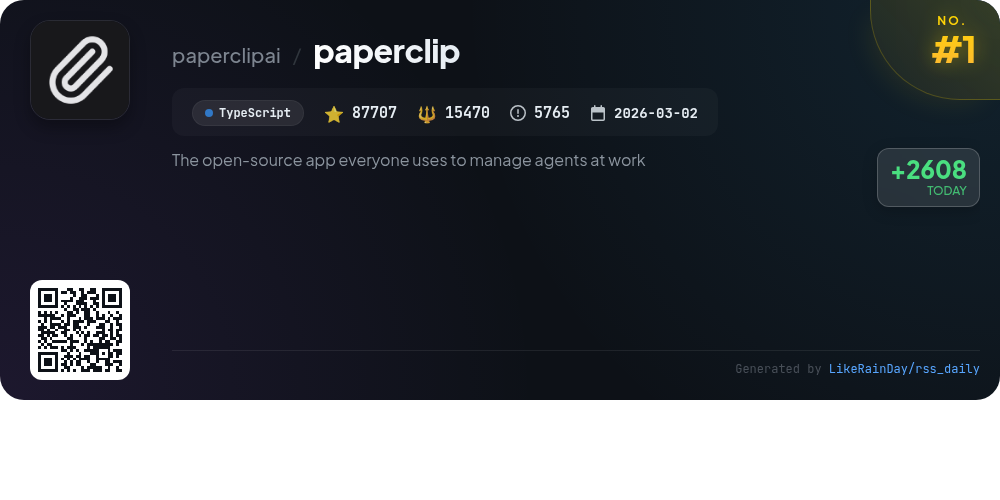
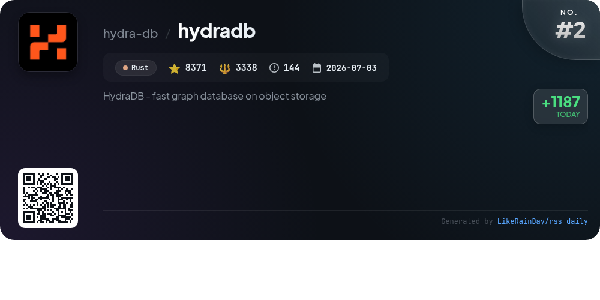
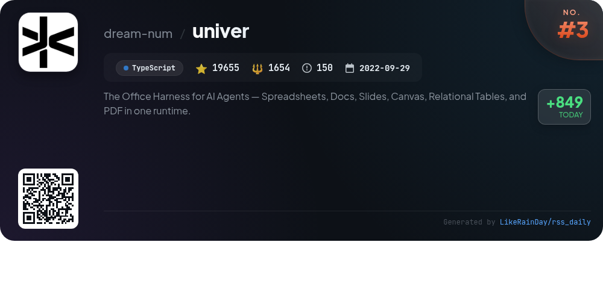
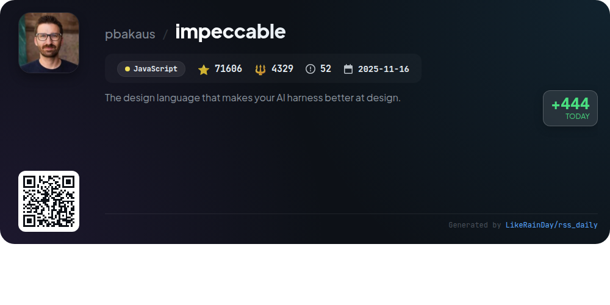
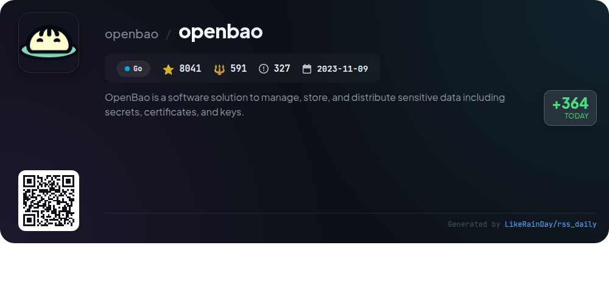
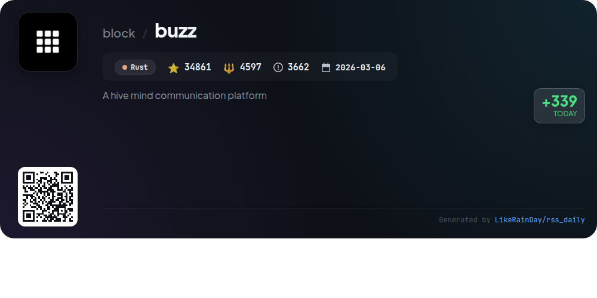
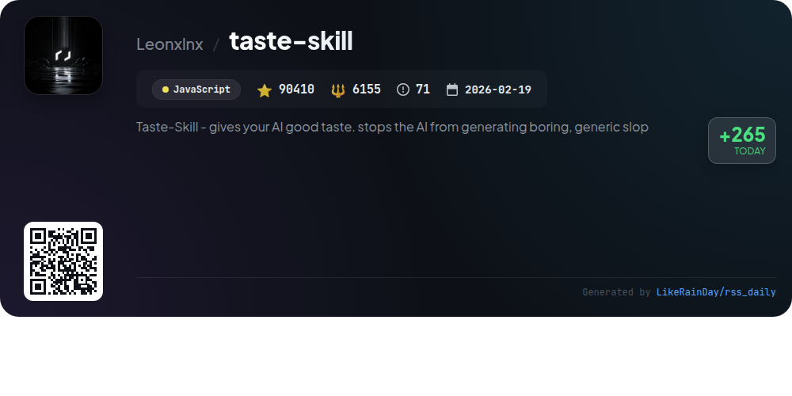
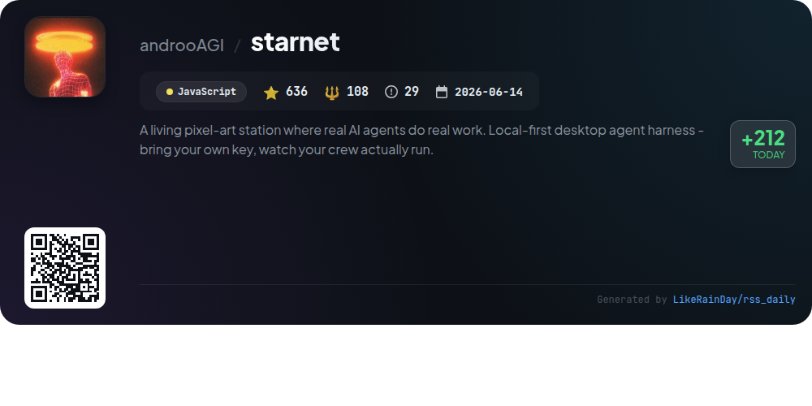
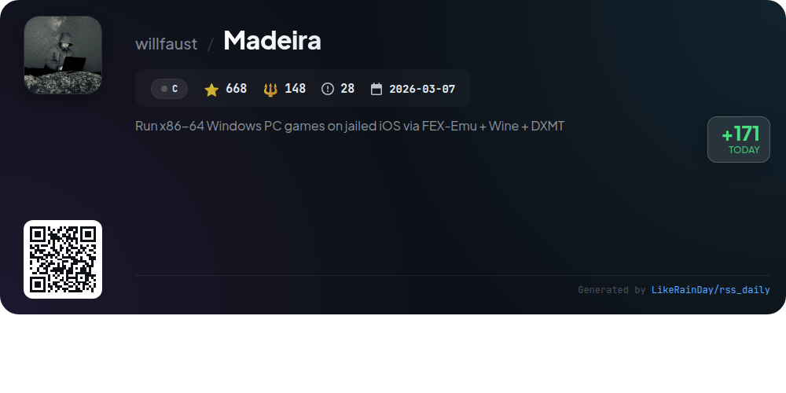
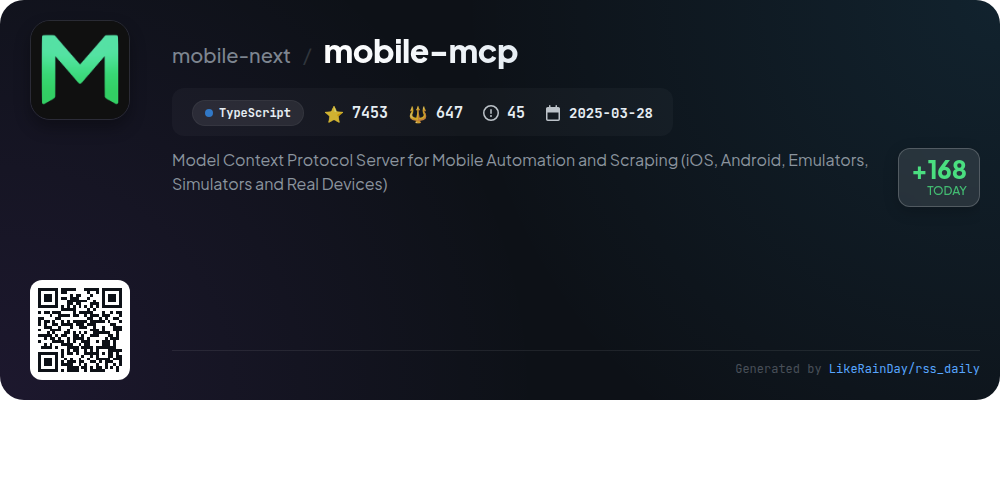

# 📊 🌟 GitHub Trending Daily - 2026-09-27

> > 📅 Daily Picks of GitHub Trending Repositories | Powered by Smart Algorithms

## 📋 Overview

**10** Projects | **329408** ⭐ | **37037** 🍴

**Top Languages:** `JavaScript` (3) · `TypeScript` (3) · `Rust` (2)

**Updated:** 2026-09-27 04:51 UTC

**Categories:**

- 🌟 Daily Top 10 (10 items)

---

## 🌟 Daily Top 10

### 1. [paperclip](https://github.com/paperclipai/paperclip)

> 🤖 **Why Recommend**  
> *Paperclip is an open-source app designed for managing AI agents in the workplace, boasting over 87,000 stars on GitHub. It combines a Node.js server and React UI to orchestrate AI teams, allowing users to set goals, track costs, and manage tasks through an intuitive dashboard. Core features include agent integration, goal alignment, cost control, and governance. Paperclip enables seamless coordination of multiple AI agents, providing tools for budget management, audit trails, and persistent task context, making it ideal for building autonomous AI organizations.*

- ⭐ 87707 stars
- 💻 TypeScript
- 📅 Updated: 2026-09-27

### 2. [hydradb](https://github.com/hydra-db/hydradb)

> 🤖 **Why Recommend**  
> *HydraDB is a high-performance, distributed graph database built in Rust, leveraging object storage for durability. It supports OpenCypher queries, GraphBLAS traversal, and Neo4j-compatible connectivity. Key features include disaggregated storage and compute roles, safe writer handoff, and consistent reads via SlateDB snapshots. HydraDB allows applications to connect through Neo4j drivers or a robust HTTPS API, ensuring flexibility and familiarity. With independent scaling of data nodes and indexers, it optimizes resource use while maintaining high availability and performance.*

- ⭐ 8371 stars
- 💻 Rust
- 📅 Updated: 2026-09-27

### 3. [univer](https://github.com/dream-num/univer)

> 🤖 **Why Recommend**  
> *Univer is an open-source Office SDK designed for building embeddable productivity applications, encompassing spreadsheets, documents, presentations, and more. With a plugin architecture and a unified Facade API, it supports both browser and Node.js environments. Key features include high-performance canvas rendering, customizable plugins, and support for AI agents in collaborative workflows. Users can quickly implement features through presets or gain full control with plugin mode. Univer facilitates seamless integration into SaaS products, enhancing document editing and server-side processing capabilities.*

- ⭐ 19655 stars
- 💻 TypeScript
- 📅 Updated: 2026-09-27

### 4. [impeccable](https://github.com/pbakaus/impeccable)

> 🤖 **Why Recommend**  
> *Impeccable is a JavaScript-based design language aimed at enhancing AI-generated frontend design. With over 71,000 stars, it offers 24 commands, including `polish`, `audit`, and `critique`, alongside 61 deterministic rules for design quality checks. Its streamlined setup involves a single command to initialize project context, ensuring AI tools understand audience and constraints. Impeccable integrates with various platforms like GitHub Copilot and Claude Code, enabling live iteration and comprehensive design audits. For detailed guidance, visit [impeccable.style](https://impeccable.style).*

- ⭐ 71606 stars
- 💻 JavaScript
- 📅 Updated: 2026-09-27

### 5. [openbao](https://github.com/openbao/openbao)

> 🤖 **Why Recommend**  
> *OpenBao is an open-source solution for managing, storing, and distributing sensitive data, including secrets, certificates, and keys. Key features include secure secret storage with encryption, dynamic secret generation on-demand (e.g., for AWS), data encryption without storage, leasing and renewal of secrets, and built-in revocation capabilities for enhanced security. With a focus on community-led development and open governance, OpenBao supports a wide range of applications by providing a robust framework for secure data management.*

- ⭐ 8041 stars
- 💻 Go
- 📅 Updated: 2026-09-27

### 6. [buzz](https://github.com/block/buzz)

> 🤖 **Why Recommend**  
> *Buzz is a self-hostable hive mind communication platform designed for collaborative work between humans and AI agents. With a focus on community-driven projects, it utilizes a single-relay architecture where every interaction—messages, workflows, and git events—are logged and auditable. Core features include agent assistance for bug triaging, integrated workflow management, and real-time collaboration in dedicated channels. Buzz supports multi-community setups, ensuring secure and scoped interactions. Built in Rust, it aims to streamline team operations by consolidating tools into one cohesive workspace.*

- ⭐ 34861 stars
- 💻 Rust
- 📅 Updated: 2026-09-27

### 7. [taste-skill](https://github.com/Leonxlnx/taste-skill)

> 🤖 **Why Recommend**  
> *Taste-Skill is an innovative JavaScript framework designed to enhance AI-generated interfaces, ensuring they are visually appealing and non-generic. With over 90,000 stars, it offers portable agent skills that optimize layout, typography, and motion, moving beyond boilerplate designs. Key features include image-generation skills for creating design references, a CLI for easy installation, and adjustable parameters for customizing design outputs. Supported by Kimi AI and other sponsors, Taste-Skill is a powerful tool for developers seeking high-quality front-end solutions.*

- ⭐ 90410 stars
- 💻 JavaScript
- 📅 Updated: 2026-09-27

### 8. [starnet](https://github.com/androoAGI/starnet)

> 🤖 **Why Recommend**  
> *StarNet is a local-first desktop platform that enables users to create and manage AI agents within a pixel-art space station. Key features include distinct agents with unique permissions, integration with external models via API keys, and messaging capabilities across popular platforms like Telegram and Discord. Users can automate workflows with recipes, track tasks, and access deliverables in a dedicated OUTBOX. The system prioritizes data privacy, retaining all activity locally, and offers a real-time visual representation of agent operations. Open-source under MIT, it supports Windows and macOS.*

- ⭐ 636 stars
- 💻 JavaScript
- 📅 Updated: 2026-09-27

### 9. [Madeira](https://github.com/willfaust/Madeira)

> 🤖 **Why Recommend**  
> *Madeira enables users to run x86-64 Windows PC games on non-jailbroken iPhones using a combination of Wine (ARM64EC), FEX-Emu for x86-64 to ARM64 translation, and DXMT for D3D11 to Metal conversion. Currently, games like Thumper and ULTRAKILL are playable, while others are in varying states of performance. The project requires sideloading due to JIT debugging needs and is intended for research, not commercial use. Key features include a single Mach process architecture and persistent app containers for saves. It is open-source under GPL-3.0-or-later.*

- ⭐ 668 stars
- 💻 C
- 📅 Updated: 2026-09-27

### 10. [mobile-mcp](https://github.com/mobile-next/mobile-mcp)

> 🤖 **Why Recommend**  
> *Mobile MCP is a TypeScript-based Model Context Protocol server designed for scalable mobile automation and development across iOS and Android platforms, including emulators and real devices. With over 7,400 stars on GitHub, it enables seamless interaction with native apps through an accessibility-first approach. Key features include a unified API for all platforms, structured UI element extraction, and comprehensive device control. It supports cloud-based device management via Mobile Next Cloud, making it ideal for CI/CD integration and automation workflows without requiring extensive platform expertise.*

- ⭐ 7453 stars
- 💻 TypeScript
- 📅 Updated: 2026-09-27

---

## 📡 RSS Subscription

Subscribe via RSS to get daily trending updates:

- 🔔 [RSS XML] (../../daily-top.xml)
- 🔔 [Daily Report] (../../GITHUB_TODAY.md)
- 🔔 [Daily Top 10](../../daily-top.xml)

---

*⚡ Powered by Smart Trending Algorithm | Generated at 2026-09-27 04:51:38 UTC
