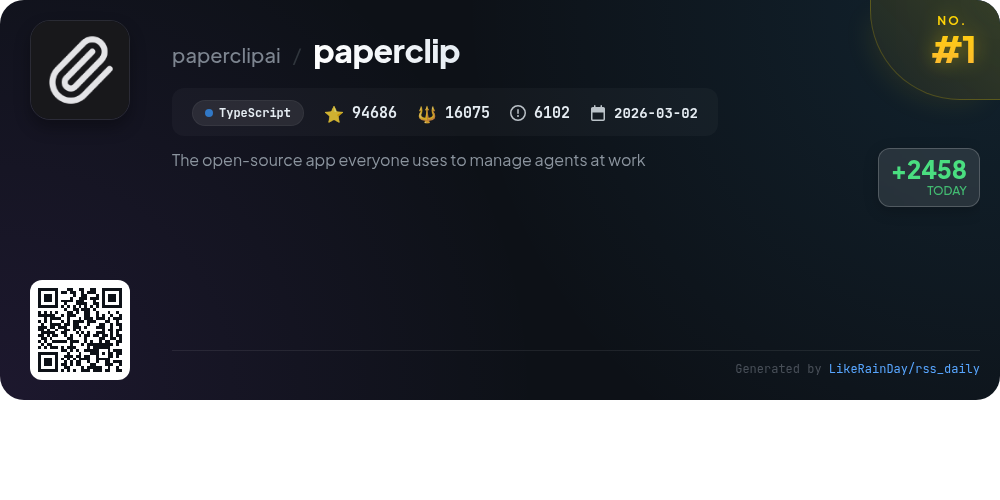
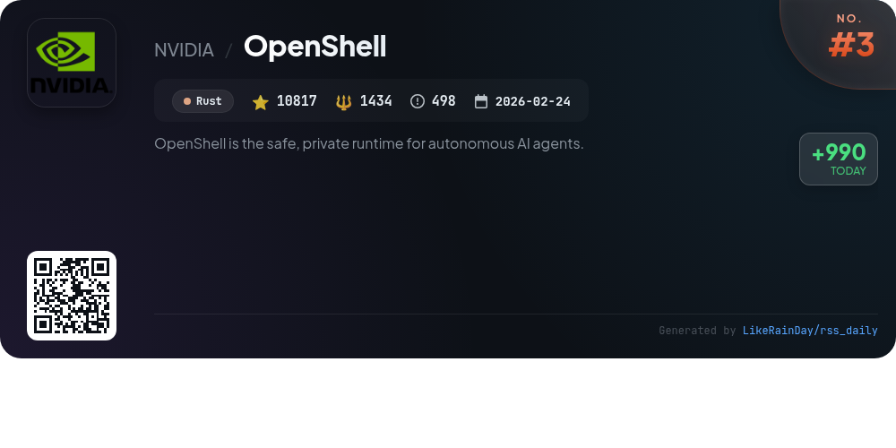
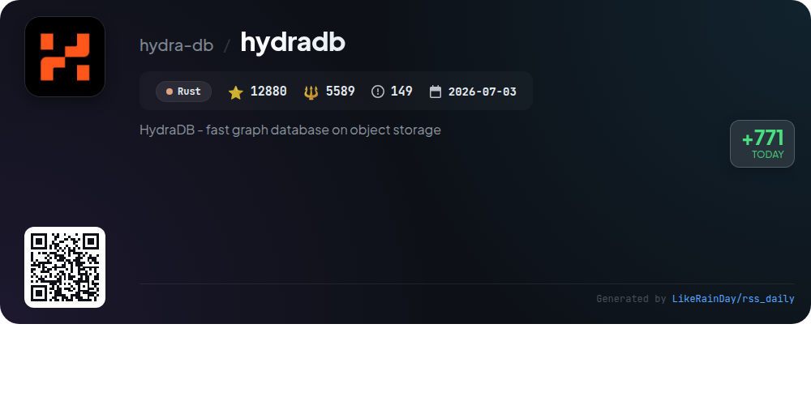
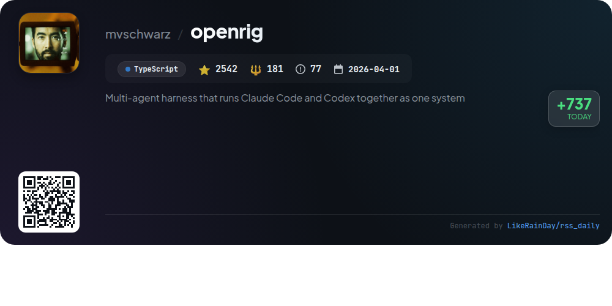
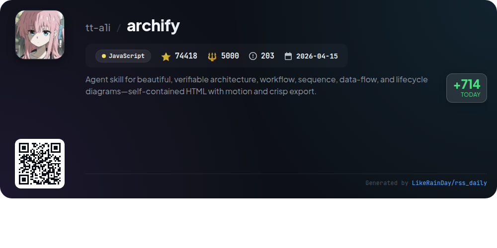
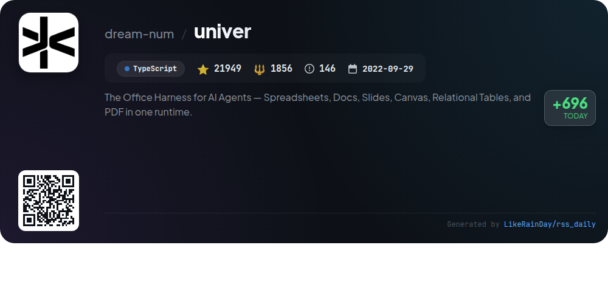
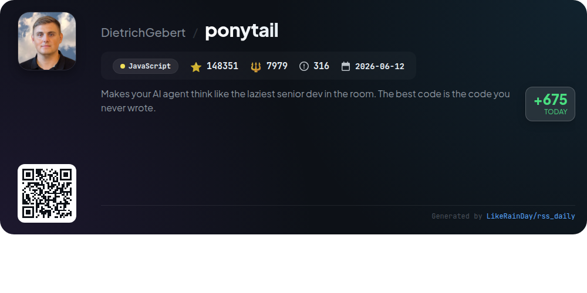
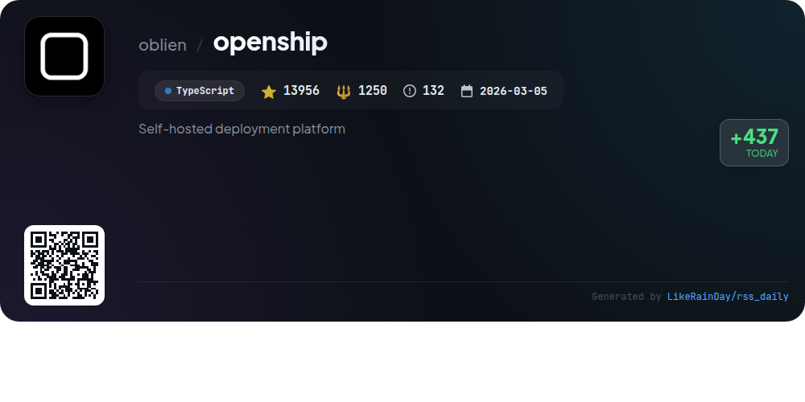
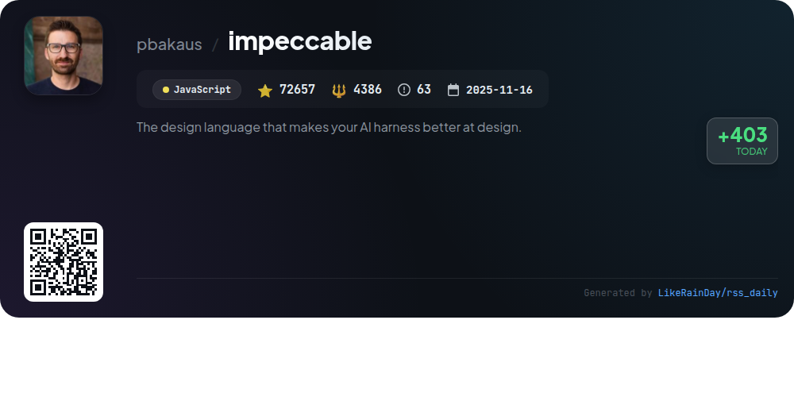

# 📊 🌟 GitHub Trending Daily - 2026-09-30

> > 📅 Daily Picks of GitHub Trending Repositories | Powered by Smart Algorithms

## 📋 Overview

**10** Projects | **518127** ⭐ | **50350** 🍴

**Top Languages:** `JavaScript` (4) · `TypeScript` (4) · `Rust` (2)

**Updated:** 2026-09-30 05:06 UTC

**Categories:**

- 🌟 Daily Top 10 (10 items)

---

## 🌟 Daily Top 10

### 1. [paperclip](https://github.com/paperclipai/paperclip)

> 🤖 **Why Recommend**  
> *Paperclip is an open-source app designed for managing AI agents in the workplace. With over 94,000 stars on GitHub, it provides a Node.js server and React UI for orchestrating AI teams. Key features include goal alignment, budget control, multi-organization support, and a ticketing system for task management. Paperclip allows users to define business goals, hire agents, and monitor costs from a unified dashboard. The app facilitates autonomous operations while ensuring governance and accountability, making it suitable for businesses that rely on multiple AI agents.*

- ⭐ 94686 stars
- 💻 TypeScript
- 📅 Updated: 2026-09-30

### 2. [up](https://github.com/byoungd/up)

> 🤖 **Why Recommend**  
> *"up" is a comprehensive lifelong learning guide by 韩先凯 (笔名：离谱) tailored for the AI era. With over 65,000 stars on GitHub, it emphasizes practical skills in English, AI collaboration, and real-world project execution. The guide promotes a cycle of discovering problems, active learning, and evidence-based reflection. Key features include downloadable resources in both Chinese and English, templates for self-assessment, and advice on personal growth through failures and recovery. The project encourages continuous improvement, making it a valuable asset for learners navigating an ever-changing landscape.*

- ⭐ 65871 stars
- 💻 JavaScript
- 📅 Updated: 2026-09-30

### 3. [OpenShell](https://github.com/NVIDIA/OpenShell)

> 🤖 **Why Recommend**  
> *OpenShell is a secure runtime environment for autonomous AI agents, designed to balance capability and privacy. Key features include kernel-level enforcement of policies restricting agent access to files, APIs, and networks, along with formal verification for policy changes to ensure safety. It supports Linux, macOS, and Windows (WSL 2) and utilizes Docker or Podman for sandboxing. OpenShell offers SDKs for Python, TypeScript, Go, and Rust, and emphasizes extensibility and community collaboration. With 10,817 stars, it provides a robust foundation for developing and managing AI agents securely.*

- ⭐ 10817 stars
- 💻 Rust
- 📅 Updated: 2026-09-30

### 4. [hydradb](https://github.com/hydra-db/hydradb)

> 🤖 **Why Recommend**  
> *HydraDB is a high-performance, distributed graph database built on Rust and optimized for object storage. With 12,880 stars, it leverages S3-compatible storage for durability and features independent compute roles: data nodes for queries and indexers for background indexing. Key highlights include snapshot-consistent OpenCypher queries, Neo4j-compatible Bolt connectivity, and an HTTPS API. HydraDB ensures consistent reads, safe writer handoff, and supports advanced graph-native execution using GraphBLAS. It offers robust observability with metrics and tracing, along with easy Kubernetes deployment via Helm.*

- ⭐ 12880 stars
- 💻 Rust
- 📅 Updated: 2026-09-30

### 5. [openrig](https://github.com/mvschwarz/openrig)

> 🤖 **Why Recommend**  
> *OpenRig is a multi-agent harness that integrates Claude Code and Codex into a cohesive system, enabling organized AI coding workflows. Users define agent teams in YAML, booting them with a single command. Key features include a terminal UI for real-time monitoring, communication across agents, and the ability to snapshot and restore project states. OpenRig supports collaboration through Slack integration and allows for managing coding tasks efficiently. Designed for macOS and Linux, it simplifies managing multiple coding agents, enhancing productivity in software development.*

- ⭐ 2542 stars
- 💻 TypeScript
- 📅 Updated: 2026-09-30

### 6. [archify](https://github.com/tt-a1i/archify)

> 🤖 **Why Recommend**  
> *Archify is a powerful JavaScript agent skill designed for creating interactive and visually appealing architecture, workflow, sequence, data-flow, and lifecycle diagrams. Users can transform ideas into customizable HTML diagrams by simply describing them to the AI agent. Key features include support for live demos, standalone HTML exports, and community-driven extensions. With over 74,000 stars on GitHub, Archify facilitates collaboration and sharing while allowing integration with various agents like Cursor and Codex. It’s ideal for both technical documentation and creative planning.*

- ⭐ 74418 stars
- 💻 JavaScript
- 📅 Updated: 2026-09-30

### 7. [univer](https://github.com/dream-num/univer)

> 🤖 **Why Recommend**  
> *Univer is an open-source Office SDK designed for building embeddable productivity applications, integrating spreadsheets, documents, presentations, and more. Key features include a customizable plugin architecture, a high-performance rendering engine, and a unified Facade API for seamless operation in both browser and Node.js environments. It supports collaborative workflows between users and AI agents, allowing for live editing and data linking across tools. With extensive documentation and a vibrant community, Univer is ideal for developers looking to enhance their applications with advanced office functionalities.*

- ⭐ 21949 stars
- 💻 TypeScript
- 📅 Updated: 2026-09-30

### 8. [ponytail](https://github.com/DietrichGebert/ponytail)

> 🤖 **Why Recommend**  
> *Ponytail is a JavaScript project designed to enhance AI agents by promoting minimal coding practices reminiscent of a seasoned, efficient developer. It reduces code generation by up to 94%, cutting costs by 20% and improving execution speed by 27% without compromising safety. Key features include a command system for adjusting intensity, code audits, and performance tracking. Ponytail integrates seamlessly with multiple AI platforms, encouraging reuse of existing code and leveraging native features, ultimately streamlining development while maintaining high standards of validation and security.*

- ⭐ 148351 stars
- 💻 JavaScript
- 📅 Updated: 2026-09-30

### 9. [openship](https://github.com/oblien/openship)

> 🤖 **Why Recommend**  
> *Self-hosted deployment platform. popular project, actively maintained, recently updated*

- ⭐ 13956 stars
- 🍴 1250 forks
- 💻 TypeScript
- 📅 Updated: 2026-09-30

### 10. [impeccable](https://github.com/pbakaus/impeccable)

> 🤖 **Why Recommend**  
> *Impeccable is a design language for AI coding agents, featuring a single setup command, 24 design commands, and 61 deterministic rules for optimizing AI-generated frontend designs. Key functionalities include project initialization with context gathering, UX/UI planning, technical audits, and design critique. It enables real-time browser iteration and offers a CLI for detecting design anti-patterns. Integrated with popular tools like GitHub Copilot and Claude Code, Impeccable enhances AI's design capabilities, ensuring high-quality, user-centered interfaces. Visit [impeccable.style](https://impeccable.style) for documentation.*

- ⭐ 72657 stars
- 💻 JavaScript
- 📅 Updated: 2026-09-30

---

## 📡 RSS Subscription

Subscribe via RSS to get daily trending updates:

- 🔔 [RSS XML] (../../daily-top.xml)
- 🔔 [Daily Report] (../../GITHUB_TODAY.md)
- 🔔 [Daily Top 10](../../daily-top.xml)

---

*⚡ Powered by Smart Trending Algorithm | Generated at 2026-09-30 05:06:46 UTC
