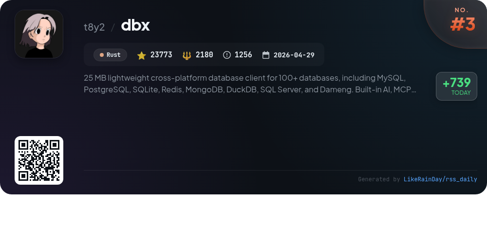
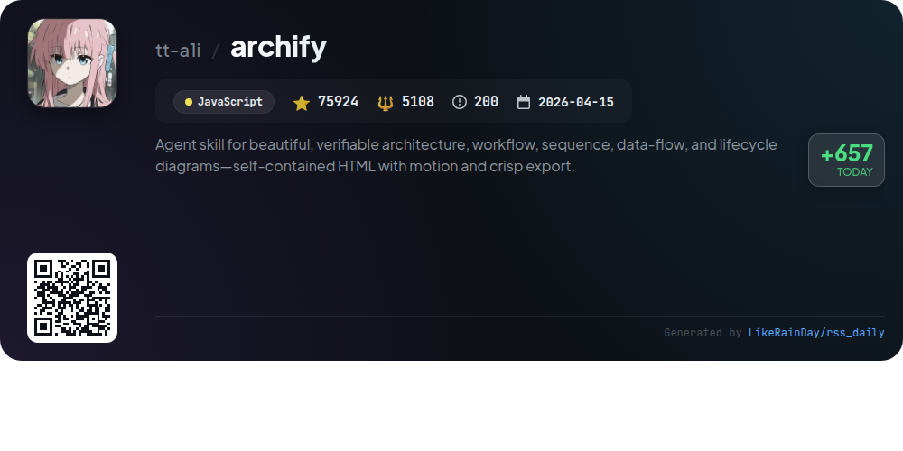
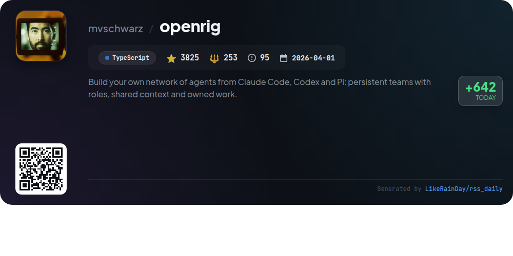
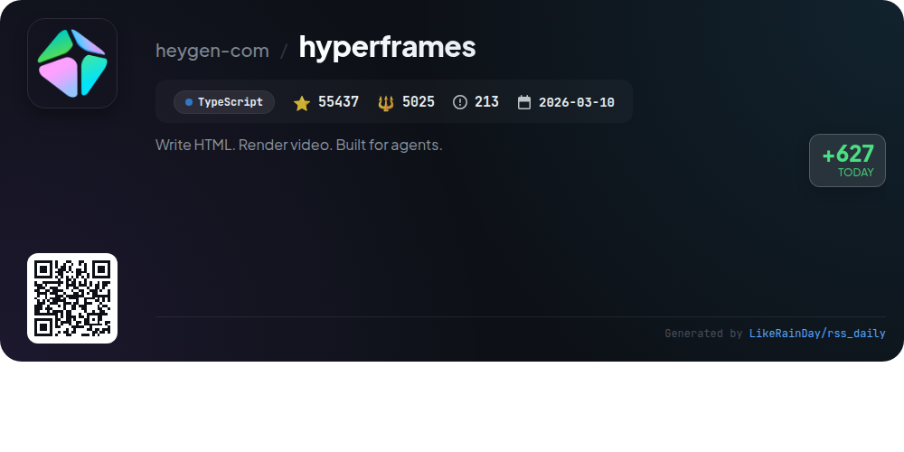
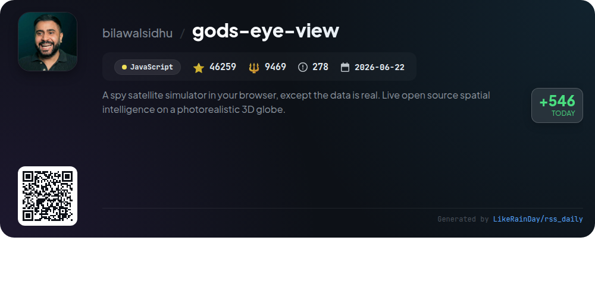
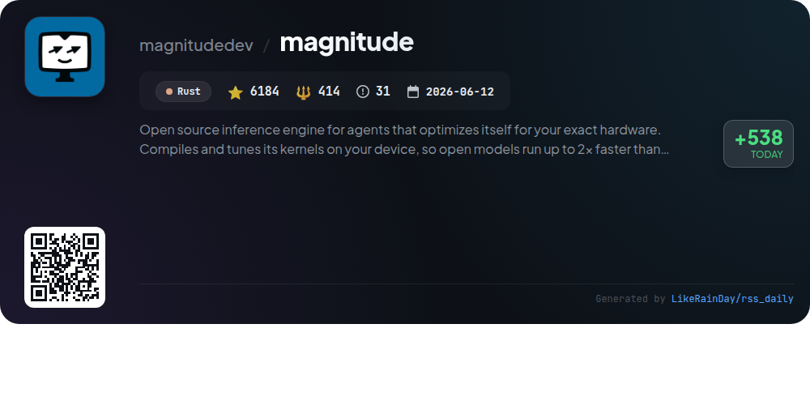
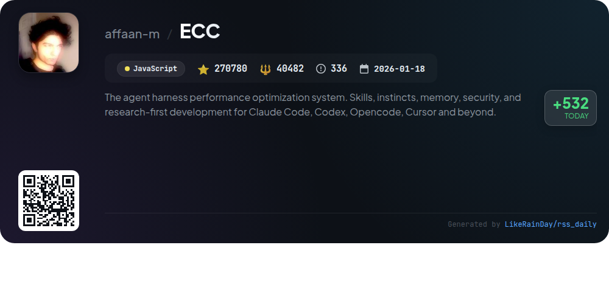
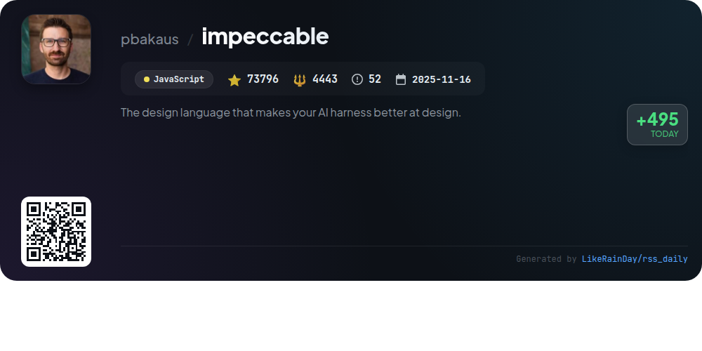

# 📊 🌟 GitHub Trending Daily - 2026-10-02

> > 📅 每日精选 GitHub 热门仓库 | 基于智能算法推荐

## 📋 Overview

**10** 个项目 | **720836** ⭐ | **77095** 🍴

**热门语言:** `JavaScript` (5) · `Rust` (3) · `TypeScript` (2)

**更新时间:** 2026-10-02 05:09 UTC

**分类分布:**

- 🌟 每日 Top 10 精选 (10 项)

---

## 🌟 每日 Top 10 精选

### 1. [OpenShell](https://github.com/NVIDIA/OpenShell)

> 🤖 **推荐理由**  
> *OpenShell is a secure runtime environment for autonomous AI agents, enabling them to interact with files, APIs, and credentials while enforcing strict access policies. Key features include kernel-level enforcement of agent activities, formal verification for policy changes, and isolated sandboxes for each agent. OpenShell supports Linux, macOS, and Windows with WSL, and provides SDKs for Python, TypeScript, Go, and Rust. With over 14,100 stars, it emphasizes safety and privacy, making it ideal for managing AI workflows securely.*

- ⭐ 14102 stars
- 💻 Rust
- 📅 Updated: 2026-10-02

### 2. [ponytail](https://github.com/DietrichGebert/ponytail)

> 🤖 **推荐理由**  
> *Ponytail is a JavaScript project designed to optimize AI code generation by mimicking the efficiency of a seasoned developer who writes minimal, functional code. With over 150,000 stars, it boasts features like reduced code output (up to 94% less), cost savings (20% cheaper), and faster execution (27% quicker), all while maintaining safety standards. Key services include integration with various AI agents, commands for reviewing and auditing code, and a focus on reusing existing code or built-in features. Ponytail champions the principle that the best code is the code you never wrote.*

- ⭐ 150756 stars
- 💻 JavaScript
- 📅 Updated: 2026-10-02

### 3. [dbx](https://github.com/t8y2/dbx)

> 🤖 **推荐理由**  
> *dbx is a lightweight (25 MB) cross-platform database client supporting over 100 databases, including MySQL, PostgreSQL, SQLite, Redis, and MongoDB. Key features include a built-in AI assistant for SQL generation, a versatile MCP Server for AI integration, and a user-friendly interface available on desktop, Docker, and CLI. It offers specialized tools for data operations, schema management, and message queue handling, along with a plugin ecosystem for extensibility. dbx is designed for seamless database management and efficient AI collaboration, making it suitable for developers and data professionals.*

- ⭐ 23773 stars
- 💻 Rust
- 📅 Updated: 2026-10-02

### 4. [archify](https://github.com/tt-a1i/archify)

> 🤖 **推荐理由**  
> *Archify is an innovative JavaScript-based agent skill that transforms descriptions into interactive, self-contained HTML diagrams for architecture, workflows, sequences, data flows, and lifecycles. With over 75,000 stars, it allows users to visualize complex ideas easily by simply describing them to an AI agent. Key features include customizable visuals, motion export options, and the ability to trace routes and highlight paths. Archify supports various integrations and is open-source, fostering community collaboration and creativity in diagramming diverse scenarios, from technical architectures to travel itineraries.*

- ⭐ 75924 stars
- 💻 JavaScript
- 📅 Updated: 2026-10-02

### 5. [openrig](https://github.com/mvschwarz/openrig)

> 🤖 **推荐理由**  
> *OpenRig is an open-source platform for creating and managing networks of AI coding agents, such as Claude Code and Codex, in a structured, persistent environment. Key features include YAML-defined team topologies, seamless agent communication, and a terminal UI for monitoring and interaction. Users can boot teams with a single command, manage shared context, and evolve agent setups dynamically. OpenRig supports Node.js and tmux, emphasizing flexibility in developing AI-driven solutions. The project serves as a powerful tool for fostering collaboration among coding agents.*

- ⭐ 3825 stars
- 💻 TypeScript
- 📅 Updated: 2026-10-02

### 6. [hyperframes](https://github.com/heygen-com/hyperframes)

> 🤖 **推荐理由**  
> *HyperFrames is an open-source framework for converting HTML, CSS, and media into deterministic MP4 videos, designed for both local use and integration with AI coding agents. Key features include a CLI for project management, a suite of 21 skills for video production, and support for various animation libraries like GSAP and Lottie. Users can create diverse video content, from product launches to data visualizations, with seamless HTML composition and no build steps. Community-driven and Apache 2.0 licensed, HyperFrames fosters collaboration and growth in video creation.*

- ⭐ 55437 stars
- 💻 TypeScript
- 📅 Updated: 2026-10-02

### 7. [gods-eye-view](https://github.com/bilawalsidhu/gods-eye-view)

> 🤖 **推荐理由**  
> *God's Eye View is a browser-based spy satellite simulator providing real-time spatial intelligence on a photorealistic 3D globe. Key features include live tracking of aircraft, ships, satellites, and environmental events, all enhanced by hands-free voice control powered by AI. Users can explore multiple data layers, including public cameras and weather conditions, without needing API keys. The project promotes open-source collaboration, allowing users to inspect and extend the code, while emphasizing responsible use of public data.*

- ⭐ 46259 stars
- 💻 JavaScript
- 📅 Updated: 2026-10-02

### 8. [magnitude](https://github.com/magnitudedev/magnitude)

> 🤖 **推荐理由**  
> *Magnitude is an open-source inference engine that optimizes performance for your specific hardware, achieving up to 2x faster speeds than llama.cpp. It compiles and tunes kernels on your device, ensuring efficient model execution on Apple Silicon, NVIDIA, AMD, or CPUs. Key features include reduced memory usage, fast concurrent sessions, and seamless integration with agents like Pi, OpenCode, and Codex. Magnitude operates on macOS, Windows, and Linux, prioritizing privacy by keeping prompts and models local. It supports popular open-weight models and is designed for developers seeking high-performance AI solutions.*

- ⭐ 6184 stars
- 💻 Rust
- 📅 Updated: 2026-10-02

### 9. [ECC](https://github.com/affaan-m/ECC)

> 🤖 **推荐理由**  
> *ECC is a performance optimization system designed for coding agents like Claude Code, Codex, and others. It offers 68 specialized agents, 293 reusable skills, and 94 command shims, enabling structured workflows such as Test-Driven Development (TDD), security reviews, and code refactoring. Key features include continuous learning, memory persistence, and AgentShield security scanning, ensuring robust code quality and security. ECC supports multiple platforms through guided setup, making it versatile for various coding environments. With over 270,000 stars, it stands as a leading tool in the open-source community.*

- ⭐ 270780 stars
- 💻 JavaScript
- 📅 Updated: 2026-10-02

### 10. [impeccable](https://github.com/pbakaus/impeccable)

> 🤖 **推荐理由**  
> *Impeccable is a design language tool for AI coding agents, enhancing frontend design with 24 commands, live browser iteration, and 61 deterministic detector rules. Key features include a streamlined setup with `/impeccable init`, a shared design vocabulary, and commands for crafting, critiquing, and auditing designs. It supports multiple AI platforms like Claude Code and GitHub Copilot. Impeccable enables teams to maintain design quality, avoid common anti-patterns, and generate reusable components efficiently, all while fostering collaboration through detailed documentation.*

- ⭐ 73796 stars
- 💻 JavaScript
- 📅 Updated: 2026-10-02

---

## 📡 RSS订阅

通过 RSS 订阅，第一时间获取每日精选项目：

- 🔔 [RSS 订阅源] (../../daily-top.xml)
- 🔔 [每日简报] (../../GITHUB_TODAY_CN.md)
- 🔔 [每日 Top 10 精选](../../daily-top.xml)

---

*⚡ Powered by Smart Trending Algorithm | Generated at 2026-10-02 05:09:07 UTC
