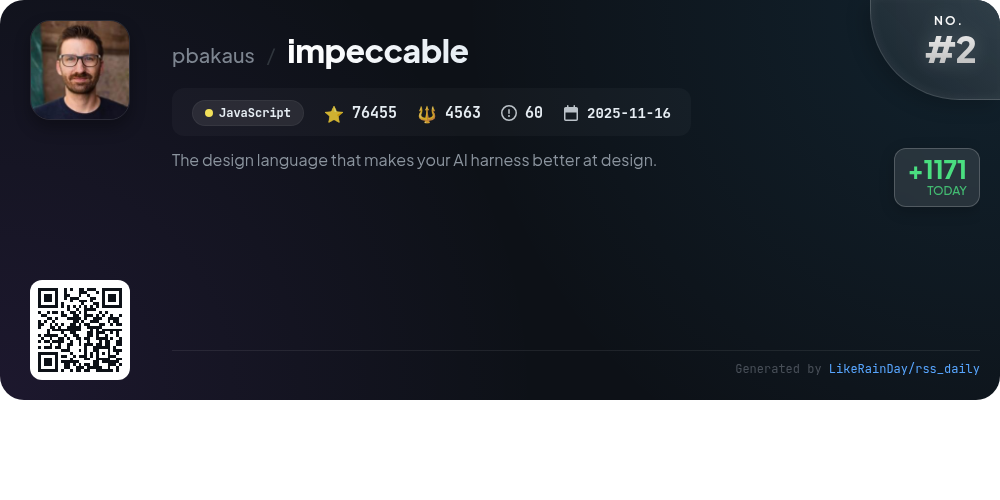
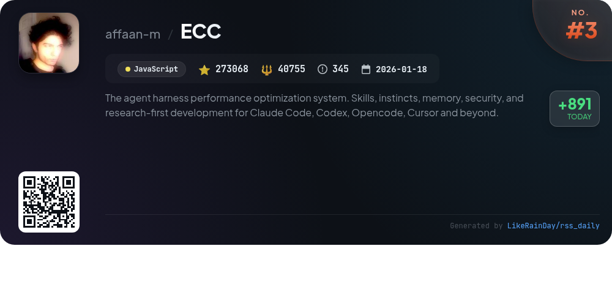
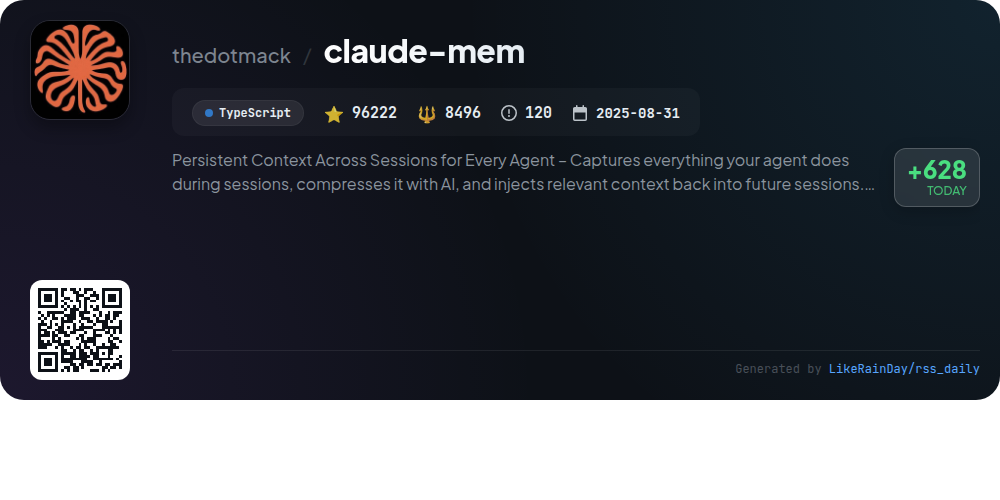
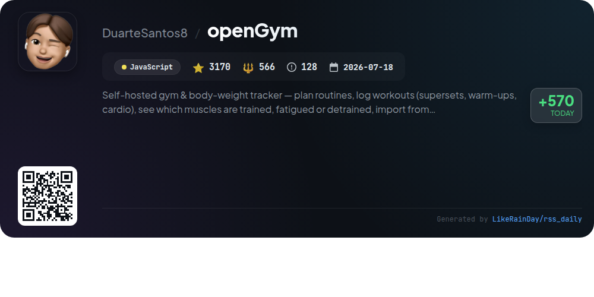
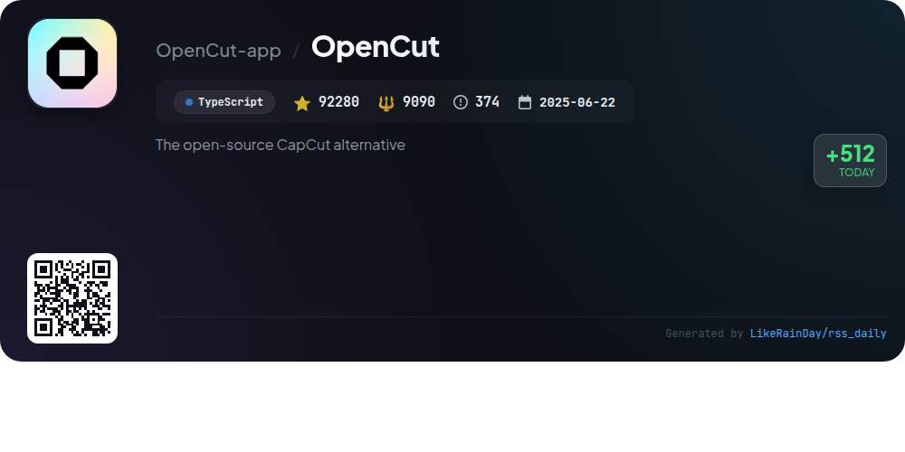
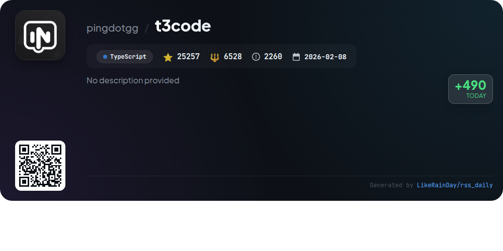
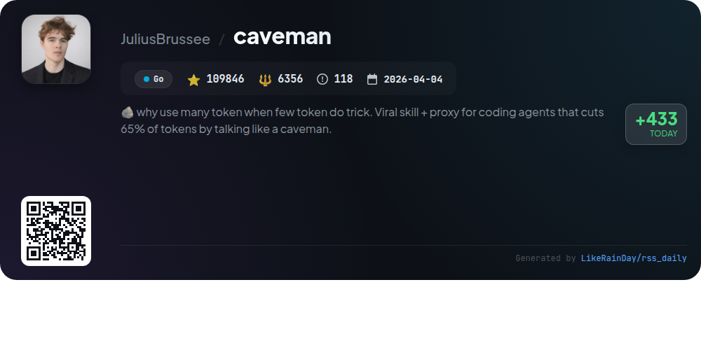
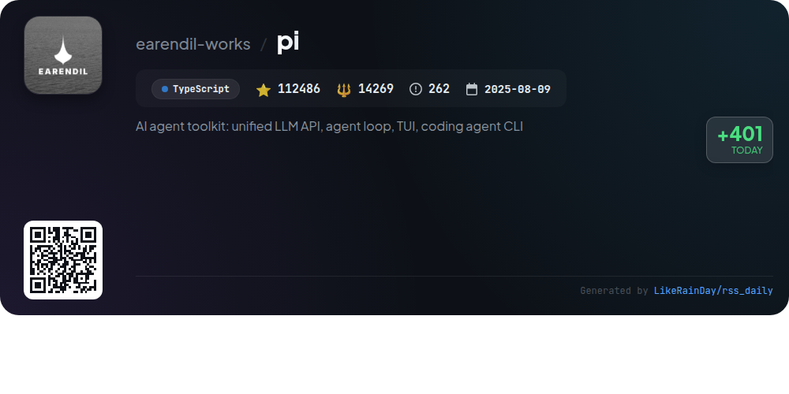
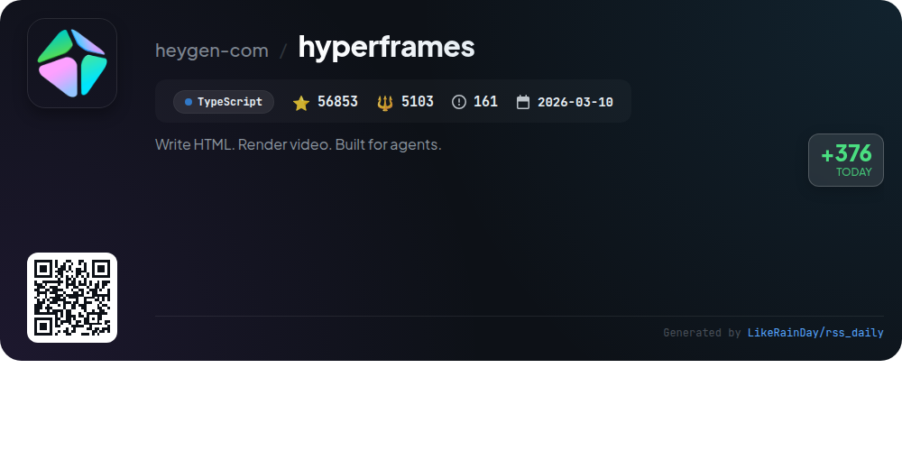

# 📊 🌟 GitHub Trending Daily - 2026-10-05

> > 📅 Daily Picks of GitHub Trending Repositories | Powered by Smart Algorithms

## 📋 Overview

**10** Projects | **1000729** ⭐ | **104063** 🍴

**Top Languages:** `TypeScript` (5) · `JavaScript` (4) · `Go` (1)

**Updated:** 2026-10-05 05:08 UTC

**Categories:**

- 🌟 Daily Top 10 (10 items)

---

## 🌟 Daily Top 10

### 1. [ponytail](https://github.com/DietrichGebert/ponytail)

> 🤖 **Why Recommend**  
> *Ponytail is a JavaScript project designed to optimize AI agent coding by mimicking the efficiency of a seasoned developer, emphasizing minimalism and practicality. With over 155,000 stars, it enables agents to reduce code by up to 94%, save costs by 20%, and improve speed by 27% while maintaining 100% safety. Key features include commands for adjusting coding intensity, auditing for over-engineering, and leveraging existing code or libraries. Ponytail is compatible with various AI platforms, focusing on writing only necessary code and enhancing project efficiency.*

- ⭐ 155092 stars
- 💻 JavaScript
- 📅 Updated: 2026-10-05

### 2. [impeccable](https://github.com/pbakaus/impeccable)

> 🤖 **Why Recommend**  
> *Impeccable is a robust design language tool for AI coding agents, offering 24 commands and 61 deterministic rules for improving AI-generated frontend designs. Key features include a streamlined setup process, a shared design vocabulary, and live browser iteration capabilities. Users can perform tasks like UX audits, critiques, and design polishing through a simple CLI interface. Compatible with major coding tools like GitHub Copilot and Claude Code, Impeccable enhances design quality by addressing common anti-patterns and enabling efficient project setup and documentation. For more info, visit impeccable.style.*

- ⭐ 76455 stars
- 💻 JavaScript
- 📅 Updated: 2026-10-05

### 3. [ECC](https://github.com/affaan-m/ECC)

> 🤖 **Why Recommend**  
> *ECC is an advanced agent harness performance optimization system designed to enhance coding workflows. Key features include 68 specialized agents, 293 reusable skills, and 94 command shims for tasks like planning, code review, and security audits. It offers seamless integration with platforms like Claude Code, Codex, and Kimi Code, alongside memory persistence and automated hooks for enhanced efficiency. The system also includes AgentShield for security scanning and support for multiple languages and frameworks, ensuring a robust coding environment. ECC is open source and available on GitHub.*

- ⭐ 273068 stars
- 💻 JavaScript
- 📅 Updated: 2026-10-05

### 4. [claude-mem](https://github.com/thedotmack/claude-mem)

> 🤖 **Why Recommend**  
> *Claude-Mem is a TypeScript-based memory management system designed to provide persistent context across sessions for various AI agents, including Claude Code, OpenClaw, and Codex. It captures agent activities, compresses them using AI, and injects relevant context into future interactions, ensuring continuity. Key features include smart memory retrieval, a web viewer UI, skill-based search, and privacy controls. The system operates autonomously, supports multiple languages, and integrates seamlessly with existing tools, enhancing productivity by maintaining project knowledge over time.*

- ⭐ 96222 stars
- 💻 TypeScript
- 📅 Updated: 2026-10-05

### 5. [openGym](https://github.com/DuarteSantos8/openGym)

> 🤖 **Why Recommend**  
> *openGym is a self-hosted gym and body-weight tracker that allows users to plan routines, log workouts, and track muscle training statuses. Key features include a library of 1,324 exercises, guided workouts, custom routines, and advanced tracking for sets, reps, and recovery. Users can import data from popular apps, utilize passkey login for security, and manage their data on their own server. With no subscriptions, ads, or telemetry, openGym prioritizes user control and privacy, making it a comprehensive solution for fitness enthusiasts.*

- ⭐ 3170 stars
- 💻 JavaScript
- 📅 Updated: 2026-10-05

### 6. [OpenCut](https://github.com/OpenCut-app/OpenCut)

> 🤖 **Why Recommend**  
> *OpenCut is a free, open-source video editor designed for web, desktop, and mobile platforms, offering a robust alternative to CapCut. With a focus on a plugin-first architecture, it will feature an Editor API, support for third-party plugins, and a scripting tab for enhanced functionality. A Rust core will enable seamless cross-platform operation, alongside an MCP server for AI integration and a headless mode for automation. The project is currently undergoing a complete rewrite, with the classic version available at opencut.app. Join the community on Discord for updates and discussions.*

- ⭐ 92280 stars
- 💻 TypeScript
- 📅 Updated: 2026-10-05

### 7. [t3code](https://github.com/pingdotgg/t3code)

> 🤖 **Why Recommend**  
> *T3 Code is an agent harness control surface built in TypeScript, designed to enhance the development experience with agents. It features a mobile app for iOS and Android, a web app, and an Electron-based desktop app. T3 Code integrates with popular services like Claude Code, Codex, Cursor, Grok Build, OpenCode, and Google Antigravity. The project is open-source, encouraging users to fork and customize it as needed. Installation is straightforward, with support for various platforms. Although still early in development, T3 Code aims to provide a performant, remote-ready experience.*

- ⭐ 25257 stars
- 💻 TypeScript
- 📅 Updated: 2026-10-05

### 8. [caveman](https://github.com/JuliusBrussee/caveman)

> 🤖 **Why Recommend**  
> *Caveman is a Go-based GitHub project that optimizes AI agent interactions by significantly reducing token usage—up to 65% fewer input tokens. It transforms verbose responses into concise, structured outputs while preserving essential information. Key features include compatibility with over 30 agents, a proxy that compresses input files like JSON and CSV by up to 99%, and multiple command modes for tailored responses. Cited by Adobe Research and JetBrains, it has garnered over 109,846 stars, making it a leading tool for efficient AI communication.*

- ⭐ 109846 stars
- 💻 Go
- 📅 Updated: 2026-10-05

### 9. [pi](https://github.com/earendil-works/pi)

> 🤖 **Why Recommend**  
> *Pi is a versatile AI agent toolkit designed for customization and extensibility, featuring a unified LLM API, an interactive coding agent CLI, and a terminal user interface (TUI). It allows users to adapt workflows through extensions, skills, prompt templates, and themes, all easily shareable as Pi packages. Key features include automation in print or JSON mode, RPC control, and integration capabilities via the TypeScript SDK. Pi supports various platforms and offers robust defaults without unnecessary complexity, making it suitable for diverse AI applications.*

- ⭐ 112486 stars
- 💻 TypeScript
- 📅 Updated: 2026-10-05

### 10. [hyperframes](https://github.com/heygen-com/hyperframes)

> 🤖 **Why Recommend**  
> *HyperFrames is an open-source framework that transforms HTML, CSS, and animations into deterministic MP4 videos, designed for both local use and AI coding agents. Key features include a CLI for project setup and rendering, a router for managing workflows, 21 on-demand skills for various video creation tasks, and seamless integration with popular animation libraries like GSAP and Lottie. HyperFrames supports AWS Lambda for distributed rendering and offers a user-friendly design system for video production. It enables rapid prototyping of product launch videos, explainer content, and more, ensuring consistency and ease of use.*

- ⭐ 56853 stars
- 💻 TypeScript
- 📅 Updated: 2026-10-05

---

## 📡 RSS Subscription

Subscribe via RSS to get daily trending updates:

- 🔔 [RSS XML] (../../daily-top.xml)
- 🔔 [Daily Report] (../../GITHUB_TODAY.md)
- 🔔 [Daily Top 10](../../daily-top.xml)

---

*⚡ Powered by Smart Trending Algorithm | Generated at 2026-10-05 05:08:06 UTC
