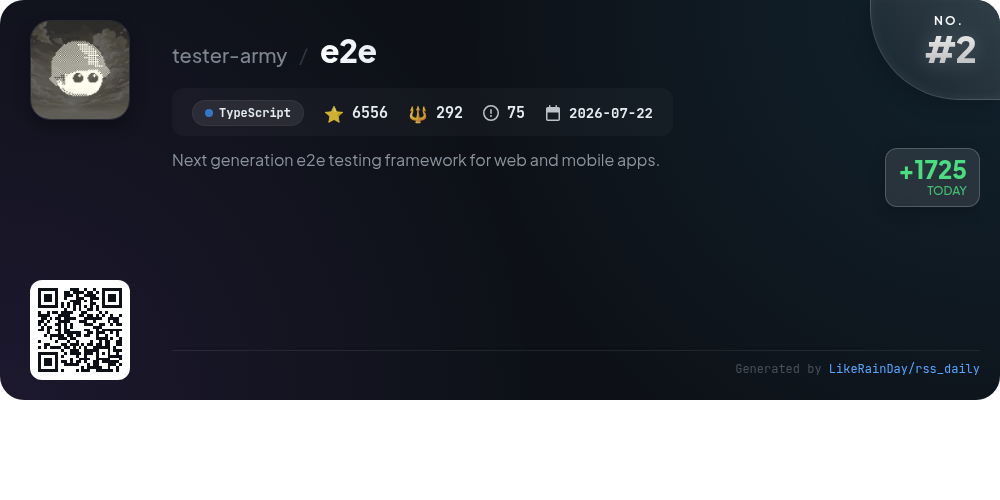
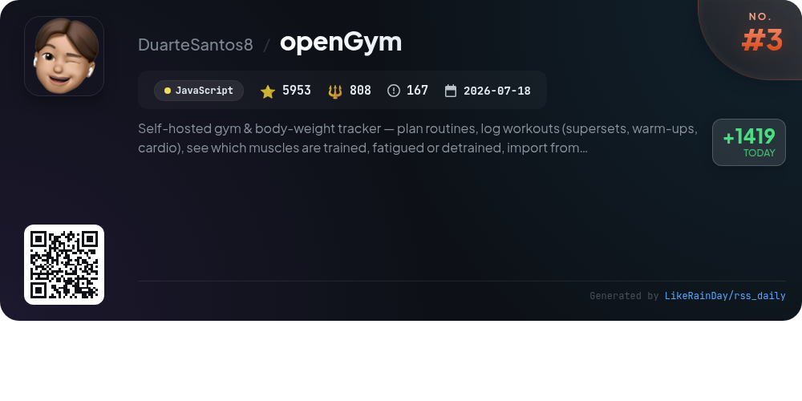
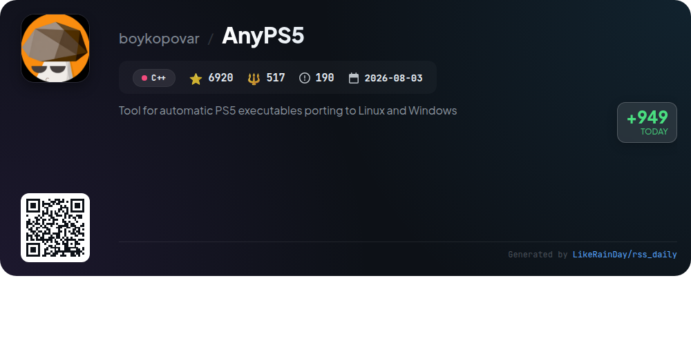
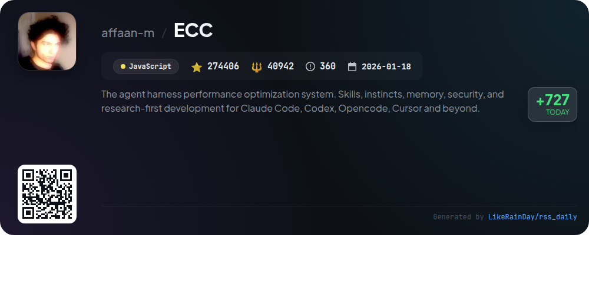
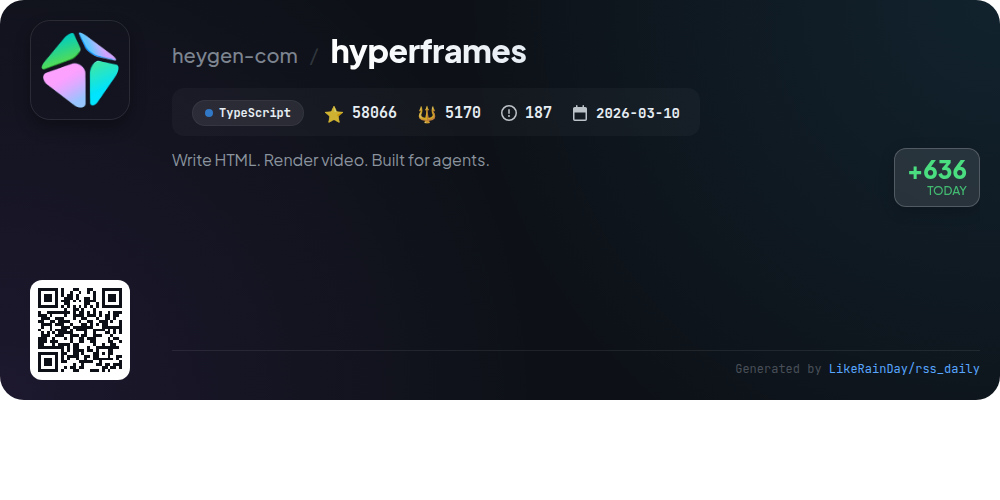
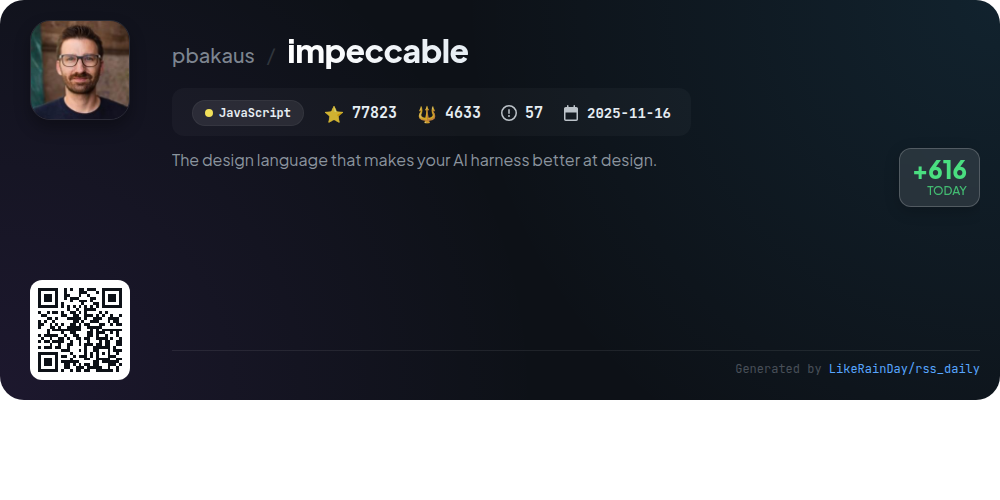
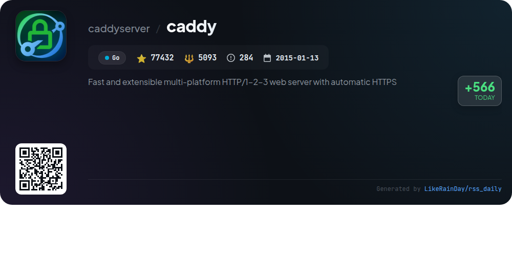

# 📊 🌟 GitHub Trending Daily - 2026-10-07

> > 📅 每日精选 GitHub 热门仓库 | 基于智能算法推荐

## 📋 Overview

**10** 个项目 | **699838** ⭐ | **68552** 🍴

**热门语言:** `JavaScript` (5) · `TypeScript` (3) · `C++` (1)

**更新时间:** 2026-10-07 05:27 UTC

**分类分布:**

- 🌟 每日 Top 10 精选 (10 项)

---

## 🌟 每日 Top 10 精选

### 1. [rea](https://github.com/morluto/rea)

> 🤖 **推荐理由**  
> *REA (Reverse Engineer Anything) is a powerful TypeScript tool designed for reverse engineering applications and binaries. It enables users to inspect app behavior, analyze native binaries, and understand features down to the binary level without source code. Key features include integration with analysis tools like Hopper and Ghidra, local analysis capabilities, and a guided workflow for investigating features. REA supports various platforms, including macOS and Linux, and facilitates the reconstruction of app functionalities for custom implementations, making it invaluable for developers and security researchers.*

- ⭐ 10271 stars
- 💻 TypeScript
- 📅 Updated: 2026-10-07

### 2. [e2e](https://github.com/tester-army/e2e)

> 🤖 **推荐理由**  
> *e2e is an innovative end-to-end testing framework for web and mobile applications, built in TypeScript and boasting over 6,500 stars on GitHub. It enables users to describe test goals in natural language, allowing an AI agent to automate actions and verify results seamlessly. Key features include support for web and mobile engines, customizable testing with various model providers, and a rich suite of packages for integration with tools like Playwright and GitHub. e2e is actively developed, ensuring continuous improvements and robust community support.*

- ⭐ 6556 stars
- 💻 TypeScript
- 📅 Updated: 2026-10-07

### 3. [openGym](https://github.com/DuarteSantos8/openGym)

> 🤖 **推荐理由**  
> *openGym is a self-hosted gym and body-weight tracker that empowers users to plan routines, log workouts, and track muscle fatigue—all while retaining control over their data. Key features include a library of 1,324 exercises, guided workouts, progression tracking, and passkey login for secure access. Users can import data from popular apps like FitNotes and Strong, and enjoy offline functionality across devices. With no subscriptions or ads, openGym offers a customizable and private fitness experience, making it an ideal solution for those seeking ownership of their fitness journey.*

- ⭐ 5953 stars
- 💻 JavaScript
- 📅 Updated: 2026-10-07

### 4. [AnyPS5](https://github.com/boykopovar/AnyPS5)

> 🤖 **推荐理由**  
> *AnyPS5 is a powerful tool designed for automatic porting of PS5 executables to Linux and Windows, garnering 6,920 stars on GitHub. Key features include a relinker for converting executables to native formats and dynamic linking through system PRX libraries, eliminating the need for emulation. It supports SDL-mapped controllers and customizable input configurations. The project emphasizes interoperability and preservation, providing a game compatibility list and a shader recompiler for SPIR-V output. Licensed under GPL v2, AnyPS5 is a vital resource for researchers and developers.*

- ⭐ 6920 stars
- 💻 C++
- 📅 Updated: 2026-10-07

### 5. [ponytail](https://github.com/DietrichGebert/ponytail)

> 🤖 **推荐理由**  
> *Ponytail is a JavaScript project that empowers AI agents to adopt a minimalist coding approach, inspired by the "lazy senior developer." By focusing on writing the least code necessary, Ponytail achieves up to 94% less code, 27% faster execution, and 20% lower costs, all while maintaining safety and code quality. Key features include a simple installation process, various command options for adjusting intensity, and a robust auditing system to prevent over-engineering. It integrates seamlessly with multiple AI models, making it a valuable tool for efficient software development.*

- ⭐ 156972 stars
- 💻 JavaScript
- 📅 Updated: 2026-10-07

### 6. [ECC](https://github.com/affaan-m/ECC)

> 🤖 **推荐理由**  
> *ECC is an advanced performance optimization system designed for coding agents like Claude Code, Codex, and Cursor. With 68 specialized agents and 293 reusable skills, ECC streamlines processes such as planning, testing, and code review, enhancing productivity. Key features include automated security scans via AgentShield, memory persistence for efficient context management, and a comprehensive installation guide for multi-harness setups. The project, open-source and MIT-licensed, integrates seamlessly with various platforms, making it essential for developers seeking to optimize their coding workflows.*

- ⭐ 274406 stars
- 💻 JavaScript
- 📅 Updated: 2026-10-07

### 7. [hyperframes](https://github.com/heygen-com/hyperframes)

> 🤖 **推荐理由**  
> *HyperFrames is an open-source framework that transforms HTML, CSS, and media into deterministic MP4 videos, catering to both developers and AI coding agents. With 21 skills for video creation, it supports diverse workflows like product launches, explainer videos, and data visualizations. Features include a CLI for local rendering, plugin integration for coding agents, and a community-driven catalog of reusable components. HyperFrames ensures deterministic outputs with no build steps, making it easy to preview and render projects directly in the browser.*

- ⭐ 58066 stars
- 💻 TypeScript
- 📅 Updated: 2026-10-07

### 8. [impeccable](https://github.com/pbakaus/impeccable)

> 🤖 **推荐理由**  
> *Impeccable is a design language tool for AI coding agents, offering a framework with 24 commands and 60 deterministic rules to enhance frontend design quality. Key features include a single setup flow (`/impeccable init`), a shared design vocabulary, and tools for auditing, critiquing, and polishing designs. It ensures consistency by recording project context in `PRODUCT.md` and enables live browser iteration. Compatible with popular AI platforms like GitHub Copilot and Claude Code, Impeccable streamlines the design process, ensuring better adherence to design principles.*

- ⭐ 77823 stars
- 💻 JavaScript
- 📅 Updated: 2026-10-07

### 9. [caddy](https://github.com/caddyserver/caddy)

> 🤖 **推荐理由**  
> *Caddy is a fast, extensible multi-platform web server written in Go, boasting over 77,000 stars on GitHub. Its core features include automatic HTTPS by default, support for HTTP/1, HTTP/2, and HTTP/3, and a highly configurable architecture using Caddyfile or JSON. Caddy excels with dynamic configuration via a powerful JSON API, seamless integration of plugins, and a focus on security with built-in TLS management. It’s production-ready, having served trillions of requests, making it suitable for scaling up to hundreds of thousands of sites. For more details, visit caddyserver.com.*

- ⭐ 77432 stars
- 💻 Go
- 📅 Updated: 2026-10-07

### 10. [security-audit-skill](https://github.com/cloudflare/security-audit-skill)

> 🤖 **推荐理由**  
> *A coding-agent skill for multi-phase security audits with independently verified, machine-readable findings. popular project, actively maintained, recently updated*

- ⭐ 25439 stars
- 🍴 1528 forks
- 💻 JavaScript
- 📅 Updated: 2026-10-07

---

## 📡 RSS订阅

通过 RSS 订阅，第一时间获取每日精选项目：

- 🔔 [RSS 订阅源] (../../daily-top.xml)
- 🔔 [每日简报] (../../GITHUB_TODAY_CN.md)
- 🔔 [每日 Top 10 精选](../../daily-top.xml)

---

*⚡ Powered by Smart Trending Algorithm | Generated at 2026-10-07 05:27:18 UTC
