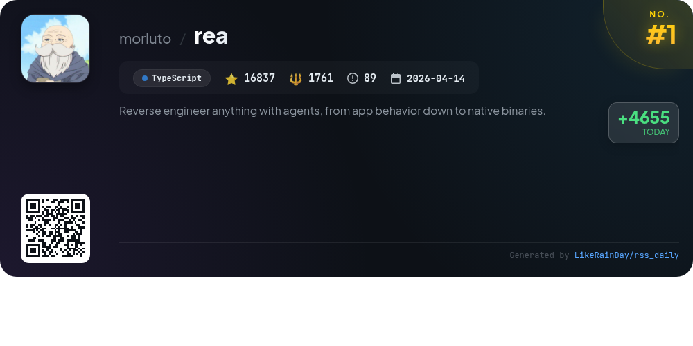
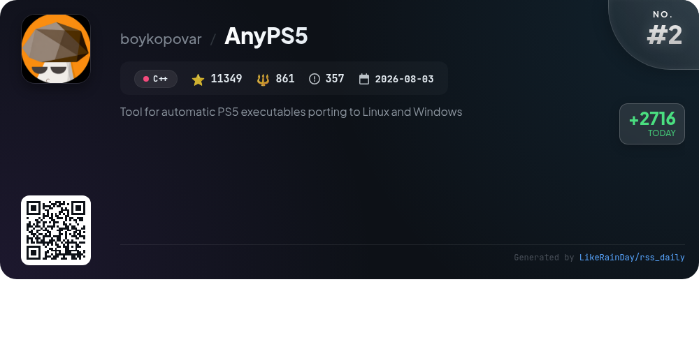
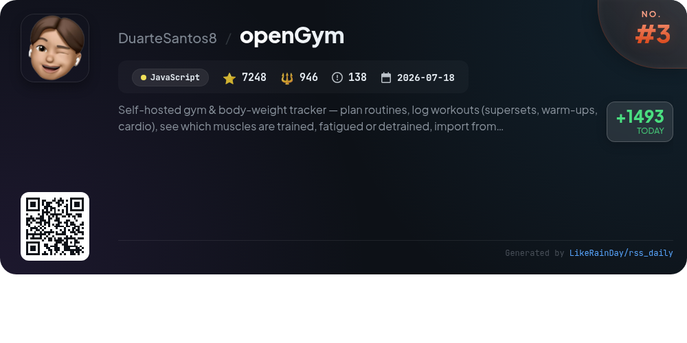
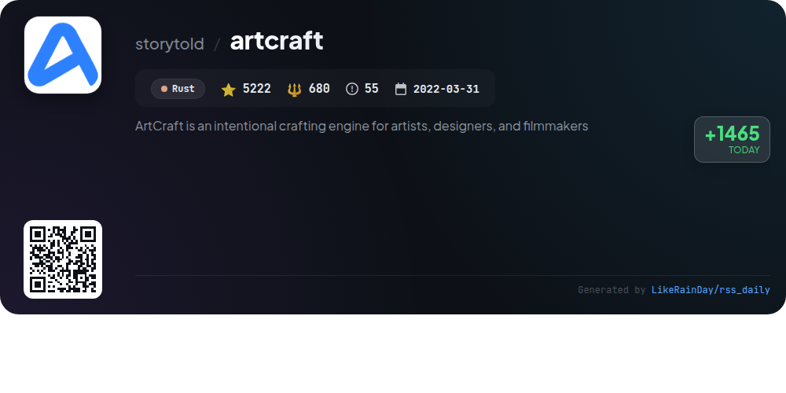
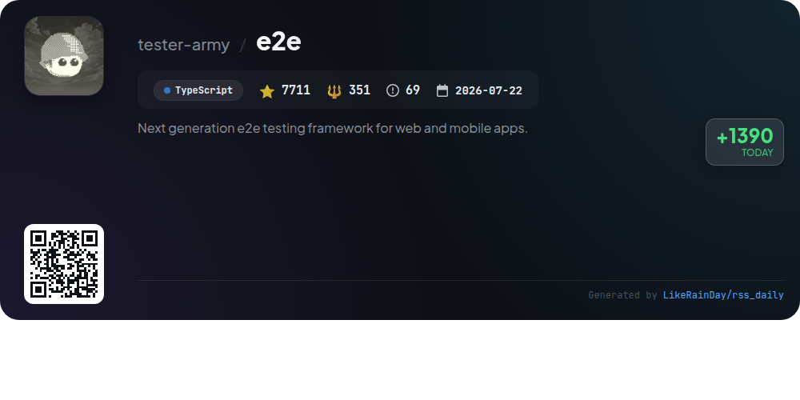
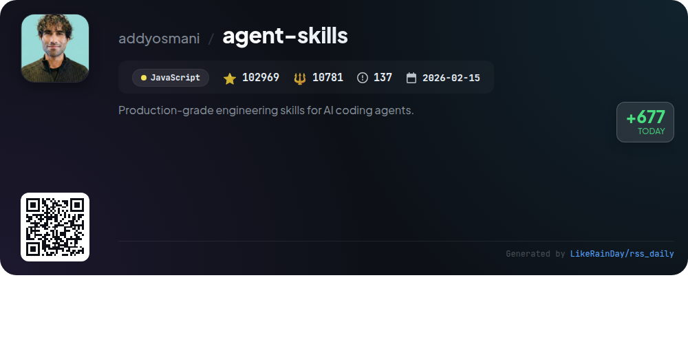
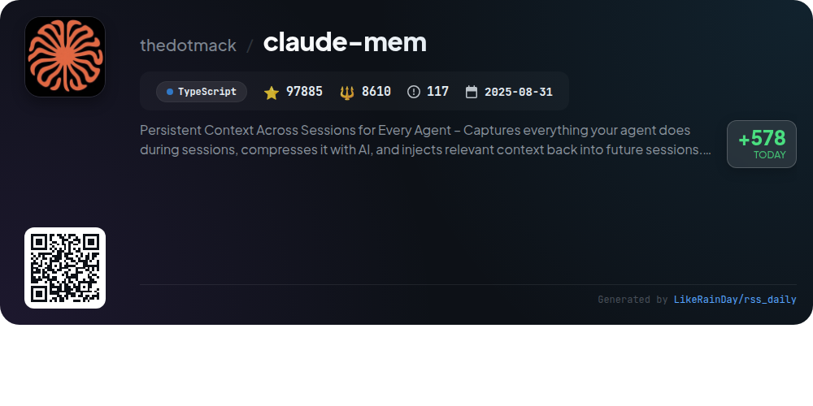
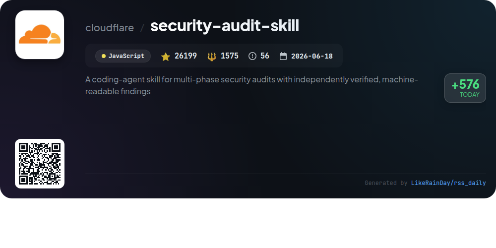
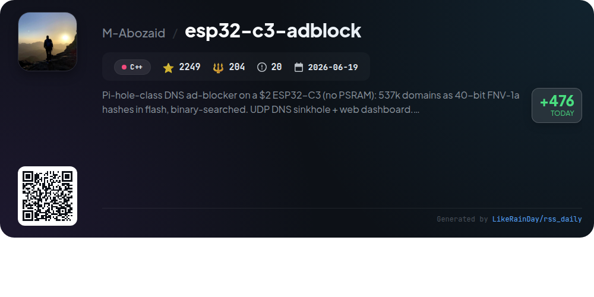
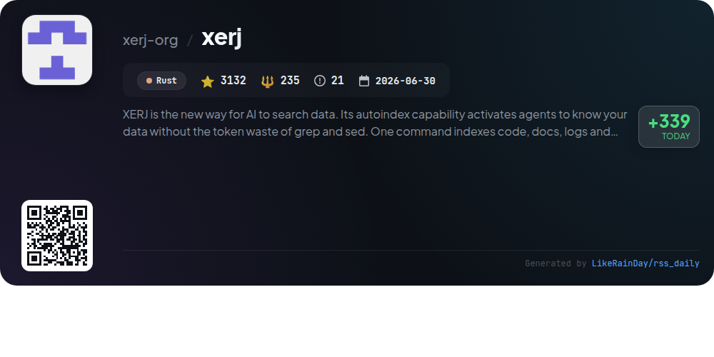

# 📊 🌟 GitHub Trending Daily - 2026-10-08

> > 📅 每日精选 GitHub 热门仓库 | 基于智能算法推荐

## 📋 Overview

**10** 个项目 | **280801** ⭐ | **26004** 🍴

**热门语言:** `JavaScript` (3) · `TypeScript` (3) · `C++` (2)

**更新时间:** 2026-10-08 05:36 UTC

**分类分布:**

- 🌟 每日 Top 10 精选 (10 项)

---

## 🌟 每日 Top 10 精选

### 1. [rea](https://github.com/morluto/rea)

> 🤖 **推荐理由**  
> *REA (Reverse Engineer Anything) is a powerful tool designed for analyzing app behaviors and native binaries without needing the source code. With a focus on local analysis, it allows users to inspect JavaScript, Electron apps, .NET assemblies, and native binaries using agents like Claude Code and Codex. Key features include pseudocode generation, evidence tracing, and the ability to reconstruct features. REA supports multiple formats and provides comprehensive guides for setup and usage. With over 16,000 stars on GitHub, it fosters a vibrant community for reverse engineering enthusiasts.*

- ⭐ 16837 stars
- 💻 TypeScript
- 📅 Updated: 2026-10-08

### 2. [AnyPS5](https://github.com/boykopovar/AnyPS5)

> 🤖 **推荐理由**  
> *AnyPS5 is a powerful tool for automatically porting PS5 executables to Linux and Windows, boasting over 11,000 stars on GitHub. Key features include a relinker for converting executables to native formats, implementations of system PRX libraries for dynamic linking, and a shader recompiler that produces validated SPIR-V. The project supports SDL-mapped game controllers and customizable input mapping. It focuses on interoperability, research, and preservation, without requiring copyrighted software. Comprehensive documentation is available for usage, building, and compatibility.*

- ⭐ 11349 stars
- 💻 C++
- 📅 Updated: 2026-10-08

### 3. [openGym](https://github.com/DuarteSantos8/openGym)

> 🤖 **推荐理由**  
> *openGym is a self-hosted gym and body-weight tracker, empowering users to plan routines, log workouts, and track muscle fatigue—all while maintaining ownership of their data. Key features include a library of 1,324 exercises, guided sessions, personalized progression rules, and detailed stats on performance. Users can import data from other fitness apps and enjoy a seamless experience with passkey authentication, offline functionality, and cross-device syncing. With no ads or subscriptions, openGym ensures complete control over your fitness journey.*

- ⭐ 7248 stars
- 💻 JavaScript
- 📅 Updated: 2026-10-08

### 4. [artcraft](https://github.com/storytold/artcraft)

> 🤖 **推荐理由**  
> *ArtCraft is an innovative crafting engine designed for artists, designers, and filmmakers, facilitating interactive AI image and video creation. With features like 2D/3D image compositing, character posing, scene blocking, and mixed asset crafting, it empowers users to build and refine their visual narratives. The platform supports a diverse range of models for images, videos, music, and 3D meshes, making it a versatile tool for creative projects. ArtCraft is available for Windows and macOS, with ongoing updates and integrations planned for enhanced functionality.*

- ⭐ 5222 stars
- 💻 Rust
- 📅 Updated: 2026-10-08

### 5. [e2e](https://github.com/tester-army/e2e)

> 🤖 **推荐理由**  
> *e2e is a next-generation end-to-end testing framework for web and mobile applications, built with TypeScript and boasting over 7,700 stars on GitHub. Users can define testing goals in natural language, which an intelligent agent executes, recording actions for seamless replay in future tests. Key features include support for various platforms (web and mobile), a range of packages for different functionalities, and an easy setup process. The framework is developed by TesterArmy and emphasizes community engagement and robust documentation for optimal use.*

- ⭐ 7711 stars
- 💻 TypeScript
- 📅 Updated: 2026-10-08

### 6. [agent-skills](https://github.com/addyosmani/agent-skills)

> 🤖 **推荐理由**  
> *Agent Skills is a JavaScript project designed to enhance AI coding agents with production-grade engineering workflows. It features 25 structured skills that guide agents through the software development lifecycle, covering tasks from defining specifications to shipping code. Key functionalities include 9 slash commands for automatic skill activation, a streamlined CLI for easy installation, and pre-configured agent personas for targeted reviews. By embedding best practices from Google's engineering culture, Agent Skills ensures adherence to quality standards, improving overall software reliability and efficiency.*

- ⭐ 102969 stars
- 💻 JavaScript
- 📅 Updated: 2026-10-08

### 7. [claude-mem](https://github.com/thedotmack/claude-mem)

> 🤖 **推荐理由**  
> *Claude-Mem is a powerful TypeScript tool designed to provide persistent context across sessions for AI agents like Claude Code, Codex, and Gemini. With features such as memory compression, automatic context injection, and skill-based search, it captures and summarizes user interactions to enhance continuity in projects. Key highlights include a web viewer UI, privacy controls, and real-time memory streams, ensuring a seamless experience. Claude-Mem is easy to install and configure, supporting multiple workflows and languages, making it an essential tool for developers aiming to optimize AI interactions.*

- ⭐ 97885 stars
- 💻 TypeScript
- 📅 Updated: 2026-10-08

### 8. [security-audit-skill](https://github.com/cloudflare/security-audit-skill)

> 🤖 **推荐理由**  
> *A coding-agent skill for multi-phase security audits with independently verified, machine-readable findings. popular project, actively maintained, recently updated*

- ⭐ 26199 stars
- 🍴 1575 forks
- 💻 JavaScript
- 📅 Updated: 2026-10-08

### 9. [esp32-c3-adblock](https://github.com/M-Abozaid/esp32-c3-adblock)

> 🤖 **推荐理由**  
> *The esp32-c3-adblock project is a cost-effective DNS ad-blocker based on the $2 ESP32-C3, utilizing a unique method of storing 537k domains as 40-bit FNV-1a hashes in flash memory, allowing for efficient lookups in approximately 10 ms with only 50 KB of RAM. It features a web dashboard for management, supports over-the-air firmware and blocklist updates, and uses a captive portal for Wi-Fi setup. This project eliminates the need for PSRAM, making it suitable for low-budget applications while delivering robust ad-blocking capabilities.*

- ⭐ 2249 stars
- 💻 C++
- 📅 Updated: 2026-10-08

### 10. [xerj](https://github.com/xerj-org/xerj)

> 🤖 **推荐理由**  
> *XERJ is an advanced AI data search tool that automatically indexes code, documents, logs, and PDFs with 40x fewer tokens than traditional methods like grep. It enhances coding efficiency by enabling agents to retrieve relevant code snippets based on context, significantly reducing the output tokens in coding tasks. Compatible with Elasticsearch, XERJ supports various use cases including reference coding, codebase Q&A, security audits, and agent memory. Its straightforward setup and AST-aware indexing make it a powerful tool for developers seeking efficient data retrieval and analysis.*

- ⭐ 3132 stars
- 💻 Rust
- 📅 Updated: 2026-10-08

---

## 📡 RSS订阅

通过 RSS 订阅，第一时间获取每日精选项目：

- 🔔 [RSS 订阅源] (../../daily-top.xml)
- 🔔 [每日简报] (../../GITHUB_TODAY_CN.md)
- 🔔 [每日 Top 10 精选](../../daily-top.xml)

---

*⚡ Powered by Smart Trending Algorithm | Generated at 2026-10-08 05:36:16 UTC
