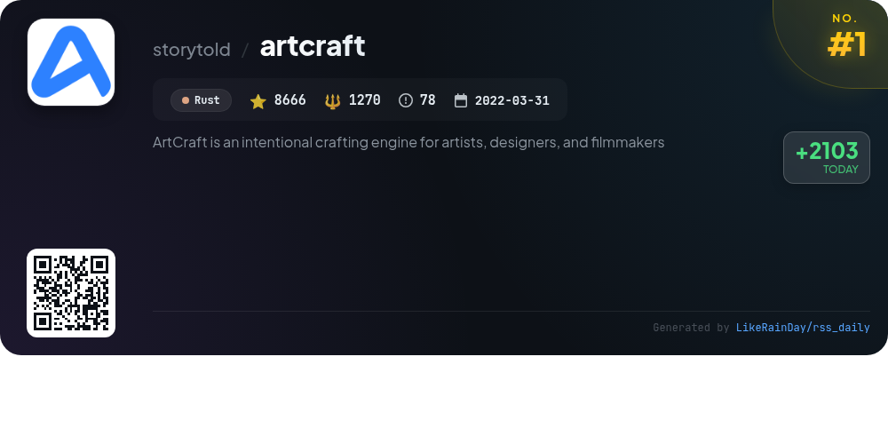
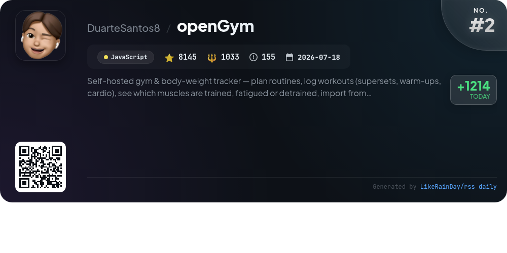
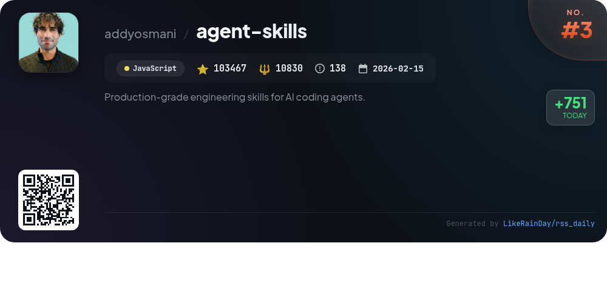
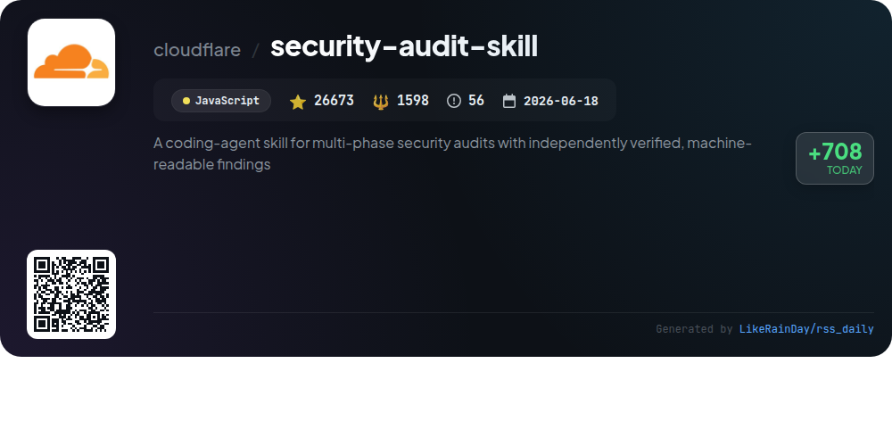
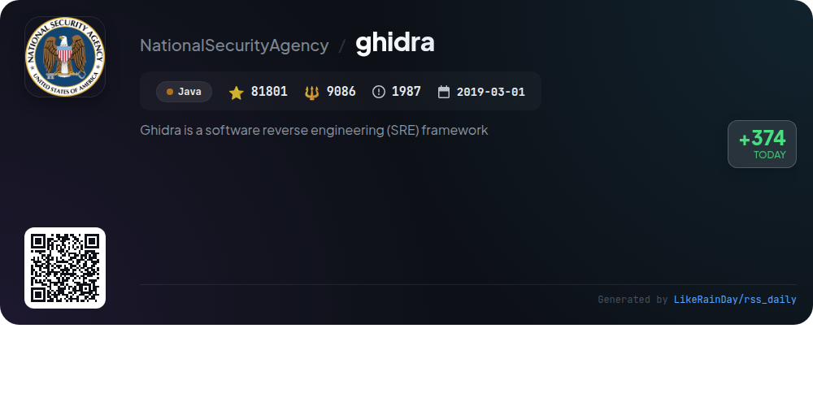
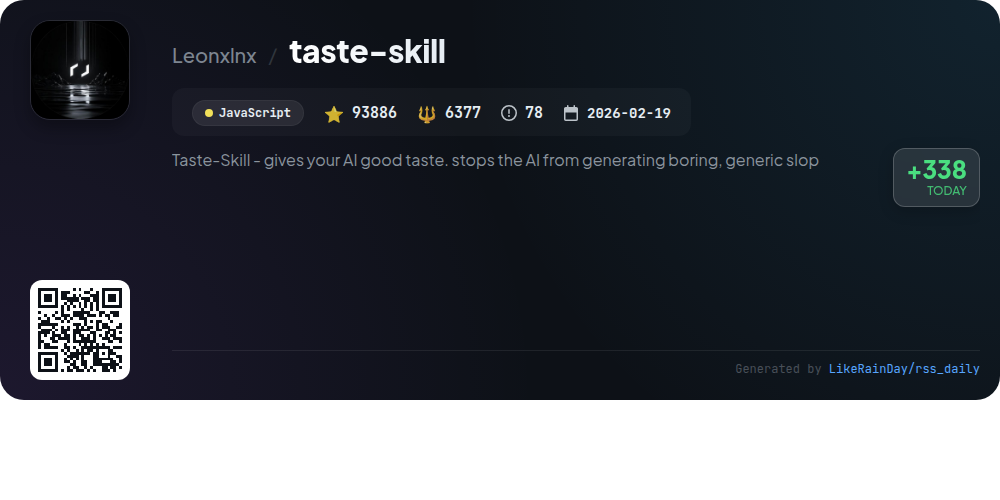
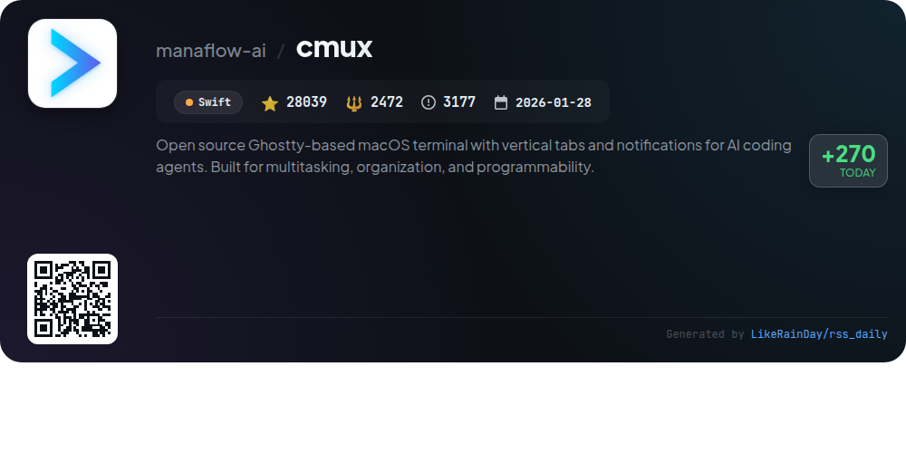
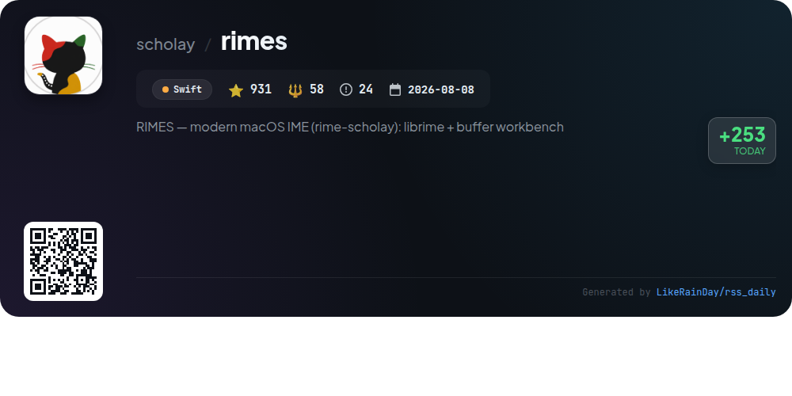
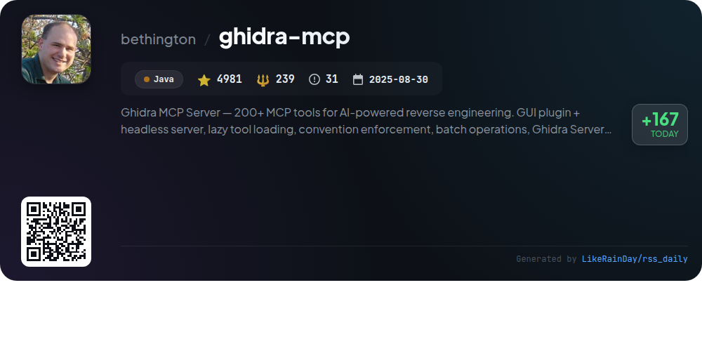
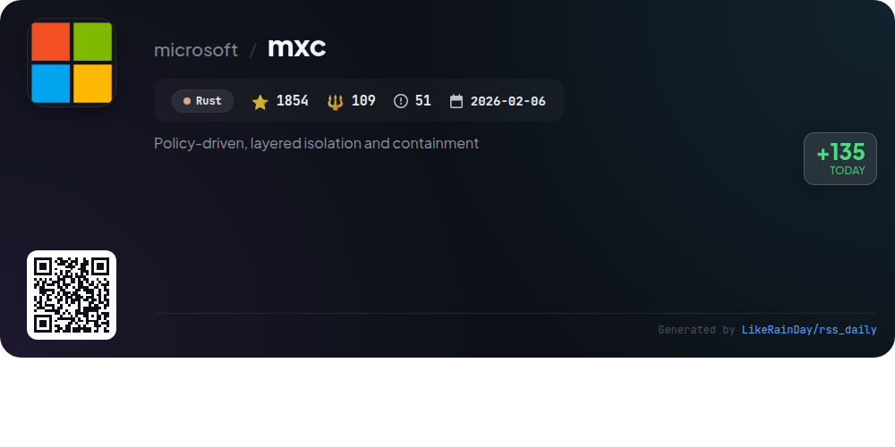

# 📊 🌟 GitHub Trending Daily - 2026-10-09

> > 📅 每日精选 GitHub 热门仓库 | 基于智能算法推荐

## 📋 Overview

**10** 个项目 | **358443** ⭐ | **33072** 🍴

**热门语言:** `JavaScript` (4) · `Rust` (2) · `Java` (2)

**更新时间:** 2026-10-09 05:42 UTC

**分类分布:**

- 🌟 每日 Top 10 精选 (10 项)

---

## 🌟 每日 Top 10 精选

### 1. [artcraft](https://github.com/storytold/artcraft)

> 🤖 **推荐理由**  
> *ArtCraft is an innovative crafting engine designed for artists, designers, and filmmakers, facilitating interactive AI image and video creation. It enables users to compose in 2D and stage scenes in 3D, offering features like image-to-location, 3D compositing, character posing, and mixed asset crafting. ArtCraft supports diverse models for images, video, and 3D meshes from providers like Grok and Midjourney. With 8,666 stars on GitHub, ArtCraft emphasizes visual tools for precise, repeatable results, making it a powerful IDE for creative professionals. Download it for Windows and macOS.*

- ⭐ 8666 stars
- 💻 Rust
- 📅 Updated: 2026-10-09

### 2. [openGym](https://github.com/DuarteSantos8/openGym)

> 🤖 **推荐理由**  
> *openGym is a self-hosted gym and body-weight tracker designed for personal data control. Key features include planning routines, logging workouts (supersets, cardio), tracking muscle fatigue, and importing data from popular apps like FitNotes. With a passkey login system, it ensures data security while syncing across devices. Users can create custom routines from a library of over 1,300 exercises and access guided workouts with built-in timers. The platform is open-source, free to use, and supports multiple languages, making it ideal for fitness enthusiasts seeking privacy and customization.*

- ⭐ 8145 stars
- 💻 JavaScript
- 📅 Updated: 2026-10-09

### 3. [agent-skills](https://github.com/addyosmani/agent-skills)

> 🤖 **推荐理由**  
> *Agent Skills is a robust GitHub project designed to enhance AI coding agents with production-grade engineering workflows. With 25 structured skills, it guides agents through the development lifecycle—from defining specifications to shipping code—while enforcing best practices like test-driven development, code reviews, and security audits. Key features include auto-activation of relevant skills based on tasks, quick installation via CLI for various agents, and a meta-skill for mapping workflows. This project embodies principles from Google's engineering culture, ensuring high-quality software delivery.*

- ⭐ 103467 stars
- 💻 JavaScript
- 📅 Updated: 2026-10-09

### 4. [security-audit-skill](https://github.com/cloudflare/security-audit-skill)

> 🤖 **推荐理由**  
> *A coding-agent skill for multi-phase security audits with independently verified, machine-readable findings. popular project, actively maintained, recently updated*

- ⭐ 26673 stars
- 🍴 1598 forks
- 💻 JavaScript
- 📅 Updated: 2026-10-09

### 5. [ghidra](https://github.com/NationalSecurityAgency/ghidra)

> 🤖 **推荐理由**  
> *Ghidra is an advanced software reverse engineering (SRE) framework developed by the NSA, offering a comprehensive suite of tools for analyzing compiled code across platforms (Windows, macOS, Linux). Key features include disassembly, decompilation, graphing, and extensive scripting capabilities in Java and Python. Ghidra supports numerous processor instruction sets and executable formats, enabling both interactive and automated analysis. Users can develop custom extensions and scripts, making it a versatile platform for cybersecurity research and threat analysis.*

- ⭐ 81801 stars
- 💻 Java
- 📅 Updated: 2026-10-09

### 6. [taste-skill](https://github.com/Leonxlnx/taste-skill)

> 🤖 **推荐理由**  
> *Taste-Skill enhances AI-generated content by promoting creativity and originality, preventing the production of dull and generic outputs. This JavaScript-based project leverages advanced algorithms to refine the aesthetics and relevance of generated text, ensuring a more engaging user experience. With over 93,000 stars, it has garnered significant attention for its ability to elevate AI performance across various applications. Taste-Skill is ideal for developers seeking to improve the quality of their AI's creative capabilities.*

- ⭐ 93886 stars
- 💻 JavaScript
- 📅 Updated: 2026-10-09

### 7. [cmux](https://github.com/manaflow-ai/cmux)

> 🤖 **推荐理由**  
> *cmux is an open-source, Ghostty-based macOS terminal designed for multitasking and organization, featuring vertical tabs and notifications for AI coding agents. Key highlights include a built-in browser with a scriptable API, notification rings for agent attention, and seamless SSH integration for remote workspaces. With customizable commands, extensive keyboard shortcuts, and a native Swift build for optimal performance, cmux enhances productivity for developers. The application supports various coding agents and offers session restoration, making it a versatile tool for modern coding environments.*

- ⭐ 28039 stars
- 💻 Swift
- 📅 Updated: 2026-10-09

### 8. [rimes](https://github.com/scholay/rimes)

> 🤖 **推荐理由**  
> *RIMES is a modern macOS input method editor (IME) built on the RIME engine, designed to enhance user experience through a customizable interface. It features three innovative components: a Buffer for real-time text editing and translation, a Capsule for clipboard management and personal knowledge storage, and a Mailbox for managing AI interactions and notes. Supporting various input schemes (e.g., Pinyin, Wubi), RIMES is user-friendly with a self-contained installation. The project is open-source, actively maintained, and offers cross-platform capabilities, including versions for iOS, Android, and Windows.*

- ⭐ 931 stars
- 💻 Swift
- 📅 Updated: 2026-10-09

### 9. [ghidra-mcp](https://github.com/bethington/ghidra-mcp)

> 🤖 **推荐理由**  
> *Ghidra MCP Server is a robust tool for AI-powered reverse engineering, integrating over 200 Model Context Protocol (MCP) tools with Ghidra's analysis capabilities. Key features include a GUI plugin, headless server mode for automation, lazy tool loading, and full Ghidra Server integration for collaborative work. It supports batch operations, atomic transactions, and convention enforcement for consistent code quality. The server is Docker-ready, enabling scalable CI/CD deployments. With proven AI workflows and dynamic analysis tools like P-code emulation, Ghidra MCP enhances reverse engineering efficiency and reliability.*

- ⭐ 4981 stars
- 💻 Java
- 📅 Updated: 2026-10-09

### 10. [mxc](https://github.com/microsoft/mxc)

> 🤖 **推荐理由**  
> *MXC (Microsoft eXecution Container) is a sandboxed code execution system that enables running untrusted code across Windows, Linux, and macOS. With support for multiple containment backends like ProcessContainer, Windows Sandbox, and LXC, MXC offers a policy-driven approach to sandboxing, allowing fine-grained control over filesystem, network, and UI access. It includes typed SDKs for Rust, .NET, and Node, facilitating easy integration into applications. Key features include JSON-based configurations, a state-aware lifecycle for containers, and diagnostics tools for troubleshooting access issues.*

- ⭐ 1854 stars
- 💻 Rust
- 📅 Updated: 2026-10-09

---

## 📡 RSS订阅

通过 RSS 订阅，第一时间获取每日精选项目：

- 🔔 [RSS 订阅源] (../../daily-top.xml)
- 🔔 [每日简报] (../../GITHUB_TODAY_CN.md)
- 🔔 [每日 Top 10 精选](../../daily-top.xml)

---

*⚡ Powered by Smart Trending Algorithm | Generated at 2026-10-09 05:42:31 UTC
