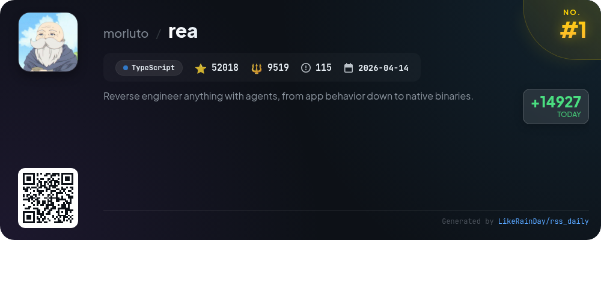
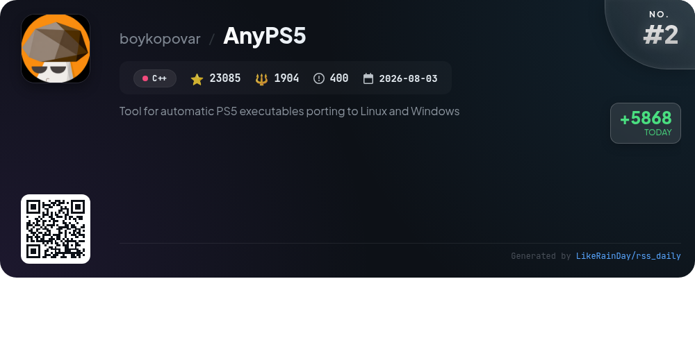
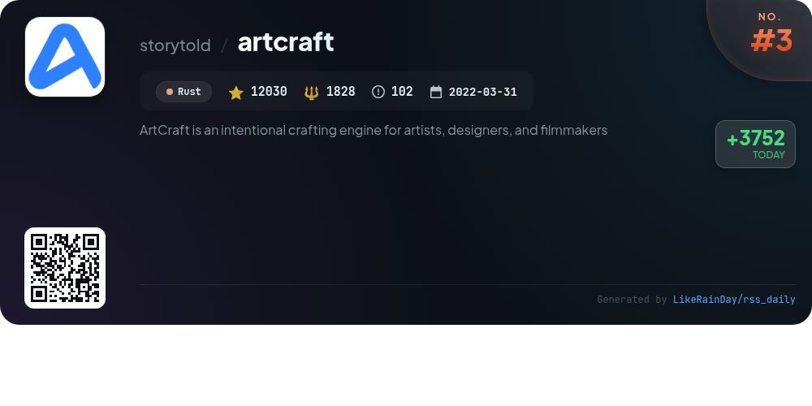
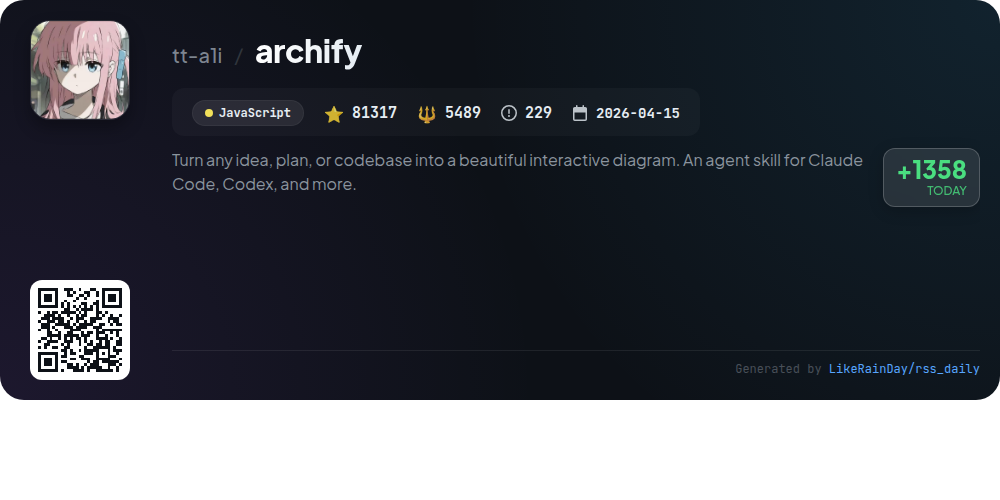
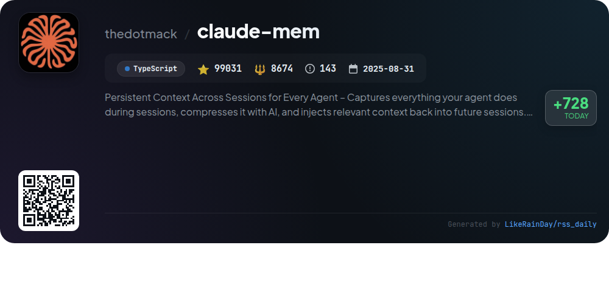
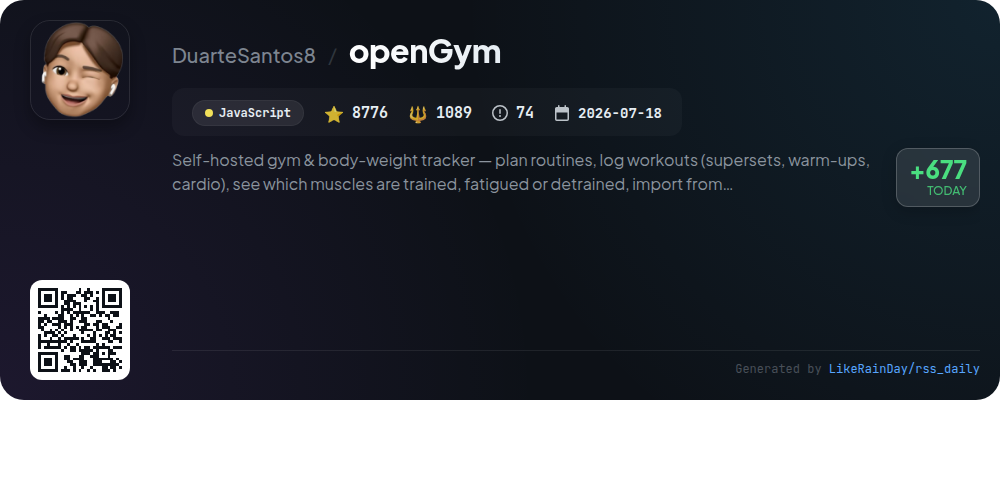
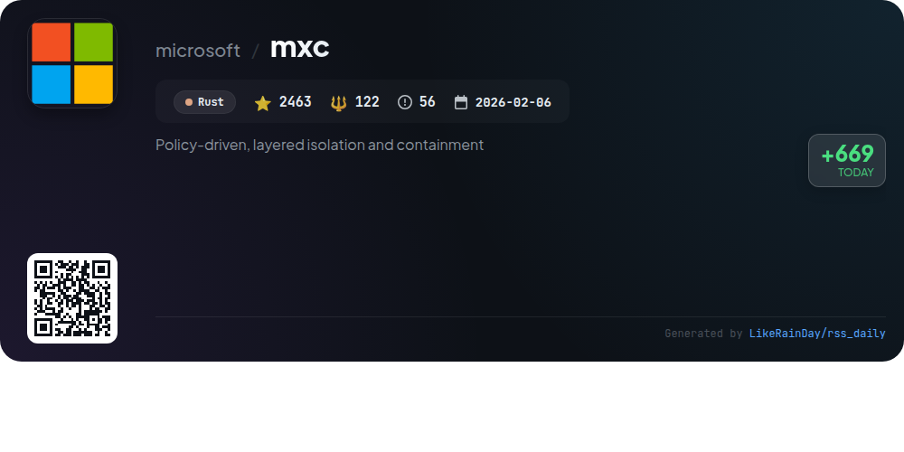
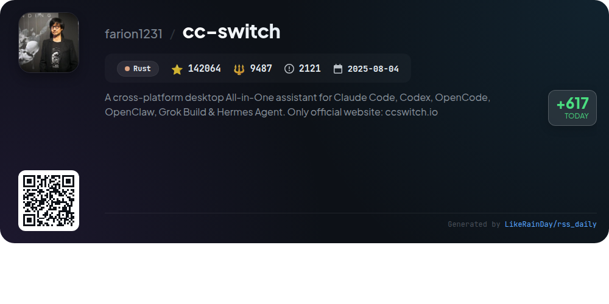
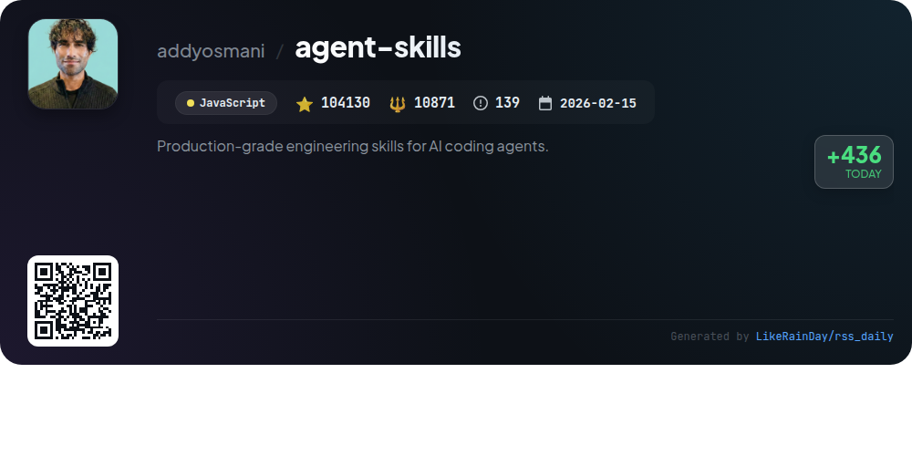
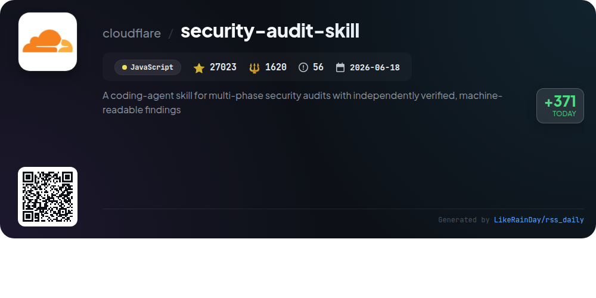

# 📊 🌟 GitHub Trending Daily - 2026-10-10

> > 📅 Daily Picks of GitHub Trending Repositories | Powered by Smart Algorithms

## 📋 Overview

**10** Projects | **551937** ⭐ | **50603** 🍴

**Top Languages:** `JavaScript` (4) · `Rust` (3) · `TypeScript` (2)

**Updated:** 2026-10-10 05:23 UTC

**Categories:**

- 🌟 Daily Top 10 (10 items)

---

## 🌟 Daily Top 10

### 1. [rea](https://github.com/morluto/rea)

> 🤖 **Why Recommend**  
> *REA (Reverse Engineer Anything) is a powerful TypeScript-based tool designed for comprehensive reverse engineering of applications and binaries. With over 52,000 stars on GitHub, it enables users to analyze native binaries, JavaScript/Electron apps, .NET assemblies, and websites. REA connects agents to various analysis tools, providing pseudocode, assembly, and evidence for features without source code. It supports local analysis with tools like Hopper and Ghidra, and offers a seamless setup process via npm. The project emphasizes community engagement, with resources for guides, showcases, and support.*

- ⭐ 52018 stars
- 💻 TypeScript
- 📅 Updated: 2026-10-10

### 2. [AnyPS5](https://github.com/boykopovar/AnyPS5)

> 🤖 **Why Recommend**  
> *AnyPS5 is a C++ tool that automates the porting of PS5 executables to Linux and Windows, boasting over 23,000 stars on GitHub. Core features include a relinker for converting executables to native formats, dynamic linking with system PRX libraries, and a shader recompiler that generates validated SPIR-V. It supports SDL-mapped game controllers, with customizable input mapping. The project prioritizes interoperability and compatibility, providing a compatibility list and detailed documentation for usage and contributions. Licensed under GPL v2.*

- ⭐ 23085 stars
- 💻 C++
- 📅 Updated: 2026-10-10

### 3. [artcraft](https://github.com/storytold/artcraft)

> 🤖 **Why Recommend**  
> *ArtCraft is a powerful crafting engine designed for artists, designers, and filmmakers, enabling interactive AI-driven image and video creation. Key features include advanced 2D and 3D compositing, character posing, scene blocking, and image-to-3D mesh conversion. Users can explore ideas through prompt-based tools and refine them with visual editing options. ArtCraft supports a diverse range of models and providers, including Grok, Midjourney, and Sora. With over 12,000 stars on GitHub, it serves as a versatile IDE for creative professionals. Download ArtCraft for Windows and macOS or build from source.*

- ⭐ 12030 stars
- 💻 Rust
- 📅 Updated: 2026-10-10

### 4. [archify](https://github.com/tt-a1i/archify)

> 🤖 **Why Recommend**  
> *Archify is an open-source project that transforms ideas, plans, or codebases into interactive diagrams. With over 81,000 stars on GitHub, it integrates seamlessly with AI agents like Claude Code and Codex. Users can create and customize diagrams based on descriptions or existing repositories, making it ideal for visualizing workflows, architecture, and data flows. Key highlights include self-contained HTML outputs for easy sharing, community-driven extensions, and support for various diagram types. Explore, refine, and share your creations effortlessly with Archify.*

- ⭐ 81317 stars
- 💻 JavaScript
- 📅 Updated: 2026-10-10

### 5. [claude-mem](https://github.com/thedotmack/claude-mem)

> 🤖 **Why Recommend**  
> *Claude-Mem is a TypeScript-based project designed to maintain persistent context across sessions for AI agents like Claude Code, OpenClaw, Codex, and more. It automatically captures and compresses interactions into semantic summaries, enhancing continuity in agent knowledge. Key features include persistent memory, skill-based search, a web viewer UI, and privacy control. It supports easy installation and integration with various platforms, allowing for automatic context injection and intelligent memory retrieval. With over 99,000 stars, it is a valuable tool for enhancing AI interactions.*

- ⭐ 99031 stars
- 💻 TypeScript
- 📅 Updated: 2026-10-10

### 6. [openGym](https://github.com/DuarteSantos8/openGym)

> 🤖 **Why Recommend**  
> *openGym is a self-hosted gym and body-weight tracker that empowers users to plan routines, log workouts, and monitor muscle training conditions. Key features include guided workouts, extensive exercise library (5,600+ exercises), customizable routines, and detailed progress tracking with a muscle map. It supports data import from popular fitness apps and allows secure access via passkey login. With no subscriptions or ads, openGym prioritizes user data privacy and offers a mobile app for seamless access. Ideal for fitness enthusiasts looking for control and flexibility in their training.*

- ⭐ 8776 stars
- 💻 JavaScript
- 📅 Updated: 2026-10-10

### 7. [mxc](https://github.com/microsoft/mxc)

> 🤖 **Why Recommend**  
> *MXC (Microsoft eXecution Container) is a cross-platform sandboxed code execution system for running untrusted code on Windows, Linux, and macOS. Key features include multiple containment backends (e.g., ProcessContainer, LXC, Bubblewrap), policy-driven sandboxing for filesystem, network, and UI access, and lifecycle operations for container management. It offers SDKs for Rust, .NET, and Node, enabling seamless integration into applications. MXC also provides diagnostic tools for troubleshooting access issues and optional telemetry for monitoring.*

- ⭐ 2463 stars
- 💻 Rust
- 📅 Updated: 2026-10-10

### 8. [cc-switch](https://github.com/farion1231/cc-switch)

> 🤖 **Why Recommend**  
> *CC Switch is a cross-platform desktop application designed to streamline the management of multiple AI coding tools, including Claude Code, Codex, Gemini CLI, and more. Key features include one-click switching between 90+ API providers, centralized management of MCP, Skills, and Prompts, and a unified session log view for easy tracking. The app supports local routing and aggregation modes, allowing seamless integration of various AI models. Built with Rust and Tauri, CC Switch offers a user-friendly interface for Windows, macOS, and Linux, enhancing productivity for developers working with AI technologies.*

- ⭐ 142064 stars
- 💻 Rust
- 📅 Updated: 2026-10-10

### 9. [agent-skills](https://github.com/addyosmani/agent-skills)

> 🤖 **Why Recommend**  
> *Agent Skills is a production-grade toolkit designed for AI coding agents, boasting over 104,000 stars on GitHub. It encapsulates the workflows, quality gates, and best practices employed by senior engineers throughout the software development lifecycle. With 25 structured skills covering steps from defining and planning to building, verifying, reviewing, and shipping, agents can automatically invoke the right skills via 9 slash commands. The project promotes disciplined coding practices, ensures quality through verification, and integrates seamlessly with various AI tools, enhancing productivity and code reliability.*

- ⭐ 104130 stars
- 💻 JavaScript
- 📅 Updated: 2026-10-10

### 10. [security-audit-skill](https://github.com/cloudflare/security-audit-skill)

> 🤖 **Why Recommend**  
> *A coding-agent skill for multi-phase security audits with independently verified, machine-readable findings. popular project, actively maintained, recently updated*

- ⭐ 27023 stars
- 🍴 1620 forks
- 💻 JavaScript
- 📅 Updated: 2026-10-10

---

## 📡 RSS Subscription

Subscribe via RSS to get daily trending updates:

- 🔔 [RSS XML] (../../daily-top.xml)
- 🔔 [Daily Report] (../../GITHUB_TODAY.md)
- 🔔 [Daily Top 10](../../daily-top.xml)

---

*⚡ Powered by Smart Trending Algorithm | Generated at 2026-10-10 05:23:59 UTC
