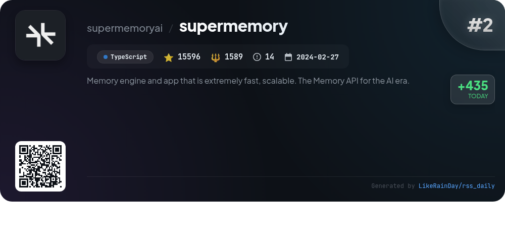
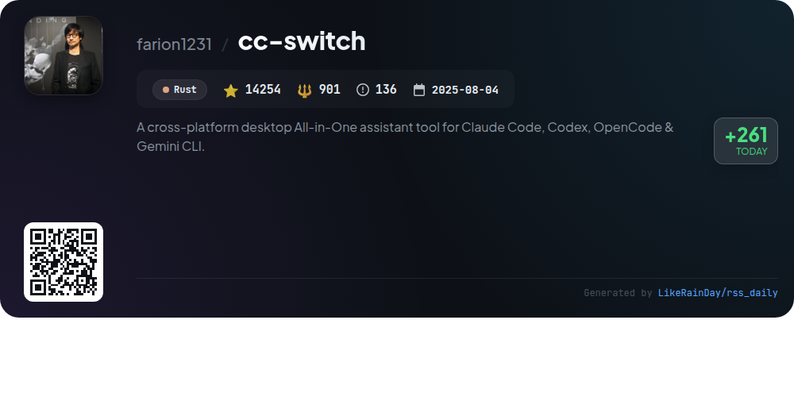
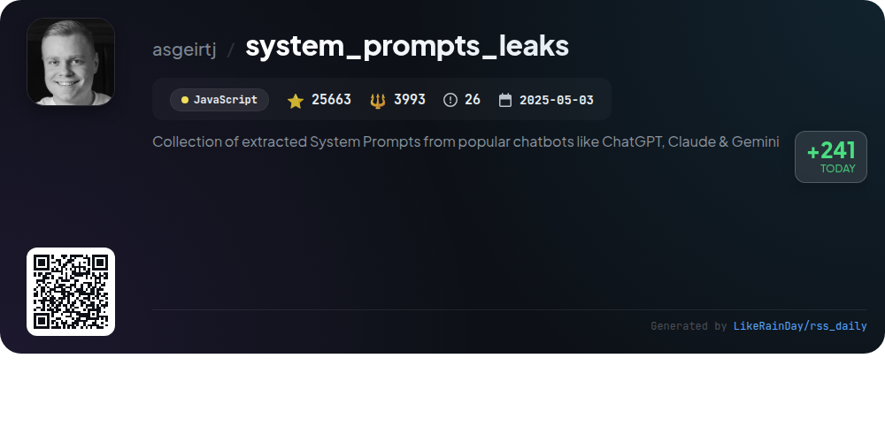
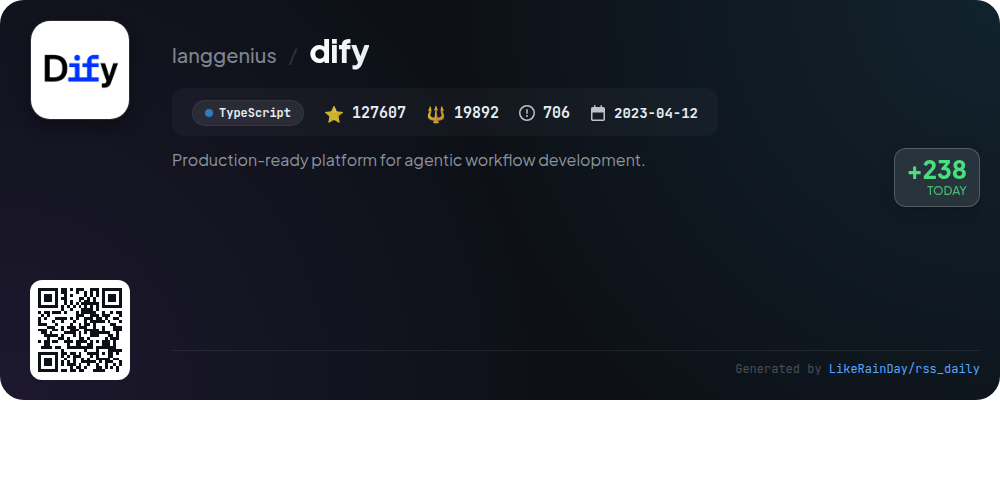
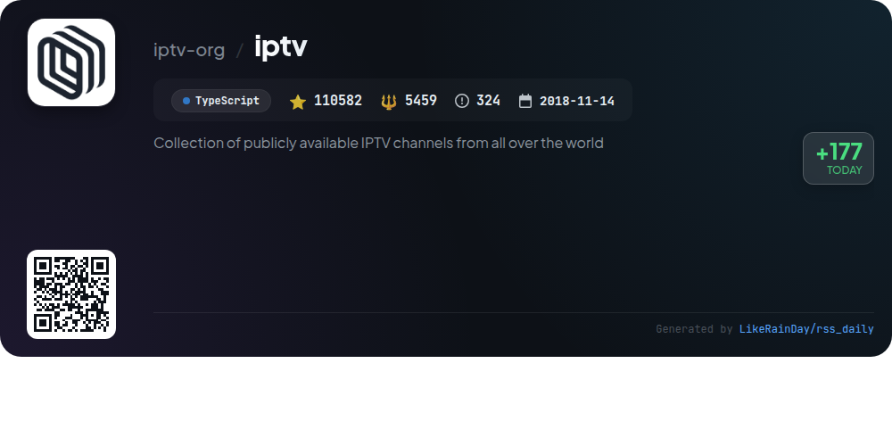
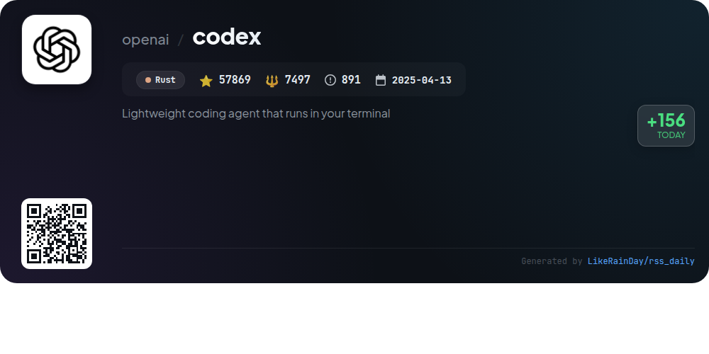
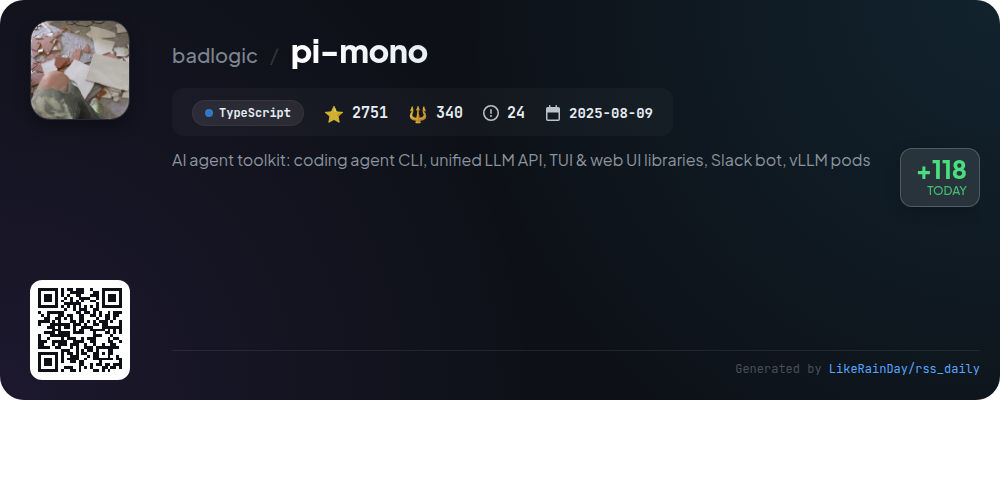

# 📊 🌟 GitHub Trending Daily - 2026-01-28

> > 📅 Daily Picks of GitHub Trending Repositories | Powered by Smart Algorithms

## 📋 Overview

**10** Projects | **418058** ⭐ | **44665** 🍴

**Top Languages:** `TypeScript` (5) · `Rust` (2) · `JavaScript` (1)

**Updated:** 2026-01-28 02:15 UTC

**Categories:**

- 🌟 Daily Top 10 (10 items)

---

## 🌟 Daily Top 10

### 1. [remotion](https://github.com/remotion-dev/remotion)

> 🤖 **Why Recommend**  
> *Remotion is a powerful framework for programmatically creating videos using React, allowing developers to leverage web technologies like CSS, Canvas, and WebGL. Key features include reusable components, programming capabilities for dynamic effects, and a rich package ecosystem. Users can easily get started with `npx create-video@latest`. Notable projects made with Remotion include GitHub Unwrapped and videos by Fireship. Comprehensive documentation is available at remotion.dev. Note that Remotion has a special licensing requirement for commercial use.*

- ⭐ 32894 stars
- 💻 TypeScript
- 📅 Updated: 2026-01-28

### 2. [supermemory](https://github.com/supermemoryai/supermemory)

> 🤖 **Why Recommend**  
> *Supermemory is a fast, scalable memory engine and app designed for the AI era, allowing users to save and organize important information effortlessly. Key features include adding memories from various content types (URLs, PDFs, text), natural language interaction with stored memories, and seamless integration with major AI tools via Supermemory MCP. The project offers a browser extension for easy saving directly from web pages, a Raycast extension for quick access, and self-hosting options for enterprise use. With over 15,596 stars, it provides robust documentation and developer support.*

- ⭐ 15596 stars
- 💻 TypeScript
- 📅 Updated: 2026-01-28

### 3. [video2x](https://github.com/k4yt3x/video2x)

> 🤖 **Why Recommend**  
> *Video2X is a machine learning-based framework for video super resolution and frame interpolation, established in 2018. With over 18,000 stars, its latest version (6.0.0) features a complete C/C++ rewrite, enhancing speed and output quality. It supports Windows and Linux, offering modes for filtering and interpolation with advanced models like Anime4K, Real-ESRGAN, and RIFE. Users can easily install via a GUI or Docker, and even utilize Google Colab for free GPU access. Comprehensive documentation is available for setup and usage.*

- ⭐ 18294 stars
- 💻 C++
- 📅 Updated: 2026-01-28

### 4. [cc-switch](https://github.com/farion1231/cc-switch)

> 🤖 **Why Recommend**  
> *cc-switch is a cross-platform desktop assistant tool for Claude Code, Codex, and Gemini CLI, built with Rust. It offers seamless provider management, allowing users to switch between AI configurations effortlessly. Key features include a revamped SQLite + JSON architecture for data persistence, a new user-friendly interface, multi-language support (Chinese, English, Japanese), and automated skills and prompts management. The tool enables latency testing, backup/restore capabilities, and supports cloud sync for cross-device configuration. With over 14,000 stars, it integrates multiple API services for enhanced coding experiences.*

- ⭐ 14254 stars
- 💻 Rust
- 📅 Updated: 2026-01-28

### 5. [system_prompts_leaks](https://github.com/asgeirtj/system_prompts_leaks)

> 🤖 **Why Recommend**  
> *The "system_prompts_leaks" project is a comprehensive collection of extracted system prompts from leading chatbots like ChatGPT, Claude, and Gemini. With over 25,600 stars, this JavaScript-based repository serves as a valuable resource for developers and researchers interested in understanding chatbot behaviors and functionalities. Key highlights include community contributions through pull requests and a visual star history chart that tracks its popularity over time. This project promotes transparency in AI interactions and encourages collaborative enhancement.*

- ⭐ 25663 stars
- 💻 JavaScript
- 📅 Updated: 2026-01-28

### 6. [dify](https://github.com/langgenius/dify)

> 🤖 **Why Recommend**  
> *Dify is a production-ready, open-source platform designed for agentic workflow development in LLM applications. Key features include a visual workflow builder, comprehensive model support for various LLMs, an intuitive prompt IDE, robust RAG pipelines, and extensive agent capabilities with over 50 built-in tools. Dify offers both a cloud service and a self-hosted community edition, enabling easy integration via APIs. The platform emphasizes observability with LLMOps and backend-as-a-service features, making it suitable for both individual developers and enterprises.*

- ⭐ 127607 stars
- 💻 TypeScript
- 📅 Updated: 2026-01-28

### 7. [iptv](https://github.com/iptv-org/iptv)

> 🤖 **Why Recommend**  
> *The IPTV project is a comprehensive collection of publicly available Internet Protocol television (IPTV) channels from around the globe, boasting over 110,000 stars on GitHub. Users can easily access channels by pasting playlist links into compatible video players. The repository includes a main playlist, Electronic Program Guide (EPG) utilities, and an API for developers. It emphasizes community contributions, offers resources for further exploration, and provides a legal disclaimer regarding the nature of the content, ensuring compliance with copyright laws.*

- ⭐ 110582 stars
- 💻 TypeScript
- 📅 Updated: 2026-01-28

### 8. [codex](https://github.com/openai/codex)

> 🤖 **Why Recommend**  
> *Codex is a lightweight coding agent from OpenAI, designed to run locally in your terminal. With over 57,000 stars on GitHub, it offers seamless integration with code editors like VS Code and supports cloud usage via Codex Web. Users can install it globally using npm or Homebrew and can sign in with their ChatGPT account for enhanced features. Codex is built in Rust, ensuring performance and reliability. Comprehensive documentation is available for installation, usage, and contributions, making it accessible for developers at all levels.*

- ⭐ 57869 stars
- 💻 Rust
- 📅 Updated: 2026-01-28

### 9. [WeKnora](https://github.com/Tencent/WeKnora)

> 🤖 **Why Recommend**  
> *WeKnora is an LLM-powered framework for deep document understanding and semantic retrieval, utilizing the RAG (Retrieval-Augmented Generation) paradigm. Key features include Agent Mode for intelligent Q&A, support for multi-type knowledge bases, precise content extraction from various formats, and flexible retrieval strategies. The framework enables efficient integration with web search engines and MCP tools, offering a user-friendly interface for knowledge management. Ideal for scenarios like enterprise knowledge management and academic research, WeKnora ensures secure local deployment and data sovereignty.*

- ⭐ 12548 stars
- 💻 Go
- 📅 Updated: 2026-01-28

### 10. [pi-mono](https://github.com/badlogic/pi-mono)

> 🤖 **Why Recommend**  
> *Pi-mono is an AI agent toolkit designed for building and managing AI agents and LLM deployments. Key features include a unified multi-provider LLM API for various platforms (OpenAI, Anthropic, Google), an interactive coding agent CLI, and a Slack bot for message delegation. The project also offers a terminal UI library with differential rendering and web components for AI chat interfaces. With 2,751 stars on GitHub, it provides essential tools for developers to create and manage AI solutions efficiently.*

- ⭐ 2751 stars
- 💻 TypeScript
- 📅 Updated: 2026-01-28

---

## 📡 RSS Subscription

Subscribe via RSS to get daily trending updates:

- 🔔 [RSS XML] (../../daily-top.xml)
- 🔔 [Daily Report] (../../GITHUB_TODAY.md)
- 🔔 [Daily Top 10](../../daily-top.xml)

---

*⚡ Powered by Smart Trending Algorithm | Generated at 2026-01-28 02:15:40 UTC
