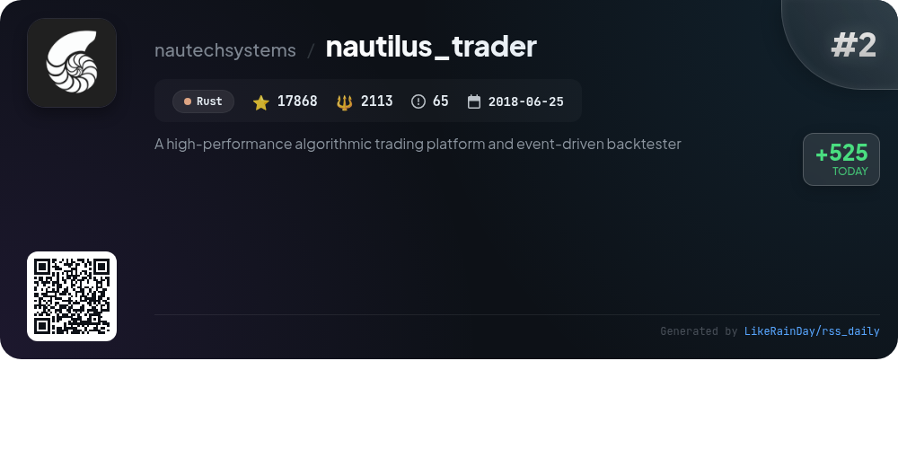
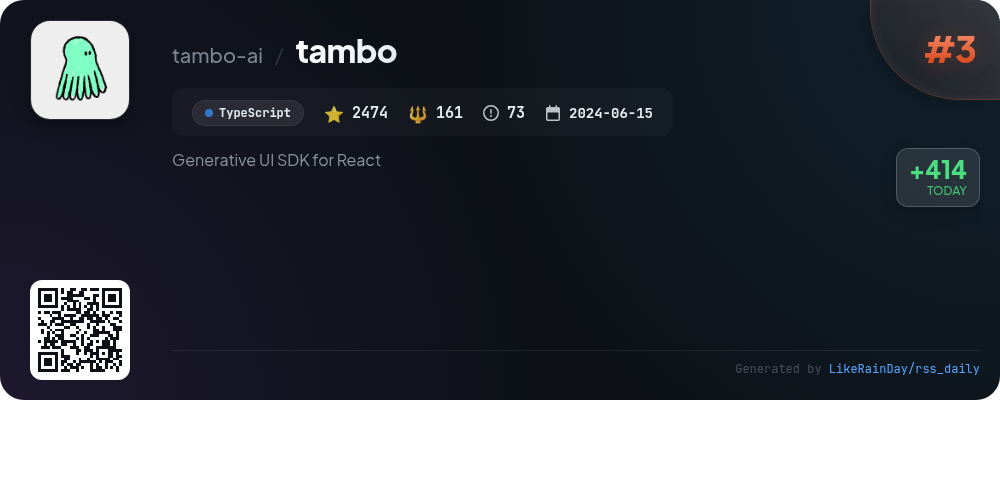
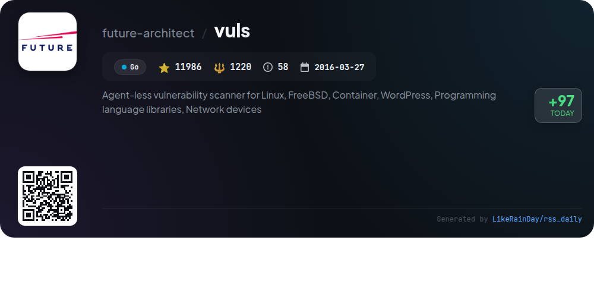
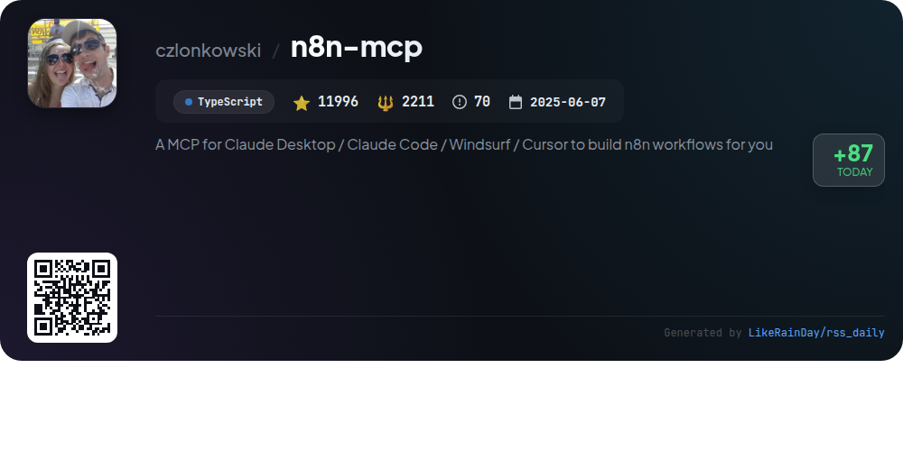
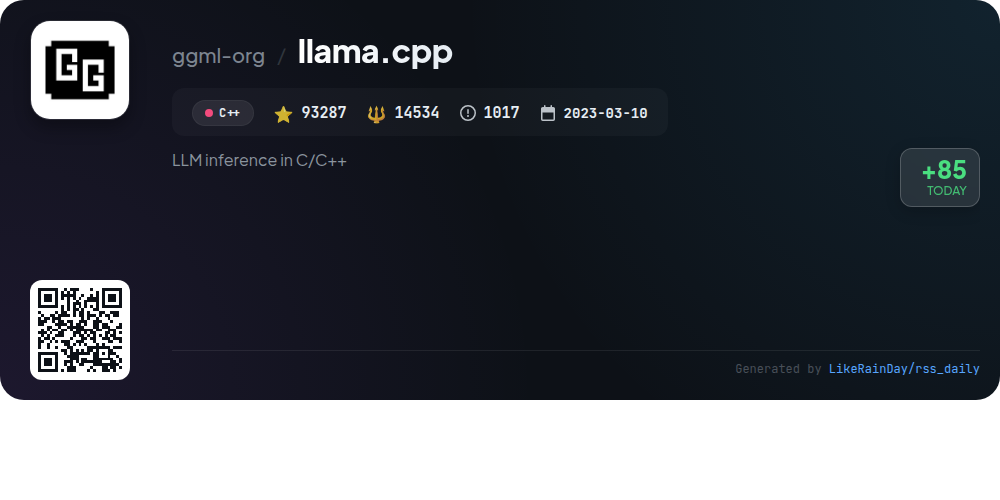

# 📊 🌟 GitHub Trending Daily - 2026-01-19

> > 📅 Daily Picks of GitHub Trending Repositories | Powered by Smart Algorithms

## 📋 Overview

**10** Projects | **170437** ⭐ | **23719** 🍴

**Top Languages:** `TypeScript` (5) · `C` (2) · `Go` (1)

**Updated:** 2026-01-19 12:33 UTC

**Categories:**

- 🌟 Daily Top 10 (10 items)

---

## 🌟 Daily Top 10

### 1. [AionUi](https://github.com/iOfficeAI/AionUi)

> 🤖 **Why Recommend**  
> *AionUi is a free, open-source coworking platform for command-line AI tools like Gemini CLI, Claude Code, and Codex, boasting over 6,389 stars on GitHub. Key features include a unified graphical interface for multi-agent collaboration, local data security, and smart file management. Users can enjoy real-time previews for various document formats and AI image generation. AionUi supports cross-platform use on macOS, Windows, and Linux, allowing for seamless remote access via WebUI. Enhance your AI experience with AionUi's intuitive design and powerful capabilities.*

- ⭐ 6389 stars
- 💻 TypeScript
- 📅 Updated: 2026-01-19

### 2. [nautilus_trader](https://github.com/nautechsystems/nautilus_trader)

> 🤖 **Why Recommend**  
> *NautilusTrader is a high-performance, open-source algorithmic trading platform built in Rust, designed for quantitative traders. It features an event-driven backtester, allowing users to backtest and deploy automated trading strategies with identical code for both environments. Key offerings include support for multiple asset classes, advanced order types, and customizable components via modular adapters. The platform prioritizes reliability and safety, ensuring consistent performance across Linux, macOS, and Windows. Integration with various trading venues and data providers enhances its versatility for high-frequency trading strategies.*

- ⭐ 17868 stars
- 💻 Rust
- 📅 Updated: 2026-01-19

### 3. [tambo](https://github.com/tambo-ai/tambo)

> 🤖 **Why Recommend**  
> *Tambo is a generative UI SDK for React that enables the creation of adaptive applications tailored to user needs. Leveraging AI, it dynamically selects and renders components based on natural language input, enhancing user experience for both novices and experts. Key features include support for generative and interactable components, seamless integration with various MCPs, and the ability to utilize local tools. Tambo offers both a free cloud service and self-hosting options, along with a comprehensive documentation and pre-built component library to accelerate development.*

- ⭐ 2474 stars
- 💻 TypeScript
- 📅 Updated: 2026-01-19

### 4. [gemini-voyager](https://github.com/Nagi-ovo/gemini-voyager)

> 🤖 **Why Recommend**  
> *An all-in-one enhancement suite for Google Gemini - timeline navigation, folder management, prompt library, and chat export in one powerful extension.. popular project, recently updated*

- ⭐ 1717 stars
- 🍴 53 forks
- 💻 TypeScript
- 📅 Updated: 2026-01-19

### 5. [TaskExplorer](https://github.com/DavidXanatos/TaskExplorer)

> 🤖 **Why Recommend**  
> *TaskExplorer is a powerful task management tool designed for real-time monitoring and analysis of running applications. It features an intuitive UI with accessible panels, including a Thread Panel for stack traces, a Memory Panel for process memory editing, and a Handles Panel for viewing open handles. Network activity can be monitored via the Socket Panel, while the Modules Panel lists loaded DLLs. Users benefit from dynamic data refresh, robust system monitoring graphs, and the ability to manage system services. Built on the Qt Framework, it aims for cross-platform compatibility, with future Linux support planned.*

- ⭐ 2319 stars
- 💻 C
- 📅 Updated: 2026-01-19

### 6. [Personal_AI_Infrastructure](https://github.com/danielmiessler/Personal_AI_Infrastructure)

> 🤖 **Why Recommend**  
> *Personal AI Infrastructure (PAI) is an open-source platform designed to enhance human capabilities through personalized AI. Key features include continuous learning, goal-oriented functionality, and a modular architecture with 23 self-contained Packs for various tasks. PAI captures user preferences and history, enabling tailored interactions and improved decision-making. It serves a wide audience—small businesses, creatives, and developers—by providing a customizable AI assistant that evolves with user needs. With 5 infrastructure Packs and 18 skill Packs, PAI aims to democratize access to advanced AI technology.*

- ⭐ 5207 stars
- 💻 TypeScript
- 📅 Updated: 2026-01-19

### 7. [Sandboxie](https://github.com/sandboxie-plus/Sandboxie)

> 🤖 **Why Recommend**  
> *Sandboxie is a sandbox-based isolation software for Windows that enables users to run applications in a secure, virtual environment without altering the host system. It features two editions: Plus, with a modern Qt UI and advanced functionalities like Snapshot Manager, a network firewall per sandbox, and enhanced privacy controls, and Classic, which offers a more basic interface. Key highlights include unlimited sandbox creation, customizable restrictions, encrypted storage, and integration with Windows components. This community-driven fork builds upon the legacy of the original Sandboxie, focusing on security and usability.*

- ⭐ 17194 stars
- 💻 C
- 📅 Updated: 2026-01-19

### 8. [vuls](https://github.com/future-architect/vuls)

> 🤖 **Why Recommend**  
> *Vuls is an agent-less vulnerability scanner for Linux, FreeBSD, and various applications, including Docker containers and WordPress, developed in Go. It automates vulnerability detection, integrates with multiple security databases, and provides high-quality scanning with minimal server load. Key features include remote and local scan modes, dynamic analysis, and support for non-OS packages. Vuls generates regular reports, offers Slack notifications, and facilitates CI/CD integration, making it an efficient solution for system administrators to manage vulnerabilities without manual oversight.*

- ⭐ 11986 stars
- 💻 Go
- 📅 Updated: 2026-01-19

### 9. [n8n-mcp](https://github.com/czlonkowski/n8n-mcp)

> 🤖 **Why Recommend**  
> *n8n-mcp is a Model Context Protocol (MCP) server designed to enhance AI assistants' interaction with n8n's workflow automation platform. Key features include access to 1,084 nodes (537 core and 547 community), detailed node properties and operations, and a library of 2,709 workflow templates. The tool offers smart node search, real-world examples, and comprehensive validation for configurations. Users can deploy n8n-mcp easily via hosted services or self-hosting options like Docker. It serves as a vital bridge, ensuring AI-driven workflows are efficient and reliable.*

- ⭐ 11996 stars
- 💻 TypeScript
- 📅 Updated: 2026-01-19

### 10. [llama.cpp](https://github.com/ggml-org/llama.cpp)

> 🤖 **Why Recommend**  
> *llama.cpp is a high-performance C/C++ library for large language model (LLM) inference, boasting over 93,000 stars on GitHub. It supports various architectures, including ARM, x86, and RISC-V, with optimizations for both CPUs and GPUs. Key features include support for multiple quantization formats for efficient inference, a REST API server for model deployment, and integration with Hugging Face for model management. The project also provides a user-friendly CLI and extensive documentation, making it accessible for developers to run and experiment with various LLMs locally or in the cloud.*

- ⭐ 93287 stars
- 💻 C++
- 📅 Updated: 2026-01-19

---

## 📡 RSS Subscription

Subscribe via RSS to get daily trending updates:

- 🔔 [RSS XML] (../../daily-top.xml)
- 🔔 [Daily Report] (../../GITHUB_TODAY.md)
- 🔔 [Daily Top 10](../../daily-top.xml)

---

*⚡ Powered by Smart Trending Algorithm | Generated at 2026-01-19 12:33:27 UTC
