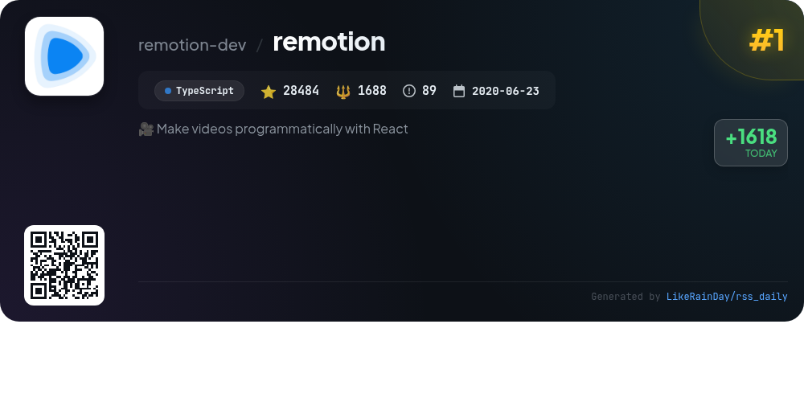
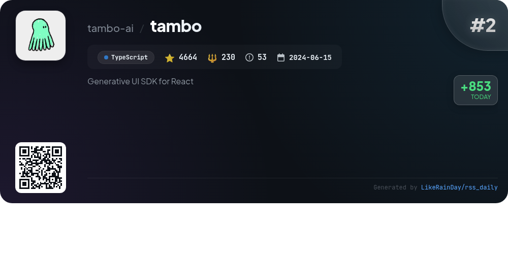
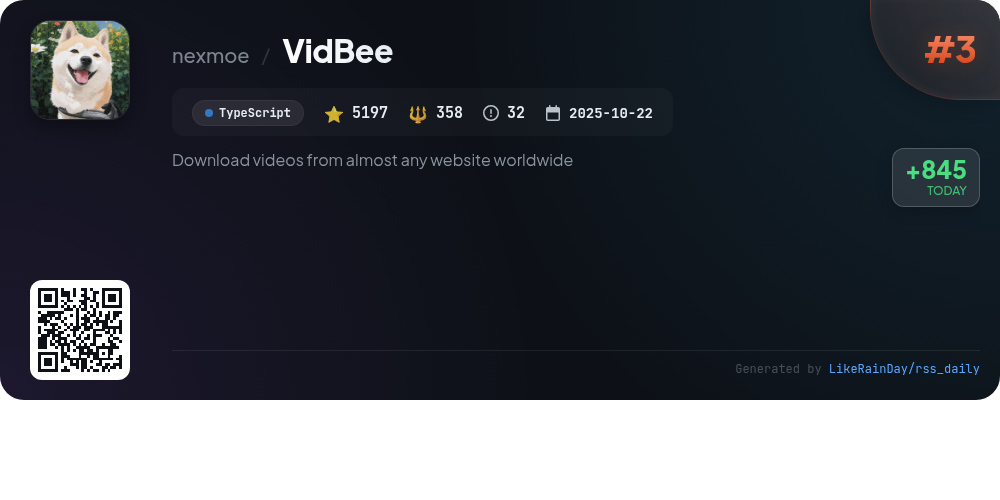
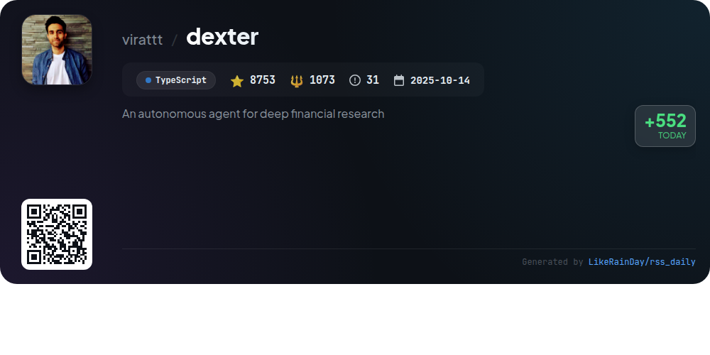
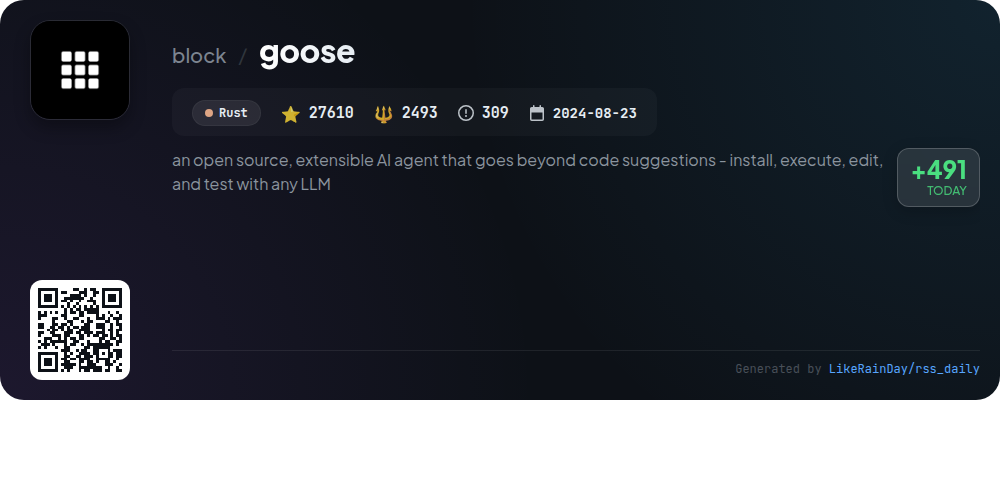
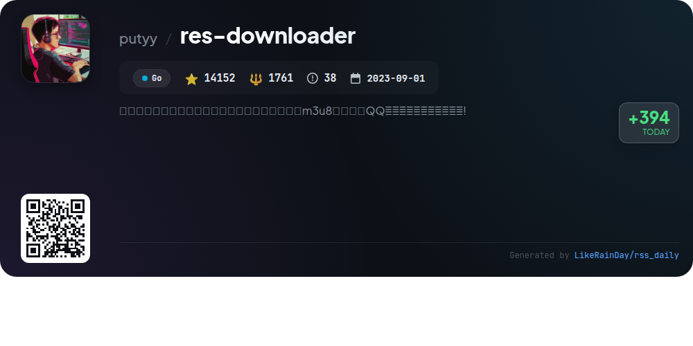
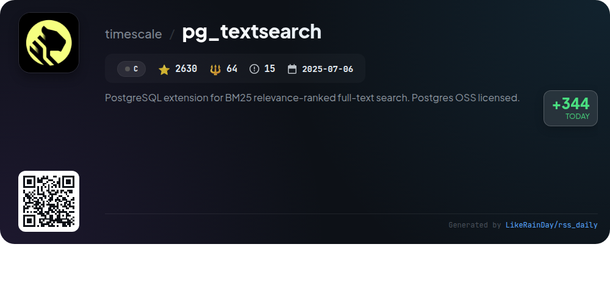

# 📊 🌟 GitHub Trending Daily - 2026-01-24

> > 📅 Daily Picks of GitHub Trending Repositories | Powered by Smart Algorithms

## 📋 Overview

**10** Projects | **151184** ⭐ | **13234** 🍴

**Top Languages:** `TypeScript` (6) · `Rust` (2) · `C` (1)

**Updated:** 2026-01-24 02:08 UTC

**Categories:**

- 🌟 Daily Top 10 (10 items)

---

## 🌟 Daily Top 10

### 1. [remotion](https://github.com/remotion-dev/remotion)

> 🤖 **Why Recommend**  
> *Remotion is a powerful framework for creating videos programmatically using React, leveraging web technologies like CSS, Canvas, and SVG. With its reusable components and programming capabilities, users can create dynamic video content using variables, functions, and APIs. The library has garnered significant attention, boasting over 28,000 stars on GitHub. Key highlights include the ability to produce personalized videos, such as GitHub Unwrapped, and a robust documentation resource. Getting started is easy with the command `npx create-video@latest`.*

- ⭐ 28484 stars
- 💻 TypeScript
- 📅 Updated: 2026-01-24

### 2. [tambo](https://github.com/tambo-ai/tambo)

> 🤖 **Why Recommend**  
> *Tambo is a generative UI SDK for React that enables developers to create adaptive applications using AI. With 4,664 stars on GitHub, it allows for dynamic component registration, delivering tailored interfaces based on user interactions. Key features include generative and interactable components, cloud or self-hosted deployment options, and support for multiple LLM providers. Tambo integrates seamlessly with various tools and services, offering a pre-built component library and customizable options for user authentication and context. Explore its capabilities through comprehensive documentation and community support.*

- ⭐ 4664 stars
- 💻 TypeScript
- 📅 Updated: 2026-01-24

### 3. [VidBee](https://github.com/nexmoe/VidBee)

> 🤖 **Why Recommend**  
> *VidBee is an open-source video downloader that supports downloading videos and audio from over 1000 websites globally, including YouTube, TikTok, and Instagram. Built with TypeScript and powered by yt-dlp, it features a modern interface with intuitive operations, allowing users to easily manage downloads with pause/resume capabilities and real-time progress tracking. A standout feature is the RSS auto-download, which automatically subscribes to feeds and downloads new content from favorite creators. Ideal for seamless content management, VidBee is actively developed and welcomes community contributions.*

- ⭐ 5197 stars
- 💻 TypeScript
- 📅 Updated: 2026-01-24

### 4. [dexter](https://github.com/virattt/dexter)

> 🤖 **Why Recommend**  
> *Dexter is an autonomous agent designed for deep financial research, leveraging TypeScript to analyze complex queries through intelligent task planning and real-time market data. With capabilities like autonomous execution, self-validation, and access to detailed financial statements, Dexter transforms intricate financial questions into structured research plans. Key features include built-in safety measures, integration with APIs for financial datasets, and support for various runtime environments. It aims to provide confident, data-backed answers while continuously refining its results.*

- ⭐ 8753 stars
- 💻 TypeScript
- 📅 Updated: 2026-01-24

### 5. [goose](https://github.com/block/goose)

> 🤖 **Why Recommend**  
> *goose is an open-source AI agent designed for developers, enabling automation of engineering tasks from start to finish. Beyond mere code suggestions, it can build projects, execute and debug code, and interact with APIs autonomously. Compatible with any LLM, goose supports multi-model configurations and integrates seamlessly with MCP servers. Available as both a desktop app and CLI, it enhances productivity and innovation in development workflows. Key resources include quickstart guides, tutorials, and a responsible AI coding guide. Join the community on Discord and other platforms.*

- ⭐ 27610 stars
- 💻 Rust
- 📅 Updated: 2026-01-24

### 6. [res-downloader](https://github.com/putyy/res-downloader)

> 🤖 **Why Recommend**  
> *res-downloader is a cross-platform resource downloader built with Go and Wails, supporting Windows, macOS, and Linux. It allows users to easily download various media types, including videos, audio, images, and live streams from popular platforms like Douyin, Kuaishou, and QQ Music. Key features include a user-friendly interface, extensive resource compatibility, and proxy support for accessing restricted content. With over 14,000 stars on GitHub, it provides a simplified experience for capturing online resources, making it accessible to a wide audience.*

- ⭐ 14152 stars
- 💻 Go
- 📅 Updated: 2026-01-24

### 7. [pg_textsearch](https://github.com/timescale/pg_textsearch)

> 🤖 **Why Recommend**  
> *PostgreSQL extension for BM25 relevance-ranked full-text search. Postgres OSS licensed.. popular project, recently updated*

- ⭐ 2630 stars
- 🍴 64 forks
- 💻 C
- 📅 Updated: 2026-01-24

### 8. [mastra](https://github.com/mastra-ai/mastra)

> 🤖 **Why Recommend**  
> *Mastra is a TypeScript framework designed for building AI-powered applications and agents. With over 20,000 stars, it offers seamless integration with popular frameworks like React and Next.js. Key features include model routing for 40+ AI providers, autonomous agents for complex tasks, a graph-based workflow engine, and human-in-the-loop support for user input. Mastra also provides context management, production essentials for evaluation, and the ability to create Model Context Protocol servers. Get started easily with the command `npm create mastra@latest`.*

- ⭐ 20350 stars
- 💻 TypeScript
- 📅 Updated: 2026-01-24

### 9. [cc-switch](https://github.com/farion1231/cc-switch)

> 🤖 **Why Recommend**  
> *cc-switch is a cross-platform desktop assistant tool designed for Claude Code, Codex, and Gemini CLI, built with Rust and Tauri. With over 13,290 stars, it offers seamless provider management, allowing users to switch between AI services effortlessly. Key features include a new UI, skills and prompts management, multi-level directory support, and SQLite-based storage for enhanced data persistence. The app supports cloud sync, auto-launch on startup, and provides integration with popular API relay services like PackyCode and AIGoCode for efficient coding experiences.*

- ⭐ 13290 stars
- 💻 Rust
- 📅 Updated: 2026-01-24

### 10. [sim](https://github.com/simstudioai/sim)

> 🤖 **Why Recommend**  
> *Sim is an open-source platform designed to build and deploy AI agent workflows quickly and easily. With over 26,000 stars on GitHub, it offers a visual workflow builder, allowing users to connect agents, tools, and blocks seamlessly. Key features include a Copilot for generating nodes and troubleshooting, integration with vector databases for content-specific queries, and options for self-hosting via Docker or NPM. The platform supports local AI models through Ollama, providing flexibility without external APIs. Comprehensive documentation and community support enhance usability.*

- ⭐ 26054 stars
- 💻 TypeScript
- 📅 Updated: 2026-01-24

---

## 📡 RSS Subscription

Subscribe via RSS to get daily trending updates:

- 🔔 [RSS XML] (../../daily-top.xml)
- 🔔 [Daily Report] (../../GITHUB_TODAY.md)
- 🔔 [Daily Top 10](../../daily-top.xml)

---

*⚡ Powered by Smart Trending Algorithm | Generated at 2026-01-24 02:08:38 UTC
