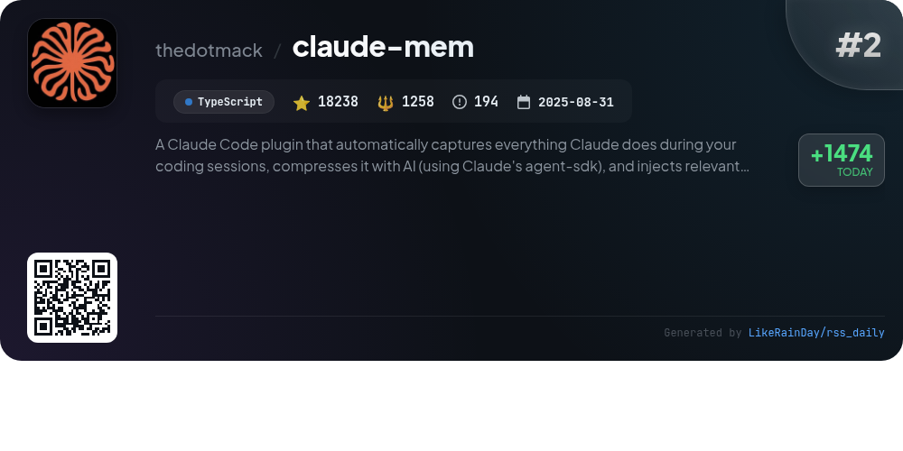
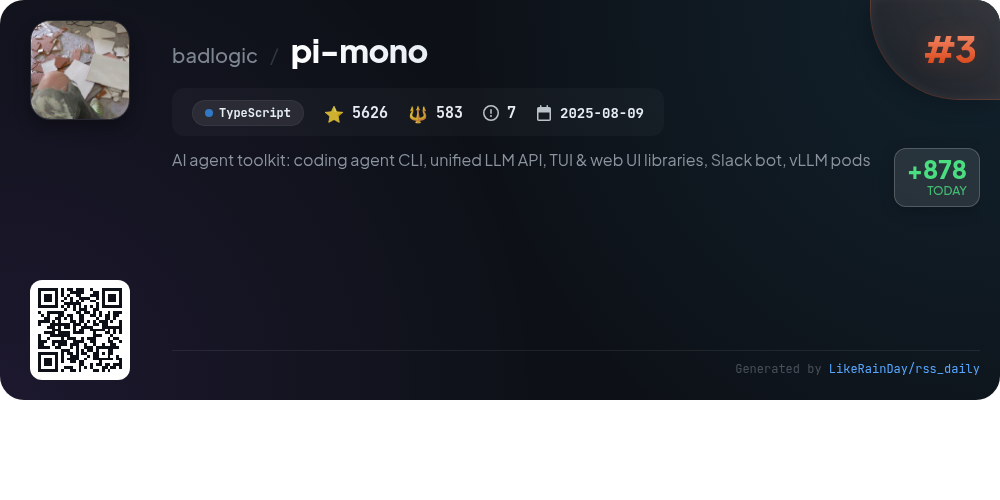
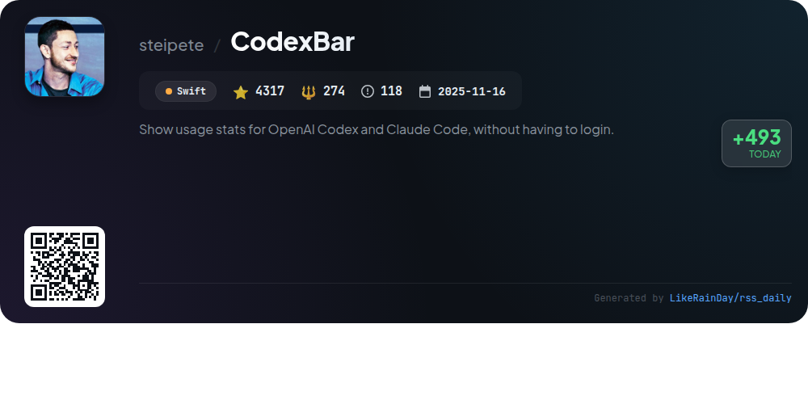
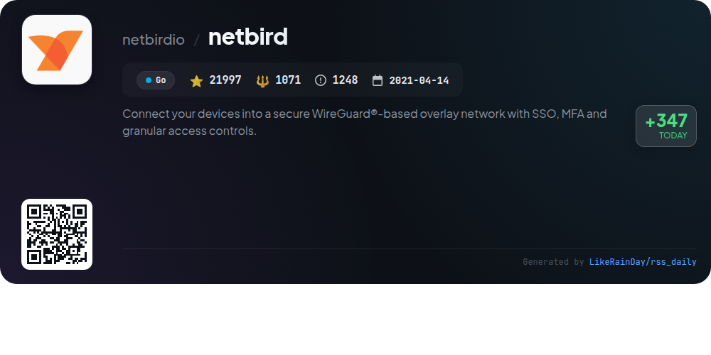
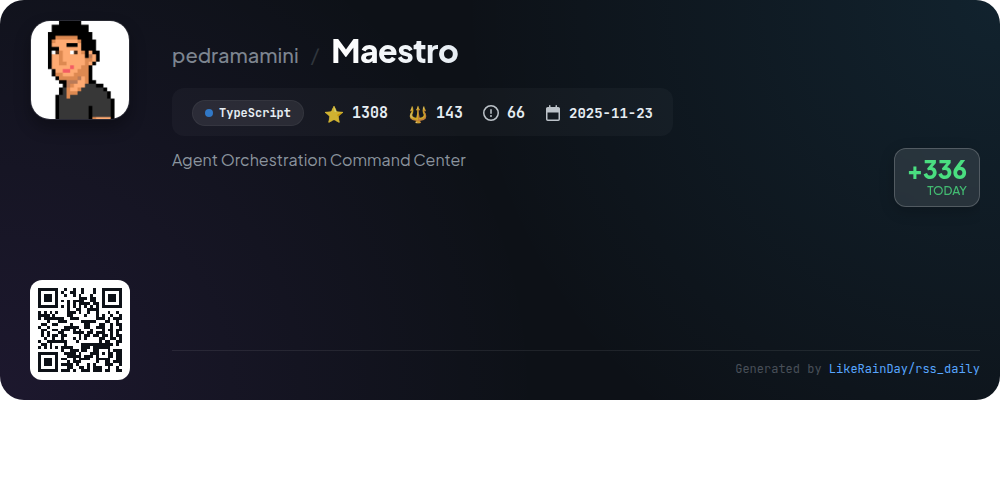
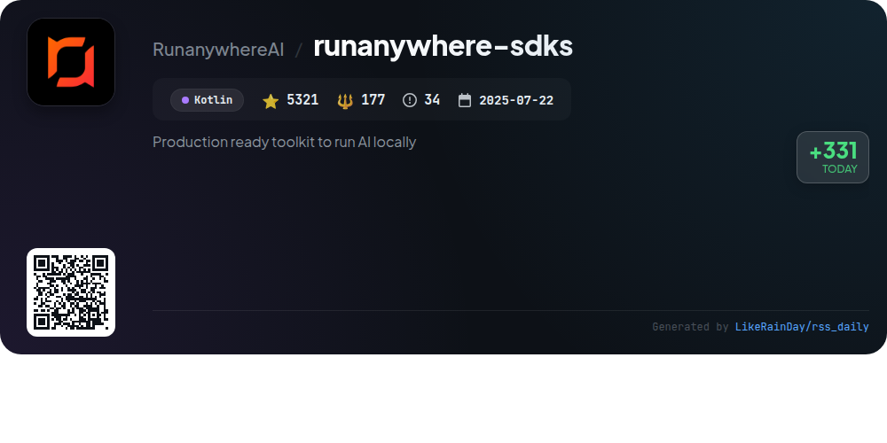
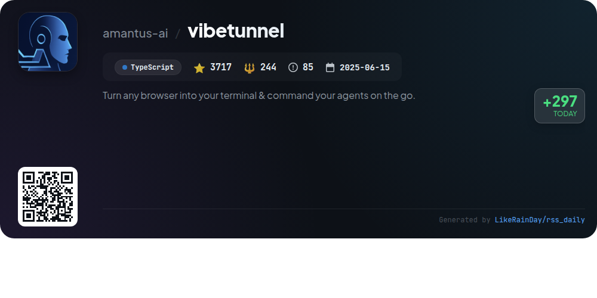
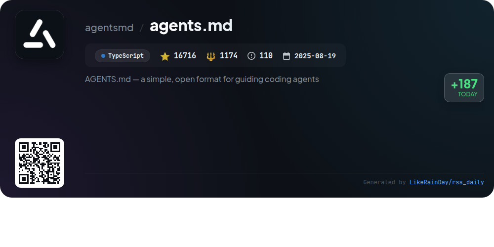

# 📊 🌟 GitHub Trending Daily - 2026-02-03

> > 📅 Daily Picks of GitHub Trending Repositories | Powered by Smart Algorithms

## 📋 Overview

**10** Projects | **233859** ⭐ | **28253** 🍴

**Top Languages:** `TypeScript` (6) · `Kotlin` (1) · `Swift` (1)

**Updated:** 2026-02-03 02:44 UTC

**Categories:**

- 🌟 Daily Top 10 (10 items)

---

## 🌟 Daily Top 10

### 1. [openclaw](https://github.com/openclaw/openclaw)

> 🤖 **Why Recommend**  
> *OpenClaw is a versatile personal AI assistant that runs on any device across multiple platforms, including macOS, iOS, Android, and more. It integrates with popular messaging services like WhatsApp, Telegram, Slack, and Discord, enabling seamless communication. Key features include a local-first control plane, multi-channel inbox, voice activation, and a live Canvas for interactive tasks. The onboarding wizard simplifies setup, while robust tools and skills management ensure customizable user experiences. With impressive community support, OpenClaw fosters a collaborative environment for AI innovation.*

- ⭐ 152217 stars
- 💻 TypeScript
- 📅 Updated: 2026-02-03

### 2. [claude-mem](https://github.com/thedotmack/claude-mem)

> 🤖 **Why Recommend**  
> *Claude-Mem is a TypeScript plugin for Claude Code that automatically captures and compresses coding session activities, enhancing contextual continuity for future sessions. Key features include persistent memory storage, skill-based search, a web viewer for real-time memory streaming, and privacy controls to manage sensitive data. It operates without manual intervention, making knowledge retention seamless. With over 18,000 stars, Claude-Mem supports advanced features like progressive disclosure and a beta channel for experimental modes, significantly improving developer workflow and project management.*

- ⭐ 18238 stars
- 💻 TypeScript
- 📅 Updated: 2026-02-03

### 3. [pi-mono](https://github.com/badlogic/pi-mono)

> 🤖 **Why Recommend**  
> *pi-mono is an AI agent toolkit designed for building and managing AI agents and LLM deployments. Key features include a unified LLM API supporting multiple providers, an interactive coding agent CLI, and a Slack bot for message delegation. The toolkit also offers a terminal UI library with differential rendering and web components for AI chat interfaces. With over 5,600 stars on GitHub, pi-mono provides essential tools for developers looking to integrate AI functionalities into their applications efficiently.*

- ⭐ 5626 stars
- 💻 TypeScript
- 📅 Updated: 2026-02-03

### 4. [CodexBar](https://github.com/steipete/CodexBar)

> 🤖 **Why Recommend**  
> *CodexBar is a lightweight macOS 14+ menu bar app that displays usage statistics for AI code assistants like OpenAI Codex, Claude, and others, without requiring login. It features session and weekly usage meters for multiple providers, with a merge icons mode for streamlined viewing. Users can customize settings, track usage, and monitor limits with dynamic icons. The app supports CLI usage, prioritizes privacy by parsing data on-device, and offers a simple installation via Homebrew. CodexBar enhances productivity by keeping essential AI resource metrics at your fingertips.*

- ⭐ 4317 stars
- 💻 Swift
- 📅 Updated: 2026-02-03

### 5. [netbird](https://github.com/netbirdio/netbird)

> 🤖 **Why Recommend**  
> *NetBird is an open-source project that simplifies the creation of secure WireGuard®-based overlay networks for devices. Key features include automatic peer-to-peer connections, centralized management via an intuitive web UI, and robust security with SSO, MFA, and granular access controls. NetBird supports multiple platforms, offers public API integration, and facilitates self-hosting. With over 21,000 stars, it streamlines secure remote access while maintaining user-friendly management and comprehensive logging. Join the NetBird community for support and collaboration.*

- ⭐ 21997 stars
- 💻 Go
- 📅 Updated: 2026-02-03

### 6. [Maestro](https://github.com/pedramamini/Maestro)

> 🤖 **Why Recommend**  
> *Maestro is a powerful cross-platform desktop app designed for orchestrating multiple AI agents and projects efficiently. Key features include parallel agent management, Auto Run for automated task execution, Git integration, and a group chat for coordinated discussions. It offers a keyboard-first design for enhanced productivity, mobile remote control, and a comprehensive analytics dashboard. With support for agents like Claude Code and OpenAI Codex, Maestro empowers users to streamline workflows and maximize coding efficiency. Join the community on Discord for support and collaboration.*

- ⭐ 1308 stars
- 💻 TypeScript
- 📅 Updated: 2026-02-03

### 7. [runanywhere-sdks](https://github.com/RunanywhereAI/runanywhere-sdks)

> 🤖 **Why Recommend**  
> *RunAnywhere is a production-ready toolkit for integrating on-device AI features into mobile applications. It supports local execution of LLMs, speech-to-text, and text-to-speech, ensuring privacy and minimal latency. Key features include a comprehensive SDK for Swift, Kotlin, React Native, and Flutter, along with demo applications for iOS and Android. Users can leverage various models like Llama and Whisper, all while maintaining data security. With over 5,300 stars on GitHub, it's an invaluable resource for developers seeking efficient AI solutions.*

- ⭐ 5321 stars
- 💻 Kotlin
- 📅 Updated: 2026-02-03

### 8. [vibetunnel](https://github.com/amantus-ai/vibetunnel)

> 🤖 **Why Recommend**  
> *VibeTunnel is an innovative tool that transforms any browser into a terminal, allowing users to control their Mac terminals remotely. Key features include zero-configuration access, AI agent monitoring, real-time session activity tracking, and Git follow mode for seamless development. It supports multiple authentication methods and offers high performance with minimal resource usage. The project is designed for macOS (Apple Silicon) and Linux, with a responsive web interface for mobile access. With 3,717 stars on GitHub, VibeTunnel is a powerful solution for terminal management on the go.*

- ⭐ 3717 stars
- 💻 TypeScript
- 📅 Updated: 2026-02-03

### 9. [prek](https://github.com/j178/prek)

> 🤖 **Why Recommend**  
> *prek is a Rust-based alternative to the popular pre-commit framework, designed for faster, dependency-free operation. Key features include a single binary with no external dependencies, improved performance, compatibility with existing pre-commit configurations, and built-in support for monorepos. It enhances user experience with features like parallel execution of hooks, automatic Python environment management, and better command usability. Already adopted by projects like CPython and Apache Airflow, prek aims to streamline development workflows while minimizing resource usage.*

- ⭐ 4402 stars
- 💻 Rust
- 📅 Updated: 2026-02-03

### 10. [agents.md](https://github.com/agentsmd/agents.md)

> 🤖 **Why Recommend**  
> *AGENTS.md is an open format designed to guide coding agents in projects, serving as a structured README for AI assistance. It provides essential instructions for development environments, testing, and pull requests, ensuring agents operate efficiently. Key features include streamlined commands for package management and testing, along with a simple setup for creating new projects with TypeScript and React. The project also includes a Next.js website (https://agents.md/) that outlines its objectives and showcases examples. With over 16,700 stars on GitHub, it’s a valuable resource for developers.*

- ⭐ 16716 stars
- 💻 TypeScript
- 📅 Updated: 2026-02-03

---

## 📡 RSS Subscription

Subscribe via RSS to get daily trending updates:

- 🔔 [RSS XML] (../../daily-top.xml)
- 🔔 [Daily Report] (../../GITHUB_TODAY.md)
- 🔔 [Daily Top 10](../../daily-top.xml)

---

*⚡ Powered by Smart Trending Algorithm | Generated at 2026-02-03 02:44:10 UTC
