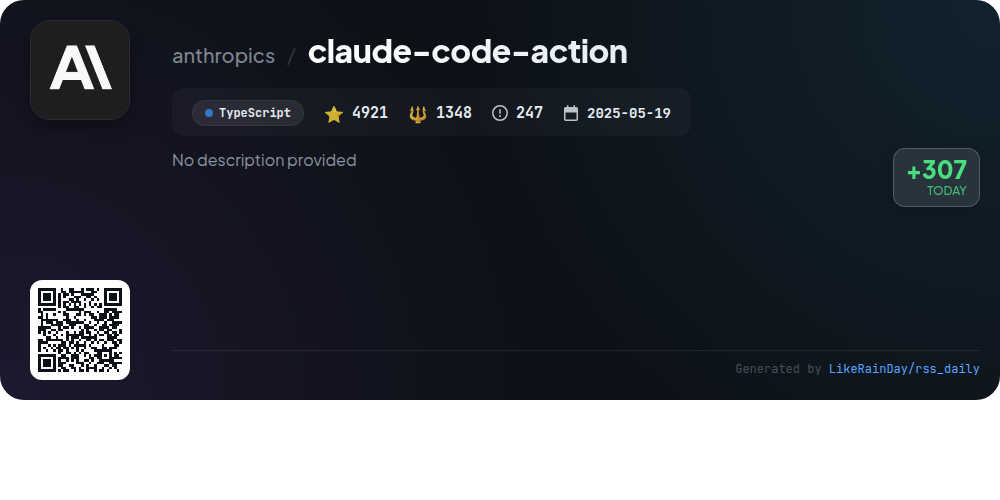
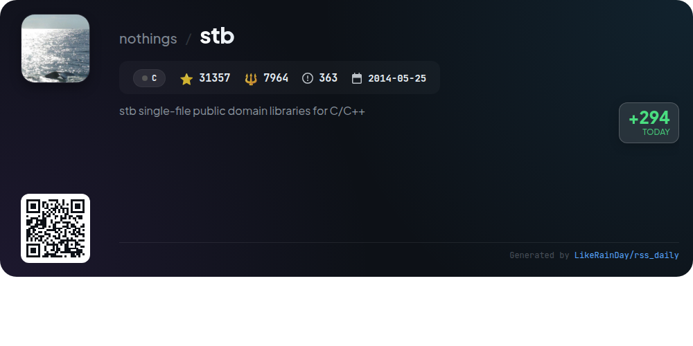
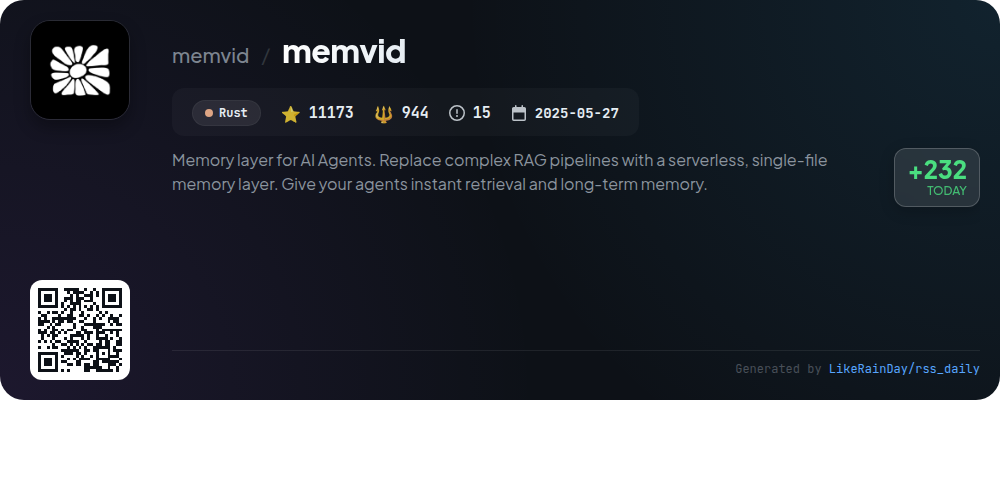
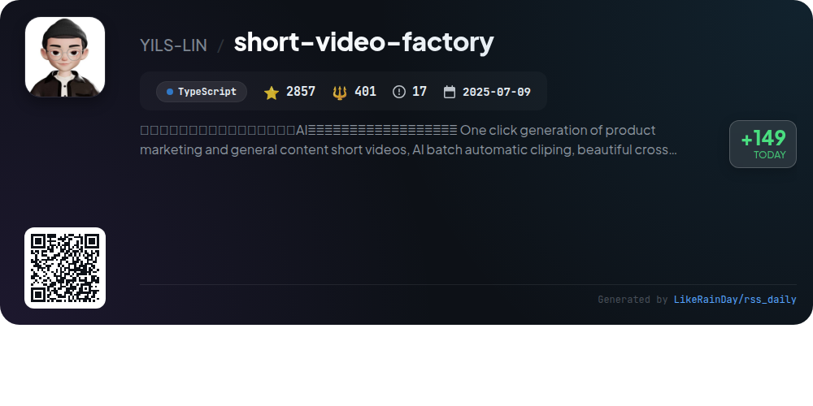

# 📊 🌟 GitHub Trending Daily - 2026-01-07

> > 📅 Daily Picks of GitHub Trending Repositories | Powered by Smart Algorithms

## 📋 Overview

**10** Projects | **160998** ⭐ | **19552** 🍴

**Top Languages:** `TypeScript` (5) · `Rust` (2) · `JavaScript` (2)

**Updated:** 2026-01-07 12:59 UTC

**Categories:**

- 🌟 Daily Top 10 (10 items)

---

## 🌟 Daily Top 10

### 1. [opencode](https://github.com/anomalyco/opencode)

> 🤖 **Why Recommend**  
> *OpenCode is an open-source AI coding agent built with TypeScript, boasting over 52,000 stars on GitHub. It features two built-in agents: a full-access "build" agent for development and a read-only "plan" agent for code exploration. OpenCode supports various installation methods, including desktop applications for macOS, Windows, and Linux. Key highlights include provider-agnostic model support, out-of-the-box LSP compatibility, and a focus on terminal user interfaces. Join the community on Discord for collaboration and support.*

- ⭐ 52753 stars
- 💻 TypeScript
- 📅 Updated: 2026-01-07

### 2. [web-check](https://github.com/Lissy93/web-check)

> 🤖 **Why Recommend**  
> *Web-Check is an all-in-one OSINT tool designed for comprehensive website analysis, boasting over 28,000 stars on GitHub. It enables users to uncover critical insights about any website, including IP info, SSL certificates, DNS records, security configurations, server architecture, and associated technologies. Key features include performance metrics, security checks, cookie analysis, and domain info retrieval. With easy deployment options via Netlify, Vercel, or Docker, Web-Check is a valuable resource for optimizing and securing web presence while supporting ethical research. Visit [web-check.xyz](https://web-check.xyz) for more details.*

- ⭐ 28209 stars
- 💻 TypeScript
- 📅 Updated: 2026-01-07

### 3. [claude-mem](https://github.com/thedotmack/claude-mem)

> 🤖 **Why Recommend**  
> *Claude-Mem is a powerful plugin for Claude Code that automates the capture and compression of coding session data, ensuring continuity across sessions. Key features include persistent memory, skill-based search, a web viewer UI for real-time memory access, and privacy controls for sensitive information. It supports natural language queries and offers a beta channel for experimental features like Endless Mode. With over 11,500 stars on GitHub, Claude-Mem enhances productivity by maintaining context, enabling efficient project management, and improving overall coding experience.*

- ⭐ 11521 stars
- 💻 TypeScript
- 📅 Updated: 2026-01-07

### 4. [public-apis](https://github.com/marcelscruz/public-apis)

> 🤖 **Why Recommend**  
> *The "public-apis" project is a collaborative repository featuring over 1,000 public APIs that developers can leverage for various applications. With over 7,112 stars, it includes a diverse range of categories such as weather, health, finance, machine learning, and more. Key highlights include APIs for popular services like GitHub, Spotify, and Google, as well as niche data sources for specific needs. This extensive list serves as a valuable resource for developers seeking to enhance their projects with robust and accessible API integrations.*

- ⭐ 7112 stars
- 💻 JavaScript
- 📅 Updated: 2026-01-07

### 5. [claude-code-action](https://github.com/anthropics/claude-code-action)

> 🤖 **Why Recommend**  
> *Claude Code Action is a versatile GitHub action designed for PRs and issues, leveraging AI to respond to queries and implement code changes. Key features include intelligent mode detection, interactive code assistance, automated code reviews, and seamless integration with GitHub comments. It supports multiple authentication methods and offers flexible tool access. Users can track progress with visual indicators and receive structured JSON outputs for automation. The action runs on your infrastructure, simplifying configuration while maintaining compatibility. Ideal for automating code reviews, issue triage, and documentation updates.*

- ⭐ 4921 stars
- 💻 TypeScript
- 📅 Updated: 2026-01-07

### 6. [stb](https://github.com/nothings/stb)

> 🤖 **Why Recommend**  
> *stb is a popular collection of single-file public domain (or MIT licensed) libraries for C/C++, boasting over 31,000 stars on GitHub. It features essential tools such as image loaders (stb_image.h), writers (stb_image_write.h), resizers (stb_image_resize2.h), and font rasterizers (stb_truetype.h). Additionally, it provides utility libraries for typesafe containers (stb_ds.h) and audio decoding (stb_vorbis.c). Designed for ease of integration, these libraries streamline deployment, making them ideal for developers seeking minimal dependencies and straightforward usage.*

- ⭐ 31357 stars
- 💻 C
- 📅 Updated: 2026-01-07

### 7. [YTPro](https://github.com/prateek-chaubey/YTPro)

> 🤖 **Why Recommend**  
> *YTPro is a lightweight YouTube client supporting older Android versions, featuring a background audio player and Google Gemini integration for video summarization. Key features include video and captions downloading, ads blocking, Picture-in-Picture mode, gesture controls, and the ability to show the number of dislikes. With an APK size under 50KB, it offers a minimal design and auto-updates. YTPro supports customizable prompts, skips sponsor segments, and allows saving videos without an account. This project showcases advanced JavaScript techniques for enhanced user experience.*

- ⭐ 1311 stars
- 💻 JavaScript
- 📅 Updated: 2026-01-07

### 8. [memvid](https://github.com/memvid/memvid)

> 🤖 **Why Recommend**  
> *Memvid is a serverless, single-file memory layer designed for AI agents, enabling instant retrieval and long-term memory without the need for complex RAG pipelines or databases. Built in Rust, it allows for persistent, versioned, and portable memory management. Key features include append-only Smart Frames for efficient data organization, time-travel debugging, and predictive caching. Memvid supports various use cases like offline AI systems and enterprise knowledge bases. Its lightweight architecture ensures fast access with a model-agnostic design, making it versatile for developers across multiple domains.*

- ⭐ 11173 stars
- 💻 Rust
- 📅 Updated: 2026-01-07

### 9. [cc-switch](https://github.com/farion1231/cc-switch)

> 🤖 **Why Recommend**  
> *cc-switch is a cross-platform desktop assistant tool for Claude Code, Codex, and Gemini CLI, built with Rust and Tauri. It boasts over 9,700 stars and features a dual-layer architecture for data management, supporting SQLite and JSON storage. Key functionalities include provider management, skills and prompts systems, and a unified MCP server management interface. It offers auto-launch on startup, cross-platform support (Windows, macOS, Linux), and a redesigned UI with multi-language support. The tool ensures efficient coding experiences with integrated API services from Z.ai, PackyCode, and AIGoCode.*

- ⭐ 9784 stars
- 💻 Rust
- 📅 Updated: 2026-01-07

### 10. [short-video-factory](https://github.com/YILS-LIN/short-video-factory)

> 🤖 **Why Recommend**  
> *The AI Short Video Factory is an open-source desktop tool designed for effortless creation of product marketing and general content videos. Key features include AI-driven video editing, automatic clip generation from user-provided scripts and footage, voice synthesis, and subtitle effects. The platform supports batch processing, multiple video formats, and offers a user-friendly interface, making it accessible on Windows, macOS, and Linux. With multi-language support and regular updates, it ensures high-quality video production with minimal setup, catering to diverse user needs.*

- ⭐ 2857 stars
- 💻 TypeScript
- 📅 Updated: 2026-01-07

---

## 📡 RSS Subscription

Subscribe via RSS to get daily trending updates:

- 🔔 [RSS XML] (../../daily-top.xml)
- 🔔 [Daily Report] (../../GITHUB_TODAY.md)
- 🔔 [Daily Top 10](../../daily-top.xml)

---

*⚡ Powered by Smart Trending Algorithm | Generated at 2026-01-07 12:59:48 UTC
