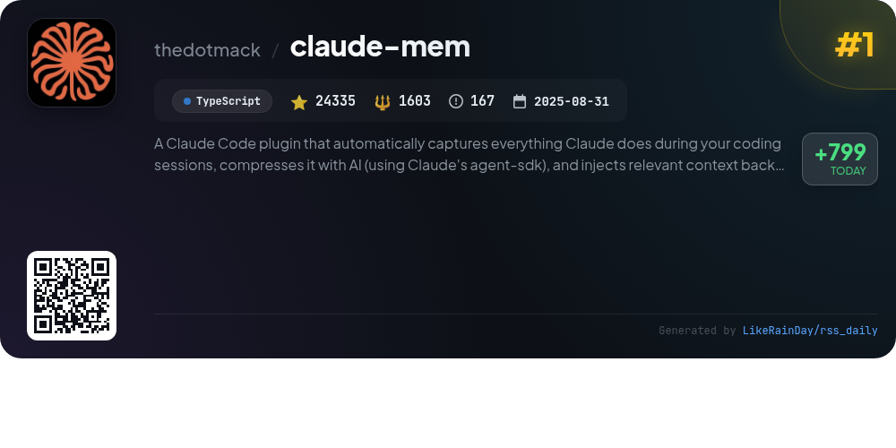
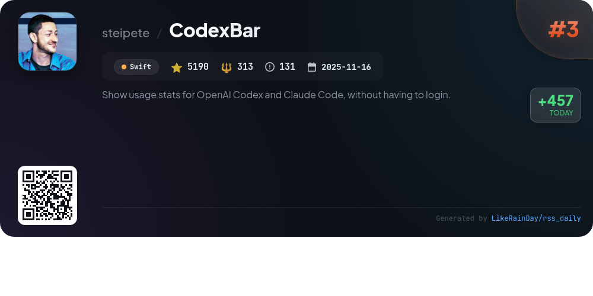
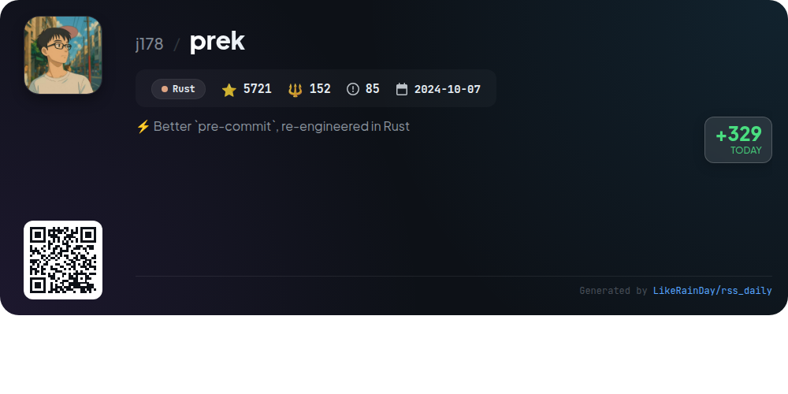
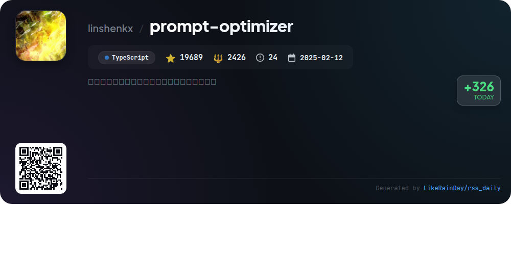
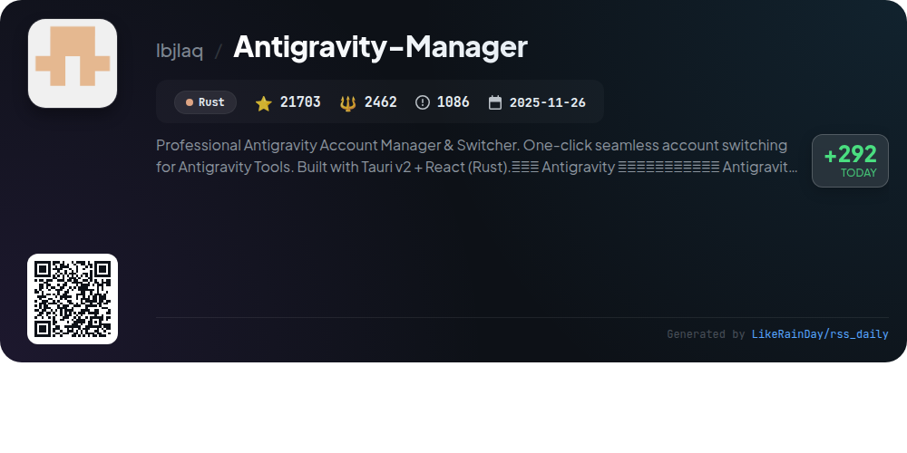
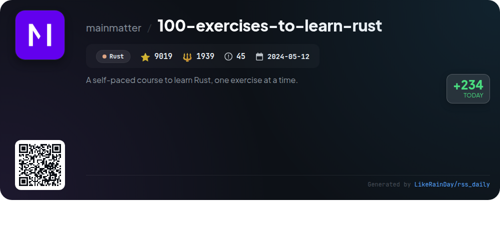
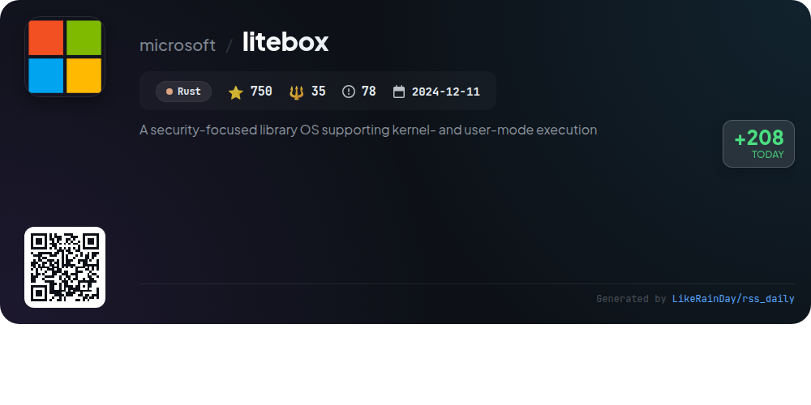
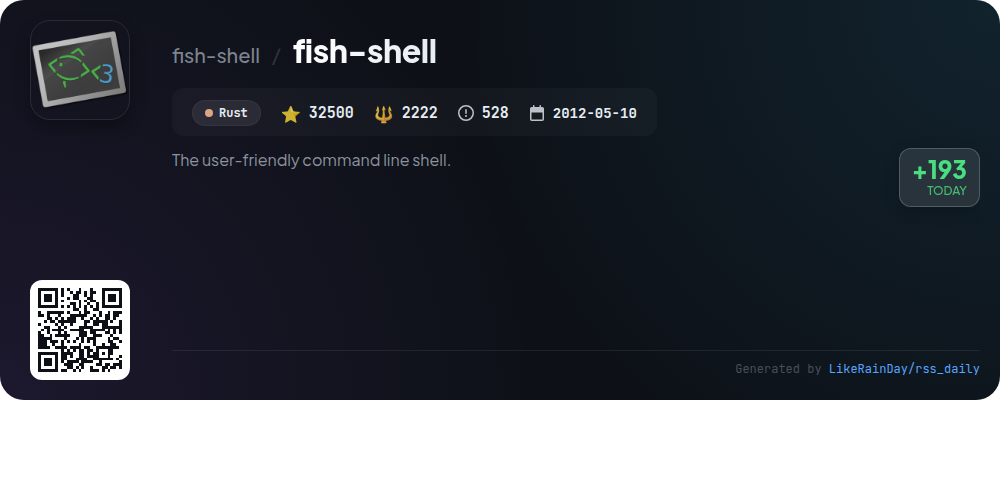

# 📊 🌟 GitHub Trending Daily - 2026-02-07

> > 📅 Daily Picks of GitHub Trending Repositories | Powered by Smart Algorithms

## 📋 Overview

**10** Projects | **205337** ⭐ | **21551** 🍴

**Top Languages:** `Rust` (6) · `TypeScript` (3) · `Swift` (1)

**Updated:** 2026-02-07 02:36 UTC

**Categories:**

- 🌟 Daily Top 10 (10 items)

---

## 🌟 Daily Top 10

### 1. [claude-mem](https://github.com/thedotmack/claude-mem)

> 🤖 **Why Recommend**  
> *Claude-Mem is a powerful TypeScript plugin for Claude Code that automatically captures and compresses coding session data, ensuring continuity across sessions. With 24,335 stars, it features persistent memory, skill-based search, and a real-time web viewer for easy access to previous observations. Key highlights include privacy control through `<private>` tags, context configuration, and automatic operation without manual intervention. The system supports advanced memory retrieval and offers experimental features via a beta channel, making it an essential tool for developers seeking enhanced productivity and contextual awareness.*

- ⭐ 24335 stars
- 💻 TypeScript
- 📅 Updated: 2026-02-07

### 2. [UI-TARS-desktop](https://github.com/bytedance/UI-TARS-desktop)

> 🤖 **Why Recommend**  
> *UI-TARS-desktop is an open-source multimodal AI agent stack that integrates advanced AI models for seamless interaction across platforms. Key features include a native GUI agent, natural language control, visual recognition, and precise mouse and keyboard manipulation, supporting Windows, MacOS, and browser environments. It allows local and remote operation, enhancing user productivity with real-time feedback. The project boasts a robust CLI and web UI, facilitating easy deployment and integration with real-world tools. With over 27,000 stars on GitHub, it aims to redefine automated GUI interactions.*

- ⭐ 27131 stars
- 💻 TypeScript
- 📅 Updated: 2026-02-07

### 3. [CodexBar](https://github.com/steipete/CodexBar)

> 🤖 **Why Recommend**  
> *CodexBar is a lightweight macOS 14+ menu bar app that displays usage stats for multiple AI providers, including OpenAI Codex, Claude, and more, without requiring login. Key features include session and weekly usage meters, customizable provider toggles, and dynamic icon overlays for status updates. It offers a bundled CLI for scripting and CI, privacy-first design with on-device data parsing, and options for browser cookie integration. With support for numerous providers and a user-friendly interface, CodexBar is ideal for monitoring AI usage efficiently.*

- ⭐ 5190 stars
- 💻 Swift
- 📅 Updated: 2026-02-07

### 4. [prek](https://github.com/j178/prek)

> 🤖 **Why Recommend**  
> *prek is a re-engineered version of the popular pre-commit framework, built in Rust for enhanced speed and efficiency. Key features include a single binary with no dependencies, full compatibility with pre-commit configurations, built-in support for monorepos, and improved toolchain installations for various languages. It also offers faster execution times, parallel execution of hooks, and Rust-native implementations of common hooks. Already adopted by projects like CPython and Apache Airflow, prek aims to provide a better user experience without the need for Python installations.*

- ⭐ 5721 stars
- 💻 Rust
- 📅 Updated: 2026-02-07

### 5. [prompt-optimizer](https://github.com/linshenkx/prompt-optimizer)

> 🤖 **Why Recommend**  
> *Prompt Optimizer is a powerful AI prompt optimization tool designed to enhance the quality of AI-generated responses. With over 19,000 stars on GitHub, it offers a user-friendly experience through web, desktop, Chrome extension, and Docker deployment options. Key features include intelligent prompt optimization, dual-mode enhancement, real-time comparison testing, and multi-model integration (OpenAI, Gemini, etc.). It also supports advanced functionalities like image generation (T2I and I2I) and a secure architecture that ensures client-side data processing.*

- ⭐ 19689 stars
- 💻 TypeScript
- 📅 Updated: 2026-02-07

### 6. [Antigravity-Manager](https://github.com/lbjlaq/Antigravity-Manager)

> 🤖 **Why Recommend**  
> *Antigravity-Manager is a professional account management tool for seamless switching between Antigravity Tools. Built with Tauri v2 and React, it offers features like real-time quota monitoring, intelligent account recommendations, OAuth 2.0 support, and multi-protocol API proxying. Users can convert web sessions into standardized APIs, eliminating protocol barriers. The application supports advanced features such as model routing, automated quota protection, and image generation capabilities, making it an essential tool for developers and AI enthusiasts. With over 21,000 stars on GitHub, it ensures stability and high performance.*

- ⭐ 21703 stars
- 💻 Rust
- 📅 Updated: 2026-02-07

### 7. [100-exercises-to-learn-rust](https://github.com/mainmatter/100-exercises-to-learn-rust)

> 🤖 **Why Recommend**  
> *The "100-exercises-to-learn-rust" project offers a self-paced course designed to teach Rust programming through 100 engaging exercises. Ideal for beginners, this course guides users from foundational knowledge to writing their own programs. Key features include clear instructions, optional IDE recommendations for enhanced learning, and access to solutions via the `solutions` branch. Developed by Mainmatter, it also highlights their consulting and training services. Get started at rust-exercises.com and explore additional resources on Mainmatter's website.*

- ⭐ 9019 stars
- 💻 Rust
- 📅 Updated: 2026-02-07

### 8. [codex](https://github.com/openai/codex)

> 🤖 **Why Recommend**  
> *Codex is a lightweight coding agent from OpenAI that operates directly in your terminal, built with Rust and boasting over 59,000 stars on GitHub. Easily installable via npm or Homebrew, Codex enhances coding efficiency by providing intelligent code suggestions and completions. It integrates seamlessly with various IDEs, including VS Code, and supports users with ChatGPT plans. The project offers comprehensive documentation and contributes to an open-source fund, making it a valuable tool for developers seeking local coding assistance.*

- ⭐ 59299 stars
- 💻 Rust
- 📅 Updated: 2026-02-07

### 9. [litebox](https://github.com/microsoft/litebox)

> 🤖 **Why Recommend**  
> *LiteBox is a security-focused library OS built in Rust, designed to minimize the attack surface by streamlining the interface to the host. It supports both kernel and user-mode execution, facilitating easy interoperability between various "North" shims and "South" platforms. Key features include running unmodified Linux programs on Windows, sandboxing Linux apps, and executing programs on SEV SNP and OP-TEE. As an evolving project, LiteBox invites experimentation while working toward a stable release. It is licensed under the MIT License.*

- ⭐ 750 stars
- 💻 Rust
- 📅 Updated: 2026-02-07

### 10. [fish-shell](https://github.com/fish-shell/fish-shell)

> 🤖 **Why Recommend**  
> *fish-shell is a user-friendly command line shell designed for macOS, Linux, and more. With 32,500 stars on GitHub, it offers intuitive features like syntax highlighting, autosuggestions, and advanced tab completions without requiring configuration. fish aims to enhance the command line experience by making it smarter and easier to use. It is easily installable via Homebrew, MacPorts, or various Linux package managers, and also supports Windows through WSL and Cygwin. Comprehensive documentation is available online to assist users in getting started.*

- ⭐ 32500 stars
- 💻 Rust
- 📅 Updated: 2026-02-07

---

## 📡 RSS Subscription

Subscribe via RSS to get daily trending updates:

- 🔔 [RSS XML] (../../daily-top.xml)
- 🔔 [Daily Report] (../../GITHUB_TODAY.md)
- 🔔 [Daily Top 10](../../daily-top.xml)

---

*⚡ Powered by Smart Trending Algorithm | Generated at 2026-02-07 02:36:44 UTC
