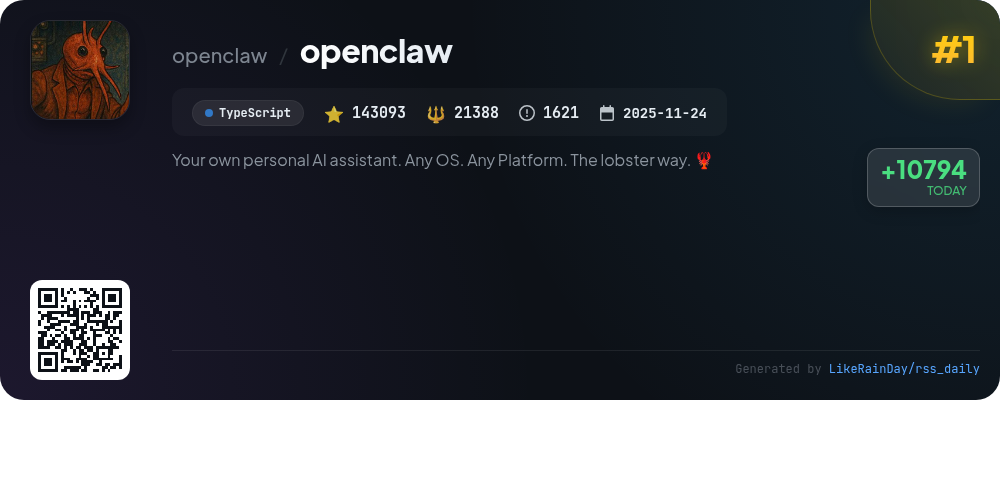
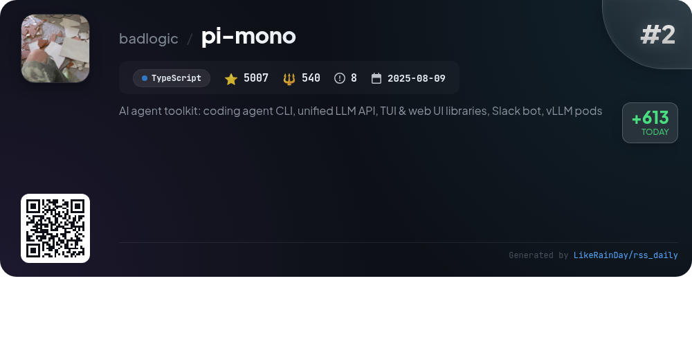
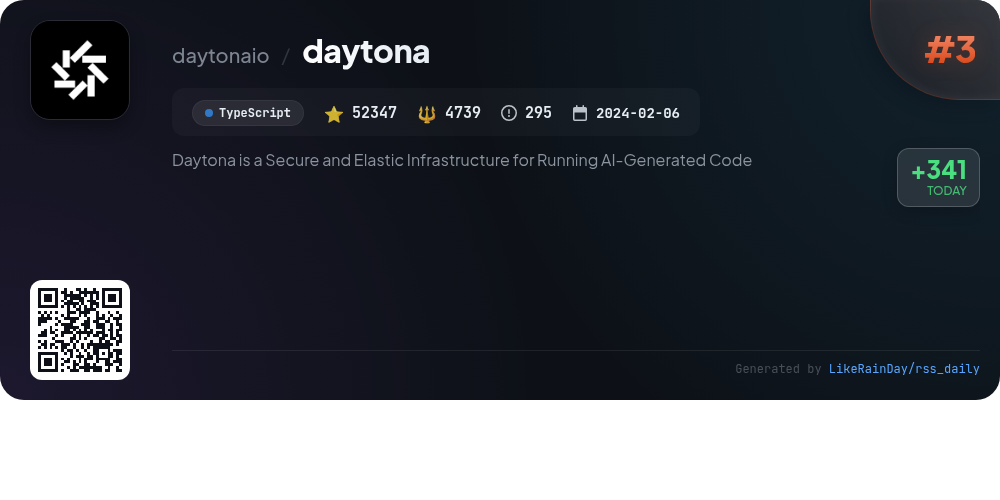
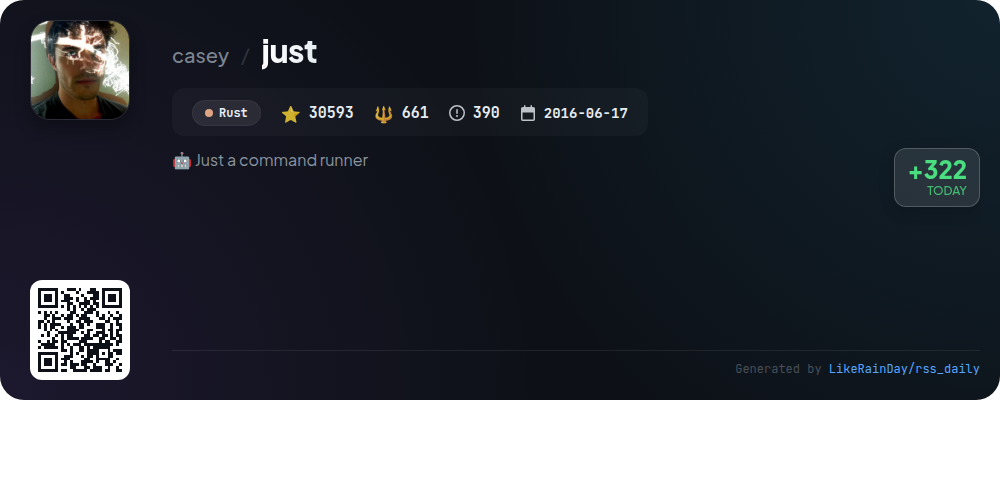
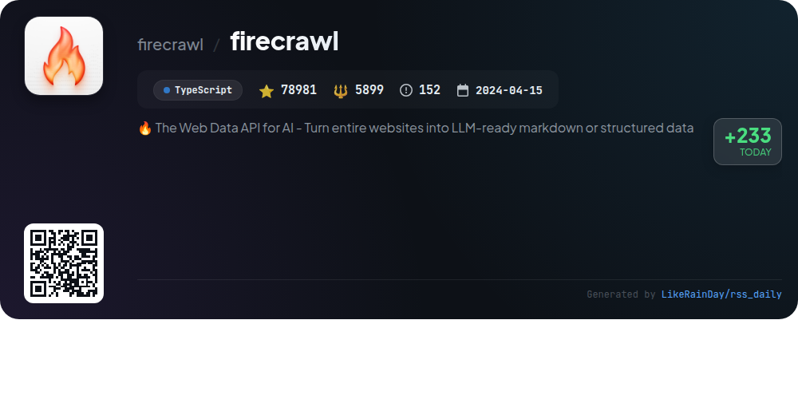
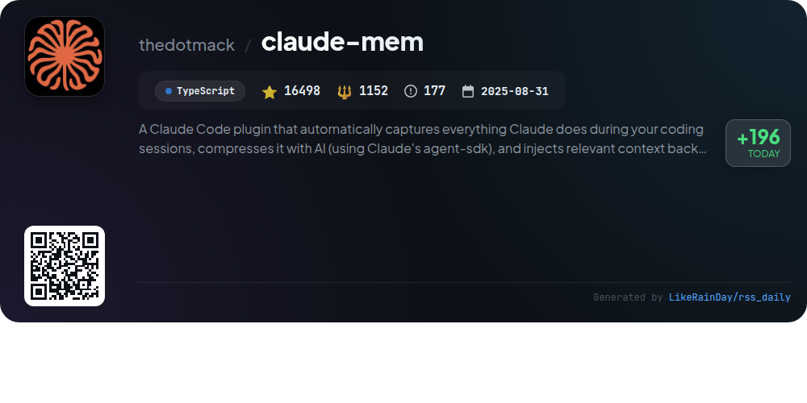
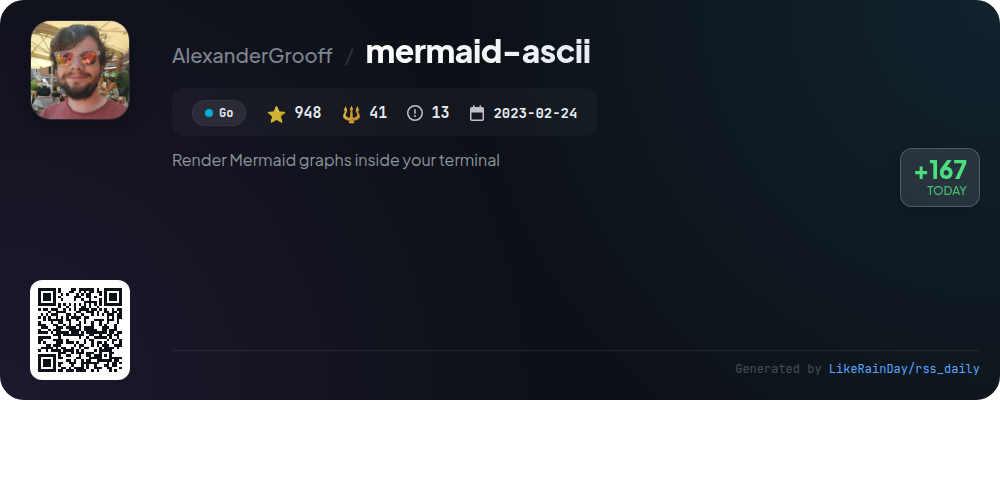
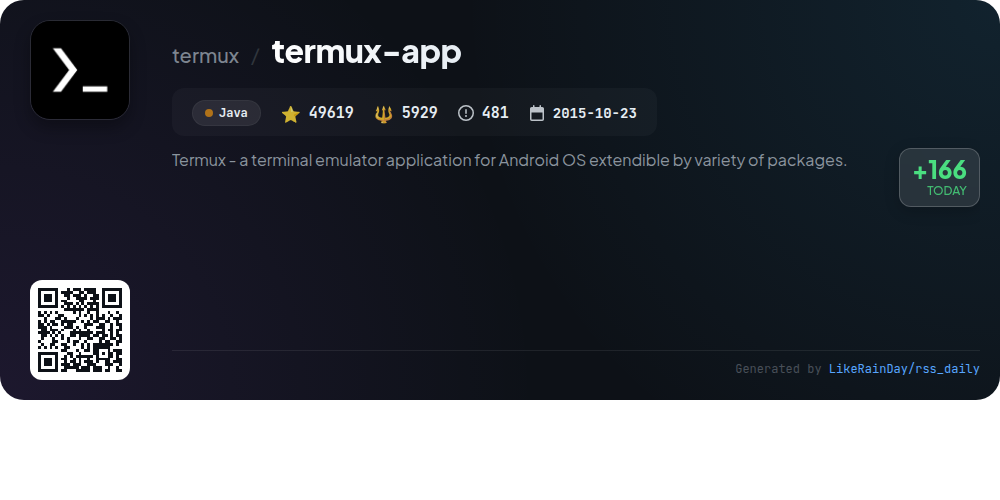
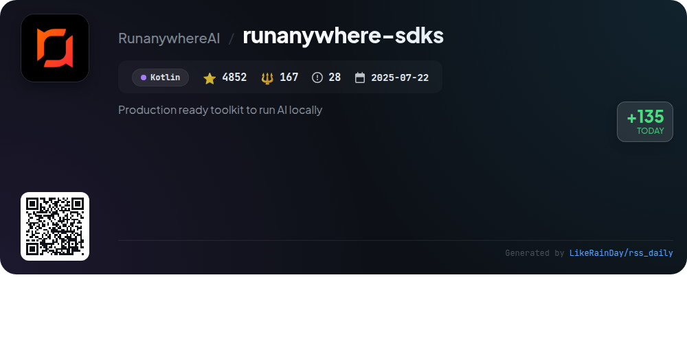

# 📊 🌟 GitHub Trending Daily - 2026-02-02

> > 📅 Daily Picks of GitHub Trending Repositories | Powered by Smart Algorithms

## 📋 Overview

**10** Projects | **384303** ⭐ | **40794** 🍴

**Top Languages:** `TypeScript` (6) · `Rust` (1) · `Java` (1)

**Updated:** 2026-02-02 02:47 UTC

**Categories:**

- 🌟 Daily Top 10 (10 items)

---

## 🌟 Daily Top 10

### 1. [openclaw](https://github.com/openclaw/openclaw)

> 🤖 **Why Recommend**  
> *OpenClaw is a versatile personal AI assistant designed to run on any operating system and platform. With support for multiple messaging channels like WhatsApp, Telegram, Slack, and Discord, it provides a seamless experience for communication. Key features include a local-first Gateway, multi-channel inbox, voice wake capabilities, and a live Canvas for enhanced interaction. Users can set up and manage skills through an intuitive onboarding wizard, while optional companion apps for macOS, iOS, and Android enhance functionality. OpenClaw prioritizes security and customization, making it ideal for personalized AI interactions.*

- ⭐ 143093 stars
- 💻 TypeScript
- 📅 Updated: 2026-02-02

### 2. [pi-mono](https://github.com/badlogic/pi-mono)

> 🤖 **Why Recommend**  
> *pi-mono is an AI agent toolkit designed for building and managing LLM deployments. Key features include a unified multi-provider LLM API, an interactive coding agent CLI, a Slack bot for message delegation, and TUI/Web UI libraries for AI chat interfaces. It also offers CLI tools for managing vLLM deployments on GPU pods. With over 5000 stars, pi-mono supports developers in creating sophisticated AI agents efficiently. The project is built in TypeScript and follows an open-source model under the MIT license.*

- ⭐ 5007 stars
- 💻 TypeScript
- 📅 Updated: 2026-02-02

### 3. [daytona](https://github.com/daytonaio/daytona)

> 🤖 **Why Recommend**  
> *Daytona is a Secure and Elastic Infrastructure for Running AI-Generated Code. popular project, actively maintained, recently updated*

- ⭐ 52347 stars
- 🍴 4739 forks
- 💻 TypeScript
- 📅 Updated: 2026-02-02

### 4. [flowsint](https://github.com/reconurge/flowsint)

> 🤖 **Why Recommend**  
> *Flowsint is a modern, open-source OSINT graph exploration tool for cybersecurity analysts and investigators, designed for ethical and transparent investigations. It features a visual graph interface that enables users to explore relationships between entities through various enrichers, including domain, IP, social media, cryptocurrency, and email enrichers. Flowsint prioritizes user privacy, storing all data locally. The platform is modular, built with TypeScript, and integrates seamlessly with Docker. It encourages community contributions and adheres to strict ethical guidelines for responsible usage.*

- ⭐ 2365 stars
- 💻 TypeScript
- 📅 Updated: 2026-02-02

### 5. [just](https://github.com/casey/just)

> 🤖 **Why Recommend**  
> *`just` is a command runner written in Rust, designed to streamline the execution of project-specific commands through a simple syntax in a `justfile`. Key features include support for Linux, macOS, and Windows; enhanced error reporting; command line argument handling; environment variable loading from `.env` files; and the ability to execute recipes in various programming languages. It offers static error resolution, shell completion scripts, and can run from any subdirectory. With over 30,000 stars on GitHub, `just` simplifies task automation while avoiding the complexities of traditional build systems like `make`.*

- ⭐ 30593 stars
- 💻 Rust
- 📅 Updated: 2026-02-02

### 6. [firecrawl](https://github.com/firecrawl/firecrawl)

> 🤖 **Why Recommend**  
> *Firecrawl is a powerful web data API that transforms entire websites into LLM-ready markdown or structured data. Key features include advanced scraping, crawling, and extraction of data from any URL without needing a sitemap. It supports various output formats, including markdown and HTML, and offers customizable options for proxies, dynamic content, and media parsing. Users can batch scrape multiple URLs, perform web searches, and track content changes over time. Firecrawl is open source, with a hosted cloud version for enhanced capabilities.*

- ⭐ 78981 stars
- 💻 TypeScript
- 📅 Updated: 2026-02-02

### 7. [claude-mem](https://github.com/thedotmack/claude-mem)

> 🤖 **Why Recommend**  
> *Claude-Mem is a powerful TypeScript plugin that enhances Claude Code by preserving context across coding sessions. With features like persistent memory, skill-based search, and a web viewer UI, it automatically captures and summarizes tool usage, ensuring continuity of knowledge. Key highlights include privacy controls, automatic operation, and a beta channel for experimental features. Users can easily install the plugin and configure it for optimal performance. With 16,498 stars, Claude-Mem is a valuable asset for developers seeking efficient project management.*

- ⭐ 16498 stars
- 💻 TypeScript
- 📅 Updated: 2026-02-02

### 8. [mermaid-ascii](https://github.com/AlexanderGrooff/mermaid-ascii)

> 🤖 **Why Recommend**  
> *Render Mermaid graphs inside your terminal. recently updated*

- ⭐ 948 stars
- 🍴 41 forks
- 💻 Go
- 📅 Updated: 2026-02-02

### 9. [termux-app](https://github.com/termux/termux-app)

> 🤖 **Why Recommend**  
> *Termux is a terminal emulator for Android that provides a Linux environment, allowing users to run command-line utilities and scripts. With over 49,600 stars on GitHub, it supports various plugins like Termux:API, Termux:Boot, and Termux:Styling for enhanced functionality. The app is compatible with Android 7 and above, offering package management via `apt`. Key features include a customizable terminal interface, extensive community support, and a focus on security. Termux is actively developed, with ongoing support for updates and user contributions.*

- ⭐ 49619 stars
- 💻 Java
- 📅 Updated: 2026-02-02

### 10. [runanywhere-sdks](https://github.com/RunanywhereAI/runanywhere-sdks)

> 🤖 **Why Recommend**  
> *RunAnywhere is a production-ready toolkit for integrating on-device AI into mobile apps, enabling local execution of large language models (LLMs), speech-to-text, and text-to-speech functionalities. Key features include fast, private, and offline AI processing with no data leaving the device. The toolkit supports iOS (Swift), Android (Kotlin), React Native, and Flutter, offering SDKs for easy integration. Users can leverage models like SmolLM2 and Whisper for seamless communication. With over 4,800 stars on GitHub, RunAnywhere is a robust solution for enhancing mobile applications with advanced AI capabilities.*

- ⭐ 4852 stars
- 💻 Kotlin
- 📅 Updated: 2026-02-02

---

## 📡 RSS Subscription

Subscribe via RSS to get daily trending updates:

- 🔔 [RSS XML] (../../daily-top.xml)
- 🔔 [Daily Report] (../../GITHUB_TODAY.md)
- 🔔 [Daily Top 10](../../daily-top.xml)

---

*⚡ Powered by Smart Trending Algorithm | Generated at 2026-02-02 02:47:42 UTC
