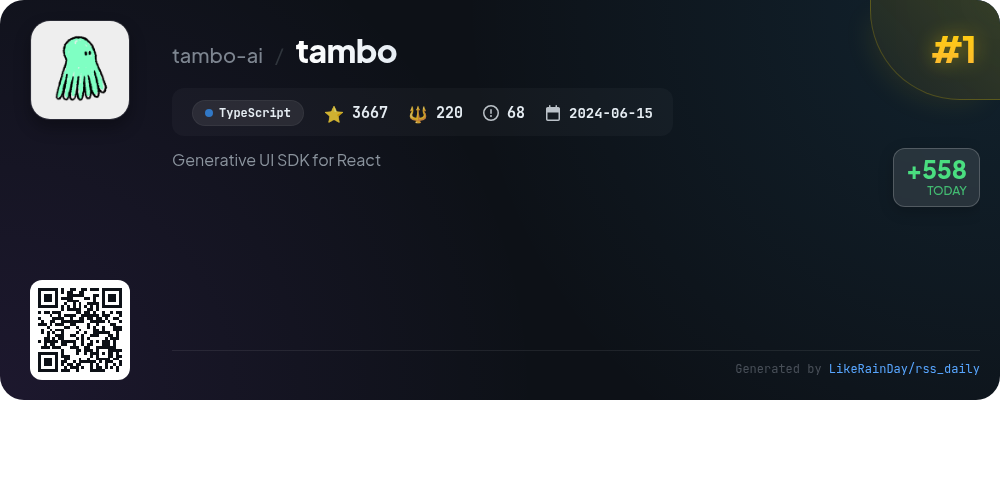
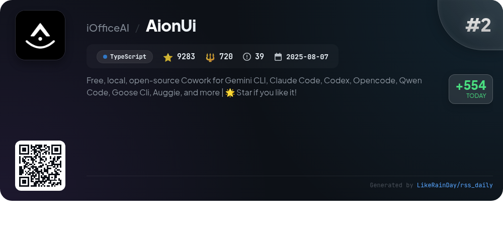
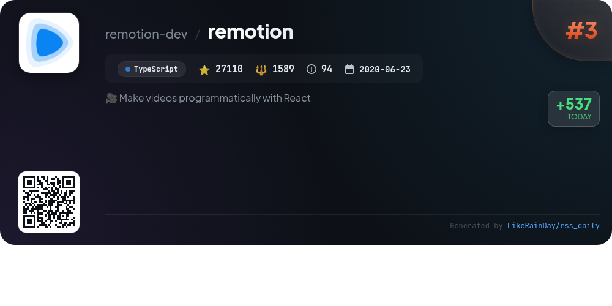
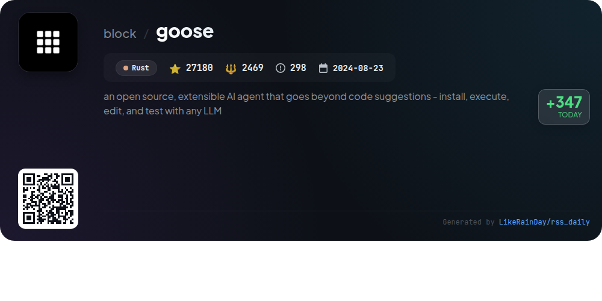
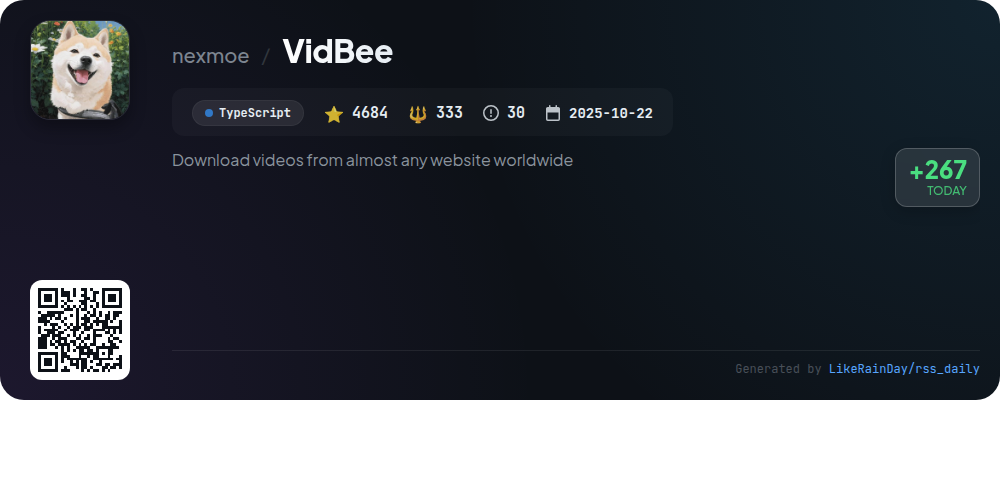
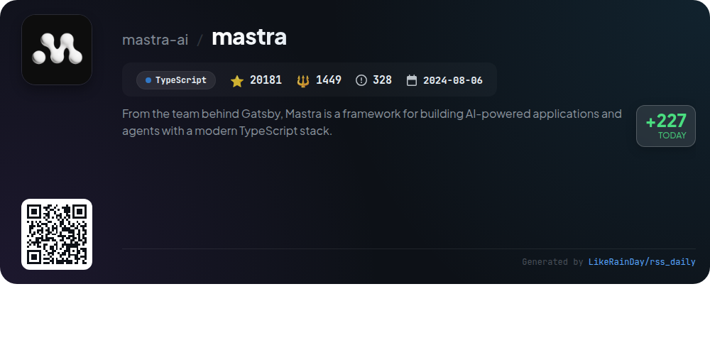
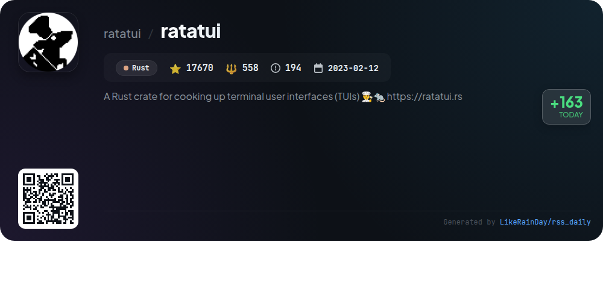
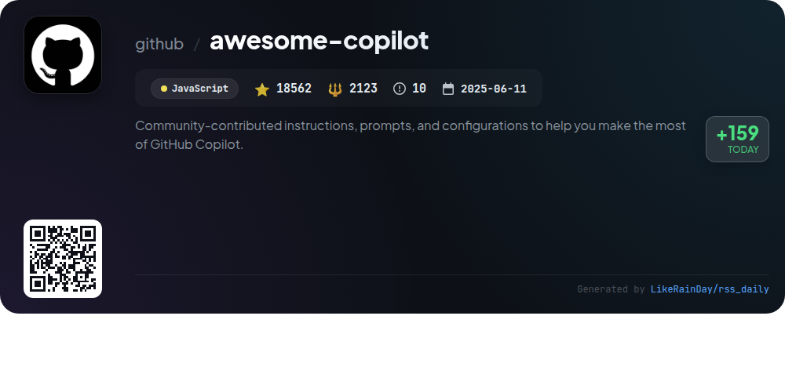

# 📊 🌟 GitHub Trending Daily - 2026-01-23

> > 📅 Daily Picks of GitHub Trending Repositories | Powered by Smart Algorithms

## 📋 Overview

**10** Projects | **149832** ⭐ | **11345** 🍴

**Top Languages:** `TypeScript` (6) · `Rust` (3) · `JavaScript` (1)

**Updated:** 2026-01-23 02:13 UTC

**Categories:**

- 🌟 Daily Top 10 (10 items)

---

## 🌟 Daily Top 10

### 1. [tambo](https://github.com/tambo-ai/tambo)

> 🤖 **Why Recommend**  
> *Tambo is a generative UI SDK for React, enabling developers to create adaptive applications that respond to user requests through natural language. Key features include generative and interactable components, seamless integration with various LLM providers, and support for MCP protocols. Tambo offers a hosted backend (Tambo Cloud) or self-hosted options, with an easy setup process. Developers can leverage pre-built templates, integrate local tools, and customize user experiences with context-aware suggestions. With over 3,600 stars on GitHub, Tambo is designed for dynamic, user-friendly interfaces.*

- ⭐ 3667 stars
- 💻 TypeScript
- 📅 Updated: 2026-01-23

### 2. [AionUi](https://github.com/iOfficeAI/AionUi)

> 🤖 **Why Recommend**  
> *AionUi is a free, open-source coworking platform for command-line AI tools like Gemini CLI, Claude Code, and Codex. Key features include a user-friendly graphical interface, multi-model support, and local data security. It offers auto-detection of installed CLI tools, multi-session chat capabilities, smart file management, and real-time previews for various formats. AionUi also supports remote access via WebUI, allowing users to control AI tools from any device on the network. Available on macOS, Windows, and Linux, it enhances AI productivity and collaboration.*

- ⭐ 9283 stars
- 💻 TypeScript
- 📅 Updated: 2026-01-23

### 3. [remotion](https://github.com/remotion-dev/remotion)

> 🤖 **Why Recommend**  
> *Remotion is a powerful framework for programmatically creating videos using React. With over 27,000 stars on GitHub, it enables developers to leverage web technologies like CSS, Canvas, and WebGL, along with the programming capabilities of React such as reusable components and powerful composition. Notable projects made with Remotion include dynamic year-in-review videos and custom animations. Getting started is simple with the command `npx create-video@latest`. Comprehensive documentation is available at remotion.dev/docs.*

- ⭐ 27110 stars
- 💻 TypeScript
- 📅 Updated: 2026-01-23

### 4. [goose](https://github.com/block/goose)

> 🤖 **Why Recommend**  
> *Goose is an open-source AI agent designed to automate engineering tasks, enabling developers to build, execute, debug, and manage projects autonomously. With support for any LLM and multi-model configurations, it optimizes performance and cost. Goose integrates seamlessly with MCP servers and is accessible as both a desktop app and CLI. Key features include project prototyping, code refinement, and workflow orchestration, making it an essential tool for developers focused on innovation. Join the community on Discord and explore comprehensive documentation for setup and tutorials.*

- ⭐ 27180 stars
- 💻 Rust
- 📅 Updated: 2026-01-23

### 5. [cc-switch](https://github.com/farion1231/cc-switch)

> 🤖 **Why Recommend**  
> *cc-switch is a cross-platform desktop assistant tool (Windows, macOS, Linux) for managing Claude Code, Codex, and Gemini CLI interfaces, built with Rust and Tauri. Key features include seamless provider management, skills and prompts systems, and a dual-layer architecture for data storage. Users benefit from enhanced UI, multi-language support, and auto-launch capabilities. The tool supports various API configurations, offers speed testing, and integrates with multiple API relay services. With over 13,000 stars, it provides a robust, efficient coding experience for developers.*

- ⭐ 13058 stars
- 💻 Rust
- 📅 Updated: 2026-01-23

### 6. [VidBee](https://github.com/nexmoe/VidBee)

> 🤖 **Why Recommend**  
> *VidBee is an open-source video downloader that enables users to download videos and audios from over 1000 websites globally, including platforms like YouTube, TikTok, and Instagram. Built with Electron and powered by yt-dlp, it features a modern interface with intuitive controls, real-time progress tracking, and robust download queue management. Key functionality includes RSS auto-download, which allows automatic subscriptions to feeds for seamless downloads from favorite creators. Actively developed and user-friendly, VidBee is ideal for efficient video management.*

- ⭐ 4684 stars
- 💻 TypeScript
- 📅 Updated: 2026-01-23

### 7. [dexter](https://github.com/virattt/dexter)

> 🤖 **Why Recommend**  
> *Dexter is an autonomous financial research agent designed to analyze complex financial queries through intelligent task planning and real-time market data. With features like autonomous execution, self-validation, and access to essential financial statements, Dexter generates clear, step-by-step research plans. It iterates on its outputs until confident results are achieved, enhanced by built-in safety mechanisms. Key requirements include the Bun runtime and various API keys. With over 8,400 stars on GitHub, Dexter represents a significant advancement in financial research automation.*

- ⭐ 8437 stars
- 💻 TypeScript
- 📅 Updated: 2026-01-23

### 8. [mastra](https://github.com/mastra-ai/mastra)

> 🤖 **Why Recommend**  
> *Mastra is a TypeScript framework for developing AI-powered applications, created by the team behind Gatsby. With over 20,000 stars, it offers seamless integration with frameworks like React and Node.js, enabling developers to build production-ready applications. Key features include model routing to 40+ providers, autonomous agents for complex tasks, a graph-based workflow engine, human-in-the-loop capabilities, and context management. Mastra also supports integrations, MCP servers for resource exposure, and built-in observability tools for ongoing refinement, making it ideal for creating reliable AI solutions.*

- ⭐ 20181 stars
- 💻 TypeScript
- 📅 Updated: 2026-01-23

### 9. [ratatui](https://github.com/ratatui/ratatui)

> 🤖 **Why Recommend**  
> *Ratatui is a Rust crate designed for building terminal user interfaces (TUIs), allowing developers to create interactive console applications easily. With over 17,670 stars, it offers templates for quick project setup using `cargo-generate`, extensive documentation, and a variety of widget examples. Key features include a modular architecture, support for custom rendering, and an active community forum for discussions. Ratatui is an excellent choice for developing command-line applications and dashboards, making it a prominent alternative to other TUI libraries like Cursive and iocraft.*

- ⭐ 17670 stars
- 💻 Rust
- 📅 Updated: 2026-01-23

### 10. [awesome-copilot](https://github.com/github/awesome-copilot)

> 🤖 **Why Recommend**  
> *Awesome Copilot is a community-driven repository designed to enhance your GitHub Copilot experience. It features a variety of resources, including specialized agents for specific workflows, task-specific prompts, comprehensive coding instructions, and curated collections organized by themes. Key highlights include the MCP Server for easy installation of customizations, and extensive documentation that supports productivity and best practices. With over 18,500 stars, it serves as a powerful toolkit for developers looking to optimize their coding processes.*

- ⭐ 18562 stars
- 💻 JavaScript
- 📅 Updated: 2026-01-23

---

## 📡 RSS Subscription

Subscribe via RSS to get daily trending updates:

- 🔔 [RSS XML] (../../daily-top.xml)
- 🔔 [Daily Report] (../../GITHUB_TODAY.md)
- 🔔 [Daily Top 10](../../daily-top.xml)

---

*⚡ Powered by Smart Trending Algorithm | Generated at 2026-01-23 02:13:22 UTC
