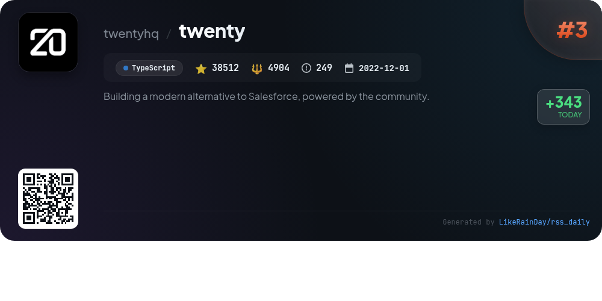
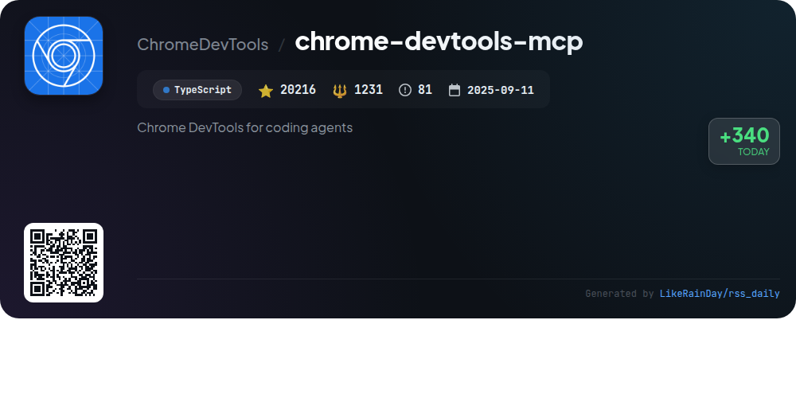
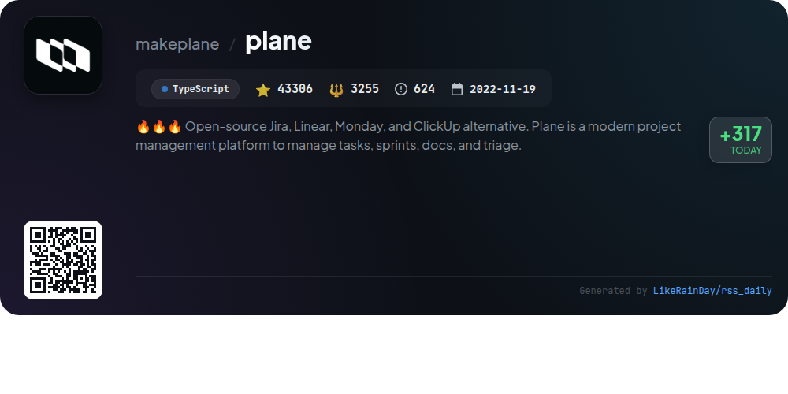
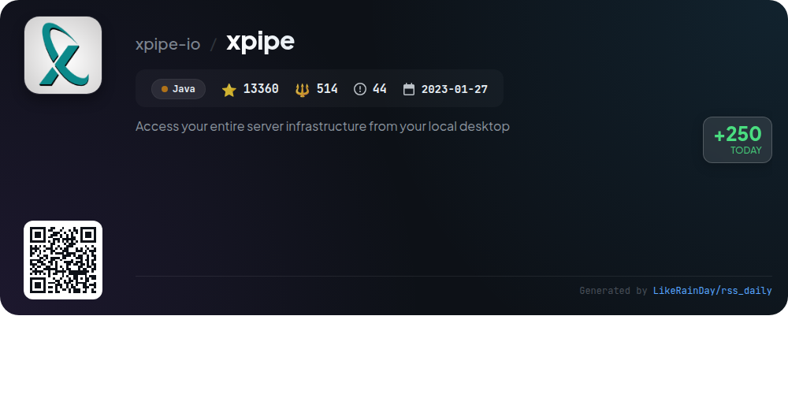
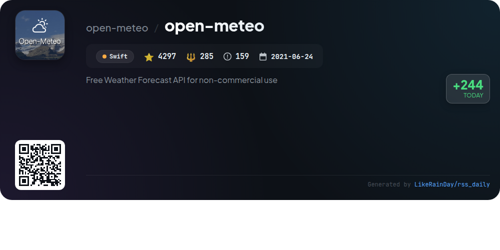

# 📊 🌟 GitHub Trending Daily - 2026-01-11

> > 📅 Daily Picks of GitHub Trending Repositories | Powered by Smart Algorithms

## 📋 Overview

**10** Projects | **251917** ⭐ | **21354** 🍴

**Top Languages:** `TypeScript` (6) · `JavaScript` (1) · `Java` (1)

**Updated:** 2026-01-11 12:27 UTC

**Categories:**

- 🌟 Daily Top 10 (10 items)

---

## 🌟 Daily Top 10

### 1. [opencode](https://github.com/anomalyco/opencode)

> 🤖 **Why Recommend**  
> *OpenCode is an open-source AI coding agent designed to enhance development workflows. With over 60,000 stars, it features two main agents: a full-access agent for development and a read-only agent for code exploration. OpenCode supports multiple programming models and offers a terminal user interface (TUI), making it ideal for neovim users. Available as a desktop app for macOS, Windows, and Linux, it prioritizes flexibility in installation. The project encourages community contributions and provides extensive documentation for setup and usage. Join the community on Discord for support and collaboration.*

- ⭐ 60692 stars
- 💻 TypeScript
- 📅 Updated: 2026-01-11

### 2. [UI-TARS-desktop](https://github.com/bytedance/UI-TARS-desktop)

> 🤖 **Why Recommend**  
> *UI-TARS-desktop is an open-source multimodal AI agent stack providing a native GUI for local and remote computer operations. It features natural language control powered by advanced Vision-Language models, real-time feedback, and precise mouse and keyboard control. The application supports cross-platform use (Windows, MacOS, Browser) and includes visual recognition and screenshot capabilities. Key highlights include seamless integration with various real-world tools and a user-friendly interface, making it ideal for automating complex tasks efficiently.*

- ⭐ 22569 stars
- 💻 TypeScript
- 📅 Updated: 2026-01-11

### 3. [twenty](https://github.com/twentyhq/twenty)

> 🤖 **Why Recommend**  
> *Twenty is an open-source CRM designed as a modern alternative to Salesforce, emphasizing community-driven development. Key features include customizable layouts, permissions management, workflow automation, and integration with emails and calendar events. The platform leverages TypeScript, NestJS, PostgreSQL, and React to deliver a user-friendly experience inspired by contemporary tools. With a growing ecosystem of plugins and a commitment to affordable, flexible solutions, Twenty aims to revolutionize CRM usage. Join the community on Discord and contribute to its evolution.*

- ⭐ 38512 stars
- 💻 TypeScript
- 📅 Updated: 2026-01-11

### 4. [chrome-devtools-mcp](https://github.com/ChromeDevTools/chrome-devtools-mcp)

> 🤖 **Why Recommend**  
> *chrome-devtools-mcp is a TypeScript-based GitHub project that enables coding agents like Gemini and Copilot to control and inspect a live Chrome browser. With over 20,000 stars, it acts as a Model-Context-Protocol server, allowing for reliable automation, advanced debugging, and performance analysis using Chrome DevTools. Key features include detailed performance insights, network request analysis, and automation capabilities via Puppeteer. The project supports various MCP clients and offers extensive configuration options for seamless integration and testing.*

- ⭐ 20216 stars
- 💻 TypeScript
- 📅 Updated: 2026-01-11

### 5. [plane](https://github.com/makeplane/plane)

> 🤖 **Why Recommend**  
> *Plane is an open-source project management platform designed as an alternative to Jira, Linear, Monday, and ClickUp. With over 43,000 stars, it offers robust features including task management with a rich text editor, sprint tracking through Cycles, customizable workflow views, and real-time analytics. Users can choose between Plane Cloud for quick setup or self-hosting for full control. The platform encourages community engagement for suggestions and bug reporting via Discord. Explore more at plane.so.*

- ⭐ 43306 stars
- 💻 TypeScript
- 📅 Updated: 2026-01-11

### 6. [ConvertX](https://github.com/C4illin/ConvertX)

> 🤖 **Why Recommend**  
> *ConvertX is a self-hosted online file converter supporting over 1000 formats, built with TypeScript, Bun, and Elysia. Key features include multi-file processing, password protection, and support for multiple accounts. It utilizes various converters like Inkscape and FFmpeg for tasks ranging from image and document conversions to video processing. ConvertX is easily deployable via Docker, ensuring a secure and customizable environment for users. With a strong community backing and 14,413 stars on GitHub, it offers robust file conversion capabilities for diverse needs.*

- ⭐ 14413 stars
- 💻 TypeScript
- 📅 Updated: 2026-01-11

### 7. [awesome-copilot](https://github.com/github/awesome-copilot)

> 🤖 **Why Recommend**  
> *Awesome Copilot is a community-driven repository designed to enhance your GitHub Copilot experience. With over 17,000 stars, it offers specialized agents, task-specific prompts, and comprehensive instructions tailored to various workflows and coding standards. Key features include curated collections of prompts, custom agents for enhanced functionality, and a user-friendly MCP server for easy integration. This project empowers developers to boost productivity and implement best practices effectively, making it an essential toolkit for anyone using GitHub Copilot.*

- ⭐ 17064 stars
- 💻 JavaScript
- 📅 Updated: 2026-01-11

### 8. [xpipe](https://github.com/xpipe-io/xpipe)

> 🤖 **Why Recommend**  
> *XPipe is a powerful connection hub that enables seamless access to your entire server infrastructure directly from your local desktop. It supports SSH, Docker, Kubernetes, and various virtualization platforms, allowing for easy management of remote systems without additional setup. Key features include a versatile scripting system, integrated file browser, and customizable terminal sessions. XPipe ensures data security with a cryptographically secure vault and sync capabilities. Its extensible architecture allows integration with text editors and command-line tools, making it ideal for professionals.*

- ⭐ 13360 stars
- 💻 Java
- 📅 Updated: 2026-01-11

### 9. [open-meteo](https://github.com/open-meteo/open-meteo)

> 🤖 **Why Recommend**  
> *Open-Meteo is a free, open-source Weather Forecast API designed for non-commercial use, requiring no API key. It offers hourly forecasts for up to 16 days, utilizing high-resolution global and regional models with updates every hour for Europe and North America. Key features include a Historical Weather API, Marine and Air Quality APIs, and fast response times under 10 ms. Data is provided under CC BY 4.0, ensuring open access, and the source code is available under AGPLv3. Users can also run their own API using Docker, fostering community contributions and transparency.*

- ⭐ 4297 stars
- 💻 Swift
- 📅 Updated: 2026-01-11

### 10. [crush](https://github.com/charmbracelet/crush)

> 🤖 **Why Recommend**  
> *Crush is a highly versatile AI coding agent designed for terminal use, integrating seamlessly with various programming workflows. Key features include support for multiple LLMs (OpenAI, Anthropic, etc.), flexible context switching, session management, and LSP-enhanced functionality. Users can extend capabilities through MCPs and utilize it across platforms like macOS, Linux, and Windows. With over 17,000 stars, Crush offers extensive configuration options, logging, and metrics tracking while prioritizing user privacy. Ideal for developers seeking to enhance productivity in coding environments.*

- ⭐ 17488 stars
- 💻 Go
- 📅 Updated: 2026-01-11

---

## 📡 RSS Subscription

Subscribe via RSS to get daily trending updates:

- 🔔 [RSS XML] (../../daily-top.xml)
- 🔔 [Daily Report] (../../GITHUB_TODAY.md)
- 🔔 [Daily Top 10](../../daily-top.xml)

---

*⚡ Powered by Smart Trending Algorithm | Generated at 2026-01-11 12:27:15 UTC
