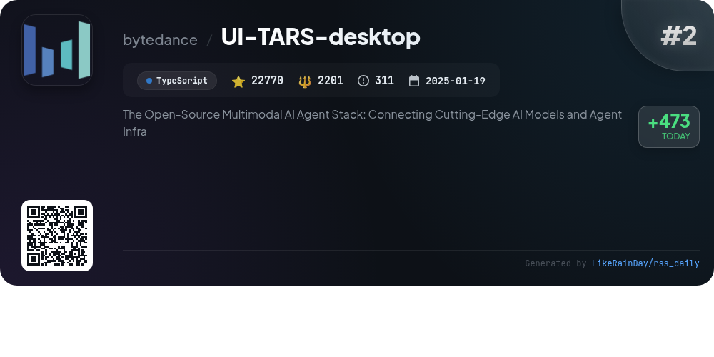
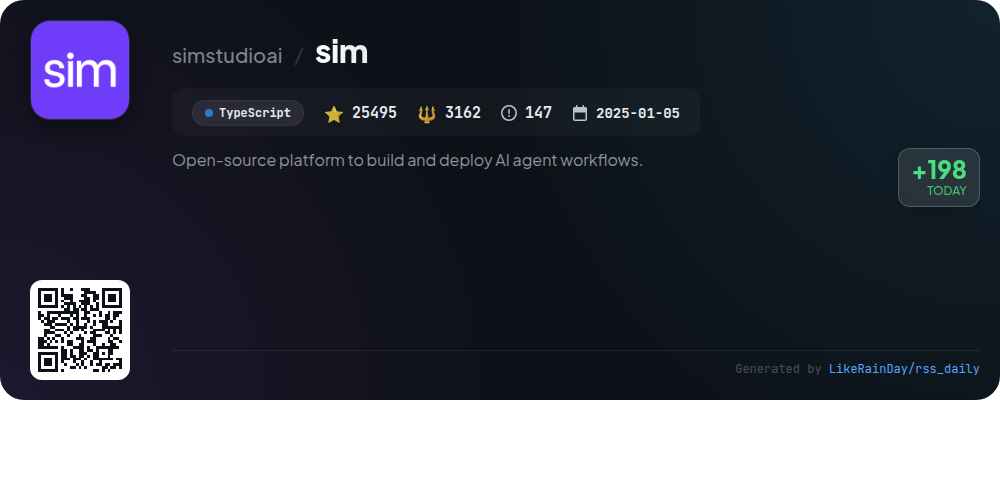
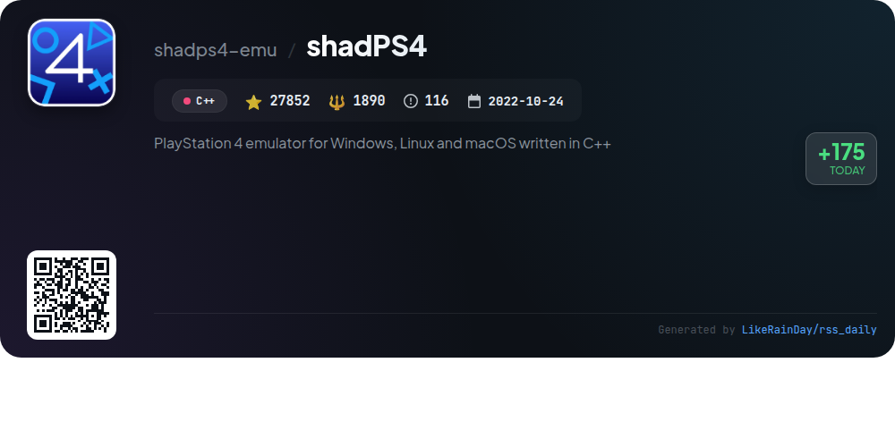

# 📊 🌟 GitHub Trending Daily - 2026-01-12

> > 📅 Daily Picks of GitHub Trending Repositories | Powered by Smart Algorithms

## 📋 Overview

**10** Projects | **315219** ⭐ | **31228** 🍴

**Top Languages:** `TypeScript` (6) · `Rust` (1) · `Swift` (1)

**Updated:** 2026-01-12 12:32 UTC

**Categories:**

- 🌟 Daily Top 10 (10 items)

---

## 🌟 Daily Top 10

### 1. [opencode](https://github.com/anomalyco/opencode)

> 🤖 **Why Recommend**  
> *OpenCode is an open-source AI coding agent built with TypeScript, designed to enhance coding productivity. It features two built-in agents: "build" for full access development and "plan" for code exploration with read-only capabilities. The project supports various installation methods, including package managers and a desktop app for macOS, Windows, and Linux. OpenCode emphasizes a terminal user interface and offers provider-agnostic model support, making it versatile for developers. Join the community on Discord for collaboration and support.*

- ⭐ 63942 stars
- 💻 TypeScript
- 📅 Updated: 2026-01-12

### 2. [plane](https://github.com/makeplane/plane)

> 🤖 **Why Recommend**  
> *Plane is an open-source project management platform that serves as an alternative to Jira, Linear, Monday, and ClickUp. It features task management with a rich text editor, cycle tracking with burn-down charts, modular organization for complex projects, customizable views, and AI-enhanced note-taking capabilities. Users can choose between Plane Cloud for quick setup or self-hosting for data control. With real-time analytics and a strong community on Discord, Plane supports teams in maintaining productivity and collaboration effectively.*

- ⭐ 43791 stars
- 💻 TypeScript
- 📅 Updated: 2026-01-12

### 3. [UI-TARS-desktop](https://github.com/bytedance/UI-TARS-desktop)

> 🤖 **Why Recommend**  
> *UI-TARS-desktop is an open-source multimodal AI agent stack designed for seamless interaction with advanced AI models. It offers a native GUI application that enables users to control local and remote computers using natural language commands, visual recognition, and precise mouse and keyboard actions. Key features include cross-platform support, real-time feedback, and integration with various tools for enhanced task automation. With over 23,000 stars on GitHub, it provides a user-friendly interface for both casual users and developers, making AI-driven automation accessible and efficient.*

- ⭐ 23052 stars
- 💻 TypeScript
- 📅 Updated: 2026-01-12

### 4. [ConvertX](https://github.com/C4illin/ConvertX)

> 🤖 **Why Recommend**  
> *ConvertX is a self-hosted online file converter supporting over 1000 formats. Built with TypeScript, it offers features like batch processing, password protection, and multi-account support. Key converters include Inkscape for vector images, FFmpeg for video, and Calibre for e-books. Users can deploy ConvertX easily using Docker, with customizable environment variables for enhanced security and functionality. With 14,787 stars on GitHub, ConvertX is a robust solution for diverse file conversion needs, catering to both individual and professional users.*

- ⭐ 14787 stars
- 💻 TypeScript
- 📅 Updated: 2026-01-12

### 5. [twenty](https://github.com/twentyhq/twenty)

> 🤖 **Why Recommend**  
> *Twenty is an open-source CRM designed as a modern alternative to Salesforce, emphasizing community collaboration. With 38,787 stars on GitHub, it offers features such as customizable layouts, object management, role-based permissions, and workflow automation. Built using TypeScript, NestJS, and React, Twenty allows users to personalize their experience through kanban and table views, integrate emails and calendar events, and automate tasks. Join the community on Discord, contribute to ongoing development, and explore the documentation for self-hosting and local setup options.*

- ⭐ 38787 stars
- 💻 TypeScript
- 📅 Updated: 2026-01-12

### 6. [awesome-copilot](https://github.com/github/awesome-copilot)

> 🤖 **Why Recommend**  
> *Awesome Copilot is a community-driven repository designed to enhance your GitHub Copilot experience. It features specialized agents, task-specific prompts, comprehensive instructions, and curated collections tailored for various coding scenarios. With over 17,000 stars, key offerings include custom agents for enhanced workflow, focused prompts for specific coding tasks, and best practice instructions. An MCP server simplifies the integration of these resources into your development environment. This project promotes productivity, best coding practices, and continuous learning in software development.*

- ⭐ 17181 stars
- 💻 JavaScript
- 📅 Updated: 2026-01-12

### 7. [open-meteo](https://github.com/open-meteo/open-meteo)

> 🤖 **Why Recommend**  
> *Open-Meteo is a free, open-source Weather API designed for non-commercial use, requiring no API key. It offers hourly forecasts for up to 16 days, historical weather data spanning 80 years, and high-resolution global models. Key features include marine and air quality APIs, rapid updates every hour, and lightning-fast response times. The API is built on reputable weather models and supports CORS, ensuring privacy without ads or tracking. Users can run their own instances with Docker, and contributions are encouraged. For more details, visit open-meteo.com.*

- ⭐ 4389 stars
- 💻 Swift
- 📅 Updated: 2026-01-12

### 8. [sim](https://github.com/simstudioai/sim)

> 🤖 **Why Recommend**  
> *Sim is an open-source platform designed for building and deploying AI agent workflows with ease. Key features include a visual workflow builder, natural language Copilot for flow generation and error correction, and integration with vector databases for tailored responses. With over 25,000 stars on GitHub, Sim supports both cloud-hosted and self-hosted deployments via Docker and NPM. The platform utilizes Next.js, PostgreSQL, and modern UI frameworks, making it versatile for developers looking to create intelligent applications quickly. Visit sim.ai for more information.*

- ⭐ 25495 stars
- 💻 TypeScript
- 📅 Updated: 2026-01-12

### 9. [codex](https://github.com/openai/codex)

> 🤖 **Why Recommend**  
> *Codex is a lightweight coding agent from OpenAI that operates directly in your terminal, enhancing coding efficiency. Install it globally via npm or Homebrew, and simply run `codex` to start. Key features include integration with various code editors like VS Code, and access to Codex Web for cloud-based functionality. Users can benefit from signing in with their ChatGPT account, which unlocks additional features based on their plan. The project boasts over 55,000 stars on GitHub and is built using Rust. Comprehensive documentation is available for installation and contributions.*

- ⭐ 55943 stars
- 💻 Rust
- 📅 Updated: 2026-01-12

### 10. [shadPS4](https://github.com/shadps4-emu/shadPS4)

> 🤖 **Why Recommend**  
> *shadPS4 is an early PlayStation 4 emulator for Windows, Linux, and macOS, developed in C++. With over 27,000 stars on GitHub, it enables users to run PS4 titles like Bloodborne and Dark Souls Remastered. The core emulator lacks a GUI, but users can download the QtLauncher for a more user-friendly experience. Key features include firmware support, custom input mapping, and a dedicated Discord community for support and development discussions. The project is in active development, with regular updates aimed at enhancing compatibility and performance.*

- ⭐ 27852 stars
- 💻 C++
- 📅 Updated: 2026-01-12

---

## 📡 RSS Subscription

Subscribe via RSS to get daily trending updates:

- 🔔 [RSS XML] (../../daily-top.xml)
- 🔔 [Daily Report] (../../GITHUB_TODAY.md)
- 🔔 [Daily Top 10](../../daily-top.xml)

---

*⚡ Powered by Smart Trending Algorithm | Generated at 2026-01-12 12:32:13 UTC
